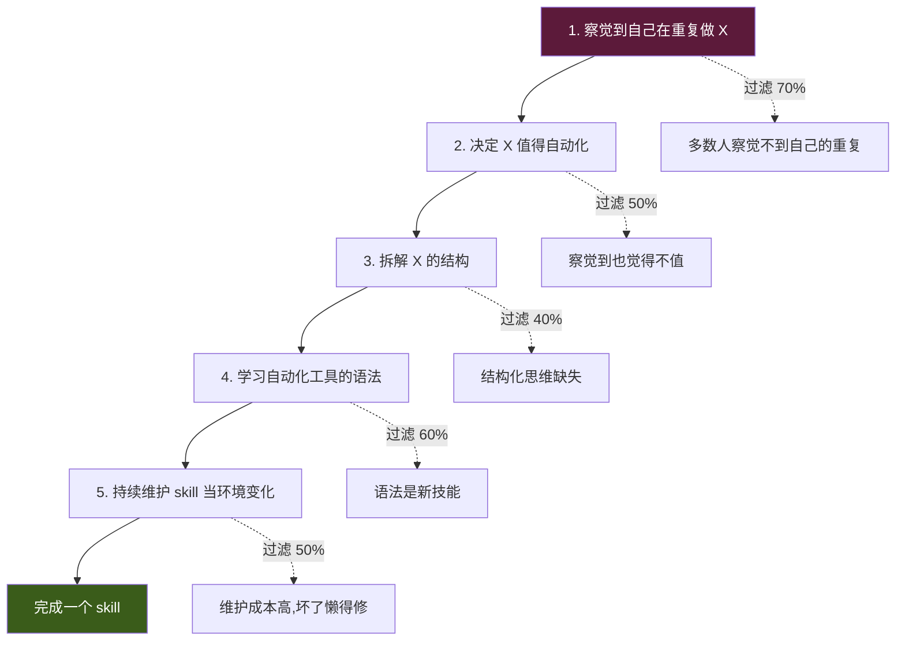
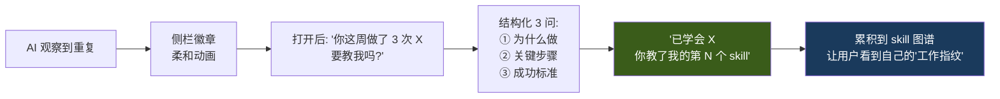
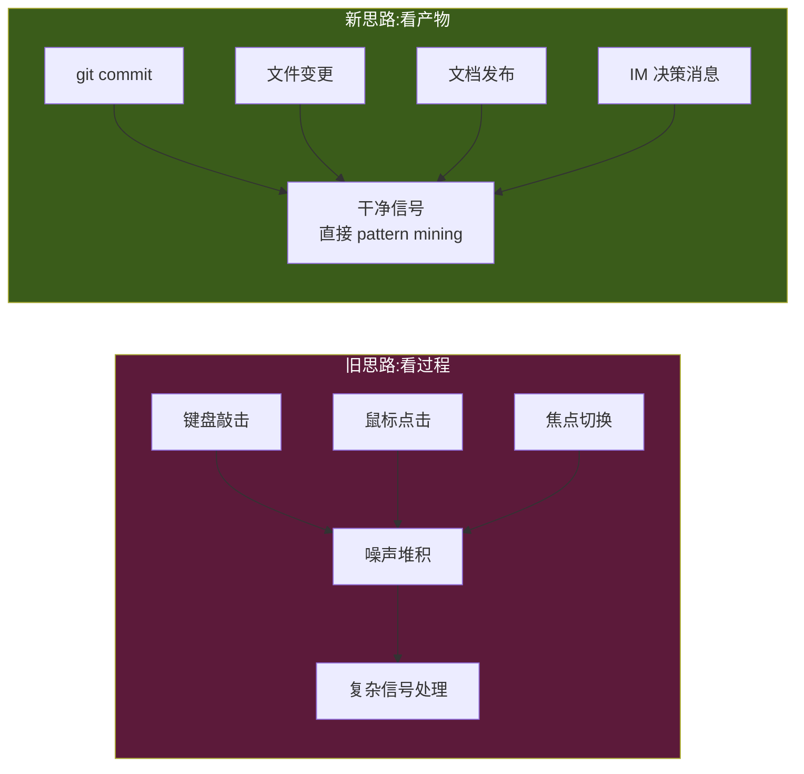
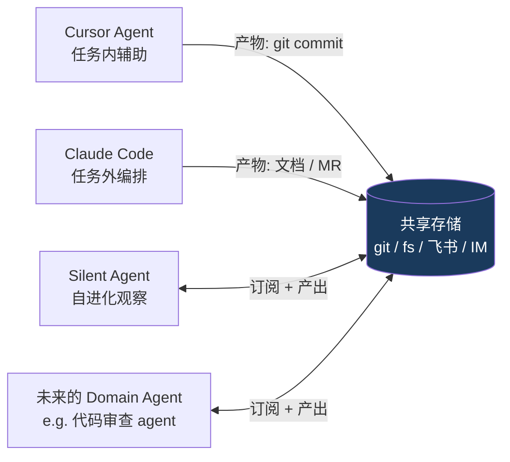
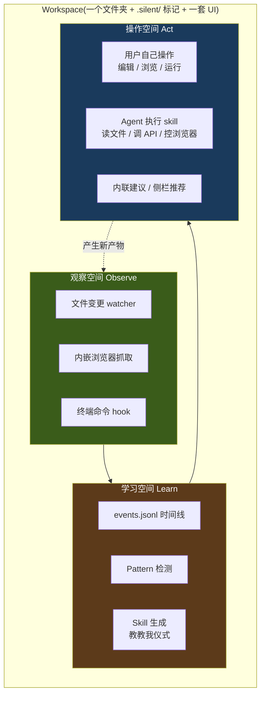
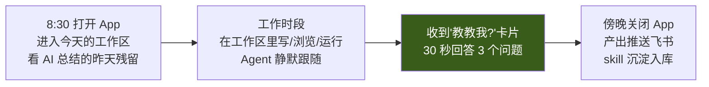

# 产品定位:AI 学你,不是你学 AI

> 本篇沉淀 Silent Agent 的产品魂,合并自三篇早期定位文档(positioning v3 / core-insight / artifact-first,2026-04-22 ~ 04-23 多轮讨论)。回答三件事:**AI 和用户的关系是什么、AI 看什么、AI 在哪里看**。
>
> 一句话:**你不用学 AI,AI 学你**。

## TL;DR

- **关系层**:AI-push 范式 — AI 主动观察用户产物 → 发现重复 pattern → 说"教教我",**外置元认知**。所有 pull 范式产品的天花板 = 用户元认知上限,Silent Agent 是结构性突破口。
- **观察层**:Artifact-first — 只看**产物**(commit、文件、文档、消息、URL、命令),不看过程(键盘敲击、鼠标点击)。产物 = 用户大脑去噪后的决策,信噪比高一个数量级。
- **形态层**:**轻工作区** — 不是 menubar、不是目的地,是介于两者之间的"任务文件夹 + 内嵌三件套(浏览器/终端/文件)+ AI 侧栏"。打开 = 隐式授权观察,关闭 = 不观察。
- **哲学**:Everything is file — 事件 / skill / 状态 / 产出全落盘为文件,可 git、可 diff、可 rewind。
- **三大空间**:observe(file watcher / 浏览器 CDP / 终端 hook)→ learn(pattern → skill)→ act(用户自做 + agent 执行)。
- **护城河**:工作区内的 full-artifact 观察 × AI-push × skill 沉淀,这三件事**没有任何一家同时做**。Cursor / Claude Code 是 pull,Screenpipe 有观察无边界,cmux 等终端壳有壳无魂。

## 定位声明

> Silent Agent 是一个**轻量级任务工作区**——
> 为 Agent 提供**观察**你的产物、**学习**你的 pattern、**操作**你的文件 / 网页 / 命令三种空间。
> 当期任务搬进来,Agent 静默跟随;
> 产出推回飞书 / GitHub / Figma,skill 留下来继续成长。
> Everything is file——所有状态、事件、产物都可 diff、可 rewind、可 git。

---

## Part 1 · 关系层:为什么必须 AI-Push

### 95% 用户从未写过 1 个 workflow

Alfred、Raycast、macOS Shortcuts、Zapier、IFTTT —— 所有"用户主动沉淀自动化"的产品都有同一组数据:

| 产品 | 真正写过 1 个 workflow 的用户比例 |
|---|---|
| Alfred workflows | ~3–5% |
| Raycast script commands | ~5–8% |
| macOS Shortcuts | ~5% |
| Zapier | ~10%(付费用户) |

即使是最优秀的工具,**95% 的用户把它当启动器用,从未进入自动化层**。工具体验不是问题——**瓶颈在用户侧**。

### 真正的障碍:元认知盲区

"用户主动沉淀 skill" 要求用户具备 5 个能力,每一步都过滤掉大量用户:



**第 1 步就过滤掉 70%** —— 这就是元认知盲区。

元认知(Metacognition)= 对自己认知和行为的察觉。它是**少数人才有**的能力,大多数人的行为是"条件反射"式的:

- 每周四下午 2 点都做某件事 → 自己察觉不到
- 收到 logid 就查 → 感觉是"随手"
- 改完代码发消息通知 → 已成肌肉记忆

**你不能期待 95% 的用户先修炼元认知再来用你的产品。**

### Pull 范式的结构性上限

所有 chatbot(ChatGPT、Claude、Cursor、Raycast AI、飞书智能助手)的交互范式是 pull:**用户发起、AI 响应**。

```
用户: "帮我查 logid X 的日志"
AI:   <查询并返回>
```

这个范式的上限是:**用户只能问他知道要问的事**。

- 不知道代码里有 bug → 不会问 "这段有 bug 吗"
- 不知道流程可以自动化 → 不会问 "这能不能自动"
- 不知道有更好做法 → 不会问 "还有啥办法"
- 不知道被重复打断多少次 → 不会问 "怎么减少打断"

**Pull 的天花板 = 用户的元认知上限。** 这是结构性的,不能靠 AI 更聪明来突破。

### AI-Push:外置元认知

AI-push 的核心不是"主动发消息给用户",是**代替用户做元认知观察**:


用户**不需要**:察觉重复 / 判断是否值得 / 学语法 / 主动维护。
用户**只需要**:响应 AI 的提问 + 确认 / 否定 / 微调。

**从"主动发起 + 学习 + 维护"5 步缩成"确认 + 反馈"2 步**。进入自动化层的用户比例有机会从 5% 提升到 30–50%。

### Skill 生命周期全 push 化

不只是"发现"要 push,整个 skill 生命周期每一步都应由 AI 发起:

| 环节 | 传统 pull | AI-push |
|---|---|---|
| **发现** | 用户说"存为 skill" | AI:"你这周做了 3 次 X,教教我?" |
| **起草** | 用户写脚本 / 配参数 | AI 根据轨迹生成 v0.1,用户只看 |
| **调参** | 用户打开编辑器改 | AI 执行出错后问"刚才哪里不对?" |
| **触发** | 用户记得召唤 | AI 识别场景主动提议 |
| **升级** | 用户回顾重写 | AI 发现新分支问"这情况怎么处理?" |
| **废弃** | 用户想起来删 | AI 观察到 2 个月未触发,问"还留吗?" |

### "教教我"仪式化设计

"教" 是 Silent Agent 最重要的动作,应该有**标志性的情感事件**,不是"又一个设置项":



设计借鉴:Duolingo 连续学习天数 / 宝可梦"学会新招式" / Apple Watch 圆环合拢 / GitHub 贡献热力图 → 用户的"教学热力图"。

**每次"教会一个 skill" = 一次正向情感事件**。这是产品叙事的灵魂时刻——用户感受到"它真的在学",而不是"又一个 AI 工具"。

### AI-push 的 4 个代价

AI-push 是对的方向,但换来了新的挑战:

1. **打断成本更高** —— 推得不准伤害 > pull。**对策**:推的质量 >> 数量;默认安静,**确信才推**。
2. **信任建立更慢** —— 用户点 yes 不代表理解原因。**对策**:每次 push 附带"为什么"。
3. **"教"的 UX 比想象难** —— 开放式"教"用户不知怎么答。**对策**:**结构化 3 问**(背景 / 步骤 / 成功标准)。
4. **观察精度决定一切** —— 巧合当 pattern 整个范式崩溃。**对策**:观察粒度越粗越准(产物级 >> 键鼠级);置信度阈值**宁高勿低**。

### 不适合 AI-push 的场景

| 场景 | 为什么不适合 |
|---|---|
| 创造性探索(写作、设计) | 探索无重复,push 无从起 |
| 一次性任务 | 没有"第 3 次"可推 |
| 高度变化的工作 | pattern 不稳定,skill 寿命短 |
| 社交/情感场景 | AI 学不会人际分寸 |

**Silent Agent 守住"重复性高的结构化工作"** —— 研发日常、文档流程、跨系统编排,这是 push 范式的甜点区。

### 一句话定位 vs 市面所有 AI

| 产品 | 用户 - AI 的关系 |
|---|---|
| ChatGPT / Claude | 你教 AI 一个 prompt |
| Cursor / Copilot | 你和 AI 结对编程 |
| Raycast AI | 你召唤 AI 做事 |
| **Silent Agent** | **AI 学你,然后替你做** |

> **你不用学 AI,AI 学你。**

---

## Part 2 · 观察层:Artifact-First

### 核心转换



### 为什么产物级观察足够

**1. 产物是"去噪后的决策"** —— 开发者在 IDE 里试 10 次最后留下 1 个 commit,那个 commit 就是去噪后的真实决策。Agent 学产物 = **让用户的大脑先帮我做了一遍 PCA**。

**2. 任务工具的盲区不在产物侧:**

| 任务工具 | 过程是否可观察 | 产物是否可观察 |
|---|---|---|
| IDE (VSCode/JetBrains) | 需装扩展,碎片化 | **git commit / 文件变更,统一** |
| Figma | 需装插件 | **export → 文件系统 / 飞书云盘** |
| 飞书文档编辑器 | API 不完整 | **飞书 OpenAPI 有 doc.content.updated 事件** |
| 终端 | 需 shell hook | **结果 = 文件 / 进程 / CI 产物** |
| 浏览器 | 需扩展 | **大部分会落到 IM 决策或文档里** |

所有主流任务工具的产物,都会沉到几个有限的共享存储里——git、文件系统、云文档、IM。**订阅这几个存储,比进入每个任务工具装 hook 简单一个数量级**。

**3. 产物事件的信噪比:**

| 粒度 | 日均事件量 | 信号密度 |
|---|---|---|
| 键盘敲击 | ~30000 | 极低 |
| 鼠标点击 | ~3000 | 低 |
| 文件保存 | ~300 | 中 |
| **git commit / 文档发布** | ~10–20 | **高** |
| **MR / 文档 review 完成** | ~3–5 | **极高** |

序列挖掘算法在噪声大的输入上几乎不 work,在 commit 序列上能跑出漂亮 pattern。**观察粒度越粗,自进化越准**。

### Skill 的新定义:产物映射

skill 不是"步骤回放",是"**看到 X 产物 → 产出 Y 产物**":

```yaml
skill:
  name: "MR 发起后的跨系统通知"

  trigger_artifacts:                        # 看到什么产物触发
    - type: git.mr.created
      conditions:
        repo_pattern: "life.marketing.*"
        author: me

  context_artifacts:                        # 相关上下文产物(模板变量)
    - type: jira.issue
      link_from: mr.description.issue_ref
    - type: feishu.group
      link_from: repo.config.notify_group

  output_artifacts:                         # 应该产出什么产物
    - type: feishu.message
      target: "{context.group.id}"
      template: "MR {trigger.title} 已发起 - 关联 {context.issue.id} - {trigger.url}"
    - type: jira.issue.comment
      target: "{context.issue.id}"
      content: "MR: {trigger.url}"

  verification:                             # 验证产出成功
    - output.feishu.message.id != null
    - output.jira.comment.id != null

  trust_level: 2                            # L1-L4 信任梯度,L2 = 执行前需确认
```

三个关键特征:

1. **没有"点哪个按钮、打开哪个 tab"** —— 只有"看到什么、产出什么"
2. **产物类型是受控词表** —— `git.mr.created` / `feishu.message` 等,形成产物 taxonomy
3. **verification 基于产物存在性** —— 执行成功 = 预期产物真的出现在存储里

这种 skill 对 **UI 改版、工具换代、平台升级天然鲁棒**——这是 skill 库能长期积累的前提。

### 产物 contract:agent 协作的协议

如果整个系统都以产物为一等公民,它天然成为多 agent 协作的协议:



这和 UNIX 哲学(文件 / 管道 / 小工具)一致。MCP resources 的设计已经在往这个方向走 —— **MCP 的 resource 就是产物**。

**判断**:Cursor 越强,产物越规整,Silent Agent 能学到的 pattern 越准——**共生关系,不是零和**。

### 观察盲区:看产物覆盖不到的三类工作

诚实说,有三类工作没留产物:

| 类型 | 例子 | 补救 |
|---|---|---|
| **探索性调研** | 读 5 篇文档决定方向 | 内嵌浏览器只记 domain metadata;或 IM 里的决策复述 |
| **验证 / 测试** | 本地跑 20 次测试确认能 work | CI log / test artifact |
| **决策对话** | 聊 10 分钟决定不做 A 做 B | 妙记 action / IM 关键消息 |

解法:**看"决策的痕迹",不看决策本身**——飞书 IM 里的"好就这么定了"、会议妙记 action、commit message 里的 "revert to approach B",都是产物级的文本决策。

---

## Part 3 · 形态层:轻工作区

### 为什么是工作区(不是 menubar / 不是云端目的地)

之前考虑过两种形态都被否定:

- **menubar claw + ⌘-Panel 召唤(v2)** —— 观察不到产物粒度,AI-push 没物理位置落地
- **云端目的地(Coze 派)** —— 数据重力、产出归属、工具重力三重失败

**轻工作区**对这两组问题有新答案:

| 否定理由 | 工作区的解法 |
|---|---|
| 数据重力 — 数据都在 Figma/飞书/GitLab | 不强求迁全量,**只拉当期任务那一小部分**(寄生式取数) |
| 产出归属 — 交付物必须回到飞书/GitHub | 工作区**只接管过程**,终态产出推回外部系统 |
| 工具重力 — 专业工具 10 年 UX 赢不了 | 内嵌工具"**够用,不专业**"——Monaco 够写 Markdown,xterm 够跑 script,不跟 IDE/iTerm 比 |
| Menubar 观察不到产物 | 工作区内直接看到文件变更、URL、终端命令——**产物粒度的第一手观察** |
| ⌘-Panel push 路径弱 | 工作区打开 = 隐式授权观察,push 有物理位置(内联 / 侧栏 / 通知) |

### 三大空间:observe / learn / act

工作区不是"功能集合",是**为 AI-push 闭环服务的三类空间**:



**Observe** —— 内嵌浏览器(Electron `WebContentsView`)/ 终端 hook(node-pty),应用内事件统一通过 `vcs.emit(...)` 落 `<workspace>/.silent/events.jsonl`。用户外部文件编辑由 git 在下次 commit 时懒发现,**不实时监听**。**核心边界**:不观察工作区之外。

**Learn** —— 事件流 → Pattern 检测(MVP 直接 LLM 摘要,后期补 sequence mining)→ "教教我"仪式(结构化 3 问)→ skill yaml 落 `<agent>/skills/`。

**Act** —— 用户自做(Monaco / WebContentsView / xterm)+ Agent 执行(按 cloud-vs-local 路由,Web API 走云端,本地资源才本地)+ 内联建议(不抢窗口,在用户正在看的 pane 浮卡片)。

### Everything is File

工作区的每一个东西都是文件,**真的只存文件**:

```
<workspace 目录>/
├── .silent/                        ← 工作区标识(类比 .git/)
│   ├── meta.yaml                   工作区配置
│   ├── messages.jsonl              silent-chat tab 对话全文
│   ├── events.jsonl                workspace 级单一事件时间线
│   ├── tabs.json                   tab 索引
│   ├── tabs/<tid>/                 每个 tab 的产物(snapshots / buffer.log)
│   └── state/                      运行时状态
└── <用户的任何文件>                  notes.md / data.csv / src/ / ...
```

带来的性质:

| 性质 | 说明 |
|---|---|
| **Git-friendly** | 工作区可以 `git init`,事件历史和产物全进版本控制(详见 02-architecture.md Layer 1/2 commit 策略) |
| **Rewindable** | 想看三天前 agent 在学什么? `git log .silent/events.jsonl` |
| **Debuggable** | Agent 行为异常?直接读 JSONL,不用进数据库 |
| **Portable** | 换电脑、备份、给同事看,都是拷贝文件夹 |
| **Scriptable** | grep / jq / sed 就能分析事件流 |
| **AI-readable** | 下一个版本的 Agent 读同样的文件就能接手 |

**约束**:性能敏感的索引(pattern 检测的倒排、embedding)可以用 SQLite/DuckDB 作**缓存**,但**源数据永远是文件**——缓存删了能从文件重建。

### 工作区的边界与多工作区

```mermaid
flowchart LR
    subgraph Agent["Agent(顶级公民)"]
        WS1["默认位置 workspace<br/>~/.silent-agent/agents/&lt;aid&gt;/workspaces/&lt;wid&gt;/"]
        WS2["外挂 workspace<br/>~/code/some-project/.silent/"]
    end

    WS1 -.独立 events.jsonl + skills.-> C1[per-workspace 上下文]
    WS2 -.独立 events.jsonl + skills.-> C2[per-workspace 上下文]

    Agent --> M[L1/L2 Memory 跨工作区共享<br/>偏好 + 角色 + 通用 skill]
```

- **每个工作区独立隔离**:观察 / skill / per-workspace memory 默认不跨串
- **跨工作区共享**:L1/L2 Memory(用户偏好、角色)+ 通用 skill(如"搜索飞书文档")由 agent 持有
- **任意目录 + `.silent/` 即工作区**(类比 git 的 `.git/`):默认建在 `agents/<aid>/workspaces/<wid>/`,也可通过 `addWorkspace(absPath)` 把任意已有目录注册为 workspace

### 一天的产品接触点



期望使用模式:**进入工作区后待 30 min – 2 h**(类似进入"专注模式")。对标 Cursor / Notion 的使用模式,**不是 Raycast** —— 不是全天召唤,是阶段性进入。

### 这个洞察对其他设计决策的辐射

| 设计决策 | 为什么 |
|---|---|
| artifact-first 观察 | 只有看产物,AI 才能外置元认知(不打扰用户) |
| observe → learn → act 三空间 | 观察 = 代替元认知;learn = AI-push;act = 确认执行 |
| 工作区 + 内嵌三件套 | 长期观察的物理前提;边界清晰避免全局监控的隐私争议 |
| 不做 chatbot-only | chatbot 结构性是 pull,突破不了元认知上限 |
| 分层信任 + L3 强确认 | AI 学得不准的兜底,信任维护 |
| 研发垂类 | 研发的重复 pattern 最多最清晰,AI-push 最易见效 |
| "教教我"仪式 | 把 skill 积累变成情感事件,不是负担 |
| 外部任务代办(查 logid 等)做第一批 skill | 这类最易识别重复,见效最快 |

---

## 成功的 4 个必须条件

### 1. 轻 —— 打开 < 1.5s,运行内存 < 250 MB

对手是用户的"嫌麻烦"。MVP 选了 Electron(为了观察质量靠 Chromium CDP / `WebContentsView`),代价是包大;放弃了"< 100 MB" 硬指标,改为"打开 < 1.5 s、运行内存 < 250 MB"(详见 02-architecture.md 选型理由)。

### 2. 内嵌工具"够用"即可,不追求专业

- **不强塞编辑器**:用户在终端里 `vim notes.md` / `code notes.md` 自便,file watcher 统一抓保存事件;Monaco 只用作"打开个文件看看"
- 内嵌浏览器够调研、看文档、填表单,**不替代 Chrome 日常使用**
- xterm 终端够跑 script、看日志,**不替代 iTerm**

### 3. observe-learn-act 闭环要跑完

- 只做观察没有 push = 变成 Screenpipe(噪声仓库)
- 只做学习没有操作 = skill 躺在文件里不执行
- 只做操作没有观察 = 变成 Cursor(没有 AI-push)

**三者缺一,产品没意义**。

### 4. Everything is file 不能食言

一旦用私有数据库存事件或 skill,用户失去可审计性和可搬运性,信任崩。SQLite 只能做**缓存**,不能做**真相源**。

---

## 风险与校准

### 风险 A:用户不愿把工作"搬进来"

工作区路线的核心质疑。即使是轻接管,用户可能"懒得切"。

**应对**:
- **降低搬入成本**:工作区本质是文件夹,拖入 = 授权;`addWorkspace(absPath)` 把已有项目目录纳为 workspace,只在那个目录写 `.silent/`
- **第一周的 quick win**:内嵌浏览器的"所有标签页一键存为笔记"、文件变更的自动时间线——让用户先看到价值,再谈搬入其他任务
- **可逆**:从工作区搬出去还是普通文件夹,没有 lock-in

### 风险 B:AI-push 精度不够导致用户关闭

工作区打开 = 观察开始,如果 push 不准用户会直接关 App。

**应对**(同 AI-push 的 4 个代价):
- 推的质量 >> 数量
- 每条 push 带"为什么"
- 结构化 3 问而非开放式"教"
- 置信度宁高勿低

### 风险 C:与 Claude Code / Cursor 边界模糊

Claude Code 也是"文件夹 + agent + CLI",Cursor 是"IDE + agent"。都可以扩展出类似工作区形态。

**应对**:
- **差异化在 observe** —— Claude Code / Cursor 都是 pull,Silent Agent 是 push(从产物主动学)
- **差异化在非代码场景** —— Cursor 锁死 IDE,Silent Agent 覆盖调研、文档、数据分析、跨系统任务
- 但要认:如果 Anthropic / Cursor 加了 push 和浏览器,**差异化会消失** —— 所以 skill 积累的护城河要尽快建起来

### 风险 D:跨平台压力

MVP 只做 macOS,Windows / Linux 推 v2。Electron 的好处是天然跨平台,但 MVP 期不打多平台 dmg。

---

## 关键判断

- **元认知盲区**是 95% 用户不用自动化工具的**根因**,不是工具问题
- 所有 pull 范式产品的天花板都被用户元认知封死
- AI-push 是**唯一系统性突破这个天花板**的范式
- **过程级观察是红海**(Cursor / Claude Code 在深耕),**产物级观察是蓝海**(没人系统做)
- **产物级 skill 对 UI 改版、工具换代、平台升级天然鲁棒**,这是 skill 库能长期积累的前提
- Silent Agent 的核心不是"功能",是"关系" —— AI 和用户的关系从 "用户 teach AI" 反转为 **"AI teach user about themselves"**

## 一句话总结

> **Silent Agent 不是更聪明的 AI,是会观察你的 AI。市面所有 AI 都在让你学它,只有这个在学你。**

## 关联文档

- [02-architecture.md](02-architecture.md) — 五层架构 / 数据模型 / Workspace = git repo / Tab = `{type, path, state}` 指针
- [03-agent-core.md](03-agent-core.md) — agent-core 4 层(Runtime / Registry / SessionManager / Sandbox)+ `runSession` 函数
- [04-workspace-interaction.md](04-workspace-interaction.md) — 工作区交互细节 / 内嵌三件套布局
- [05-observation-channels.md](05-observation-channels.md) — 观察通道分层(P0 工作区内三通道)
- [06-cloud-vs-local-agent.md](06-cloud-vs-local-agent.md) — 本地 / 云端职责划分
- [07-competitors.md](07-competitors.md) — 竞品对标(cmux / Yume / Screenpipe / Claude Code 等)

## 参考资料

- 元认知理论:J.H. Flavell (1979) "Metacognition and cognitive monitoring: A new area of cognitive-developmental inquiry"
- Alfred / Raycast / Shortcuts / Zapier 用户数据:各自社区公开讨论
- [Claude Code harness 解剖](../../Notes/调研/claude-code-harness/) — "everything is file" 哲学的参考
- [Cloud Agent Workspace 调研](../../Notes/调研/cloud-agent-workspace/) — sandbox / workspace 技术栈
