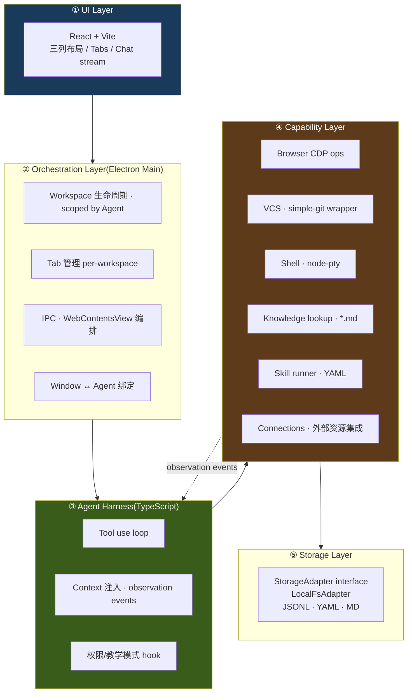
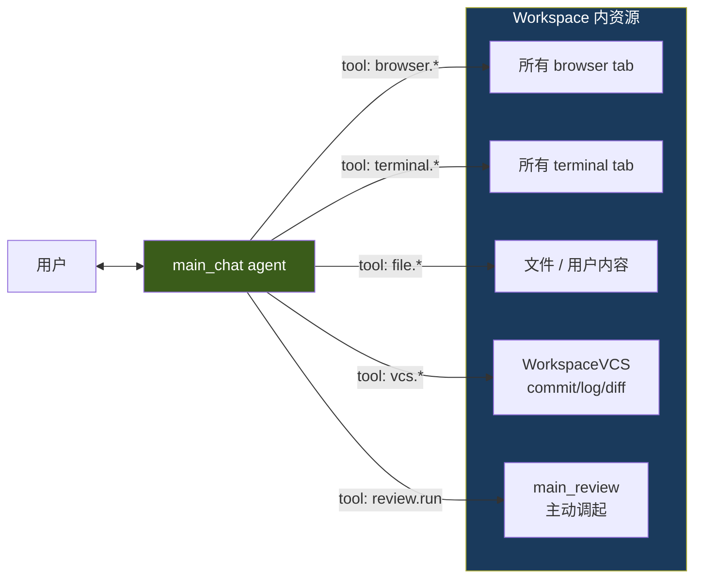

# 架构与技术选型(v0.1)

> 本篇沉淀自 2026-04-23 架构讨论。回答:分层怎么切、harness 什么路线、壳选谁、数据模型怎么组织。MVP 全本地(不依赖云端服务,仅调用 Claude API 做推理),数据模型按多 agent 设计、UI 先单 window 单 agent。

## TL;DR

- **壳**:Electron(Node.js + Chromium + TypeScript)
- **后端**:Electron 主进程即后端,Node.js / TypeScript
- **前端**:React + Vite(electron-vite 模板,HMR)
- **Agent harness**:接口形式抽象;Phase 6 起手 `ClaudeAgentSdkHarness`(走 Claude 订阅);后续可平替 Anthropic API / OpenAI / Ollama
- **运行时三件套**:Harness(LLM loop)/ Session(身份+历史)/ Sandbox(执行边界),正交可换
- **存储**:本地 JSONL + YAML + Markdown,`~/.silent-agent/` 为默认根;**任意文件夹 + `.silent/` 即工作区**(类比 `.git/`)
- **顶级公民**:Agent(非 singleton),**workspace 归属 agent**;默认 workspace 落在 `agents/<id>/workspaces/<wid>/`,外挂 workspace 落在用户指定路径
- **外部资源**:Connection 全局唯一,按 `exclusive | shared` 分 mode;agent 通过 Attachment 关系挂载
- **观察通道**:MVP P0 = 内嵌浏览器 CDP(Electron 原生)
- **不上云**:本地自洽;未来可替换 harness 为 Claude Managed Agent,storage 加 sync adapter

## 选型理由

- **Electron over Tauri/Wails**:observe-learn-act 的**观察质量**靠 Chromium CDP,WKWebView 走 JS 注入丢 50%+ 信号;MCP 生态 Node 原生,上云时顺;代价是包大(放弃 "< 100 MB" 硬指标,改为 "打开 < 1.5 s、运行内存 < 250 MB")
- **TypeScript over Go**:选了 Electron 后 Node.js 就是主进程,Go 做子进程成本 > 收益
- **自研 harness over 复用 Claude Code**:事件驱动(observer push)与 CLI 交互驱动不兼容;GUI 权限/教学 UI 要深集成;不引第三进程

## 分层架构



| 层 | 职责 | 实现 | 未来上云替换点 |
|---|---|---|---|
| ① UI | 前端渲染、交互 | React + Vite(renderer) | 不变 |
| ② Orchestration | Workspace/Tab/Window 生命周期、IPC | Electron main (TS) | 不变 |
| ③ Agent Harness | tool use loop、context、permission | 自研 minimal loop (TS) | **替换为 Managed Agent runtime** |
| ④ Capability | tools、skill runner、connections | Node 包 | web tools 可路由到云端执行 |
| ⑤ Storage | 事件/skill/memory 落盘 | LocalFsAdapter(JSONL+YAML+MD) | **加 sync adapter**,L1/L2 先同步 |

## 核心模型

### 五个核心对象

```mermaid
classDiagram
    class App {
      singleton · 一台设备一份
    }
    class Agent {
      + id : slug
      + name / avatar / model
      + system_prompt
    }
    class Workspace {
      + id
      + name / createdAt
      + linkedFolder? (可选外部挂载)
      (本质是一个 git repo 目录)
    }
    class Connection {
      app-level · 全局唯一
      + id : feishu | gmail | notion | ...
      + auth (OAuth/token)
    }
    class Capability {
      + kind : im | calendar | doc | kb | ...
      + mode : exclusive | shared
    }
    class Attachment {
      关系对象
      + connectionId
      + capabilityKind
      + agentId
      + role : owner | consumer
    }
    class Window {
      runtime only
      + agentId (绑定)
      + activeWorkspaceId
    }
    class Message
    class WorkspaceEvent {
      workspace-level timeline
      events.jsonl append-only
    }
    class Tab {
      + id
      + type : browser | terminal | file | silent-chat
      + path (产物路径, workspace 内或外部绝对路径)
      + state (type-specific runtime)
    }
    class Skill
    class KnowledgeFile

    App "1" *-- "1..*" Agent
    App "1" *-- "0..*" Connection
    App "1" *-- "1..*" Window
    Connection "1" *-- "1..*" Capability
    Capability "1" -- "0..*" Attachment : 按 mode 限数
    Attachment "*" -- "1" Agent
    Agent "1" *-- "0..*" Workspace
    Agent "1" *-- "0..*" Skill
    Agent "1" *-- "0..*" KnowledgeFile
    Agent "1" -- "1" Memory
    Workspace "1" *-- "0..*" Message
    Workspace "1" *-- "0..*" WorkspaceEvent
    Workspace "1" *-- "0..*" Tab
    Window ..> Agent : 绑定
    Window ..> Workspace : 当前活跃
```

### 关系规则

- **Agent 是顶级公民**:删 agent = 它的 workspaces / skills / knowledge / memory 全走
- **Workspace = 一个工作区目录(任意路径 + `.silent/` 标记)**:不再区分 chat / workspace 类型,所有都是工作区。默认建在 `agents/<aid>/workspaces/<wid>/`,也可由用户指定挂载任意外部文件夹(`addWorkspace`)。`.silent/` 类比 `.git/`,是工作区身份的唯一标识。
- **Tab = `{type, path, state}` 指针**:只告诉 UI "用什么视图打开哪个路径";产物快照 / 版本链在 path 所指的位置自管
- **Events 是 workspace 级**:单一 `events.jsonl`,跨 tab 动作(focus/open/close)本身就是 event
- **Connection 是 app-level 资源**:一个飞书登录就一份 auth,共享给多个 agent
- **Capability 按 mode 决定 Attachment 的数量上限**:
  - `exclusive`(如飞书 IM):整个 App 只能有 1 个 `Attachment`,那个 agent 独占
  - `shared`(如日历/文档/KB):可多个 agent 并联
- **Window 绑定 Agent**:MVP 单 window,未来切 agent 可能走"新开 window"
- **linkedFolder(可选)**:workspace 可挂一个外部文件夹作 cwd / 观察锚;**不**纳入 workspace repo,events.jsonl 记其 HEAD SHA

### 统一模型:Workspace 就是一个 Git Repo,Tab 是文件指针

**Workspace = 一个 git 仓库(目录)**。目录里所有产物(chat、browser 快照、terminal buffer、用户放的文件)都是这个仓库的内容。

**Tab = 一个 `{type, path, state}` 指针**。`tabs.json` 是索引,告诉 UI "用哪种 pane 打开哪个路径"。

关键约定:
- **不再分类型** — 所有 workspace 都是工作区,区别只是"下面有哪些文件"
- **Tab 自己管产物快照 / 版本**,落在 `.silent/runtime/tabs/<tid>/` 子目录里(silent agent 私域)
- **Events 是 workspace 级**,单一 `events.jsonl` 记所有跨 tab 动作(tab focus/open/close 本身就是事件)
- **Git 只追用户文件** —— 每 workspace 一个 repo(为支持 worktree),`.silent/` 整个 gitignore;**silent agent 默认不主动 commit**(Tier 1 = 0 条),git history 由 agent 显式 Tier 2 commit + 用户自己 commit 构成;idle 兜底是 opt-in 工具
- **`linkedFolder` 是 workspace 可选的外部挂载** —— 不纳入 workspace repo,只在 events 里记其 HEAD SHA

```
事件(.silent/runtime/events.jsonl)  ← silent agent 的完整观察(timeline)
  ↕ 按 ts + tabId 引用
观察产物(.silent/runtime/tabs/<tid>/…)  ← "长什么样"(snapshots / latest.* / buffer)
  ━ 不进 git,silent agent 私域

用户文件(notes.md / src/ / ...)     ← "用户做出的真东西"
  ↕ silent agent 不主动 commit(默认);agent 改后调 Tier 2 显式 commit;用户自己 commit
git commit                            ← "用户产物的版本锚点"
  → git log / git diff                ← "用户工作的清晰版本时间线"

→ 两轴独立:silent 观察走 events.jsonl,用户产物走 git history,各司其职。
```

### Tab 的 `{type, path}` 映射

| type | `path` | 产物内部 | 谁产生 |
|---|---|---|---|
| `silent-chat` | `.silent/runtime/main_chat.jsonl` | append-only 流(`.silent/` 整个不进 git) | main_chat agent 与用户对话 |
| `browser` | `.silent/tabs/<tid>/` | `latest.md`(顶层 copy) + `runtime/tabs/<tid>/snapshots/NNN.md`(历史) | `did-finish-load` 后抽 readability |
| `terminal` | `.silent/tabs/<tid>/` | `latest-cmd.log`(顶层 copy) + `runtime/tabs/<tid>/{snapshots/NNN.log, buffer.log}` | `pty.onData` + preexec/exit |
| `file` (内部) | `workspaces/<wid>/<path>` | 文件本身(✅ git) | 用户 save |
| `file` (外部) | 绝对路径 | 文件本身(workspace 外,外部 git 自管) | 用户 save |

### 分栏(Split Layout)演进路线

MVP 主区有两种显示模式:
- **A 模式**:silent-chat tab 活跃 → Silent Chat 全宽
- **B 模式**:browser/terminal/file tab 活跃 → 左工作 tab 1.3 / 右 Silent Chat 1 自动分栏

当前 v0.1 是**纯 UI 派生规则**(Level 0),无模型、无存储。后续按需升级:

| Level | 内容 | 新增存储 | 触发升级的信号 |
|---|---|---|---|
| **0(现在)** | hardcoded:activeTab.type 决定 A/B,比例写死 CSS 1.3:1 | 无 | — |
| **1** | 持久化 divider ratio 到 `workspaces/<wid>/state/layout.json`,divider 可拖动 | `layout.json: { splitRatio: number }` | dogfood 时反复调比例 |
| **2** | 完整 layout 树(类似 VSCode editor groups):任意 tab 可拖入 split,横纵皆可,可嵌套 | `layout.json: { tree: LayoutNode }` | 出现 "两个 browser / terminal 并排" 等真实多-pane 需求 |

**设计原则**:tab 是一等公民,layout 是 tab 的排列派生物。Level 1+ 引入后仍不能动摇"每个 tab 独立有 id / 独立 content"的单元性,layout 只管"放在哪"。

### 工作区文件树 — Pinned-left,Tab Bar 上 toggle

**心智区分**(影响 UI 决策):
- **LeftNav = 脑子切换**:消息渠道、工作流、知识库、会话列表 —— **决定要做哪件事**
- **工作区文件树 = 工作心流**:文件浏览、定位、跳转 —— **进入并完成这件事**

文件树**不**长在 LeftNav 里(那会污染脑子切换的语义),而是作为**第二列固定区**,通过 TabBar 最左的 📁 按钮 toggle 出现/消失。

```
[LeftNav | (📁 file tree?) | TabBar + center pane ]
   180px      190px              flex-1
```

**Toggle 入口**(两处冗余,体感一致):
1. TabBar 最左的 `📁` 按钮(active 态 magic-color glow)—— 工作流主入口
2. LeftNav 里 workspace 项的 `ws` tag 点击 —— 脑子切换里的"快捷暗门"

**Narrow LeftNav**(打开文件树时):
- LeftNav 从 180px → **100px**(只**横向**压缩,**不动**纵向高度;高度变了会让滚动位置跳)
- Workspace 卡片从单行变 **2 行**:line1 = 名字 + ws tag + live dot;line2 = 路径(若 linkedFolder)或相对时间("3 分钟前")
- 这条规则的 **why**:用户讲过"leftNav 是脑子切换 / 文件夹和文件操作是要专注和心流的地方";窄到 100px 仍能看清 workspace 名,但视觉重量收缩,把焦点推给文件树

**File Tree Panel 自身**:
- 190px 宽,**舒适行高**(不靠竖向压紧塞内容)
- **不要 chevron 列**,只用 emoji icon(📁/📄)区分文件夹和文件;减小视觉噪音
- 隐藏:`.silent/`、`.git/`、`node_modules/`、`.DS_Store`、`.next/`、`.venv`
- 懒加载:展开时再读子目录;不预扫描全树
- 没有 `×` 关闭按钮 —— 它是 **pinned tab**,只通过 toggle 收起;离 📁 按钮很近,不需要冗余

### 版本管理 + Events 设计 → 详见 [08-vcs.md](08-vcs.md)

每个 workspace 目录自动 `git init`,作为独立 repo —— 但 git 只追**用户文件**,不追 silent agent 的运行时数据(`.silent/` 整个 gitignore)。**git history = 用户产物的版本序列**,silent agent 不在其中留痕。

为什么仍主动 git init:**worktree 是后台 agent 隔离的根基,必须有 git repo**(详见 [10-multi-agent-isolation.md](10-multi-agent-isolation.md))。

`WorkspaceVCS` 是 workspace 同级暴露的能力对象,提供 `emit / commit / log / diff / show / status / branch / checkout` + worktree 操作。**Auto-commit 默认 0 条规则** —— silent agent 不主动写 git history;`.silent/` 不进 git 后原 4 条 Tier 1 规则全部失效,唯一仍有意义的 `workspace.idle` 改成 opt-in 常量(`TIER1_RULES_IDLE_ONLY`)。git history 由两类来源构成:agent 显式 Tier 2 commit(`workspace.commit("...")`)+ 用户自己 commit。完整设计见 **[08-vcs.md](08-vcs.md)**。

#### `.silent/` 二分:整个 `.silent/` 不进 git · git 只追用户文件

`<workspace>/` 内文件按"是不是 silent agent 的私域"二分,**git 边界 = `.silent/` 目录边界**:

| 位置 | 进 git? | 内容 |
|---|---|---|
| `用户文件 / src / 任意用户产物` | ✅ | 用户的工作内容(silent agent 不该越过此边界) |
| `agents/<aid>/skills/*.yaml`(在用户 home 下,不在 workspace 内) | — | skill 定义,跟 workspace git 无关,跨设备同步走 silent agent 自己的 sync layer |
| **`.silent/`** ↓ | ❌ `.gitignore`(整个目录) | silent agent 私域,无论顶层 / runtime 都不进 git |
| `.silent/meta.yaml` | ❌ | workspace 配置(id / name / createdAt),bg worktree 由 silent agent 主动 cp 同步 |
| `.silent/tabs/<tid>/latest.md` | ❌ | browser tab 当前页面(Defuddle 抽出),per-worktree 视角 |
| `.silent/tabs/<tid>/latest-cmd.log` | ❌ | terminal tab 最近一次命令完整输出,per-worktree 视角 |
| `.silent/runtime/events.jsonl` | ❌ | workspace 时序日志(2 层结构,Layer 1) |
| `.silent/runtime/main_chat.jsonl` | ❌ | main_chat agent 对话流 |
| `.silent/runtime/main_review.jsonl` | ❌ | main_review agent 对话流 |
| `.silent/runtime/tabs.json` | ❌ | tab 索引(UI 状态,per-worktree 视角) |
| `.silent/runtime/tabs/<tid>/snapshots/NNN-*.{md,log}` | ❌ | 历史快照序列(序列本身已是 log) |
| `.silent/runtime/tabs/<tid>/buffer.log` | ❌ | pty raw 流(信息冗余在 NNN-cmd.log) |
| `.silent/runtime/state/{cookies,cache,last-active.json,...}` | ❌ | runtime cache / 隐私 |

> 注:`latest.*` 物理位置在 `.silent/tabs/<tid>/` 顶层(原 5c+ 迁移结果保留),不挪到 `runtime/` 下;只是 `.gitignore` 从原"`.silent/runtime/`"扩到"`.silent/`",让顶层的 latest.* / meta.yaml 一并不进 git。代码层 `paths.ts` 不动。

**核心约定**:**git 只追用户文件,silent agent 不在 git history 里留痕**。workspace 身份靠 `.silent/` 目录是否存在判断(类比 `.git/`),不靠 meta.yaml 是否进 git。

`.gitignore` 简化到一行:
```gitignore
.silent/
```

**为什么整个 .silent/ 不进 git**:

1. **多 worktree 模型下的语义正确性**(决定性论据):per-agent 视角的文件(`tabs.json` / `latest.md` / `latest-cmd.log` / `events.jsonl` / `main_chat.jsonl`)在 main_chat 和 bg agent 之间**不是同一语义对象的两个版本**,git merge 假设不成立 → 详见 [10-multi-agent-isolation.md §3.1](10-multi-agent-isolation.md)
2. **runtime 流本身就是 monotonic truth**:append-only(events / main_chat / main_review)和 immutable NNN 切片(snapshots/)不需要 git 加额外时间维度,`head -n <line>` / `ls snapshots/` 就够
3. **buffer.log / cache** —— 高频 / 派生 / 可重建
4. **meta.yaml** —— bg worktree fork 时 cp 一份就够,字段(id / name / createdAt)本来就不需要"演化历史"

**worktree 必需性 ≠ git history 需要 silent 数据**:silent agent 仍主动 `git init`(因为 worktree 必须是 git repo),但**不主动写 git history** —— 仅在用户产物(用户文件)有真实变化时由"workspace.idle 30s + dirty"兜底 commit;agent 改用户文件时显式 Tier 2 commit。silent agent 自己的运行时数据(.silent/)永远不进 git。

时点查询 = `git checkout <sha>`(用户文件)+ `cat .silent/runtime/events.jsonl | jq 'select(.ts < t)'`(timeline)。两轴完全独立,git history 极薄,timeline 完整。

#### Events 2 层结构(强约定)

每条 events.jsonl 行 = **Layer 1 简要事件** + 可选 detail 引用(指向 Layer 2 详情)。

```typescript
interface WorkspaceEvent {
  ts: string
  source: 'tab' | 'browser' | 'shell' | 'file' | 'chat' | 'agent' | 'review' | 'user' | 'workspace' | 'linked'
  action: string
  tabId?: string
  target?: string                              // 主对象(URL / cmd / path)
  meta?: {
    summary?: string                           // Layer 1:一行 LLM-readable 简介,< 200 字符
    detailPath?: string                        // Layer 2 引用:immutable 文件(snapshot / suggestion / skill)
    messageId?: string                         // Layer 2 引用:append stream 中的单条(main_chat.jsonl / main_review.jsonl)
    [key: string]: unknown                     // 其他短结构化字段(exitCode / status / count)
  }
}
```

**Layer 2 detail 按 source 形态选引用方式**:

| 形态 | 引用字段 | 例子 |
|---|---|---|
| immutable 文件 / 文件序列 | `meta.detailPath` | `browser.load-finish` → `tabs/br-1/snapshots/003-*.md` |
| append stream 中的单条 | `meta.messageId` | `chat.tool-use` → `main_chat.jsonl` / `review.surfaced` → `main_review.jsonl`(同构) |
| 用户文件(git 自管) | `target` 已是路径 | `file.save → notes.md`,无需 detail |

**约束**:
- 每行 events.jsonl 严格 < 1KB(timeline scan 友好,LLM token 经济)
- `summary` 必填(timeline 自包含可读)
- `detailPath` 与 `messageId` 互斥(一个事件最多一种 detail 引用)
- 长内容(快照原文 / 对话内容 / suggestion markdown)**只能放 Layer 2 文件**,不能进 jsonl meta

**好处**:LLM scan timeline 只读 summary 即可,要细节按需 fetch;隐私分级天然(Layer 1 元数据 vs Layer 2 内容);git 摆放(detail 进 git,timeline 不进)清爽。

#### linkedFolder(嵌套 repo)处理 — 只记 ref,不复制内容

- `.gitignore` 包含 linkedFolder 路径
- `events.jsonl` 记 `{source:'linked', action:'probe', meta:{summary, head:<sha>, dirty:bool}}`
- linkedFolder 内容演进由它自己的 git 管

### 每 workspace 两个 agent · main_chat 与 main_review

每个 workspace 同时有两个 LLM agent 角色,各自有独立 append stream(都在 `.silent/runtime/` 下,**整个 `.silent/` 不进 git**):

| Agent | 落盘文件 | 触发 | session 持久化 |
|---|---|---|---|
| **main_chat** | `.silent/runtime/main_chat.jsonl` | 用户主动输入(SilentChat 问答区) | ✅ workspace 重开续接(v0.2 实装,MVP 暂每次新会话) |
| **main_review** | `.silent/runtime/main_review.jsonl` | 系统调用(idle / 手动 Review / 凌晨) | ❌ 用完即弃,每次 fresh session |

`main_chat.jsonl` 取代了原 `messages.jsonl`(rename 时机:Phase 5 合并)。

#### main_chat 是 workspace 主权 agent(架构层重要约定)

main_chat 不只是"chat panel 后端",它是**该 workspace 的主权 agent**,可调度该 workspace 内**所有资源**:



**未来 main_chat 可暴露的 tool 集**(Phase 6+ 增量实装):

| Tool 类 | 例子 | Phase |
|---|---|---|
| `browser.*` | navigate / extractText / click / waitForLoad / screenshot | 6 起手 / v0.2 完整 49 verb |
| `terminal.*` | run / sendKeys / readBuffer / waitForPrompt | 6 起手 |
| `file.*` | read / write / list / pickOpen | 6 起手(已有 IPC 复用) |
| `vcs.*`(workspace 版本能力) | log / diff / show / status / commit / branch | 6+ |
| `review.run` | 主动触发 review | 7 |
| `tab.*` | open / close / focus | 6 |

**意义**:用户跟 main_chat 一个对话,就能让它代为操作整个工作区 —— 看页面、跑命令、改文件、读历史、commit、调起 review、写 skill。**main_chat 是用户在 workspace 里的"放大器"**。

跟其他工作区 agent 的区别:
- review agent:只读探索 + 单次产出 suggestion,系统调用,不持有用户对话上下文
- 未来可能加的 background agent / domain agent:特定任务,不抢 main_chat 的主权

### Agent 运行时 → 详见 [03-agent-core.md](03-agent-core.md)

LLM 对话运行时抽出独立包 **`@silent/agent-core`**,Node-only / 零 Electron 依赖。**4 层架构**:

| 层 | 职责 |
|---|---|
| **Runtime** | 进程级,加载/卸载 Session,并发控制 |
| **AgentRegistry** | `AgentConfig` CRUD + 版本化(接口在 core,JsonlAgentRegistry 实现在 app) |
| **SessionManager** | Session 状态机(create/running/idle/terminated)+ `runSession` 核心 loop 函数 |
| **Sandbox** | 执行边界(`exec/read/write/...`),策略可换(LocalFs / ReadOnly / Docker / Remote) |

`runSession(agent, session, sandbox, *, llm, hooks)` 是核心 loop 函数(不是类),4 路退出 → `end_turn` / `requires_action` / `retries_exhausted` / `terminated`,跟 Anthropic Managed Agent 同构。

**app 端 Workspace 双面 adapter**:同一个工作区目录给 agent-core 当 Session(读 `main_chat.jsonl`)+ Sandbox(读写文件 / 跑命令)。Memory 通过 `onSessionStart` / `onSessionEnd` hook 推到 harness 外,由 app 层管。

完整设计(`AgentConfig` 版本化、`runSession` 主循环、`SessionHooks` Memory 切口、Provider 矩阵 / Prefix cache 策略 / Skill 集成 / monorepo 包结构 / Phase 6 子任务)见 **[03-agent-core.md](03-agent-core.md)**。

### Tool 契约

Tool 接收 sandbox 注入的 ctx,**不直接碰 fs / child_process**,通过 sandbox 执行:

```typescript
interface Tool {
  name: string
  description: string
  input_schema: JSONSchema
  runMode: 'local' | 'web'   // local=必须本地;web=未来可云端执行
  execute(input: any, ctx: ExecContext): Promise<ToolResult>
}

interface ExecContext {
  agentId: string
  workspaceId: string
  sandbox: Sandbox       // tool 通过它读写文件 / exec,sandbox 决定允不允许
  windowId?: number
}
```

## 存储约定(everything is file)

> **核心约定**:工作区身份由 **`.silent/`** 目录决定(类比 `.git/`)。任何文件夹 `<X>` 加上 `<X>/.silent/` 就是一个 Silent Agent 工作区。Agent 默认在 `~/.silent-agent/agents/<aid>/workspaces/<wid>/` 下建,也可通过 `addWorkspace(absPath)` 把任意已有目录注册为 workspace,只要在该目录写 `.silent/` 并把绝对路径登记进 agent 的 `_index.json`。

**身份目录命名集中在 `app/src/shared/consts.ts`**(`SILENT_DIR / FILES.* / SUBDIRS.* / SILENT_CHAT_TAB_PATH / tabRelPath()`),不要把 `'.silent'` / `'main_chat.jsonl'` / `'events.jsonl'` 这类字符串散落到各处。

```
~/.silent-agent/
├── app-state.json                      # 窗口位置、上次活跃 agent+workspace
├── app-config.yaml                     # API key、主题、全局偏好
│
├── connections/                        # app-level 外部资源
│   ├── _index.json                     # [{id, kind, status}]
│   └── feishu/
│       ├── auth.yaml
│       └── capabilities.yaml
│
├── agents/                             # 顶级公民容器
│   ├── _index.json                     # [{id, name, lastActiveAt}]
│   └── <agent-id>/                     # id 为 slug(如 silent-default)
│       ├── meta.yaml
│       ├── memory/
│       │   ├── L1-preferences.md
│       │   └── L2-profile.md
│       ├── skills/<skill-name>.yaml
│       ├── knowledge/<topic>.md
│       └── workspaces/
│           ├── _index.json             # [{id, path?}] —— path 在场表示外挂工作区
│           └── <workspace-id>/         # ★ 一个工作区目录(同时也是 git repo)
│               ├── .git/               # auto-init(支持 worktree;只追用户文件)
│               ├── .gitignore          # 仅一行: .silent/
│               ├── .silent/                                ❌ .gitignore 整个目录 · silent agent 私域
│               │   ├── meta.yaml                           workspace 配置(id / name / createdAt)
│               │   ├── tabs/
│               │   │   └── <tid>/
│               │   │       ├── latest.md                   browser 当前页面 copy(per-worktree 视角)
│               │   │       └── latest-cmd.log              terminal 最近命令 copy(per-worktree 视角)
│               │   └── runtime/                            per-worktree 运行时状态
│               │       ├── events.jsonl                    timeline log (2 层 schema, Layer 1)
│               │       ├── main_chat.jsonl                 main_chat agent 对话流
│               │       ├── main_review.jsonl               review agent 对话流
│               │       ├── tabs.json                       UI 状态(per-worktree 视角)
│               │       ├── tabs/
│               │       │   └── <tid>/
│               │       │       ├── snapshots/NNN-<ts>.{md|log}  immutable 历史切片
│               │       │       └── buffer.log              pty raw 流
│               │       └── state/{last-active.json, cookies/, cache/}
│               └── (用户放的任何文件)                       ✅ git: notes.md / data.csv / src/
│
└── logs/app.log
```

**外挂工作区(addWorkspace)**:
```
<任意路径>/<my-existing-project>/
├── .git/                               # 用户原有(silent agent 不接管,只借用追用户文件)
├── .gitignore                          # silent agent 仅追加一行 ".silent/"(幂等,不动用户既有规则)
├── src/, package.json, ...             # 用户原有
└── .silent/                            ❌ gitignore · silent agent 私域
    ├── meta.yaml                       workspace 配置
    └── runtime/                        per-worktree 运行时状态
        ├── main_chat.jsonl
        ├── events.jsonl
        └── ...                         # 同上方默认目录树
```
- `addWorkspace(agentId, absPath, name?)` 在 `absPath/.silent/` 下创建标识 + 初始化 runtime 子目录
- 在 agent 的 `workspaces/_index.json` 追加 `{id, path: absPath}` 记录
- 之后 Storage 层用 `resolveWorkspacePath(agentId, workspaceId)` 把 workspaceId → 绝对路径(默认位置或外挂位置)
- **不复制用户文件,不接管用户的 `.git/`**;silent agent 借用用户的 git 做 worktree 隔离 + 偶发 idle commit,**永不主动写 `.silent/` 进 git history**
- 若用户原 `.gitignore` 已含 `.silent/` 或 `.silent` 行,跳过追加

**linkedFolder(D 方案,只记 ref)**:
- 与 addWorkspace 不同 —— `linkedFolder` 是 workspace 内部 meta 字段,标记一个**观察锚**(只读引用),不在那里写 `.silent/`
- `.gitignore` 不复制其内容,events.jsonl 定期 probe 记 HEAD SHA + dirty 状态

- **JSONL 是真相源**,SQLite/index 只做缓存,删了能从 JSONL 重建
- **一 workspace 一 git repo**:删 = `rm -rf`,分享 = tar 整目录(`.silent/` 整个不在 git 里 → `git bundle` 不够,需整目录复制)
- **原子写**:yaml/json 整文件写 `.tmp` + rename(POSIX 原子);jsonl 追加 + fsync
- **List 优化**:`_index.json` 作为目录扫描 cache,启动时读,不命中再重建
- **`.silent/` 整个不进 git** —— silent agent 私域跟用户的 git history 完全隔离;git 只追用户文件,workspace 身份靠 `.silent/` 目录是否存在判断
- **commit 默认不主动**:silent agent 不写 git history(`DEFAULT_TIER1_RULES = []`);agent 改用户文件走 Tier 2 显式 `workspace.commit("<语义化 message>")`;`workspace.idle 30s + dirty` 兜底是 opt-in(`TIER1_RULES_IDLE_ONLY` 常量,用户/上层显式启用)

### StorageAdapter 接口(一等抽象)

```typescript
interface StorageAdapter {
  // agents
  listAgents(): Promise<AgentMeta[]>
  getAgent(id: string): Promise<Agent>

  // workspaces (scoped by agent) —— workspaceId → 绝对路径解析
  listWorkspaces(agentId: string): Promise<WorkspaceMeta[]>
  createWorkspace(agentId: string, args: CreateWorkspaceArgs): Promise<WorkspaceMeta>
  /** ★ 把任意已有目录注册为 workspace,在该目录写 .silent/ */
  addWorkspace(agentId: string, absPath: string, name?: string): Promise<WorkspaceMeta>
  /** ★ workspaceId → 绝对路径(默认位置 or 外挂),内部带 cache */
  resolveWorkspacePath(agentId: string, workspaceId: string): Promise<string>

  appendMessage(agentId: string, workspaceId: string, msg: ChatMessage): Promise<void>
  appendEvent(agentId: string, workspaceId: string, evt: WorkspaceEvent): Promise<void>

  // tabs
  getTabs(agentId: string, workspaceId: string): Promise<Tab[]>
  setTabs(agentId: string, workspaceId: string, tabs: Tab[]): Promise<void>

  // skills / memory / knowledge
  listSkills(agentId: string): Promise<Skill[]>
  saveSkill(agentId: string, s: Skill): Promise<void>
  getMemory(agentId: string, level: 'L1' | 'L2'): Promise<string>
  setMemory(agentId: string, level: 'L1' | 'L2', content: string): Promise<void>
  listKnowledge(agentId: string): Promise<KnowledgeFile[]>

  // connections
  listConnections(): Promise<ConnectionStatus[]>
  getAttachments(connectionId: string, capability: string): Promise<Attachment[]>
}

// 实现
class LocalFsAdapter implements StorageAdapter { ... }
// 未来 CloudSyncAdapter wraps LocalFsAdapter,双写+本地优先
```

**`_index.json` 的演化**:从早期的 `{ids: [...]}` 升级为 `{entries: [{id, path?}]}`,其中 `path` 在场表示外挂工作区的绝对路径,缺省表示用 `agents/<aid>/workspaces/<id>/` 默认位置。

## 项目目录(代码组织)

```
silent-agent/
├── design/                             # 设计文档
├── app/                                # Electron 应用
│   ├── src/
│   │   ├── main/
│   │   │   ├── index.ts                # 窗口 + 启动
│   │   │   ├── ipc/                    # 唯一 import 'electron' 的业务入口
│   │   │   │   ├── agent.ts
│   │   │   │   ├── workspace.ts
│   │   │   │   ├── tab.ts
│   │   │   │   └── ...
│   │   │   ├── storage/                # 纯 TS,不 import electron
│   │   │   │   ├── adapter.ts          # StorageAdapter 接口
│   │   │   │   ├── local-fs.ts         # LocalFsAdapter 实现
│   │   │   │   ├── paths.ts            # ~/.silent-agent/ 路径工具
│   │   │   │   ├── jsonl.ts            # append / read 工具
│   │   │   │   └── yaml.ts             # 原子写
│   │   │   ├── agent/                  # 纯 TS
│   │   │   │   ├── registry.ts         # agent list/get
│   │   │   │   ├── workspace.ts        # workspace CRUD
│   │   │   │   ├── harness.ts          # tool use loop(Phase 2+)
│   │   │   │   └── llm.ts              # Anthropic SDK 封装
│   │   │   ├── tabs/                   # 桥接层,import electron
│   │   │   │   ├── manager.ts          # Tab 生命周期
│   │   │   │   ├── browser.ts          # WebContentsView
│   │   │   │   ├── terminal.ts         # node-pty
│   │   │   │   └── file.ts             # fs 操作
│   │   │   ├── vcs/                    # WorkspaceVCS · workspace 暴露的版本能力
│   │   │   │   ├── interface.ts        # WorkspaceVCS 接口
│   │   │   │   ├── git.ts              # simple-git 薄封装
│   │   │   │   ├── auto-commit.ts      # Tier 1 规则 + IdleTimer
│   │   │   │   └── events.ts           # events.jsonl append
│   │   │   ├── snapshots/              # 浏览器 / 终端产物落 fs
│   │   │   │   ├── browser.ts          # outerHTML + Defuddle → snapshots/NNN.md
│   │   │   │   └── terminal.ts         # buffer + cmd 切片 → NNN-cmd.log
│   │   │   ├── connections/            # 外部资源集成(v0.2+ 实装)
│   │   │   │   └── feishu/
│   │   │   └── tools/                  # 纯 TS
│   │   │       ├── registry.ts
│   │   │       ├── browser.ts
│   │   │       ├── knowledge.ts
│   │   │       └── skill-runner.ts
│   │   ├── preload/
│   │   │   └── index.ts                # contextBridge
│   │   ├── renderer/
│   │   │   ├── index.html
│   │   │   └── src/
│   │   │       ├── App.tsx
│   │   │       ├── main.tsx
│   │   │       ├── components/
│   │   │       ├── hooks/
│   │   │       ├── lib/ipc.ts
│   │   │       └── styles/
│   │   └── shared/                     # 两端共用 types(runtime-free)
│   │       └── types.ts
│   ├── package.json
│   ├── electron.vite.config.ts
│   └── tsconfig{.json,.node.json,.web.json}
├── README.md
├── CLAUDE.md
└── task.md
```

**分层原则**(未来上云抽 Node 服务用):
- `storage/ + agent/ + tools/`:**纯业务,不 import 'electron'**
- `ipc/ + tabs/ + observers/ + main/index.ts`:桥接层,可以 import electron
- `connections/`:分情况——底层 SDK 本身不依赖 electron(如 lark-cli 封装),但接入时的 window/通知会用到

## IPC 白名单(v0.1)

```typescript
window.api = {
  agent: {
    current: () => AgentMeta            // 当前 window 绑定的 agent
    list: () => AgentMeta[]
    // create/rename/delete: MVP 不开放 UI,手改 yaml
  }

  // 所有 workspace 调用隐含"当前 window 的 agentId"
  workspace: {
    list: () => WorkspaceMeta[]
    create: (args: { name?: string }) => WorkspaceMeta            // 默认位置
    add: (absPath: string, name?: string) => WorkspaceMeta        // 外挂任意已有目录(addWorkspace)
    rename: (id: string, name: string) => void
    delete: (id: string) => void
    loadMessages: (id: string) => ChatMessage[]
  }

  tab: {
    list: (workspaceId: string) => TabMeta[]
    open: (workspaceId: string, args: TabOpenArgs) => TabMeta
    close: (tabId: string) => void
    focus: (tabId: string) => void
    popupTypeMenu: () => 'browser'|'terminal'|'file'|'file-new'|null  // 原生 OS 菜单
  }

  file: {
    read: (absPath: string) => string
    write: (absPath: string, content: string) => void
    pickOpen: () => string | null
    createInWorkspace: (workspaceId: string, filename: string) => string  // 安全检查 .silent / .git / 越界
    listDir: (absPath: string) => DirEntry[]                          // 文件树用
  }

  connection: {
    list: () => ConnectionStatus[]
    // v0.1 只读状态,路由规则改 yaml
  }

  ping: () => { pong: true, at: string }
}
```

**IPC 内部用 `BrowserWindow.fromWebContents(event.sender)` 取 `agentId`**,业务层拿到的永远是 `(agentId, workspaceId, ...)`,不关心 window 怎么绑。

## MVP v0.1 范围对齐

**核心原则**:**Tab 基础设施先做,AI 后置**。先把"轻 IDE 壳"的 3 种 tab(浏览器/终端/文件)跑通,dogfood 工作区形态 → 再加 agent harness + observation + skill。

**做**(Phase 1-8,详见 `task.md`):
- Phase 1 ✅ 存储层 + Agent/Workspace CRUD + 左栏对接
- Phase 2 ✅ Tab 管理框架 + 浏览器 tab(WebContentsView)
- Phase 3 ✅ 终端 tab(xterm + node-pty)
- Phase 4 ✅ 文件 tab(Monaco editor)
- Phase 5 🔄 Workspace 化(`.silent/`)+ events.jsonl(2 层 schema)+ main_chat.jsonl / main_review.jsonl + Tier 1 git auto-commit
- Phase 6 — Chat:Sandbox + Harness 接口 + `ClaudeAgentSdkHarness`(走 Claude 订阅,自管 main_chat.jsonl + cache_control)+ 知识库 tool + main_chat 主权 tool 集
- Phase 7 — 教教我仪式 + skill v1 教学执行
- Phase 8 — Dogfood(1 周)

**不做(推 v0.2)**:
- 飞书 IM 真接入(MVP 只做 connection 数据结构占位)
- Skill 信任等级升级(v1 教学 → v2 auto)
- 技能商店、多 agent UI 切换器、多 window
- 日程/TODO/邮箱 实体内容(UI 占位)
- Pattern 检测算法(MVP 用 LLM 摘要)

## 风险与对策

| 风险 | 对策 |
|---|---|
| Electron 包大违反"轻"原则 | 只打 macOS dmg;砍 locale;v0.2 再考虑 Tauri partial port |
| 多 agent 数据模型变复杂了 | MVP 只展示 default agent,代码按多 agent 写;UI 不做 |
| Connection mode 冲突(飞书换 owner) | MVP 手改 yaml;v0.2 做设置面板 |
| Observation events 累积,workspace 变慢 | 按 workspace 按通道分 jsonl;V2 加 SQLite index |
| Node 主进程单线程卡 LLM 流 | harness async + renderer 直接渲染流 |
| 教学模式 UI 节奏烦 | 第一版每 tool call 一次;dogfood 再调 |

## 关联文档

- [01-product-vision.md](01-product-vision.md) — 产品定位 / AI-push / 产物哲学
- [03-agent-core.md](03-agent-core.md) — agent-core 4 层 + `runSession`
- [05-observation-channels.md](05-observation-channels.md) — 观察通道分层
- [06-cloud-vs-local-agent.md](06-cloud-vs-local-agent.md) — 本地 / 云端分工
- [08-vcs.md](08-vcs.md) — 事件流 + git auto-commit + snapshot 子系统
- [`task.md`](../task.md) — Phase 0-8 实施清单

## 参考资料

- [Electron docs](https://www.electronjs.org/docs/latest)
- [electron-vite](https://electron-vite.org/)
- [Anthropic TypeScript SDK](https://github.com/anthropics/anthropic-sdk-typescript)
- [xterm.js](https://xtermjs.org) / [node-pty](https://github.com/microsoft/node-pty)
- [simple-git](https://github.com/steveukx/git-js)
- [@modelcontextprotocol/sdk](https://github.com/modelcontextprotocol/typescript-sdk)
