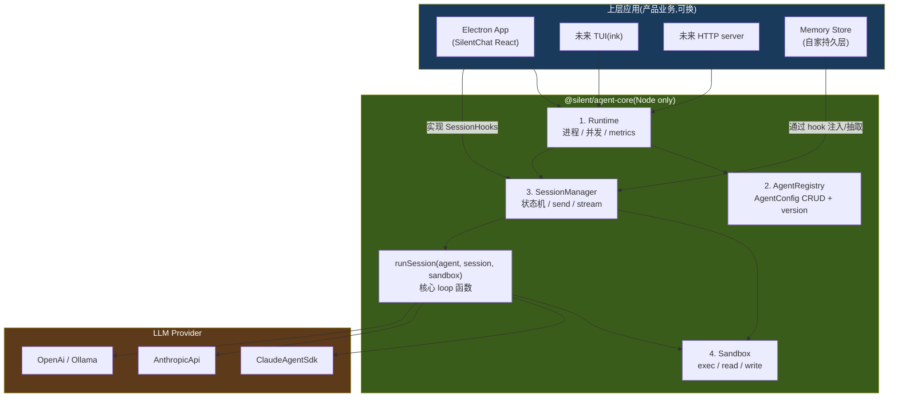
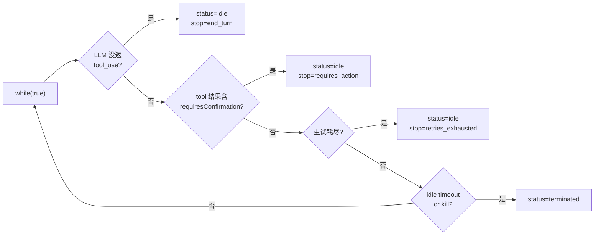

# Agent Core 技术方案(v0.2)

> **TL;DR** — 抽出独立包 `@silent/agent-core`,Node-only / 零 Electron 依赖。**4 层架构** + 一个核心循环函数:
>
> - **Runtime** — 进程级,加载/卸载 Session,并发控制
> - **AgentRegistry** — 声明式 `AgentConfig` 的 CRUD + 版本化(改 skill 产新 version,in-flight session 用旧版本)
> - **SessionManager** — Session 状态机(create/running/idle/terminated),send/stream/terminate 入口
> - **Sandbox** — 执行边界(`exec/read/write/...`),策略可换(LocalFs / ReadOnly / Docker / Remote)
> - **`runSession(agent, session, sandbox, *, llm, hooks)`** — 核心 loop,一个**函数**(不是类),所有状态在参数里;4 路退出 → `end_turn` / `requires_action` / `retries_exhausted` / `terminated`
>
> 架构跟 **Anthropic Managed Agent 同构**,未来上云 / 多租户 / 切 TUI 都不重构。Provider 首发 `ClaudeAgentSdk`(走订阅),`AnthropicApi` / `OpenAi` 平替。Memory **推到 harness 外**,只通过 `on_session_start` / `on_session_end` 两个 hook 让上层应用管。

## 目标与约束

| 目标 | 约束 |
|---|---|
| **G1 分层**:agent-core 不依赖 Electron | grep `import.*electron` in `packages/agent-core/` 必须为空 |
| **G2 LLM 可插拔**:换 provider 不改业务 | Provider 接口稳定 ≥ 6 个月 |
| **G3 Agent 可插拔**:换整个 agent loop | Runtime 抽象到 "loop 单位" |
| **G4 4 层解耦** | 4 个 Layer 互不引用对方实现细节 |
| **G5 TUI ready** | agent-core 输出**事件流**(`AsyncIterable<SessionEvent>`),不直接渲染 |
| **G6 上云零重构** | AgentConfig 版本化 + Session/Sandbox 解耦,跟 Managed Agent 同构 |
| **G7 Memory 推外** | harness 只暴露 hook,不知道 memory 内容结构 |

**非目标**(留给 v0.2+):多 agent 并行 / 跨进程 distributed harness / token 级 cancel 粒度

## 总体分层



## 各层职责

| 层 | 类比 | 职责 | 不做 |
|---|---|---|---|
| **Runtime** | systemd / supervisor | 加载/卸载 Session,并发上限,metrics | 不知业务、不知 memory |
| **AgentRegistry** | DB + CRUD | 存 `AgentConfig`(system/skills/tools/policy)+ 版本号 | 不参与运行时 |
| **SessionManager** | 状态机 + 事件流 | 创建/运行/idle/终止 Session;调度 `runSession`;发事件;hook | 不管 memory 内容 |
| **Sandbox** | container/exec backend | 执行 fs / 子进程,permission enforce | 不关心 LLM |
| (上层应用) | 产品 | memory、租户、审批、UI | 不实现 LLM 循环 |

## 包结构(monorepo)

**核心原则:接口归 `agent-core`,持久化实现归 `app`。** AgentConfig 类型 + AgentRegistry 接口在 core,具体怎么落盘(JSONL / SQLite / Cloud DB)由 app 层决定 —— 这是经典 "interface in core, impl at edge" 模式,让 core 真正纯净、可独立测试。

```
silent-agent/
├── package.json                # { workspaces: ["packages/*"] }
├── packages/
│   ├── agent-core/             # ★ Node-only,无 fs/yaml/git 持久化代码
│   │   ├── package.json        # name: "@silent/agent-core"
│   │   └── src/
│   │       ├── index.ts        # public exports
│   │       ├── types.ts        # AgentConfig / Session / WorkspaceEvent / Tool / etc.
│   │       ├── runtime/
│   │       │   └── runtime.ts          # Layer 1
│   │       ├── registry/
│   │       │   └── interface.ts        # ★ AgentRegistry 接口(只接口,无实现)
│   │       ├── session/
│   │       │   ├── interface.ts        # Session / SessionManager / SessionHooks
│   │       │   ├── manager.ts          # SessionManager 实现(不读盘,通过注入的 registry)
│   │       │   └── run-session.ts      # ★ 核心 loop 函数
│   │       ├── sandbox/
│   │       │   ├── interface.ts
│   │       │   └── local-fs.ts         # MVP 默认实现(只用 node:fs,不依赖 electron)
│   │       ├── llm/
│   │       │   ├── interface.ts        # LLMClient 接口
│   │       │   ├── claude-agent-sdk.ts
│   │       │   ├── anthropic-api.ts
│   │       │   └── openai.ts
│   │       ├── tools/
│   │       │   ├── registry.ts
│   │       │   └── builtin/            # shell / file / knowledge
│   │       ├── skills/
│   │       │   ├── interface.ts        # SkillRef / SkillIndex
│   │       │   └── loader.ts           # builtin / custom 二分加载(从注入的目录读)
│   │       └── cache/
│   │           └── prompt-cache.ts     # cache_control 打点
│   └── app/                    # Electron 装配者,提供 core 接口的具体实现
│       └── src/main/agent/
│           ├── jsonl-agent-registry.ts # ★ implements AgentRegistry,落 agents/<aid>/agent.yaml
│           ├── workspace-adapter.ts    # Workspace → Session/Sandbox 双面 adapter
│           └── electron-bridge.ts      # 把 SessionManager 接到 IPC
```

**关键约束**:
- `agent-core/registry/` 下**只有 interface.ts**,没有任何具体存储实现
- app 层 `JsonlAgentRegistry` implements `AgentRegistry`,负责读写 yaml + 维护 `_index.json`
- SessionManager 接受 `registry: AgentRegistry` 注入(不知道具体实现)
- 未来 `CloudAgentRegistry implements AgentRegistry` 也只在 app 层(或独立的 cloud-app 包)实现,core 一行不改

**migration**:`app/` 整体移一次,根 `package.json` 加 `workspaces`,tsconfig path 指 `@silent/agent-core` → `../agent-core/src`。约 1 小时。

## 1. AgentConfig — 声明式 + 版本化

```typescript
export interface AgentConfig {
  id: string                              // 'silent-default'
  version: number                         // 单调递增,每次 update 自增
  name: string
  system: string                          // system prompt
  model: string                           // 'claude-sonnet-4-6'
  skills: SkillRef[]                      // ★ Skill 在这里(版本化)
  tools: ToolRef[]
  mcpServers?: McpServerRef[]             // v0.2+
  permissionPolicy: PermissionPolicy
  createdAt: string
  archived?: boolean
}

export type SkillRef =
  | { type: 'builtin'; skillId: string }                  // 引用 ~/.silent-agent/skills/<id>
  | { type: 'custom'; content: string }                   // inline SKILL.md

export interface PermissionPolicy {
  // MVP: allow / deny 黑白名单;v0.2 require_confirmation
  allow?: string[]                        // tool name 或 glob
  deny?: string[]
  requireConfirmation?: string[]
}
```

**关键约束**:
- 改 skill / system / tools = `agents.update(id, ...)` → 产新 `version`,**旧 version 仍在磁盘**
- in-flight session 持有的 AgentConfig 是**冻结快照**,运行时不会被并发的 update 改掉
- 新 session 默认拉 `latest`,可显式 pin 旧 version 做灰度

**3 个收益**(为什么 Day 1 就拆):
1. **版本化** — 改 skill 不打断 in-flight session
2. **灰度** — 不同流量引用不同 Agent version
3. **多租户** — 一个 Runtime 服务多个 Agent

代价:多一个数据对象 + 简单 CRUD。**不在 Day 1 拆,将来要做 SessionManager 数据迁移**,贵很多。

### 磁盘布局

```
~/.silent-agent/agents/<aid>/
├── _index.json              # { "latest": 4, "versions": [1,2,3,4] }
├── versions/
│   ├── v1/agent.yaml        # 历史 AgentConfig,只读
│   ├── v2/agent.yaml
│   ├── v3/agent.yaml
│   └── v4/agent.yaml        # latest
├── memory/                  # ★ Memory(不在 AgentConfig 里!)
│   ├── L1-preferences.md
│   └── L2-profile.md
├── skills/                  # builtin skill 库(被 AgentConfig.skills[].skillId 引用)
│   └── <skill-id>/SKILL.md
└── workspaces/              # workspace(对话+执行)
    └── <wid>/.silent/...
```

## 2. Session — 对话状态 + 引用 Agent version

```typescript
export interface Session {
  id: string                              // workspaceId(MVP 1:1 复用)
  agentId: string
  agentVersion: number                    // ★ pin 到具体 version
  workspacePath: string                   // 工作区根
  messages: ChatMessage[]                 // 全文
  status: 'created' | 'running' | 'idle' | 'terminated'
  stopReason?: StopReason
  createdAt: string
  lastActiveAt: string
}

export type StopReason =
  | 'end_turn'                            // LLM 没返 tool_use,自然结束
  | 'requires_action'                     // tool 需用户确认,等 send 重入
  | 'retries_exhausted'                   // LLM 重试耗尽
  | 'terminated'                          // 手动 / idle timeout
```

**关键**:`Session` 是 mutable state,`AgentConfig` 是 frozen value。`runSession` 同时拿到两者。

## 3. Sandbox — 执行边界

```typescript
export interface Sandbox {
  readonly sessionId: string
  readonly cwd: string
  readonly env: Record<string, string>

  canRead(p: string): boolean
  canWrite(p: string): boolean
  canExec(cmd: string): boolean

  readFile(p: string): Promise<string>
  writeFile(p: string, c: string): Promise<void>
  exec(cmd: string, opts?: ExecOpts): Promise<ExecResult>
  listFiles(glob: string): Promise<FileRef[]>
  destroy(): Promise<void>
}
```

实现:`LocalFsSandbox`(MVP)/ `ReadOnlySandbox`(dry-run)/ `DockerSandbox`(v1+)。

## 4. SessionHooks — Memory 推外的唯一切口

**关键决策**:harness **不知道**memory 内容,只在两个时刻调 hook 让上层应用接管。

```typescript
export interface SessionHooks {
  /**
   * Session 进入 LLM 循环前调。上层应用拿 agent + session 后,
   * 从自家 Memory Store 读相关 memory,以三种方式之一注入。
   * 重入(send 后再次进入 runSession)也会再走一遍。
   */
  onSessionStart(session: Session, agent: AgentConfig): Promise<MemoryPayload>

  /**
   * Session 进入 idle / terminated 时调。
   * 上层负责:从 transcript + sandbox files 抽 learnings,写自家持久层。
   * sandbox 销毁前**最后一次**机会读文件。
   */
  onSessionEnd(
    session: Session,
    transcript: ChatMessage[],
    sandboxFiles: FileRef[],
  ): Promise<void>

  /** Tool 执行前的权限钩子(可选)。返回 deny 直接拒,allow + updatedInput 可改 */
  onToolUse?(
    session: Session,
    toolName: string,
    input: unknown,
  ): Promise<{ behavior: 'allow' | 'deny'; updatedInput?: unknown; message?: string }>
}

export interface MemoryPayload {
  prependUserMessage?: string             // 注入方式 1:首条 user msg 之前
  sandboxFiles?: Record<string, string>   // 注入方式 2:写到 sandbox 路径
  appendSystem?: string                   // 注入方式 3:append system(慎用,影响 cache)
}
```

**为什么不放进 AgentConfig**:Memory 是**高频累积**,塞进 Agent 会让每条 feedback 都产新 version,version log 退化为 KV log。维度对照:

| 维度 | AgentConfig | Memory |
|---|---|---|
| 写入频率 | 低 | 高 |
| 性质 | 声明式规则 | 累积型事实 |
| 版本化语义 | 期望稳定可追溯 | 期望持续演进 |
| 共享粒度 | 整个 Agent | 可能 per-用户 / per-workspace |
| 生命周期 | 与产品迭代同步 | 与 workspace 同步 |

## 5. `runSession` — 核心 loop 函数

**这是 harness 的心脏。是函数,不是类。** 三参数 `(agent, session, sandbox)` + DI `(llm, hooks)`,自身无字段无全局状态:

```typescript
export async function runSession(
  agent: AgentConfig,                     // 只读 value(loop 内不变)
  session: Session,                       // mutable state
  sandbox: Sandbox,                       // resource handle
  deps: {
    llm: LLMClient
    hooks: SessionHooks
    tools: ToolRegistry
    emit: (e: SessionEvent) => void
  },
): Promise<SessionResult> {
  const { llm, hooks, tools, emit } = deps

  // (1) on_session_start —— memory 注入
  const payload = await hooks.onSessionStart(session, agent)
  applyPayload(session, sandbox, payload)

  // (2) 装配 LLM 调用参数(一次性,从 agent.skills + tools 推导)
  const skillIndex = buildSkillIndex(agent.skills)
  const allTools = tools.builtin(sandbox).concat(skillIndex.asTool())
  const system = agent.system + (payload.appendSystem ?? '')

  session.status = 'running'

  // (3) 主循环 —— 单层 while,不递归
  while (true) {
    let response: LLMResponse
    try {
      response = await llm.create({
        model: agent.model,
        system,
        messages: applyCacheControl(session.messages),  // ★ prefix cache 在这里打点
        tools: allTools,
      })
    } catch (e) {
      if (isRetriesExhausted(e)) {
        session.stopReason = 'retries_exhausted'
        session.status = 'idle'
        break
      }
      throw e
    }

    session.messages.push(response.assistantMessage)
    emit({ type: 'assistant-turn', message: response.assistantMessage })

    const toolUses = response.toolUses
    if (toolUses.length === 0) {
      // ─ 自然结束:LLM 没返回 tool_use ─
      session.stopReason = 'end_turn'
      session.status = 'idle'
      break
    }

    // (4) 工具派发(并发 readonly + 串行 mutate;policy 通过 hooks.onToolUse 介入)
    const toolResults = await dispatchTools(
      toolUses, sandbox, agent.permissionPolicy, hooks, tools, emit,
    )
    session.messages.push(buildUserToolResults(toolResults))

    // (5) 检查 idle 条件
    if (toolResults.some((r) => r.requiresConfirmation)) {
      session.stopReason = 'requires_action'
      session.status = 'idle'
      break  // ← 退出 loop,但 session/sandbox 不销毁,等 send 重入
    }

    if (session.shouldTerminate?.()) {
      session.status = 'terminated'
      break
    }
  }

  // (6) on_session_end —— memory 抽取(sandbox 销毁前)
  const files = await sandbox.listFiles('/mnt/session/outputs/**').catch(() => [])
  await hooks.onSessionEnd(session, session.messages, files)

  return {
    status: session.status,
    stopReason: session.stopReason!,
    transcript: session.messages,
  }
}
```

### 退出条件 → stopReason 4 路



四条退出路径**正好对应** Anthropic Managed Agent 的四种 `stop_reason` —— 上云时不需要重新设计语义。

### `idle ≠ 销毁` —— 重入语义

**`requires_action` / `end_turn` / `retries_exhausted` 都是 `idle`**:loop 退出但 session+sandbox **还活着**,等上层调 `send(text)` 后**再次进入 `runSession`**(重入)。**只有 `terminated` 才销毁 sandbox**。

每次重入都会**重走 `onSessionStart`** —— 让上层有机会拿到中途新增的 memory(比如另一个 session 同时写了什么)。

## 6. SessionManager — Session 生命周期外壳

`runSession` 是函数,管不了"创建 sandbox / idle 等待 send / terminated 时清理"这些资源。这部分由 `SessionManager` 负责:

```typescript
export interface SessionManager {
  create(args: { agentId: string; agentVersion?: number; workspacePath: string }): Promise<Session>
  send(sessionId: string, content: string): Promise<void>             // 重入 runSession
  stream(sessionId: string): AsyncIterable<SessionEvent>               // SSE 风格事件流
  terminate(sessionId: string): Promise<void>
  get(sessionId: string): Promise<Session>
}
```

伪代码骨架:

```typescript
class DefaultSessionManager implements SessionManager {
  async create({ agentId, agentVersion, workspacePath }) {
    const agent = await this.registry.get(agentId, agentVersion)  // 默认 latest
    const sandbox = await this.sandboxFactory.create(workspacePath)
    const session = newSession(agent, sandbox, workspacePath)
    this.sessions.set(session.id, { session, sandbox, agent })
    this.spawnLoop(session.id)                                        // 后台跑 runSession
    return session
  }

  async send(sessionId, content) {
    const ent = this.sessions.get(sessionId)
    ent.session.messages.push({ role: 'user', content, ... })
    if (ent.session.status === 'idle') this.spawnLoop(sessionId)      // 重入
  }

  private async spawnLoop(sessionId: string) {
    const { session, sandbox, agent } = this.sessions.get(sessionId)
    const result = await runSession(agent, session, sandbox, this.deps)
    if (result.status === 'terminated') {
      await sandbox.destroy()
      this.sessions.delete(sessionId)
    }
    // idle: 不销毁,等 send 唤醒
  }
}
```

## 7. Provider 矩阵 — LLMClient 实现

`LLMClient` 是 `runSession` 调的 LLM 调用接口,**不**是整个 harness:

```typescript
export interface LLMClient {
  readonly providerName: string
  create(opts: {
    model: string
    system: string | SystemBlock[]
    messages: ChatMessage[]
    tools: ToolDef[]
    cacheControl?: { ttl: 'ephemeral' | 'extended' }
  }): Promise<LLMResponse>
}
```

| Provider | Loop 归属 | Cache 管理 | 适用 |
|---|---|---|---|
| `claude-agent-sdk` | SDK 自带 loop(包一层适配) | SDK 内置 | 起手 / 走订阅 |
| `anthropic-api` | 用我们的 `runSession` | 自管 cache_control | API key / 跨工具共享 prefix |
| `openai` | 用我们的 `runSession` | OpenAI 自动 | 备选 |
| `ollama` | 用我们的 `runSession` | 无 | 离线 |

**注意**:`ClaudeAgentSdk` 的 SDK 自带 tool loop,我们需要决定是 ① 包一层适配让它兼容 `runSession`(把 SDK 看成更高级的 LLMClient,跳过我们的 dispatchTools),还是 ② 把 SDK 当成"另一个 Runtime 实现",外层不走 `runSession`。Phase 6 起手时实测决定;**初步倾向 ①** —— 让 4 层架构在所有 provider 上保持一致。

## 8. Skill — Builtin / Custom 二分(v0.2 实装,接口预留)

```typescript
export type SkillRef =
  | { type: 'builtin'; skillId: string }     // 引用 ~/.silent-agent/skills/<id>/SKILL.md
  | { type: 'custom'; content: string }      // 直接 inline markdown(let agent 动态产 skill)

// 装载时机:SessionManager.create 时一次性
function buildSkillIndex(skills: SkillRef[]): SkillIndex { ... }
```

价值:
- **builtin**:跨 Agent 共享通用能力(git/docker/test),不用每个 AgentConfig inline 一遍
- **custom**:让上层应用动态产 skill(基于用户偏好生成)

实现成本几乎为零(多个 if/else),所以两个都做。

## 9. Prefix Cache 策略

落到 agent-core 的形态 —— `runSession` 在 `llm.create` 调用前过一道 `applyCacheControl`:

- `system` + `tools` 在 SessionManager.create 时打一次 ephemeral cache(长期复用)
- 倒数第二条 assistant message 在每次 sendMessage 时打 ephemeral(让"上轮 prefix"成为下轮 cache key)
- Anthropic 限制 4 个 cache_control / 请求,留 1 个给 dynamic context(比如 memory payload)

## 10. App 适配层 — Workspace 双面

agent-core 不知道 "Workspace" 这个词。app 的 `Workspace` 通过两个 adapter 同时充当 `Session` 的持久层 + `Sandbox` 的实现:

```typescript
// app/src/main/agent/workspace-adapter.ts
import type { Sandbox, ChatMessage, SessionEvent } from '@silent/agent-core'

/** 把 Workspace 暴露成 Sandbox */
export class WorkspaceSandboxAdapter implements Sandbox {
  constructor(private ws: Workspace) {}
  get cwd() { return this.ws.absPath }
  // canRead/canWrite/canExec/readFile/writeFile/exec ...
}

/** Workspace 同时是 SessionHooks 的实现方:读写 messages.jsonl + memory */
export class WorkspaceSessionHooks implements SessionHooks {
  constructor(
    private ws: Workspace,
    private memoryStore: MemoryStore,         // 上层应用的 memory 实现
  ) {}

  async onSessionStart(session, agent) {
    const memory = await this.memoryStore.read(this.ws.agentId, this.ws.id)
    return { prependUserMessage: memory ? `Prior learnings:\n${memory}` : undefined }
  }

  async onSessionEnd(session, transcript, files) {
    const learnings = await summarize(transcript)            // 让 LLM 摘要 / 规则抽
    await this.memoryStore.upsert(this.ws.agentId, this.ws.id, learnings)
  }
}

// app/src/main/agent/electron-bridge.ts
async function startChat(workspaceId: string, userText: string, webContents: WebContents) {
  const ws       = await loadWorkspace(workspaceId)
  const sandbox  = new WorkspaceSandboxAdapter(ws)
  const hooks    = new WorkspaceSessionHooks(ws, memoryStore)
  const session  = await sessionManager.create({ agentId: ws.agentId, workspacePath: ws.absPath })

  await sessionManager.send(session.id, userText)
  for await (const ev of sessionManager.stream(session.id)) {
    webContents.send('chat.event', ev)              // ← 唯一的 Electron 接触点
  }
}
```

### 现在融合 / 未来分离

MVP 1 个 Workspace = 1 个 Session 持久层 + 1 个 Sandbox(融合)。**未来上云,这两者天然分离**:

| 维度 | MVP 本地 | 云端 v1+ |
|---|---|---|
| Session 持久 | `WorkspaceSessionHooks`(读本地 messages.jsonl) | `CloudSessionHooks`(读云端 DB,跨设备同步) |
| Sandbox 来源 | `WorkspaceSandboxAdapter`(本机 fs) | `RemoteSandbox`(Docker / Firecracker / 远程 VM) |
| 装配 | 1 Workspace → 1 Session + 1 Sandbox | N:M 任意装配 |
| agent-core 接口 | 不变 | 不变 ✅ |

## 11. 实施路线(Phase 6 子任务,共 ~5d)

| 子任务 | 估时 | 产出 | 验收 |
|---|---|---|---|
| **6a · monorepo + agent-core 骨架** | 0.5d | npm workspace,空接口编译过 | `npm run build` 两包都过 |
| **6b · Sandbox + LocalFsSandbox** | 0.5d | 接口 + 默认实现 | unit test:exec/readFile 通 |
| **6c · AgentRegistry 接口 + app 实现** | 0.5d | core 只 export `AgentRegistry` interface;app 写 `JsonlAgentRegistry` 实现 read latest / pin version,落 `agents/<aid>/agent.yaml` | unit test:update 产 v2;get(id, version=1) 取旧;core 包 grep 不出 fs/yaml 字样 |
| **6d · runSession 函数 + 4 路 stopReason** | 1d | 核心 loop;Mock LLM 跑通 4 条退出 | 表驱动测试 4 个 stopReason 都触发 |
| **6e · SessionManager + Hooks + 重入** | 0.5d | create/send/stream/terminate;`onSessionStart/End` 调用时机正确 | mock hooks 验证调用次数 / payload 注入 |
| **6f · ClaudeAgentSdk LLMClient** | 1d | 走订阅;cache_control 集成 | 跑通脚本 `chat.mjs` 一来一回 |
| **6g · Tool 框架 + 内置 3 件套** | 0.5d | `shell.exec / file.read|write / knowledge.lookup` | demo 让 agent 跑 `ls` 收结果 |
| **6h · Electron 接入 + WorkspaceAdapter** | 0.5d | `Workspace*Adapter` + IPC `chat.send/stream/cancel` | UI 上"hi" 流式回复 |

总 ~5 天(原方案 3.5 天)。多出来的 1.5d 主要花在版本化 + Hooks + run-session 状态机 —— **现在花,将来不重构**。

## 12. 风险与权衡

| 风险 | 缓解 |
|---|---|
| AgentConfig 版本化一开始用不到,显得过度设计 | 本来就是个 yaml + index.json,代码量 < 100 行;真用上(v0.2 改 system prompt)零迁移成本 |
| `runSession` 是函数不是类,跨重入要持久化 session 状态 | session.status / messages 都在 `Session` 对象里,SessionManager 重入时直接传同一个引用即可 |
| Memory hook 让上层"必须实现"才能用 | 提供 `NoopHooks` 默认实现,什么都不做;MVP 阶段足够 |
| ClaudeAgentSdk 自带 loop 跟 runSession 冲突 | Phase 6f 实测决定 ① 包一层做 LLMClient(推荐) ② 旁路 SessionManager 直接接 SDK 的 stream |
| 4 层比 3 件套多一层 SessionManager | SessionManager 本质就是"跨进程持久化 session 状态"的容器 —— 没它的话 `idle ≠ 销毁` 的语义无处安放 |

## 13. Open Questions

1. **`tool_use` 派发时,部分 readonly 工具能否并发?** Phase 6d 实测;先串行,稳定后再加并发(`tools.readonly = ['file.read', 'shell.exec']`)
2. **Compaction 在哪一层?** 先放 `runSession` 的 token-count 阈值检查;Phase 7 长对话 dogfood 后再调
3. **MCP server 在 v0.1 暴露吗?** 接口预留 `agent.mcpServers`,实装推 v0.2
4. **AgentConfig.systemPrompt 注入观察事件**(动态)? Phase 7 接入"observation summary",通过 `appendSystem` payload 走 hook,**不**进 AgentConfig

## 关联文档

- [02-architecture.md](02-architecture.md) — 整体架构(已对齐"4 层 + Workspace adapter")
- [08-vcs.md](08-vcs.md) — agent-core 通过 onEvent hook 推事件给 journal
- [task.md](../task.md) — Phase 6 子任务对应 6a-6h
- [Anthropic Managed Agents](https://docs.claude.com/en/api/agent-sdk/overview) — 我们的架构跟它同构(Runtime / Agent Registry / Session / Container)
- [Anthropic prompt caching](https://docs.claude.com/en/docs/build-with-claude/prompt-caching) — cache_control 文档
- [@anthropic-ai/claude-agent-sdk](https://github.com/anthropics/claude-agent-sdk-typescript) — Phase 6f 起手 SDK
- 调研笔记(决策依据):`/Users/bytedance/Documents/ObsidianPKM/Notes/调研/claude-skill-memory-impl/06-self-harness-design.md`
