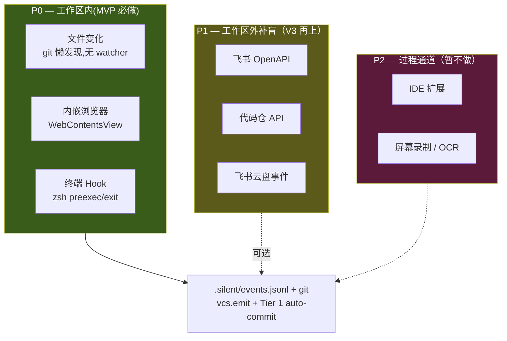

# 观察通道设计（v3）：工作区内三通道为 P0，外部 API 辅助

> 本篇是 [01-product-vision.md](01-product-vision.md) 的"observe 空间"具体实现规格。**观察主战场在工作区内**:内嵌浏览器 + 终端 hook 是 P0 实时通道;**用户外部文件编辑由 git 懒发现**(无 watcher);外部 API 通道(飞书 / 代码仓 / 云盘)降为 P1 辅助信号。应用内事件通过 [`08-vcs.md`](08-vcs.md) 的 `vcs.emit(...)` 落 `events.jsonl`。

## TL;DR

- **三条红线不变**：不建用户要切去的目的地；元数据 > 内容；本地合并再上云
- **P0 = 工作区内**:内嵌浏览器 + 终端 hook 实时 emit;用户文件编辑由 git 懒发现(无 watcher)
- **P1 = 工作区外补盲**：飞书 / 代码仓 / 云盘——当用户搬不进工作区的那部分数据
- **P2 = 过程通道**：IDE 扩展 / 屏幕录制，暂不做
- **MVP = P0 三通道**，6 周内在工作区内跑通 observe-learn-act 闭环

## 三条红线

1. **工作区边界 = 观察边界 = 授权边界** — 工作区目录之外不观察，内嵌浏览器以外的 Chrome 不观察，其他终端进程不观察
2. **元数据 > 内容** — 默认只抓 URL / 时间 / 动作类型 / 命令名，不抓消息 body / 文档正文 / 代码内容 / 命令参数里的敏感字符串
3. **本地合并** — 各通道事件统一落盘到 `<workspace>/.silent/events.jsonl`,只送**脱敏摘要**给云端 LLM(对应 [06-cloud-vs-local-agent.md](06-cloud-vs-local-agent.md) 的守门人原则)

## 通道分层



## P0 — 工作区内三通道(MVP 必做)

### 1. 文件变化(无 watcher,由 git 懒发现)

**MVP 不监听用户外部文件编辑**。Silent Agent 本身不内嵌编辑器,用户在 vim / VSCode / Cursor / JetBrains 里编辑文件,workspace 不主动捕获事件。

**变化怎么进版本**:下一次其他 trigger(`chat.turn-end` / `browser.load-finish` / `shell.exit` / `workspace.idle 30s`)触发 commit 时,`git status` 会把所有用户编辑的文件**自然捡进版本**。

**Agent 怎么看到变化**:`workspace.diff(refA, refB?)` —— 一次 git diff 拿到完整变化(详见 [08-vcs.md](08-vcs.md))。

**为什么不要 watcher**:
- chokidar 在大目录(10 万文件)启动慢、内存涨、编辑器 swap+rename 误触发
- 实时事件流的价值只在"agent 立刻知道用户改了文件",但 agent 通常等 chat turn 来时再看就够了
- git 已经是真相源,**无需第二个独立的事件流跟它打架**

**v0.2+ 可选**:如果"实时通知"价值真出现(比如内联建议要立即响应),再补一个轻量 chokidar wrapper,只管 emit 不管 commit。MVP 不做。

#### 子模块：二进制产物的影子文本（Office / PDF 等）

工作区里 `.docx / .pptx / .xlsx / .pdf` 等**二进制产物**会破坏 everything-is-file 哲学——能 commit 不能 diff、LLM 也读不了。解法：watcher 检测到这类文件变更时，**自动产出影子文本副本**，原文件留给用户用 Office/Acrobat 编辑：

```
研究报告.docx        ← 用户原文件（Office 编辑）
研究报告.shadow.md   ← watcher 自动生成（git diff + LLM 学习用）
```

```yaml
office_to_shadow:
  enabled: true
  rules:
    - patterns: ["*.docx", "*.odt"]
      converter: pandoc
      shadow_ext: ".shadow.md"
    - patterns: ["*.xlsx", "*.ods"]
      converter: xlsx2csv
      shadow_ext: ".shadow.csv"
    - patterns: ["*.pptx"]
      converter: pandoc
      shadow_ext: ".shadow.md"
    - patterns: ["*.pdf"]
      converter: pdftotext
      shadow_ext: ".shadow.txt"
  shadow_in_git: true     # 影子文本进 git，原文件可选择走 LFS
  shadow_in_jsonl: true   # 文件变更事件里带上 shadow_path
```

工作区初始化时同步写入 `.gitattributes`：

```
*.docx diff=pandoc
*.xlsx diff=xlsx
*.pptx diff=pandoc
*.pdf  diff=pdf
```

这样**所有产物（纯文本 + 二进制）都能进入 observe-learn-act 闭环**，不破坏 everything-is-file。

老 Office 格式（`.doc / .ppt / .xls` 二进制 CFBF）pandoc 处理不了，建议在工作区入口拒收或自动转新格式。

### 2. 内嵌浏览器(Electron `WebContentsView`)

> **MVP = macOS only**:Electron 内嵌 Chromium,通过 `WebContentsView`(替代 deprecated `BrowserView`)挂到主窗口的 BrowserPane DOM 位置上。观察通过 `webContents` 事件 + `executeJavaScript` 拿,不需要 CDP attach。

**抓什么**(observe):
- **导航事件**(`webContents.on('did-navigate' / 'did-finish-load')`)→ URL / title / domain
- **Network 请求**(`webContents.session.webRequest.onCompleted`)→ `{method, url, status, domain}`(token / Authorization header 永远剥)
- **用户交互**(`executeJavaScript` 注入 listener,只抓 element role / selector / 位置,**不抓输入内容**)
- **页面快照**(`did-finish-load` 后 `executeJavaScript('document.documentElement.outerHTML')` → Defuddle 抽干净 → `.silent/tabs/<tid>/snapshots/NNN.md`)
- 通过 `vcs.emit(...)` 落 `<workspace>/.silent/events.jsonl`(详见 [08-vcs.md](08-vcs.md));`load-finish` 命中 Tier 1 → 1s debounce 后 commit

**同时具备 act 能力**(给 agent 当 tool):
- 导航:`webContents.loadURL(url)`
- DOM 抽取:`webContents.executeJavaScript('document.querySelector(...).innerText')`
- 截图:`webContents.capturePage()`
- v0.2+ 升级:接 `playwright-core` 通过 `--remote-debugging-port` connectOverCDP,拿到完整 locator / click / fill / waitFor 能力

**Snapshot 后处理**(MVP 用 Defuddle):

| 方案 | 耗时 | 质量 |
|---|---|---|
| **outerHTML + Defuddle**(MVP 选) | 中页 150-400ms | ⭐⭐⭐⭐ 干净 markdown |
| innerText 直存(800ms timeout fallback) | < 300ms | ⭐⭐ |

详见 [08-vcs.md](08-vcs.md) "Browser Snapshot 子系统" 节。

**不抓什么**:
- 页面正文、表单输入内容(只在 Defuddle 抽 snapshot 时拿,不进 journal)
- API 的 request body / response body
- 用户的外部 Chrome(只管内嵌的)
- Cookie / Token / Authorization header(永远剥)

**Context 隔离**:每个 workspace 独立 `session.fromPartition('persist:ws-<id>')`(Electron) —— cookie / localStorage 互不串扰,对应 Playwright 的 `browserContext` 概念

### 3. 终端 Hook

**抓什么**:
- zsh preexec hook → `{命令名, cwd, 时间}` → `vcs.emit({source:'shell', action:'exec'})`
- 命令退出 → `{exit_code, 耗时}` → `vcs.emit({source:'shell', action:'exit'})`(命中 Tier 1 → commit) + 落 `.silent/tabs/<tid>/snapshots/NNN-cmd.log`(命令输出快照)
- 完整 pty 数据流 → append 到 `.silent/tabs/<tid>/buffer.log`(高频,**不进 git**;信息冗余在 NNN-cmd.log 切片里)

**不抓什么**:
- 命令参数里的敏感字符串(token、密码、私有 URL)—— 用 glob pattern 白名单匹配后过滤

**技术实现**:内嵌 xterm.js + node-pty,包装的 shell(zsh/bash)注入 preexec hook,在 pty 层解析 prompt 分隔标记切分命令。详见 [08-vcs.md](08-vcs.md) "Terminal Snapshot 子系统" 节。

## P1 — 工作区外补盲（V3 再上）

当用户的任务部分数据搬不进工作区（会议在日历、别人的 PR 在 GitHub、文档正在飞书多人协作），这些外部通道作为补盲：

### 4. 飞书 OpenAPI

**抓什么**：
- 消息：`{time, chat_id, sender, 是否@我, 是否未读}` — 不抓正文
- 日程：`{time, title, 参会人, 确认状态}`
- 文档变更：`{doc_id, title, 修改时间, 我是否参与}`
- 任务：`{state, assignee, due}`

**技术复用**：已有 lark-cli / lark-im / lark-doc / lark-calendar skill，直接封装。

### 5. 代码仓 API（code.byted.org / GitHub / GitLab）

**抓什么**：
- commit / MR / PR 元数据（不抓 diff）
- review verdict（不抓 comment 正文）
- CI 状态

**技术实现**：code.byted.org 走 OpenAPI（bytedcli 已封装）；GitHub 走 REST + webhook。

### 6. 飞书云盘事件

**抓什么**：
- 文件创建 / 修改 / 删除事件
- 文档评论 / @ 提及
- 文档 permission 变更

**技术实现**：飞书 OpenAPI drive webhook + event subscription。

## P2 — 过程通道（暂不做）

### 7. IDE 扩展

**什么时候做**：需要"实时辅助"场景时（类似 Copilot）。但这块已被 Cursor / Claude Code 占据，**除非自己做 IDE AI，否则别碰**。

### 8. 屏幕录制 / OCR

**为什么不做**：
- 权限重（用户心理负担）
- 噪声极大（信噪比极低）
- 工作区内三通道已覆盖 80% 研发工作
- **Rewind / Limitless 的教训**：全屏采集引来的隐私争议不值得

## 事件统一 schema(everything is file)

各通道事件汇入 `<workspace>/.silent/events.jsonl`,字段统一(详见 [08-vcs.md](08-vcs.md) Event schema):

```jsonl
{"ts":"2026-04-23T10:32:05Z","source":"fs","action":"save","target":"notes.md","meta":{"size":4321,"ext":"md"}}
{"ts":"2026-04-23T10:32:10Z","source":"browser","action":"navigate","target":"https://logservice...","tabId":"br-1"}
{"ts":"2026-04-23T10:32:30Z","source":"shell","action":"exec","target":"git commit","tabId":"term-x","meta":{"cwd":"...","exit":0}}
```

**Workspace 边界 = session 边界**:每个 workspace 独立 `events.jsonl` 时间线,跨 workspace 不共享(workspace 已经是任务粒度的天然 session)。Pattern detection 在 v0.2+ 引入 wall-clock window 切分(详见 [08-vcs.md](08-vcs.md) OpenChronicle 启示)。

## 隐私架构

```
🔴 原始内容(消息 body / 文档正文 / 代码 diff / 命令输出)  → 永远不离开设备
🟡 脱敏摘要("用户在工作区里整理了竞品笔记")              → 可送云端 LLM 做推理
🟢 产物元数据(文件路径 / URL 域名 / 命令名)              → 可存工作区 .silent/events.jsonl,可 git 追踪
🔵 Skill 定义(observe-learn-act schema)                  → 跨设备同步(云端 Sidecar)
```

与 [06-cloud-vs-local-agent.md](06-cloud-vs-local-agent.md#memory-分层同步策略) 的 L1–L4 Memory 分层一致。

## MVP 实施顺序

详见根目录 `task.md` Phase 5(`.silent/` + journal + 浏览器/终端 snapshot 子系统)。P1 外部 API 通道推到 v0.2,P2 屏幕录制 / IDE 扩展永远不做。

## 关联文档

- [01-product-vision.md](01-product-vision.md) — 产物视角的哲学基础(为什么观察产物)
- [04-workspace-interaction.md](04-workspace-interaction.md) — 工作区交互设计(三通道在 UI 里如何呈现)
- [06-cloud-vs-local-agent.md](06-cloud-vs-local-agent.md) — 本地 vs 云端架构
- [08-vcs.md](08-vcs.md) — 事件流统一落 events.jsonl + git auto-commit + snapshot 子系统

## 参考资料

- [Chrome DevTools Protocol](https://chromedevtools.github.io/devtools-protocol/) — CDP 官方文档
- [simple-git](https://github.com/steveukx/git-js) — git 包装(给 WorkspaceVCS 用)
- [zsh preexec hook](https://zsh.sourceforge.io/Doc/Release/Functions.html) — shell 命令捕获
- [Cloud Agent Workspace 调研](../../Notes/调研/cloud-agent-workspace/) — sandbox / workspace 技术栈参考
