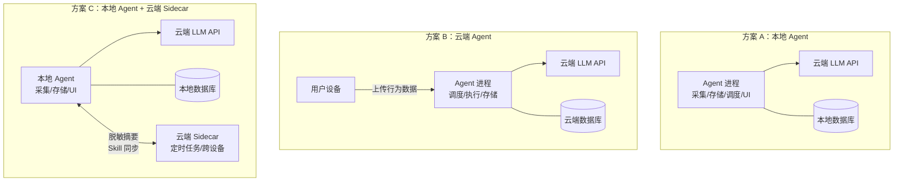
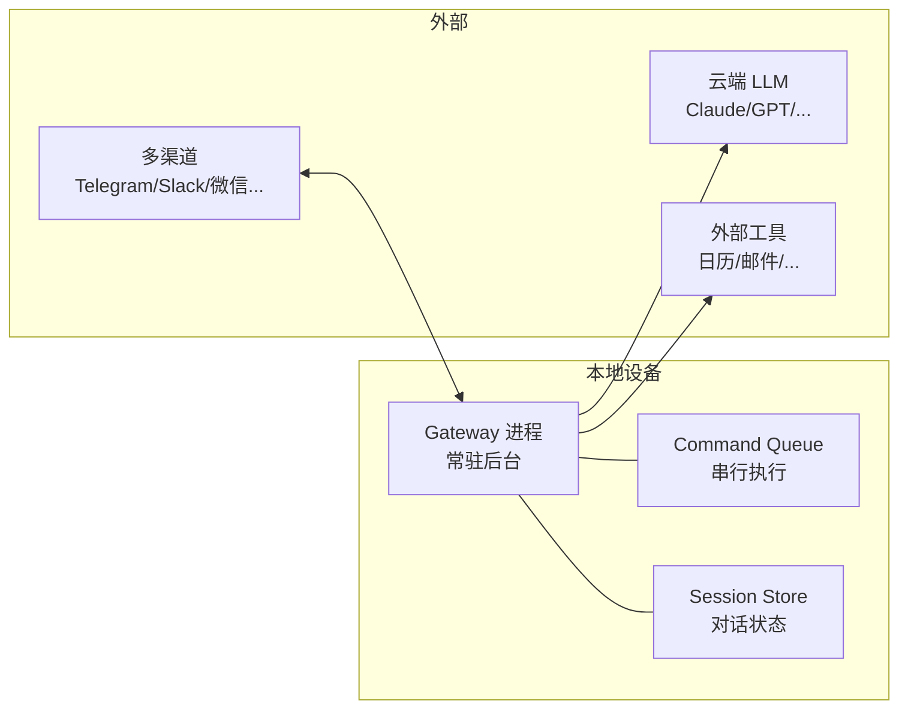
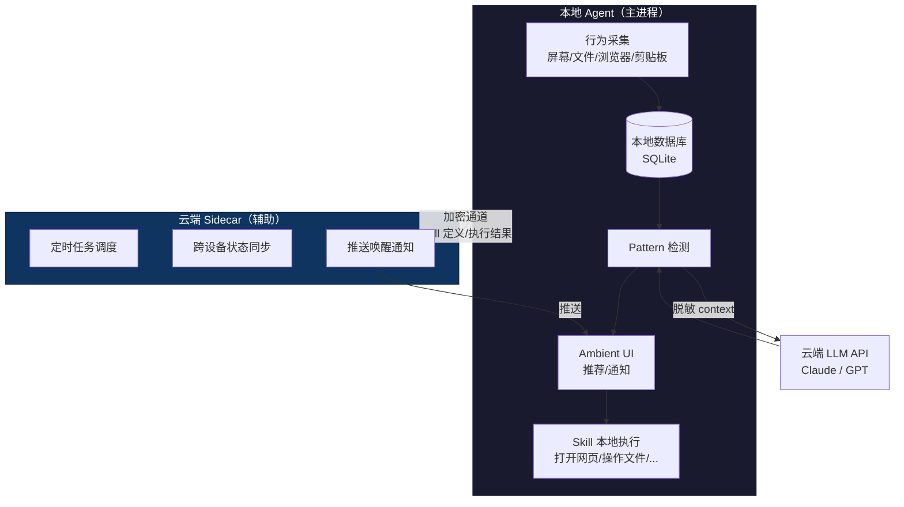
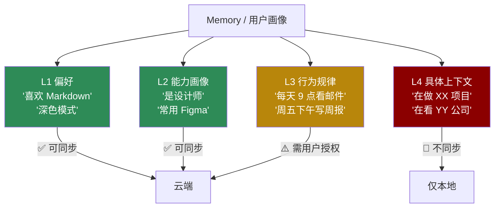
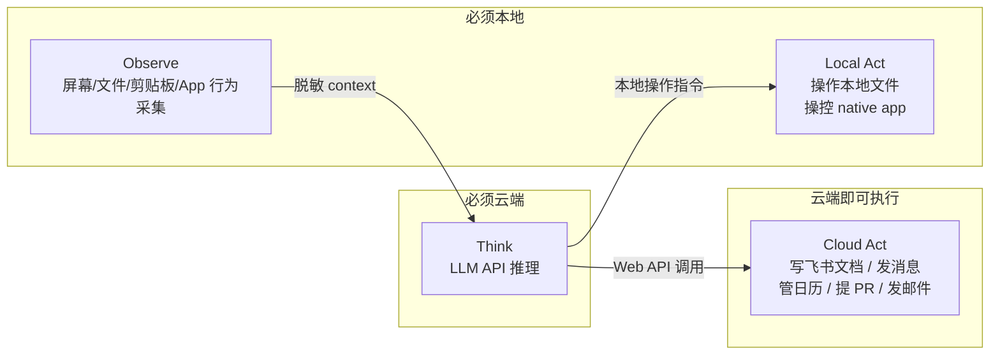
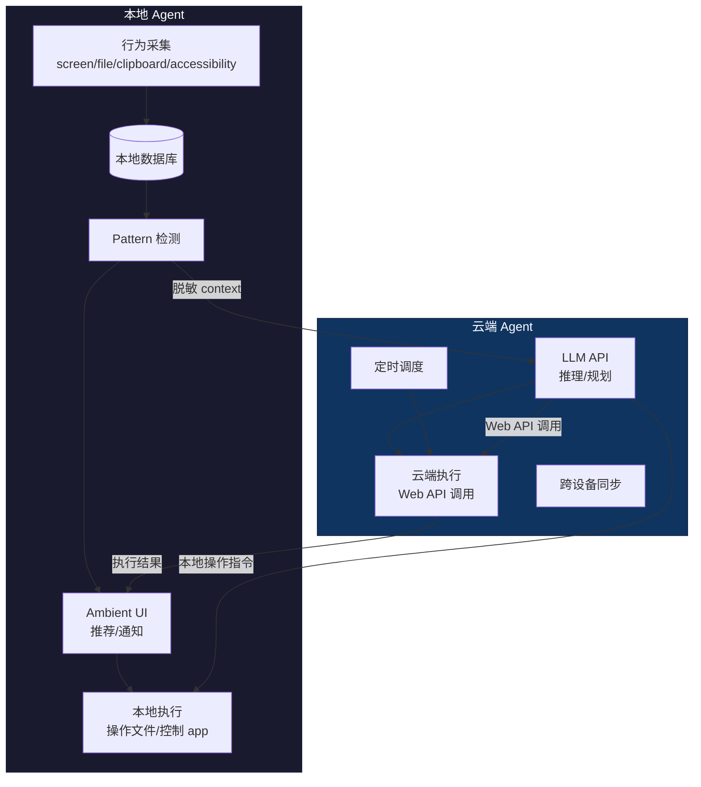

# 本地 Agent vs 云端 Agent：个人助理部署形态调研

> 前提：模型推理统一走云端 API（Claude/GPT），不考虑本地大模型。本文讨论的是 **Agent 进程本身**（采集、存储、调度、执行）跑在用户设备上还是跑在云端服务器上。
>
> 结论：Silent Agent 应采用 **本地 Agent + 云端 Sidecar** 架构 — Agent 主进程常驻本地设备做行为采集和数据守门，云端 Sidecar 负责 always-on 定时任务和跨设备同步。两者通过加密通道协作，原始行为数据永远不离开设备。

## 先厘清概念



三个方案的本质区别不在于模型（都是云端 API），而在于**谁控制数据、谁做调度、谁跟用户交互**。

## 维度对比

### 1. 行为数据采集

这是 Silent Agent 的核心能力，也是架构选择的决定性因素。

| 维度 | 本地 Agent | 云端 Agent |
|------|-----------|-----------|
| 采集能力 | **直接访问**屏幕、文件系统、剪贴板、Accessibility API | 需要用户设备上装一个轻客户端持续上传 |
| 数据延迟 | 零延迟，实时处理 | 取决于上传带宽和频率 |
| 隐私 | 原始数据不离开设备 | 原始数据必须上传到云端 |
| 离线采集 | 正常工作 | 断网时丢失数据 |

**结论：行为采集只能本地做。** 让用户把截图、浏览记录、文件操作实时上传到云端服务器，这不是技术问题，是用户心理不可接受。Rewind.ai 的前身就是因为全本地才被市场接受，后来 Limitless 转云端后引发隐私争议。

### 2. 数据存储与隐私

| 维度 | 本地 Agent | 云端 Agent |
|------|-----------|-----------|
| 存储位置 | 用户设备（SQLite/本地文件） | 云端数据库 |
| 数据所有权 | 用户完全控制 | 依赖服务商承诺 |
| 泄露面 | 仅物理接触设备 | 网络传输 + 云端存储 + 内部人员 |
| 合规 | 天然满足 GDPR（数据不出设备） | 需要复杂的合规架构 |
| 用户信任 | 高 — "我的数据在我的电脑上" | 低 — "我的屏幕截图在别人的服务器上" |

Screenpipe（开源屏幕记录 agent）的成功验证了这一点：全本地存储、用户完全控制是这类产品的信任基石。

### 3. 调用云端 LLM API 时的数据控制

两种架构都要调用云端 LLM API，关键区别在于**发送什么数据**：

| | 本地 Agent | 云端 Agent |
|---|-----------|-----------|
| 发送内容 | Agent 在本地做预处理，**只发脱敏后的摘要/问题** | 云端 Agent 直接访问原始数据，可能将更多内容发给 LLM |
| 数据守门人 | **用户设备上的 Agent 代码** — 可审计、可控制 | 云端服务商 — 用户看不到实际发送了什么 |
| 透明度 | 可以本地记录每次 API 调用的完整 prompt | 黑盒 |

```mermaid
flowchart LR
    subgraph 本地Agent["本地 Agent（数据守门人）"]
        Raw[原始数据<br/>截图/URL/文件] -->|本地预处理| Clean[脱敏摘要<br/>"用户从设计工具导出图片"]
    end
    Clean -->|只发摘要| LLM[云端 LLM API]
    LLM -->|结果| 本地Agent

    subgraph 云端Agent["云端 Agent"]
        Raw2[原始数据] -->|全量上传| Server[云端服务器]
        Server -->|可能含原始数据| LLM2[云端 LLM API]
    end
```

**这是最核心的差异：本地 Agent 让用户设备成为数据守门人，精确控制什么信息以什么形式发给 LLM。**

### 4. Always-on 与持续运行

| 维度 | 本地 Agent | 云端 Agent |
|------|-----------|-----------|
| 可用性 | 设备在线时运行（笔记本合盖就停） | 7x24 永远在线 |
| 定时任务 | 设备必须开机 | 随时执行 |
| 后台 Skill 执行 | 依赖设备不休眠 | 独立于设备状态 |
| 跨设备 | 每台设备独立 | 天然统一 |

**这是云端 Agent 的核心优势。** 个人助理需要"设备关了也能帮你做事"的能力：
- 凌晨 3 点自动拉取数据生成日报
- 在用户通勤时（手机上）继续 PC 上的工作流
- 持续监控某个网页变化并通知用户

Cloudflare Project Think 的架构很有参考价值：agent 在事件驱动下唤醒（HTTP/cron/email），执行完后休眠，成本几乎为零。

### 5. 响应延迟与交互体验

| 场景 | 本地 Agent | 云端 Agent |
|------|-----------|-----------|
| UI 响应 | 本地进程，毫秒级 | 需要网络往返 |
| 上下文加载 | 直接读本地数据库 | 需要从云端拉取或在客户端缓存 |
| 离线体验 | 可展示历史数据和缓存推荐 | 完全不可用 |

Ambient UI（常驻悬浮窗/状态栏）需要毫秒级响应，这只有本地进程能做到。

### 6. 开发与运维

| 维度 | 本地 Agent | 云端 Agent |
|------|-----------|-----------|
| 分发 | 桌面 App 安装包 | 注册账号即用 |
| 跨平台 | 需要适配 macOS/Windows/Linux | 一套后端 |
| 更新 | 用户需更新客户端 | 服务端热更新 |
| 错误处理 | 崩了用户自己重启 | 自动恢复、监控告警 |
| 用户获取门槛 | 高（下载安装、授权权限） | 低（网页即用） |
| 运维成本 | 低（用户设备算力） | 高（服务器成本随用户线性增长） |

### 7. 成本模型

| 项目 | 本地 Agent | 云端 Agent |
|------|-----------|-----------|
| 算力 | 用户设备承担（免费） | 服务器成本（$5-50/用户/月） |
| LLM API | 用户付（BYOK）或平台付 | 平台统一付 |
| 存储 | 用户本地磁盘（免费） | 云存储（按量） |
| 带宽 | 仅 LLM API 调用 | 行为数据上传 + LLM API |
| 规模效应 | 边际成本趋零 | 每增一个用户加一份成本 |

**本地 Agent 的成本结构对创业者更友好** — 不需要为每个用户准备服务器和存储。OpenClaw 的模式验证了这一点：agent 跑在用户设备上，用户自带 API key，平台零边际成本。

## 行业参考案例

### OpenClaw — 本地 Agent + 云端 API 的标杆

2026 年最成功的个人助理开源项目（GitHub 247K stars），架构值得深入参考：



关键设计：
- **Gateway 是本地单一进程** — 所有消息、会话、工具调用通过它路由
- **模型无关** — 用户自带任意 LLM 的 API key
- **消息串行处理** — 每个 session 内一次只处理一条消息，避免并发冲突
- **多渠道统一入口** — 20+ 聊天平台的消息归一化后统一处理
- 通过 `systemd`/`LaunchAgent` 实现**常驻后台**，30 分钟心跳保活

### Screenpipe — 本地行为采集 + 云端 LLM

与 Silent Agent 最接近的产品形态：

- 本地持续录屏 + OCR/Accessibility API 提取文字
- 数据全部存本地，**不上传任何原始数据**
- 用户可选择接入 Claude/GPT 做智能分析
- 提供 REST API，可接入 Obsidian、自定义 agent
- 开源，用户可审计数据流

### Limitless（原 Rewind）— 从全本地到云端的教训

- Rewind 时期：**全本地**录屏 + 本地索引，隐私口碑极好
- 转型 Limitless 后：转向**云端处理**（Confidential Cloud），引发隐私争议
- 用"零知识加密"（Confidential Computing）试图缓解，但用户信任已受损
- 教训：**个人行为数据一旦上了云，不管加密多强，用户心理上就不信了**

### Cloudflare Project Think — 云端 Agent 的最佳实践

如果要做云端部分，Project Think 的架构最值得参考：

- **事件驱动唤醒** — HTTP/cron/email/WebSocket 触发，不用常驻进程
- **休眠零成本** — Durable Objects 空闲时不计费
- **持久化状态** — 每个 agent 实例自带 SQLite，崩溃可恢复
- **适合场景** — 定时任务、webhook 响应、异步长流程

## Silent Agent 的推荐架构

### 本地 Agent + 云端 Sidecar



### 职责划分

| 功能 | 在哪跑 | 为什么 |
|------|--------|--------|
| 行为数据采集 | **本地** | 需要访问屏幕/文件系统/Accessibility API |
| 数据存储 | **本地** | 隐私红线 |
| Pattern 检测 | **本地** | 数据不出设备 |
| LLM API 调用 | 本地发起 → **云端推理** | 本地 Agent 做数据守门人，控制发送内容 |
| Ambient UI | **本地** | 毫秒级响应 |
| Skill 本地执行 | **本地** | 操作用户的 app/文件 |
| 定时任务 | **云端 Sidecar** | 设备可能离线 |
| 跨设备同步 | **云端 Sidecar** | 需要中心节点 |
| 推送通知 | **云端 Sidecar** | 设备休眠时唤醒 |

### 数据流动规则

```
🔴 原始行为数据（截图/URL/文件内容）    → 永远不离开设备
🟡 脱敏摘要（"用户从设计工具导出图片"） → 发给 LLM API 做推理
🟢 Pattern 描述（"每周五汇总三个数据源"）→ 可同步到云端 Sidecar
🔵 Skill 定义（goal + trigger + context）→ 跨设备同步
```

### 云端同步 Schema

云端 Sidecar 只存逻辑和元数据，不存行为数据：

```yaml
cloud_sync:
  # Skill 定义 — 跨设备复用的核心资产
  skills:
    - name: "周报生成"
      goal: "汇总本周工作生成周报"
      trigger: { type: cron, expr: "0 17 * * 5" }
      context_schema: [calendar, task_system, git]  # 只存 schema，不存实际数据
      output: { format: markdown, destination: doc }
      trust_level: 3
      version: 4

  # 执行状态 — Sidecar 调度需要
  execution_state:
    - skill: "周报生成"
      last_run: "2026-04-11T17:00:00Z"
      status: success
      next_trigger: "2026-04-18T17:00:00Z"

  # 用户配置 — 跨设备一致体验
  preferences:
    notification_frequency: low
    ui_theme: dark
    language: zh-CN
    active_devices: [macbook-pro, iphone]

  # L1/L2 Memory — 安全的用户画像（偏好+角色）
  memory:
    role: "设计师"
    tools: [figma, feishu, vscode]
    output_preferences: { format: markdown, style: concise }

  # 反馈信号 — 改善推荐质量
  feedback_log:
    - pattern_id: "p_032"
      action: confirmed  # confirmed / dismissed / blocked
      timestamp: "2026-04-15T10:30:00Z"
```

### Memory 分层同步策略

Memory 横跨"有用"和"敏感"，需要按层级区分：



判断标准：**这条信息泄露了，会不会让用户不舒服？**

| 数据类型 | 同步 | 理由 |
|---------|------|------|
| 原始行为事件 | 🚫 | 隐私红线 |
| Session 摘要 | 🚫 | 含行为语义，可推断用户在干嘛 |
| Pattern 库 | ⚠️ | 脱敏后可以，需逐条授权 |
| Skill 定义 | ✅ | 纯逻辑，跨设备核心资产 |
| Skill 执行状态 | ✅ | 调度必需 |
| 用户配置 | ✅ | 跨设备体验一致 |
| L1/L2 Memory | ✅ | 偏好和角色，不敏感 |
| L3 Memory | ⚠️ | 行为规律，需授权 |
| L4 Memory | 🚫 | 具体上下文，高度敏感 |
| 账号凭证 | 🚫 | 只存加密引用，设备端解密 |
| 反馈记录 | ✅ | 不含敏感内容 |

### MCP 能力层：哪些只能本地，哪些云端也行

本地 Agent 的能力本质上是一组 **MCP Server**：

```mermaid
flowchart TB
    subgraph 本地only["本地 Only MCP — 只有本地 Agent 能用"]
        direction TB
        M1["screen-capture — 截屏/OCR/窗口识别"]
        M2["filesystem — 本地文件读写/监听变更"]
        M3["clipboard — 监听复制粘贴/来源追踪"]
        M4["accessibility — UI 元素树/操控 native app"]
        M5["app-launcher — 打开/切换/关闭本地应用"]
        M6["system-events — WiFi/蓝牙/休眠状态"]
    end

    subgraph 云端也行["Web MCP — 云端 Agent 同样能用"]
        direction TB
        W1["calendar — 日历 CRUD"]
        W2["im — 飞书/Slack 消息收发"]
        W3["docs — 飞书文档/Notion/Google Docs"]
        W4["github — PR/Issue/代码"]
        W5["email — 邮件收发"]
        W6["browser-remote — Playwright 云端浏览器"]
    end
```



### 重新审视 Act：大部分执行不需要本地

现代知识工作者的工作场景已经高度云化。审视一遍用户的日常操作：

| 用户动作 | 实际发生在哪 | 需要本地 Act？ |
|---------|------------|--------------|
| 写文档 | 飞书文档 / Google Docs / Notion | **否** — Web API 直接写 |
| 发消息 | 飞书 / Slack / 邮件 | **否** — IM API / SMTP |
| 管理日程 | 云端日历 | **否** — Calendar API |
| 提交代码 | GitHub / GitLab | **否** — Git API |
| 管理任务 | Jira / Linear / 飞书任务 | **否** — API |
| 做设计 | Figma（云端） | **否** — Figma API 可导出 |
| 操作本地文件 | Finder / 终端 | **是** |
| 操控无 API 的桌面 app | Keynote / Excel 本地版 / 专业软件 | **是** |
| 浏览器自动化（填表、爬取） | 可以 Playwright 云端跑 | **大部分否** |

**结论：用户日常 70-80% 的"操作"已经在云端 SaaS 里完成，本地设备只是进入这些服务的窗口。**

这意味着 Observe / Think / Act 的分布要重画：



> **Observe 必须本地，Think 必须云端，Act 大部分可以云端。**

### 这对架构的影响

之前把云端 Sidecar 定位为"辅助"（只做定时任务和同步），现在应该升级为 **云端 Agent 也是一等执行者**：

| 能力 | 之前的定位 | 修正后 |
|------|----------|--------|
| 本地 Agent | 采集 + 推荐 + 所有执行 | 采集 + 推荐 + **本地 only 执行** |
| 云端 Sidecar | 定时任务 + 同步 | **独立完成大部分 Skill 执行** + 定时任务 + 同步 |

修正后的架构：



### Skill 执行路由

每个 Skill 在生成时就确定执行位置：

```yaml
skill:
  name: "周报生成"
  goal: "汇总本周工作生成周报"
  execution:
    route: cloud          # cloud / local / hybrid
    reason: "所有数据源和输出都是 Web API"
    tools:
      - calendar.list     # 云端
      - github.commits    # 云端
      - feishu.doc.create # 云端
    trigger:
      type: cron
      expr: "0 17 * * 5"
      can_run_offline: true  # 设备离线也能执行

---

skill:
  name: "整理下载文件夹"
  goal: "按类型归类 ~/Downloads 下的文件"
  execution:
    route: local           # 必须本地
    reason: "需要 filesystem MCP"
    tools:
      - filesystem.list
      - filesystem.move
    trigger:
      type: event
      source: filesystem.watch
      path: ~/Downloads

---

skill:
  name: "Figma 导出同步到飞书"
  goal: "Figma 导出的设计稿自动上传到飞书文档"
  execution:
    route: hybrid          # 采集本地，执行云端
    reason: "监听本地文件变更，但上传走 Web API"
    tools:
      - filesystem.watch   # 本地：监听 ~/Downloads 新增 PNG
      - feishu.drive.upload # 云端：上传到飞书
```

### 这带来的产品优势

1. **设备关了 Skill 照样跑** — "周报生成"不依赖本地设备，周五下午 5 点云端 Agent 直接调 API 完成
2. **更稳定** — Web API 调用比 UI 自动化可靠 10 倍，不怕界面改版
3. **更快** — API 直接写文档 vs 打开浏览器→导航→操作，快一个数量级
4. **本地 Agent 更轻** — 专注于采集和观察，不需要集成所有 Web API SDK

### 本地 Agent 真正不可替代的是什么

收窄到两件事：

1. **Observe** — 看到用户在干嘛（屏幕、文件、剪贴板、App 切换）。这只能在用户设备上做，是发现 pattern 的数据源，是整个产品的起点。
2. **Local-only Act** — 操作用户电脑上没有 Web API 的东西（本地文件、Native app、IDE）。这是少数场景但不可替代。

其余能力（Think + Cloud Act + 定时调度 + 跨设备同步）都在云端更好。

### 关键设计原则

1. **Observe 绑定本地，Act 按需路由** — 采集必须本地，执行优先走 Web API（更快更稳），只有操作本地资源时才走本地 MCP
2. **Agent 是数据守门人** — 所有 LLM API 调用从本地发起，Agent 在本地做预处理和脱敏，用户可审计每次发送的 prompt
3. **云端 Agent 是一等执行者** — 不是"辅助"，是大部分 Skill 的实际执行者，设备离线也能独立完成任务
4. **云端只存逻辑，不存行为数据** — 云端 Agent 有 Skill 定义、Web API 凭证、调度状态，但没有任何用户行为数据
5. **成本在用户侧** — 本地 Agent 用用户设备算力做采集，云端 Agent 的 Web API 调用成本极低

## 参考资料

- [Local vs Cloud AI Agents: Architecture Split Explained](https://algeriatech.news/local-vs-cloud-ai-agents-architecture-2026/) — 2026 年 Agent 架构分裂的全景分析
- [AI Agent Desktop: How Autonomous Software Controls Your Computer](https://fazm.ai/blog/ai-agent-desktop) — 桌面 Agent 三种部署模式及隐私分析
- [How OpenClaw Works: Understanding AI Agents Through a Real Architecture](https://bibek-poudel.medium.com/how-openclaw-works-understanding-ai-agents-through-a-real-architecture-5d59cc7a4764) — OpenClaw Gateway 架构详解
- [Screenpipe vs Limitless 2026](https://screenpi.pe/blog/screenpipe-vs-limitless-2026) — 全本地 vs 云端的产品对比
- [Project Think: Building Next-Gen AI Agents on Cloudflare](https://blog.cloudflare.com/project-think/) — 事件驱动云端 Agent 架构
- [Running AI Agents 24/7 in 2026: Local vs Cloud vs Managed](https://www.deployagents.co/blog/running-ai-agents-24-7-in-2026-local-vs-cloud) — 成本和可靠性对比
- [Cloud vs Local AI Agents: What OpenClaw's Risks Reveal](https://www.ninjatech.ai/blog/cloud-ai-agents-vs-local-ai-agents) — 安全视角分析
- [Local vs Cloud AI (Konvoy VC)](https://www.konvoy.vc/newsletters/local-vs-cloud-ai) — 投资视角的市场趋势
