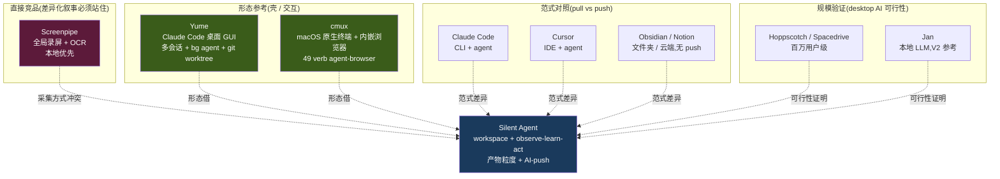
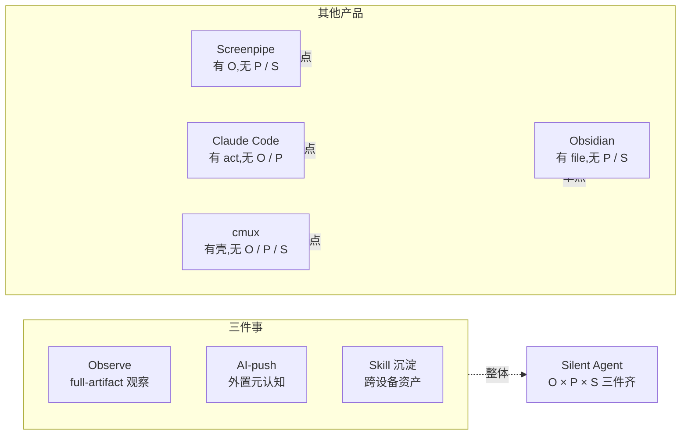

# 竞品对标:桌面 AI helper 生态

> Silent Agent 在 "本地观察 + AI-push + 工作区" 这个交叉点上,生态里已有几个产品路径高度重叠。本篇梳理最值得对标的产品,目标:**回答三个问题 — 能借鉴什么、差异点在哪、是否会正面竞争**。
>
> 早期版本(2026-04 之前)以 Tauri 生态为框架对标(Screenpipe / Yume / Jan / GitButler / Hoppscotch),后来选型敲定 Electron(详见 [02-architecture.md](02-architecture.md) 选型理由),本篇按"产品路径"而非"技术栈"重新组织。

## TL;DR

- **直接竞品 / 差异化必须说清楚**:**Screenpipe**(全本地观察 + AI 上下文,但走 OCR 屏幕录制)
- **形态参考价值高**:**cmux**(macOS 原生 GPL 终端壳 + 内嵌浏览器 + 垂直标签页 + 49 verb agent-browser API)、**Yume**(闭源 Claude Code GUI,只能产品参考不能抄代码)
- **范式参考**:**Cursor / Claude Code**(pull 范式,差异在 push)、**Obsidian / Notion**(文件夹/云端但无 push)
- **规模验证(技术栈无关)**:Hoppscotch / Spacedrive / Jan 证明 desktop AI app 可以做大
- **结论**:在"工作区内 full-artifact 观察 × AI-push × skill 沉淀"这三件事的交集上,**没有任何一家同时做**。这是 Silent Agent 的护城河

## 核心对标矩阵



## Screenpipe — 最像的竞品

### 产品形态
- 24/7 本地屏幕录制 + OCR + Accessibility API 提取文字
- 全本地存储,不上传原始数据
- 可接入 Claude / GPT 做智能分析
- 提供 REST API,可接入 Obsidian / 自定义 agent
- 开源,Tauri + Rust 实现

### 与 Silent Agent 的共同点
- 本地优先、隐私红线一致(`06-cloud-vs-local-agent.md` 引用为参考)
- 目标用户都是"希望 AI 理解工作上下文"的知识工作者

### 关键差异:采集方式

| 维度 | Screenpipe | Silent Agent |
|---|---|---|
| 采集边界 | **整台电脑全局** | **工作区边界内** |
| 采集方式 | 屏幕录制 + OCR + Accessibility | 文件 watcher + 内嵌浏览器 + 终端 hook |
| 信噪比 | 低(刷抖音、看微信都录) | 高(工作区内天然相关) |
| 权限 | 屏幕录制 + 辅助功能(重) | 单个文件夹(轻) |
| 用户心理 | "它在监视我" | "我主动把东西放这里" |
| 观察粒度 | 像素 / 文本块 | 产物 / 结构化事件 |
| AI-push? | 没有 — 只观察不主动 | 有 — "教教我"仪式 |

### 我们相对 Screenpipe 的优势
- **隐私感知低**:工作区边界 = 授权边界,不像全局录屏那样"吓人"
- **信噪比高**:工作区内 100% 相关,不用做噪声过滤
- **产物粒度更利于 AI-push**:屏幕 OCR 出的是散乱文本块,工作区事件流天然结构化
- **`observe → learn → act` 完整闭环**:Screenpipe 只 observe,我们到 act

### 我们可能的劣势
- **覆盖面窄**:Screenpipe 能抓到 Silent Agent 工作区外的事(用户回飞书的消息、Figma 的操作)
- **用户需要"搬入"**:Screenpipe 零配置开机就录,Silent Agent 需要用户主动 `New Workspace`

### 差异化叙事(三句话)
1. "Screenpipe 采集全局,我们采集工作区"
2. "Screenpipe 靠 OCR 降噪靠算法,我们靠边界天然降噪"
3. "Screenpipe 观察像素 / 文本,我们观察结构化产物"

这三句话要能站住 —— 否则用户会问"为什么我不用 Screenpipe?"

### 从 Screenpipe 学什么(技术栈无关)
- **24/7 后台长跑**经验:内存占用不增长 / event 写入性能 / macOS 系统权限申请流程
- 从 OCR 路线的失败经验反向验证我们 artifact-first 路线的优势

## Yume — Claude Code 桌面 GUI

> 详细调研:`Notes/调研/yume-claude-code-gui/`

### 产品形态
- Claude Code 原生桌面 GUI —— 把 Claude Code CLI 作为 subprocess spawn
- 多标签会话(`⌘T` / `⌘W` / `⌘D` / `⌘⇧D` fork session)
- 4 个并发 background agents,git worktree 隔离(`yume-async-{type}-{id}`)
- 3 进程架构:Tauri 2.9(Rust)+ React 19(virtualized rendering)+ Node.js server(socket.io stream)
- SQLite + WAL 做 sessions / messages / analytics 持久化

### License 限制(影响借鉴方式)

```
禁止:Modify / reverse engineer / decompile / disassemble
禁止:Create derivative works based on the software
源码:proprietary and confidential(不公开)
```

→ **不能借鉴代码**,仅产品设计可参考。

### 可借鉴的产品设计(不抄代码)

| 设计点 | 借鉴度 | 备注 |
|---|---|---|
| **Background agent + git worktree 隔离** | ⭐⭐⭐⭐⭐ | 最有价值 —— 每个 agent 任务独立 worktree + 分支,合并前冲突检测;契合 Silent Agent "everything is file" 哲学;v0.2 实装 |
| **Fork session** 快捷键 | ⭐⭐⭐ | 从某点复制对话继续探索不同方向 —— Silent Agent workspace 可以借鉴(workspace 目录 + git branch) |
| **Virtualized rendering** | ⭐⭐⭐⭐ | 大会话历史性能必需,React 生态直接用 `react-window` |
| **SQLite WAL 持久化** | — | 我们用 jsonl + git;SQLite 仅做缓存(everything-is-file 要求 jsonl 为真相源) |

### Yume 没做的(我们的差异化)
- **没有 observe** —— Yume 是 Claude Code 的 GUI,纯 pull 范式,看不到用户工作流
- **没有 skill 沉淀** —— 每次会话开始 agent context 是空的,不学用户
- **任务边界靠用户手动管** —— 不能"自动看到用户在做啥然后教"

## cmux — agent-ready 终端壳

> 详细调研:`Notes/调研/cmux-terminal-browser/`

### 产品形态
- macOS 原生 Swift + AppKit + libghostty 终端
- 内嵌浏览器(WKWebView)+ 垂直标签页 + 分屏
- 49 verb agent-browser API(Playwright 风格 locator + `WKWebsiteDataStore` 级 context 隔离)
- v1/v2 协议双轨,可编程
- GPL-3.0-or-later(传染许可,**不能 fork 代码**)

### 价值:形态参考的上限

cmux 把"agent-ready 终端"形态做到了上限 —— 原生壳、原生菜单、键盘交互,Electron 永远追不上。

但 cmux **只做壳,不做魂** —— 没有 observe-learn-act 闭环、没有 skill 沉淀、没有 AI-push。**Silent Agent 接管它不做的"魂"**。

### 可借鉴的设计(不碰代码)
- **49 verb agent-browser spec** —— Playwright 风格 locator 是好接口设计,我们 v0.2 接 `playwright-core` 时参考
- **`WKWebsiteDataStore` 级 context 隔离** —— Electron `session.fromPartition('persist:ws-<id>')` 是对应的
- **垂直标签页 + 分屏** —— layout level 1/2 演进时参考(详见 [02-architecture.md](02-architecture.md) 分栏 Level 演进)

### 重要:不要陷入"做更好的终端"

cmux / Warp / Wave / Ghostty 在终端体验上做得比我们好(尤其 cmux 的原生 Swift)。Silent Agent 的差异在**魂**:

- **observe-learn-act 闭环** —— 没有别家做完整
- **AI-push** —— 别家都是 pull
- **skill 沉淀** —— 别家会话结束就忘

**精力全在魂,壳做到"够用"即可**。

## Cursor / Claude Code / Copilot — pull 范式参考

| 产品 | 形态 | 范式 | Silent Agent 差异 |
|---|---|---|---|
| **Cursor** | IDE + AI | pull(用户问) | Cursor 锁死代码;Silent Agent 覆盖调研 / 文档 / 数据分析 / 跨系统任务 |
| **Claude Code** | CLI + project dir | pull | Claude Code 是命令行;Silent Agent 是图形化工作区 + 内嵌三件套 |
| **GitHub Copilot** | IDE 内联补全 | pull | 只限代码,无跨场景观察 |

### 范式差异是核心

详见 [01-product-vision.md](01-product-vision.md) Part 1 —— pull 范式的天花板 = 用户元认知上限。Silent Agent 的差异不在功能,在**关系**:从 "用户 teach AI" 反转为 "AI teach user about themselves"。

### 风险:差异化可能消失

如果 Anthropic / Cursor 明天加了 push 和浏览器,**差异化会消失**。所以 skill 沉淀的护城河要尽快建起来 —— 用户在 Silent Agent 里教过的 skill 跟在 Cursor 里教过的 skill 不互通,这是真正的 lock-in。

## Obsidian / Notion / Replit — 形态对照

| 产品 | 形态 | 与 Silent Agent 的关系 |
|---|---|---|
| **Obsidian** | 文件夹 + 插件 | 只管 Markdown 笔记;我们有内嵌浏览器/终端 + AI-push |
| **Notion AI** | 云端文档 + AI | Notion 数据上云;我们本地优先 + 产物 git-friendly |
| **Replit Agent** | 云端 IDE + Agent | Replit 只管代码 sandbox;我们管真实工作产物 |
| **Coze Studio** | 云端 agent 构建 | Coze 用户要迁入;我们寄生用户当期任务 |

## 规模验证(desktop app 可行性)

技术栈虽然换成了 Electron,但下面这些 Tauri / 跨平台 desktop AI app 仍然证明:**desktop AI helper 商业上可行**。

| 产品 | 类别 | 意义 |
|---|---|---|
| **Hoppscotch** | API 测试,百万用户 | 桌面 AI 工具能做大 |
| **Spacedrive** | 跨平台文件浏览器 | 复杂 UI + 多窗格布局可行 |
| **Jan** | 离线 ChatGPT 替代 | 本地 LLM 集成的参考(V2 隐私场景对标) |
| **GitButler** | 新一代 Git SCM | 复杂桌面交互的标杆 |

我们 MVP 用 Electron 而非 Tauri,但**生态可行性在两边都已经被验证**:

- 单用户重型 desktop AI app(Cursor / Claude Desktop / VSCode)走 Electron 路径
- 极致轻量 / 系统集成深(Screenpipe / cmux)走 Tauri / 原生
- Silent Agent 的需求 —— Chromium CDP 观察质量、MCP Node 生态、上云顺 —— 让 Electron 是更合适的选择(详见 [02-architecture.md](02-architecture.md) 选型理由)

## 关键差异化判断(最终结论)



**没有任何一家把 O × P × S 同时做。** 这是 Silent Agent 唯一且确定的位置。

## 关联文档

- [01-product-vision.md](01-product-vision.md) — 为什么 push / 为什么产物级 / 为什么轻工作区
- [02-architecture.md](02-architecture.md) — Electron 选型理由(对标 Screenpipe Tauri 的对比)
- [06-cloud-vs-local-agent.md](06-cloud-vs-local-agent.md) — 本地 Agent 架构(Screenpipe 已被引用)
- `Notes/调研/yume-claude-code-gui/` — Yume 源码深度调研(license 限制)
- `Notes/调研/cmux-terminal-browser/` — cmux 调研(壳类竞品)

## 参考资料

- [Screenpipe](https://github.com/mediar-ai/screenpipe) — 24/7 本地录屏 + AI
- [cmux](https://github.com/cmux-app/cmux) — macOS 原生终端 + agent-browser
- [Jan](https://github.com/janhq/jan) — 离线 ChatGPT
- [GitButler](https://github.com/gitbutlerapp/gitbutler) — Git SCM
- [Hoppscotch](https://github.com/hoppscotch/hoppscotch) — API 工具
- [Spacedrive](https://github.com/spacedriveapp/spacedrive) — 跨平台文件浏览器
- [agent-browser](https://github.com/vercel-labs/agent-browser) — Playwright 风格 49 verb spec
