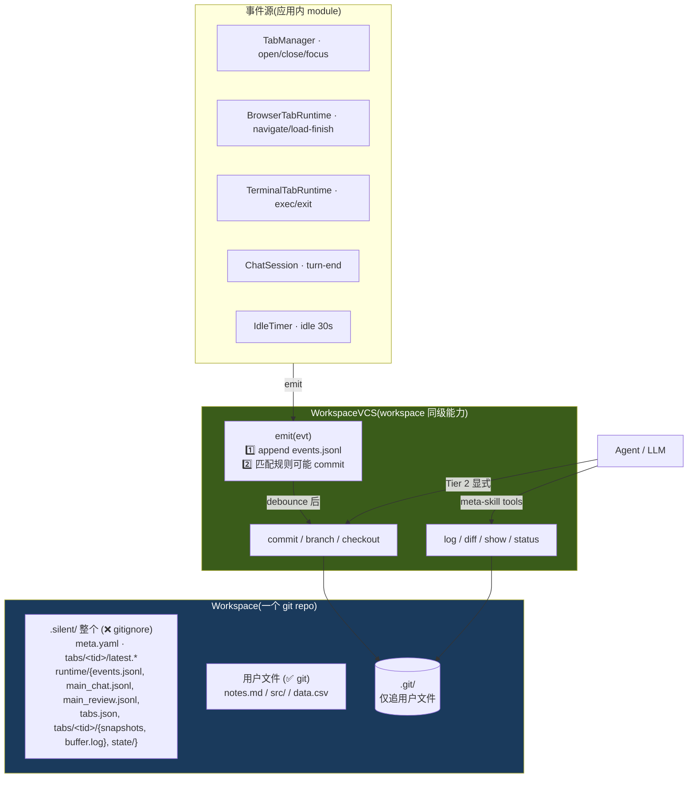

# Workspace VCS:工作区暴露的版本能力(meta-skill)

> Workspace 是一个 git repo,**`WorkspaceVCS` 是 workspace 同级暴露的能力对象**,所有 agent 都能通过它读历史 / 写 commit / 看 diff。app 内 module(TabManager / BrowserTabRuntime / TerminalTabRuntime / ChatSession)通过 `vcs.emit(...)` 写事件 + 在边界自动触发 commit。
>
> 不要独立的 watcher 包,不要 cursor / anchor 索引 —— **git 自身就是真相源,VCS 是它的薄外壳**。

## TL;DR

- **Workspace 是 git 仓库**(为支持 worktree),但 **git 只追用户文件**,`.silent/` 整个 gitignore —— silent agent 不在用户的 git history 里留痕
- **两条独立时间轴**:
  - **Git history**(用户文件 commit 序列)— 答 "在 t 时刻**用户文件**长啥样"
  - **events.jsonl**(append-only timeline)— 答 "在 t 时刻 workspace 发生了什么"(silent agent 完整观察)
- **`WorkspaceVCS` 是 workspace 同级的能力对象**:`emit / commit / log / diff / show / status / branch / checkout` + worktree 4 方法(详见 [10-multi-agent-isolation.md](10-multi-agent-isolation.md))
- **Tier 1 自动 commit 默认 0 条**:silent agent 不主动写 git history;原 4 条规则全部失效(`.silent/` 不进 git 后无东西可 commit);唯一仍有意义的 `workspace.idle` 改成 opt-in
- **没有 chokidar**,silent agent 不实时跟踪用户文件改动;agent 改文件走 Tier 2 显式 commit;用户改文件由用户自己 commit
- **Agent meta-skill**:agent-core 把 `WorkspaceVCS` 几个只读方法(log / diff / show / status)+ 显式 commit / branch / checkout 暴露成 builtin tool;**main_chat agent 是工作区主权**,通过 vcs + browser/terminal/file tools 调度该 workspace 全部资源
- **Events 2 层结构**:Layer 1 events.jsonl 行 < 1KB(summary + ref);Layer 2 detail 是独立 immutable 文件(snapshot)或 stream message id;全部在 `.silent/runtime/`,均不进 git
- **快照子系统**:browser Defuddle .md → `runtime/tabs/<tid>/snapshots/NNN-*.md` + `latest.md`(per-worktree 视角,**不进 git**);terminal 同构落 `NNN-cmd.log` + `latest-cmd.log`
- **`.silent/` 视角文件不进 git 的核心论据**:per-agent 视角(latest.\* / tabs.json / events.jsonl)在 worktree 模型下不是同一语义对象,git merge 假设不成立 → 详见 [10-multi-agent-isolation.md §3.1](10-multi-agent-isolation.md)

## 设计目标与约束

| 目标 | 约束 |
|---|---|
| **G1 git 只追用户文件,silent 私域全不进 git** | `.gitignore` 一行 `.silent/`;两条时间轴(git = 用户产物 / events.jsonl = silent agent 观察)互不串扰 |
| **G2 不监听外部 fs** | 没有 chokidar,用户编辑文件由 `workspace.idle` commit 时 `git status` 懒发现 |
| **G3 单一 emit 入口** | 应用内 module 主动调 `vcs.emit(evt)` —— 写 events.jsonl(始终);只有 idle 规则匹配时才检查 dirty + commit |
| **G4 meta-skill 暴露** | `WorkspaceVCS` 同时是 app 内部 API + 暴露给 agent 的 builtin tools(main_chat 是工作区主权 agent) |
| **G5 git 工具兼容** | 用户用 GitHub Desktop / GitButler / `git log` CLI 看到的全是用户产物 commit,无 silent agent 噪音 |
| **G6 worktree 友好** | 整个 `.silent/` 不进 git → bg worktree fork 时 `.silent/` 完全独立(silent agent 主动 cp meta.yaml + 初始化 runtime/),merge 时只动用户文件,语义无冲突 |
| **G7 隐私 / 安全** | 高频 pty 流落 runtime/buffer.log;敏感字段(token / cookie / Authorization)永不写 events.jsonl |
| **G8 Events 2 层结构** | Layer 1 events.jsonl 行 < 1KB,Layer 2 detail 通过 `meta.detailPath`(immutable 文件)或 `meta.messageId`(stream 单条)引用 |

**非目标**(留给 v0.2+):多级摘要 pipeline / 跨 workspace 同步 / 实时事件 stream sink / MCP server 暴露 / 通用 npm package 化

## 总体形态



## 1. Git 边界 = `.silent/` 目录边界

**git 只追用户文件**;silent agent 的所有内部状态(配置 / 时序 / 历史 / 派生 / cache)全部进 `.silent/`,整个目录 `.gitignore`。

```
<workspace>/
├── .git/
├── .gitignore                                  仅一行: .silent/
├── .silent/                                    ❌ gitignore 整个目录 · silent agent 私域
│   ├── meta.yaml                               workspace 配置(id / name / createdAt)
│   ├── tabs/<tid>/
│   │   ├── latest.md                           browser 当前页面 copy(per-worktree 视角)
│   │   └── latest-cmd.log                      terminal 最近命令 copy(per-worktree 视角)
│   └── runtime/                                per-worktree 运行时状态
│       ├── events.jsonl                        timeline log(append,2 层 Layer 1)
│       ├── main_chat.jsonl                     main_chat agent 对话流(messageId 源)
│       ├── main_review.jsonl                   main_review agent 对话流(messageId 源)
│       ├── tabs.json                           UI 状态(per-worktree 视角)
│       ├── tabs/<tid>/
│       │   ├── snapshots/NNN-<ts>.{md,log}     immutable 历史切片(序列即 log)
│       │   └── buffer.log                      pty raw 流
│       └── state/                              runtime cache
│           ├── last-active.json
│           ├── cookies/
│           └── cache/
└── notes.md / src/ / data.csv                  ✅ git · 用户内容(silent agent 唯一可能动 git history 的来源)
```

> 物理布局保留 5c+ 迁移结果(`latest.*` 在 `.silent/tabs/<tid>/` 顶层,`snapshots` / `buffer.log` 在 `runtime/tabs/<tid>/`);本轮设计修订只把 `.gitignore` 的 `.silent/runtime/` 改成 `.silent/`,代码层 `paths.ts` 路径常量不动。

**为什么 `.silent/` 整个不进 git**(从弱到强 4 个理由):

| 论据 | 强度 |
|---|---|
| append-only logs / immutable NNN 切片本身就是 monotonic truth,git pack 不会比 cat 文件便宜 | 中 |
| buffer.log / cache 高频派生可重建,进 git 是噪音 | 中 |
| tabs.json / latest.\* 改动太频繁,git status 永远 dirty | 中 |
| **per-agent 视角文件在 worktree 模型下跨 worktree 不是同一语义对象,merge 假设不成立** | **决定性**(见 [10-multi-agent-isolation.md §3.1](10-multi-agent-isolation.md)) |

**为什么这些进 git**:

| 类型 | 为什么进 git |
|---|---|
| 用户文件(`notes.md` / `src/` / 用户写的任何东西) | 真·内容,需要内容版本化;silent agent 借用此能力但只在 idle / 显式 Tier 2 时 commit |

`agents/<aid>/skills/*.yaml` / memory 等都在用户 home 下(`~/.silent-agent/agents/...`),不在 workspace 内,与 workspace git 无关 —— 它们的跨设备同步走 silent agent 自己的 sync layer(v0.2+)。

**核心**:`.silent/` 目录边界 = git 边界。`.gitignore` 一行,心智零负担。**workspace 身份靠 `.silent/` 目录是否存在判断(类比 `.git/`),不靠 meta.yaml 是否进 git**。删 `.silent/` 不影响用户的 git;tar 整目录是真正的"备份 silent agent 状态"。

### 默认 `.gitignore`

```gitignore
# 系统
.DS_Store
Thumbs.db

# 编辑器临时
*.swp
*.swo
*~

# 项目通用 cache
node_modules/
.next/
.venv/
__pycache__/
target/

# Silent Agent · 整个私域
.silent/

# linkedFolder(动态写入,如有)
# <linkedFolder relative path>/
```

外挂 workspace(用户已有 .gitignore)只**幂等追加 `.silent/` 一行**,不动用户其他规则。如已含 `.silent/` 或 `.silent` 行则跳过。

**没有**默认 ignore 大二进制扩展(.mov / .psd 等)—— 改用 pre-commit hook 拦 > 10MB 文件。

## 2. WorkspaceVCS 接口

```typescript
// app/src/main/vcs/interface.ts
export interface WorkspaceVCS {
  readonly workspacePath: string

  // ============ 应用内 module 调:emit + 自动 commit ============
  /**
   * 应用内 module(TabManager / BrowserTabRuntime / 等)主动调。做两件事:
   *   1. append events.jsonl(append-only,在 runtime/ 下不进 git)
   *   2. 命中唯一一条 idle 规则时(workspace.idle)→ git status check → 用户文件 dirty 才 commit
   * 其他 evt 都只走 ① append,不触发 commit
   */
  emit(evt: {
    source: EventSource                     // 'chat' | 'browser' | 'shell' | 'tab' | 'workspace' | 'agent' | 'linked'
    action: string                          // turn-end / load-finish / exec / focus / ...
    tabId?: string
    target?: string                         // URL / cmd / path
    meta?: Record<string, unknown>
  }): Promise<void>

  // ============ 显式 commit(Tier 2 · agent curator)============
  commit(message: string, opts?: { paths?: string[]; allowEmpty?: boolean }): Promise<string>
  branch(name: string): Promise<void>
  checkout(ref: string): Promise<void>

  // ============ 读(任意 agent 调,作为 meta-skill)============
  status(): Promise<{ dirty: boolean; staged: FileStatus[]; unstaged: FileStatus[] }>
  log(opts?: { limit?: number; since?: string; until?: string; path?: string }): Promise<CommitInfo[]>
  diff(refA: string, refB?: string, paths?: string[]): Promise<string>      // unified patch text
  show(sha: string): Promise<{ message: string; ts: string; files: string[]; patch: string }>

  // ============ 生命周期 ============
  dispose(): Promise<void>
}

export interface CommitInfo {
  sha: string
  message: string
  ts: string
  files: string[]
}

export interface FileStatus {
  path: string
  status: 'added' | 'modified' | 'deleted' | 'renamed'
}
```

**Factory**:`createWorkspaceVCS(workspacePath: string, opts?): WorkspaceVCS`,内部用 `simple-git` + 内置规则。

**关键**:`emit` 是唯一写入入口。一次调用做两件事(append + 可能 commit),语义清楚,调用方不管规则匹配细节。

## 3. Tier 1 默认规则:**默认 0 条**,silent agent 不主动 commit

```typescript
// app/src/main/vcs/auto-commit.ts
export const DEFAULT_TIER1_RULES: AutoCommitRule[] = []

// 可选 opt-in:idle 兜底,30s 没活动 + dirty → commit 用户文件
export const TIER1_RULES_IDLE_ONLY: AutoCommitRule[] = [
  { source: 'workspace', action: 'idle', debounceMs: 0 },
]
```

`createWorkspaceVCS(path)` 默认走 `DEFAULT_TIER1_RULES`(空) → silent agent **完全不主动写 git history**;想要 idle 兜底传 `{ rules: TIER1_RULES_IDLE_ONLY }`。

**为什么默认 0 条**:

整个 `.silent/` gitignore 后,原 4 条规则全部失去意义:

| 原规则 | 旧设计 | 新设计 |
|---|---|---|
| `chat.turn-end` | turn 完了 commit messages.jsonl | ❌ messages 在 `.silent/runtime/` 不进 git;无东西 commit |
| `browser.load-finish` | cp latest.md 后 commit | ❌ latest.md 在 `.silent/` 不进 git |
| `shell.exit` | cp latest-cmd.log 后 commit | ❌ 同理 |
| `workspace.idle` | dirty 兜底 commit | 🟡 唯一仍有意义 → 改成 **opt-in** |

**用户主权**:用户的 git history 应该由用户主导,不被 silent agent 自动写脏。Tier 1 的"自动 commit"在 `.silent/` 不进 git 后只剩 idle 一项可能,而 idle 也只是给 worktree fork 提供干净 base —— 这个收益不强,所以默认关。

**写 git history 的两条路**:

1. **agent 显式 Tier 2 commit** —— main_chat 跑完一段任务调 `workspace.commit("查清 logid abc123 + 写入 notes.md")`,语义化 message
2. **用户自己 commit** —— 用户用 GitHub Desktop / `git commit` 正常工作流

silent agent 做的事:**只暴露 commit/log/diff 工具,自己不主动写**。

**什么时候打开 idle opt-in**:

- 用户表达过需求("帮我打 checkpoint,经常忘 commit")
- worktree fork 时发现 base dirty 是常态(`git worktree add` 报错)
- dogfood 实测发现"找不到自己刚才改了啥"

idle 不是设计原则,是 dogfood 后**按需开**的工具。

> ⚠️ **没 chokidar 监听用户文件** —— silent agent 不实时跟踪用户文件改动;agent 自己改文件时走 Tier 2 显式 commit;用户改文件就让用户自己处理。

→ **git history 干净度**:0 个机械 commit,纯由 agent 显式 Tier 2 + 用户主动 commit 构成,events.jsonl 同期 200+ 行 full timeline。两条独立轴,各司其职。

## 4. emit / commit 命中规则一览

应用内 module 调用 `vcs.emit(...)` 时,**所有 evt 都 append 到 events.jsonl**(在 `.silent/runtime/` 下,不进 git);**默认配置下没有任何 evt 触发 commit**:

| evt | 进 events.jsonl? | 触发 commit?(默认配置) |
|---|---|---|
| `tab.focus / open / close` | ✅ | ❌ |
| `browser.navigate / load-finish / request` | ✅ | ❌ |
| `shell.exec / exit` | ✅ | ❌ |
| `shell.output`(pty chunk) | ❌(碎,落 buffer.log → runtime) | — |
| `chat.user-turn / tool-use / tool-result / turn-end` | ✅ | ❌ |
| `agent.*`(内部动作) | ✅ | ❌ |
| `workspace.idle 30s` ∧ git status dirty | ✅ | 🟡 仅 opt-in `TIER1_RULES_IDLE_ONLY` 启用时才 commit |
| `linked.probe` | ✅ | ❌ |
| agent 显式调 `workspace.commit("...")` Tier 2 | — | ✅ 语义化 message,绕过 Tier 1 |
| 用户自己 `git commit` | — | ✅ 用户主权,silent agent 不参与 |

**关键观察**:默认配置下 **silent agent 不写任何 commit**。git history 完全由两类来源构成:

1. **agent 显式 Tier 2 commit**(`workspace.commit("<语义化 message>")`)
2. **用户主动 commit**(GitHub Desktop / `git commit` / 任意工具)

git history 极其干净 —— silent agent 不写脏用户的版本历史;events.jsonl 完整记录 silent agent 的观察。两条独立轴,各司其职。

## 5. IdleTimer:不靠 watcher 实现 idle 兜底

```typescript
class IdleTimer {
  private timer: NodeJS.Timeout | null = null
  constructor(private vcs: WorkspaceVCS, private idleMs = 30_000) {}

  /** 每次 emit 后 reset */
  reset() {
    if (this.timer) clearTimeout(this.timer)
    this.timer = setTimeout(() => {
      this.vcs.emit({ source: 'workspace', action: 'idle' })
    }, this.idleMs)
  }
}
```

每次 `vcs.emit` 调用时调 `idleTimer.reset()`。30s 没新 emit → 触发 `workspace.idle` event(始终 emit 到 events.jsonl)。**仅当启用 opt-in `TIER1_RULES_IDLE_ONLY` 时**该 event 才命中 idle commit 规则 → 检查用户文件 dirty → commit if dirty。

→ **0 chokidar 依赖,纯内存 timer**。默认配置下 idle event 仅记录,不写 git;opt-in 后才写。silent agent 是否主动写 git history 由用户/上层显式选择。

## 6. Browser Snapshot 子系统

每次 `did-finish-load` 触发,**BrowserTabRuntime**(`src/main/tabs/browser-tab.ts`)做 5 件事(全部落 `.silent/`,整个目录 gitignore,**不进 git**):

```
1. 抓 outerHTML (executeJavaScript)
2. Defuddle 抽干净 .md  (npm 包,不 spawn)
3. 写 .silent/runtime/tabs/<tid>/snapshots/NNN-<ts>.md  (immutable 历史切片)
4. cp 到 .silent/tabs/<tid>/latest.md  (per-worktree 视角的"当前页面"视图,顶层路径不变)
5. vcs.emit({source:'browser', action:'load-finish', ...}) → 仅 append events.jsonl,不 commit
```

```typescript
async snapshotPage() {
  const html = await this.webContents.executeJavaScript(`document.documentElement.outerHTML`)
  if (!html || html.length < 200) return                   // loading 骨架,跳过

  const md = await Promise.race([
    this.runDefuddle(html),
    timeout(800).then(() => this.runInnerTextFallback()),  // 800ms 超时回退
  ])

  const N = String(await this.nextSnapshotIndex()).padStart(3, '0')
  const ts = new Date().toISOString().replace(/[:.]/g, '-')
  const filename = `${N}-${ts}.md`
  await fs.writeFile(path.join(this.snapshotDir, filename), this.composeMd(md))
  // latest.md 在 .silent/tabs/<tid>/(顶层),snapshotDir 在 .silent/runtime/tabs/<tid>/snapshots/,跨目录 cp
  await fs.copyFile(path.join(this.snapshotDir, filename), this.latestPath)

  await this.vcs.emit({
    source: 'browser', action: 'load-finish',
    tabId: this.tabId, target: this.url,
    meta: { title: this.title, snapshot: filename },
  })
}
```

### 性能预算

| 页面 | total |
|---|---|
| 小(GitHub README ~50KB) | 30-100ms |
| 中(Notion / 飞书 doc ~500KB) | 150-400ms |
| 重(SPA 5MB+) | 500-1000ms,800ms 超时回退 innerText |

(原 1s commit debounce 已移除,现在 snapshot 只落盘不 commit,无 deadline 压力)

### `latest.md` 用 copy 而非 symlink

| 形态 | 看页面演化体验 | 磁盘 |
|---|---|---|
| symlink | 看到 target 字符串变化(`002→003`),内容不可见 | 几字节 |
| **copy(选)** | **直接 cat `.silent/tabs/<tid>/latest.md` 看当前态;翻历史读 `runtime/tabs/<tid>/snapshots/NNN-*.md` 文件序列** | 多一份实体文件,但都在 `.silent/` 不进 git,无版本叠加成本 |

→ 选 copy。看页面演化:`ls .silent/runtime/tabs/br-1/snapshots/` + `diff snapshots/NNN snapshots/MMM`(NNN 自身就是时序),不依赖 git log。

## 7. Terminal Snapshot 子系统

终端比浏览器多一个 `buffer.log`(高频 pty 流),信息冗余在 NNN-cmd.log。**全部落 `.silent/` 不进 git**(顶层 + runtime/ 都 gitignore):

```
.silent/tabs/<tid>/
└── latest-cmd.log                      最新 cmd 切片 copy(per-worktree 视角,顶层路径)

.silent/runtime/tabs/<tid>/
├── buffer.log                          高频 pty 流,信息冗余
└── snapshots/
    ├── 001-<ts>-ls.log                 per-cmd 切片,immutable
    ├── 002-<ts>-pwd.log
    └── 003-<ts>-git-status.log
```

**TerminalTabRuntime**(`src/main/tabs/terminal-tab.ts`)在 zsh `preexec` / `precmd` hook:

```typescript
// preexec: 命令开始
this.currentCmd = { cmd, ts: nowIso(), bufferStart: this.buffer.size }
await this.vcs.emit({ source: 'shell', action: 'exec', tabId: this.tabId, target: cmd })

// precmd / exit: 命令结束
const slice = this.buffer.readFrom(this.currentCmd.bufferStart)
const N = String(...).padStart(3, '0')
const filename = `${N}-${this.currentCmd.ts}-${slug(cmd)}.log`
await fs.writeFile(path.join(this.snapshotDir, filename), slice)
// snapshotDir 在 runtime/tabs/<tid>/snapshots/,latest-cmd.log 在 .silent/tabs/<tid>/(顶层),跨目录 cp
await fs.copyFile(path.join(this.snapshotDir, filename), this.latestPath)
await this.vcs.emit({
  source: 'shell', action: 'exit', tabId: this.tabId, target: cmd,
  meta: { exitCode, durMs },
})
```

emit 仅写 events.jsonl,不再触发 commit。

### `&&` / `;` 链式命令

`ls && pwd && git status` 触发 3 次 preexec / exit → **3 个 snapshot 切片 + 6 行 events**(3 exec + 3 exit),**0 commit**。粒度细仍然在,后续 pattern mining / replay 全靠 NNN 序列 + events.jsonl 时序 join。

### 长时运行命令(`tail -f` / REPL)

无 exit 触发 → buffer.log 一直涨。这跟新设计无关 —— 反正都不进 git,仅落 runtime/。
若用户中途 ctrl+c 退出 → 触发 exit hook → 生成切片;若 idle 30s + 用户文件 dirty → idle commit 落用户产物。

## 8. 模块位置

```
app/src/main/
├── agent/
│   ├── registry.ts
│   └── workspace.ts                # Workspace CRUD(已有)
├── vcs/                            # ★ 跟 agent/ 同级
│   ├── interface.ts                # WorkspaceVCS 接口 + 类型
│   ├── git.ts                      # simple-git 薄封装
│   ├── auto-commit.ts              # Tier 1 规则匹配 + debounce + IdleTimer
│   ├── events.ts                   # events.jsonl append(从 storage/ 搬过来)
│   └── factory.ts                  # createWorkspaceVCS(wsPath) → WorkspaceVCS
├── snapshots/                      # ★ 浏览器 / 终端产物落 fs
│   ├── browser.ts                  # outerHTML + Defuddle → snapshots/NNN.md + latest.md copy
│   └── terminal.ts                 # buffer + cmd 切片 → snapshots/NNN-cmd.log + latest.log copy
├── tabs/
│   ├── manager.ts                  # 调 vcs.emit(tab.*)
│   ├── browser-tab.ts              # 调 vcs.emit(browser.*)
│   └── terminal-tab.ts             # 调 vcs.emit(shell.*)
└── ipc/
    └── vcs.ts                      # ★ NEW · vcs.log / diff / show / status IPC
```

**vcs/ 跟 agent/ 同级**,因为 VCS 是 workspace 暴露的能力,跟 agent registry 是同一抽象层级(workspace 的 facets)。

## 9. Agent Meta-skill 暴露(Phase 6 接入)

agent-core 的 builtin tools 包一层调 `WorkspaceVCS`:

```typescript
// agent-core builtin tools(只读 + 显式 write)
workspace.status()                              → vcs.status()
workspace.log(opts)                             → vcs.log(opts)
workspace.diff(refA, refB?, paths?)             → vcs.diff(...)
workspace.show(sha)                             → vcs.show(sha)
workspace.commit(message)                       → vcs.commit(message)         // Tier 2
workspace.branch(name)                          → vcs.branch(name)
workspace.checkout(ref)                         → vcs.checkout(ref)
```

**emit 不暴露给 agent**(写入归引擎,agent 只能"看"和"显式 commit",不能直接 write events 到 stream)。这是 OpenChronicle 启示的 "agent 只读" 原则。

### 三个具体的 agent 用法

**用法 1 · "我离开半小时,用户做了啥?"**

```typescript
// 两轴并行查:用户文件变化走 git,完整 timeline 走 events.jsonl
const lastSeenSha = session.lastSeenSha
const lastSeenTs = session.lastSeenTs
const diff = await workspace.diff(lastSeenSha, 'HEAD')          // 用户文件变化(只有用户产物在 git)
const events = await readEventsSince('.silent/runtime/events.jsonl', lastSeenTs) // 完整观察(浏览了什么 / 跑了什么命令 / 看了什么页面)
// LLM 同时拿到两种视角:用户产物的变化 + silent agent 的细粒度观察
```

**用法 2 · "用户问我关于 logid xxx,我之前查过吗?"**

```typescript
// latest.md 不在 git,所以查页面历史走 events.jsonl + snapshots/ 文件序列
const events = await readEventsJsonl({ source: 'browser', action: 'load-finish' })
const candidates = events.filter(e => e.target?.includes('logservice'))
// 每条 event 带 meta.snapshot 指向 snapshots/NNN-*.md,按需 fetch 内容
```

**用法 3 · agent 跑完任务后写语义化 commit(Tier 2)**

```typescript
const status = await workspace.status()
if (status.dirty) {
  await workspace.commit('查清 logid abc123 根因 + 写入 notes.md')
  // → 覆盖刚才 Tier 1 自动 commit 的机械 message,留下语义化记录
}
```

## 10. 完整链路示例:查 logid

默认配置(silent agent 不主动 commit):

```
T1   用户在地址栏输 https://logservice.bytedance.net
T4   did-finish-load → snapshot 001 + latest.md cp + vcs.emit(browser.load-finish) [仅 events]
T6   SPA 跳 /home → snapshot 002 + latest.md cp + vcs.emit(browser.load-finish) [仅 events]
T8   click 搜索 → vcs.emit(browser.click) [仅 events]
T9   fetch /api/search?logid=abc123 → vcs.emit(browser.request) [仅 events]
T12  did-finish-load(结果页) → snapshot 003 + latest.md cp + vcs.emit(browser.load-finish) [仅 events]
       silent 侧:.silent/tabs/<tid>/latest.md cp + .silent/runtime/tabs/<tid>/snapshots/001-003
       events.jsonl 累积 +9 行(都在 .silent/ 下不进 git)
T14  用户切 silent-chat → vcs.emit(tab.focus) [仅 events]
T15  用户问 main_chat → vcs.emit(chat.user-turn) → 写 main_chat.jsonl(runtime/)
T16  main_chat 调 browser.extractText → vcs.emit(agent.tool-use) [仅 events]
T18  main_chat 答完 → vcs.emit(chat.assistant-turn)
T19  vcs.emit(chat.turn-end) → 不 commit(默认 0 条规则)
T20  用户改 notes.md 写下结论
T50  30s 没新 emit → IdleTimer 触发 vcs.emit(workspace.idle) [仅 events,默认不 commit]
T80  main_chat 跑完 "查清 logid abc123 + 写入 notes.md" 任务,显式调 workspace.commit("查清 logid abc123 根因 + 写入 notes.md")
       → COMMIT a1b2c3(Tier 2,语义化 message)
       files: notes.md(用户文件)
```

→ **1 commit**(纯由 agent 显式 Tier 2 触发);silent agent 自身的观察数据全在 `.silent/` 下不进 git;events.jsonl 全程 ~15 行;Agent 想看链路靠 events.jsonl 时序读取 + snapshots/ 文件序列,不依赖 git log。

**对比旧设计**:旧设计同场景产 4-5 commit(`browser.load-finish` x3 + `chat.turn-end` x1 + idle 兜底),全是 silent agent 自动打的机械 message;新设计 1 commit,纯语义化(由 agent 完成任务时显式调),git history 极清晰,完全是用户/agent 真正"做了一件事"的版本锚点。

## 11. 实施路线(对应 task.md Phase 5)

| 子任务 | 估时 | 产出 |
|---|---|---|
| **5a · vcs/ module 骨架 + WorkspaceVCS 接口** | 0.5d | `interface.ts` + `factory.ts` 编译过 |
| **5b · git wrapper + 0 条默认规则 + IdleTimer** | 0.5d | `git.ts` + `auto-commit.ts`,`DEFAULT_TIER1_RULES = []`,提供 `TIER1_RULES_IDLE_ONLY` opt-in 常量 |
| **5c · events.ts 搬迁 + emit 单一入口** | 0.5d | `storage/events.ts` → `vcs/events.ts`,接 `vcs.emit` |
| **5d · BrowserTabRuntime snapshot(Defuddle)** | 1d | `snapshots/browser.ts`,800ms timeout fallback,latest.md copy |
| **5e · TerminalTabRuntime snapshot(zsh hook)** | 1d | `snapshots/terminal.ts`,preexec/exit hook,链式命令切片 |
| **5f · IPC 暴露 + tabs/ 调 vcs.emit 接入** | 0.5d | `ipc/vcs.ts`(log / diff / show / status);TabManager / BrowserTabRuntime / TerminalTabRuntime 调用接入 |
| **5g · linkedFolder probe(可选)** | 0.5d | idle 时 probe linkedFolder HEAD + dirty,emit `linked.probe` |

总 ~4 天。完成后 task.md Phase 5 关闭。

## 12. 风险与权衡

| 风险 | 缓解 |
|---|---|
| **events.jsonl 长期增长** | 30 天 archive(v0.2+);MVP 不限,实测后看 |
| ~~chat 内容被 push 到远端~~ | 整个 `.silent/` gitignore,git 永远看不到 silent agent 任何内部数据 |
| **大文件偶尔进 commit** | pre-commit hook 拦 > 10MB |
| **Defuddle 在某些页失败** | 800ms timeout fallback 到 innerText |
| **`.silent/` 不进 git → 跨设备 fast-resume 丢** | tar 整目录或 rsync 单独同步 silent agent state(v0.2+);git push 只带用户文件 |
| **用户文件改动不实时 commit** | 接受懒发现,30s idle 由 `git status` 捡入版本;损失实时,得到极简架构 |
| **idle commit 频繁打扰用户的 git history** | message 带 `[silent-agent]` 前缀清晰可辨;用户可一律 squash 或 rebase 掉 |

## 13. Open Questions

1. **MCP server 暴露 VCS?** 推 v0.2+ —— `WorkspaceVCS.toMCPServer()` 让外部 agent 通过 MCP read-only 看 workspace 变化
2. **跨设备同步策略?** v0.2 决定:rsync 整目录 / git push(workspace 自带 .git)
3. **Multi-workspace 全局聚合?** 一个 agent 多个 workspace 时,有无"agent 级 timeline"聚合所有 workspace?推 v0.3
4. **Pattern detector 输入用 git log 还是 events.jsonl?** 都行 —— git log 给 commit 边界视角,events.jsonl 给细粒度。Phase 7 实测决定

## 14. OpenChronicle 启示(实施纪律)

详细调研:`/Users/bytedance/Documents/ObsidianPKM/Notes/调研/OpenChronicle/`。5 条沉淀进 VCS 的实施纪律:

1. **多级压缩 pipeline**(v0.2+):1min → 5min → 30min 摘要,每级只看上一级输出,token 不爆
2. **Bookmark 字段而非消息队列**:任何 consumer 在 `.silent/runtime/processors.jsonl` 持久化水位,crash 重启幂等
3. **Wall-clock window 而非滚动窗口**:`[10:00, 10:01)` 整 60s 对齐,UNIQUE(start, end) 重跑不重复
4. **永不静默丢数据**:每个 batch task 都有 fallback,绝不 silent drop
5. **写入归引擎,agent 只读**:meta-skill 不暴露 emit 给 agent,只暴露 read + 显式 commit / branch / checkout

## 关联文档

- [02-architecture.md](02-architecture.md) — workspace = git repo 的整体上下文
- [03-agent-core.md](03-agent-core.md) — agent-core 通过 Workspace adapter + meta-skill tools 调 VCS
- [05-observation-channels.md](05-observation-channels.md) — 三通道 emit 进 VCS
- [archive/08-journal-deprecated.md](archive/08-journal-deprecated.md) — 早期独立 journal package 设计(已废弃,保留追溯)

## 参考资料

- [simple-git](https://github.com/steveukx/git-js) — git wrapper(MVP 实现选)
- [Defuddle](https://github.com/kepano/defuddle) — HTML → clean markdown
- [Anthropic prompt caching](https://docs.claude.com/en/docs/build-with-claude/prompt-caching) — diff 给 LLM 时打 cache
- [OpenChronicle](https://github.com/openchronicle/openchronicle) — 多级压缩 + bookmark + AX tree 参考实现
