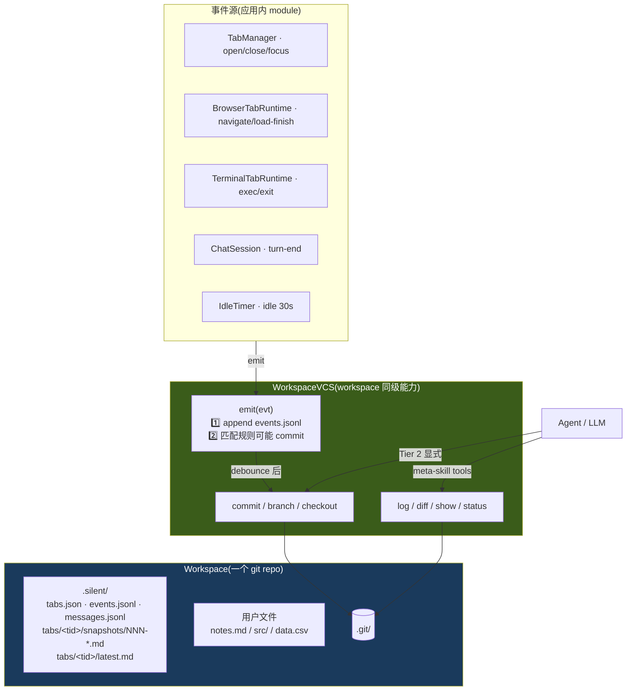

# Workspace VCS:工作区暴露的版本能力(meta-skill)

> Workspace 是一个 git repo,**`WorkspaceVCS` 是 workspace 同级暴露的能力对象**,所有 agent 都能通过它读历史 / 写 commit / 看 diff。app 内 module(TabManager / BrowserTabRuntime / TerminalTabRuntime / ChatSession)通过 `vcs.emit(...)` 写事件 + 在边界自动触发 commit。
>
> 不要独立的 watcher 包,不要 cursor / anchor 索引 —— **git 自身就是真相源,VCS 是它的薄外壳**。

## TL;DR

- **Workspace = 一个 git 仓库**,所有变化由 git 管版本。**Workspace 版本 = git commit SHA**
- **`WorkspaceVCS` 是 workspace 同级的能力对象**:`emit / commit / log / diff / show / status / branch / checkout`
- **应用内 module 主动 emit**(TabManager / BrowserTabRuntime / 等),写 `events.jsonl` + 按规则自动 commit。**没有 chokidar,不监听用户外部文件**
- **用户编辑文件懒发现**:vim :w 后无 event,但下次 emit 触发 commit 时 `git status` 自然捡进版本
- **Agent meta-skill**:agent-core 把 `WorkspaceVCS` 几个只读方法(log / diff / show / status)+ 显式 commit / branch / checkout 暴露成 builtin tool,任何 agent 都能用
- **快照子系统**:browser 用 Defuddle 抽干净 .md,terminal 在命令边界切 .log;每 tab 都有 `latest.md` / `latest.log` **(copy,非 symlink)**,`git log -p latest.md` 一行命令看页面演化
- **唯一例外**:`buffer.log` 高频 pty 数据流不进 git(信息冗余在 NNN-cmd.log)

## 设计目标与约束

| 目标 | 约束 |
|---|---|
| **G1 git 是真相源** | workspace 版本 = git sha,不另立 anchor / journal cursor;empty commit 不可能(events.jsonl 永远有增量) |
| **G2 不监听外部 fs** | 没有 chokidar,用户编辑文件 by `git status` 在 next trigger 时懒发现 |
| **G3 单一 emit 入口** | 应用内 module 主动调 `vcs.emit(evt)` —— 一次调用做两件事:append events.jsonl + 按规则匹配可能 commit |
| **G4 meta-skill 暴露** | `WorkspaceVCS` 同时是 app 内部 API + 暴露给 agent 的 builtin tools |
| **G5 git 工具兼容** | 用户用 GitHub Desktop / GitButler / `git log` CLI 都能正确看到 workspace 历史 |
| **G6 隐私 / 安全** | 高频 pty 流不入 git;敏感字段(token / cookie / Authorization)永不写 events.jsonl |

**非目标**(留给 v0.2+):多级摘要 pipeline / 跨 workspace 同步 / 实时事件 stream sink / MCP server 暴露 / 通用 npm package 化

## 总体形态



## 1. Git 资源清单(全在 git working tree)

按"进 git / 不进 git"清晰切分,**所有需要"回得到那一刻"的内容都进 git**。

### 进 git(workspace 真相源)

```
<workspace>/
├── .git/                                    repo 元数据
├── .gitignore                               默认配置见下
├── .silent/
│   ├── meta.yaml                            工作区配置(name / linkedFolder),lastActiveAt 已拆出
│   ├── tabs.json                            tab 索引(open/close/state-change 时重写)
│   ├── messages.jsonl                       ★ silent-chat tab 对话全文(append)
│   ├── events.jsonl                         ★ workspace 单一事件时间线(append,app 主动写)
│   └── tabs/
│       └── <tid>/
│           ├── snapshots/
│           │   ├── 001-<ts>.md              immutable(browser readability 或 terminal cmd)
│           │   ├── 002-<ts>.md
│           │   └── 003-<ts>.md
│           └── latest.md (or .log)          ★ copy of newest snapshot,git log -p 看演化
└── 用户的任何文件                              notes.md / src/ / data.csv / ...
```

### 不进 git(运行时 / 隐私 / 高频冗余)

```
.silent/state/                               全部 .gitignore
├── last-active.json                         touchWorkspace 高频更新,污染版本
├── active.json                              当前 active tab(纯 UI)
├── cookies/                                 内嵌浏览器 storage(隐私)
└── cache/                                   任何重建型缓存

.silent/tabs/<tid>/
└── buffer.log                               ★ 高频 pty 数据流,信息已在 snapshots/NNN-cmd.log
```

### 默认 `.gitignore`

```gitignore
# 系统
.DS_Store
Thumbs.db

# 编辑器临时
*.swp
*.swo
*~

# 项目通用 cache
node_modules/
.next/
.venv/
__pycache__/
target/

# Silent Agent 运行时
.silent/state/
.silent/tabs/*/buffer.log

# linkedFolder(动态写入,如有)
# <linkedFolder relative path>/
```

**没有**默认 ignore 大二进制扩展(.mov / .psd 等)—— 改用 pre-commit hook 拦 > 10MB 文件。

## 2. WorkspaceVCS 接口

```typescript
// app/src/main/vcs/interface.ts
export interface WorkspaceVCS {
  readonly workspacePath: string

  // ============ 应用内 module 调:emit + 自动 commit ============
  /**
   * 应用内 module(TabManager / BrowserTabRuntime / 等)主动调。做两件事:
   *   1. append events.jsonl(append-only)
   *   2. 检查 evt 是否命中 Tier 1 规则,命中则 debounce 后 git status check + commit
   */
  emit(evt: {
    source: EventSource                     // 'chat' | 'browser' | 'shell' | 'tab' | 'workspace' | 'agent' | 'linked'
    action: string                          // turn-end / load-finish / exec / focus / ...
    tabId?: string
    target?: string                         // URL / cmd / path
    meta?: Record<string, unknown>
  }): Promise<void>

  // ============ 显式 commit(Tier 2 · agent curator)============
  commit(message: string, opts?: { paths?: string[]; allowEmpty?: boolean }): Promise<string>
  branch(name: string): Promise<void>
  checkout(ref: string): Promise<void>

  // ============ 读(任意 agent 调,作为 meta-skill)============
  status(): Promise<{ dirty: boolean; staged: FileStatus[]; unstaged: FileStatus[] }>
  log(opts?: { limit?: number; since?: string; until?: string; path?: string }): Promise<CommitInfo[]>
  diff(refA: string, refB?: string, paths?: string[]): Promise<string>      // unified patch text
  show(sha: string): Promise<{ message: string; ts: string; files: string[]; patch: string }>

  // ============ 生命周期 ============
  dispose(): Promise<void>
}

export interface CommitInfo {
  sha: string
  message: string
  ts: string
  files: string[]
}

export interface FileStatus {
  path: string
  status: 'added' | 'modified' | 'deleted' | 'renamed'
}
```

**Factory**:`createWorkspaceVCS(workspacePath: string, opts?): WorkspaceVCS`,内部用 `simple-git` + 内置规则。

**关键**:`emit` 是唯一写入入口。一次调用做两件事(append + 可能 commit),语义清楚,调用方不管规则匹配细节。

## 3. Tier 1 默认规则(4 条)

```typescript
const DEFAULT_RULES: AutoCommitRule[] = [
  { match: { source: 'chat',      action: 'turn-end' },    debounceMs: 0,    msg: e => `[chat] turn: ${truncate(e.meta?.preview, 60)}` },
  { match: { source: 'browser',   action: 'load-finish' }, debounceMs: 1000, msg: e => `[browser] load: ${new URL(e.target!).host}` },
  { match: { source: 'shell',     action: 'exit' },        debounceMs: 0,    msg: e => `[shell] exec: ${truncate(e.meta?.cmd, 60)}` },
  { match: { source: 'workspace', action: 'idle' },        debounceMs: 0,    msg: '[workspace] idle flush' },
]
```

> ⚠️ **没有 `fs.save` 规则** —— 因为没有 chokidar 监听用户文件。用户编辑由下一次其他 trigger 时 `git status` 懒发现,自然进版本。

每个 commit footer 反向链回 event:

```
[browser] load: logservice.bytedance.net

---
trigger: browser.load-finish
ts: 2026-04-28T10:32:42.123Z
event-id: evt_abc123
```

**关键**:events.jsonl 在 git 里 → 任何 Tier 1 边界永远非空 → empty commit skip 规则不需要。

## 4. emit / commit 命中规则一览

应用内 module 调用 `vcs.emit(...)` 时,**所有 evt 都 append 到 events.jsonl**;只有命中 Tier 1 规则的 evt 触发 commit:

| evt | 进 events.jsonl? | 命中规则 → commit? |
|---|---|---|
| `tab.focus` | ✅ | ❌ 只记录(focus 抖动不该 commit) |
| `tab.open / close` | ✅ | ❌ 只记录(由后续 trigger 顺手捡 tabs.json 变化) |
| `browser.navigate` | ✅ | ❌ 只记录(等 load-finish) |
| `browser.navigate-in-page` | ✅ | ❌ 只记录 |
| `browser.load-finish` | ✅ | ✅ 1s debounce → commit(SPA 多帧合并) |
| `browser.request`(网络抓包,脱敏后) | ✅ | ❌ 只记录 |
| `shell.exec`(preexec) | ✅ | ❌ 只记录(与 exit 配对) |
| `shell.exit` | ✅ | ✅ 0ms → commit |
| `shell.output`(pty chunks) | ❌ 不进 events.jsonl(太碎,落 buffer.log) | — |
| `chat.user-turn` | ✅ | ❌ 只记录 |
| `chat.tool-use / tool-result` | ✅ | ❌ 只记录 |
| `chat.turn-end` | ✅ | ✅ 0ms → commit |
| `agent.*`(agent 内部动作) | ✅ | ❌ 只记录 |
| `workspace.idle`(IdleTimer 调) | ✅ | ✅ 0ms → commit if dirty(兜底) |
| `linked.probe` | ✅ | ❌ 只记录 |

## 5. IdleTimer:不靠 watcher 实现 idle 兜底

```typescript
class IdleTimer {
  private timer: NodeJS.Timeout | null = null
  constructor(private vcs: WorkspaceVCS, private idleMs = 30_000) {}

  /** 每次 emit 后 reset */
  reset() {
    if (this.timer) clearTimeout(this.timer)
    this.timer = setTimeout(() => {
      this.vcs.emit({ source: 'workspace', action: 'idle' })
    }, this.idleMs)
  }
}
```

每次 `vcs.emit` 调用时调 `idleTimer.reset()`。30s 没新 emit → 触发 `workspace.idle` → 命中 Tier 1 → commit if dirty。

→ **0 chokidar 依赖,纯内存 timer 就实现"用户停下来 commit 一次"语义**。

## 6. Browser Snapshot 子系统

每次 `did-finish-load` 触发,**BrowserTabRuntime**(`src/main/tabs/browser-tab.ts`)做 5 件事:

```
1. 抓 outerHTML (executeJavaScript)
2. Defuddle 抽干净 .md  (npm 包,不 spawn)
3. 写 snapshots/NNN-<ts>.md  (immutable)
4. cp 到 latest.md  (供 git log -p 看时间线)
5. vcs.emit({source:'browser', action:'load-finish', ...}) → 触发 1s debounce commit
```

```typescript
async snapshotPage() {
  const html = await this.webContents.executeJavaScript(`document.documentElement.outerHTML`)
  if (!html || html.length < 200) return                   // loading 骨架,跳过

  const md = await Promise.race([
    this.runDefuddle(html),
    timeout(800).then(() => this.runInnerTextFallback()),  // 800ms 超时回退
  ])

  const N = String(await this.nextSnapshotIndex()).padStart(3, '0')
  const ts = new Date().toISOString().replace(/[:.]/g, '-')
  const filename = `${N}-${ts}.md`
  await fs.writeFile(path.join(this.snapshotDir, filename), this.composeMd(md))
  await fs.copyFile(path.join(this.snapshotDir, filename), path.join(this.snapshotDir, '../latest.md'))

  await this.vcs.emit({
    source: 'browser', action: 'load-finish',
    tabId: this.tabId, target: this.url,
    meta: { title: this.title, snapshot: filename },
  })
}
```

### 性能预算

| 页面 | total | 在 1s commit debounce 内? |
|---|---|---|
| 小(GitHub README ~50KB) | 30-100ms | ✅ |
| 中(Notion / 飞书 doc ~500KB) | 150-400ms | ✅ |
| 重(SPA 5MB+) | 500-1000ms | ⚠️ 800ms 超时回退 innerText |

### `latest.md` 用 copy 而非 symlink

| 形态 | git log -p 体验 | 磁盘 |
|---|---|---|
| symlink | 看到 target 字符串变化(`002→003`),内容不可见 | 几字节 |
| **copy(选)** | **完整页面内容演进时间线**,一行命令看 | git pack delta dedupe 后实际 +5% |

→ 选 copy。`git log -p .silent/tabs/br-1/latest.md` 直接看到该 tab 历次页面变化。

## 7. Terminal Snapshot 子系统

终端比浏览器多一个 `buffer.log`(高频 pty 流)。**buffer.log 不进 git**,信息冗余在 NNN-cmd.log。

```
.silent/tabs/<tid>/
├── buffer.log                          ❌ .gitignore (高频 pty 流,信息冗余)
├── snapshots/
│   ├── 001-<ts>-ls.log                 ✅ git (per-cmd 切片,immutable)
│   ├── 002-<ts>-pwd.log
│   └── 003-<ts>-git-status.log
└── latest.log                          ✅ git (最新 cmd 切片 copy,git log -p 看)
```

**TerminalTabRuntime**(`src/main/tabs/terminal-tab.ts`)在 zsh `preexec` / `precmd` hook:

```typescript
// preexec: 命令开始
this.currentCmd = { cmd, ts: nowIso(), bufferStart: this.buffer.size }
await this.vcs.emit({ source: 'shell', action: 'exec', tabId: this.tabId, target: cmd })

// precmd / exit: 命令结束
const slice = this.buffer.readFrom(this.currentCmd.bufferStart)
const N = String(...).padStart(3, '0')
const filename = `${N}-${this.currentCmd.ts}-${slug(cmd)}.log`
await fs.writeFile(path.join(this.snapshotDir, filename), slice)
await fs.copyFile(path.join(this.snapshotDir, filename), path.join(this.snapshotDir, '../latest.log'))
await this.vcs.emit({
  source: 'shell', action: 'exit', tabId: this.tabId, target: cmd,
  meta: { exitCode, durMs },
})
```

### `&&` / `;` 链式命令

`ls && pwd && git status` 触发 3 次 preexec / exit → **3 个 snapshot + 3 个 commit**:

```
[shell] exec: git status
[shell] exec: pwd
[shell] exec: ls
```

粒度细,后续 pattern mining / replay 都受益。

### 长时运行命令(`tail -f` / REPL)

无 exit 触发 → buffer.log 一直涨但不 snapshot/commit。
兜底:**`workspace.idle 30s` 触发 commit if dirty**(此时只记录 events.jsonl 增量进版本)。

## 8. 模块位置

```
app/src/main/
├── agent/
│   ├── registry.ts
│   └── workspace.ts                # Workspace CRUD(已有)
├── vcs/                            # ★ 跟 agent/ 同级
│   ├── interface.ts                # WorkspaceVCS 接口 + 类型
│   ├── git.ts                      # simple-git 薄封装
│   ├── auto-commit.ts              # Tier 1 规则匹配 + debounce + IdleTimer
│   ├── events.ts                   # events.jsonl append(从 storage/ 搬过来)
│   └── factory.ts                  # createWorkspaceVCS(wsPath) → WorkspaceVCS
├── snapshots/                      # ★ 浏览器 / 终端产物落 fs
│   ├── browser.ts                  # outerHTML + Defuddle → snapshots/NNN.md + latest.md copy
│   └── terminal.ts                 # buffer + cmd 切片 → snapshots/NNN-cmd.log + latest.log copy
├── tabs/
│   ├── manager.ts                  # 调 vcs.emit(tab.*)
│   ├── browser-tab.ts              # 调 vcs.emit(browser.*)
│   └── terminal-tab.ts             # 调 vcs.emit(shell.*)
└── ipc/
    └── vcs.ts                      # ★ NEW · vcs.log / diff / show / status IPC
```

**vcs/ 跟 agent/ 同级**,因为 VCS 是 workspace 暴露的能力,跟 agent registry 是同一抽象层级(workspace 的 facets)。

## 9. Agent Meta-skill 暴露(Phase 6 接入)

agent-core 的 builtin tools 包一层调 `WorkspaceVCS`:

```typescript
// agent-core builtin tools(只读 + 显式 write)
workspace.status()                              → vcs.status()
workspace.log(opts)                             → vcs.log(opts)
workspace.diff(refA, refB?, paths?)             → vcs.diff(...)
workspace.show(sha)                             → vcs.show(sha)
workspace.commit(message)                       → vcs.commit(message)         // Tier 2
workspace.branch(name)                          → vcs.branch(name)
workspace.checkout(ref)                         → vcs.checkout(ref)
```

**emit 不暴露给 agent**(写入归引擎,agent 只能"看"和"显式 commit",不能直接 write events 到 stream)。这是 OpenChronicle 启示的 "agent 只读" 原则。

### 三个具体的 agent 用法

**用法 1 · "我离开半小时,用户做了啥?"**

```typescript
const lastSeenSha = session.lastSeenSha
const diff = await workspace.diff(lastSeenSha, 'HEAD')
// → 一次拿到 events.jsonl 增量 + 文件变化 + 新 snapshot(unified diff text)
//    LLM 直接读 diff 就理解了一切
```

**用法 2 · "用户问我关于 logid xxx,我之前查过吗?"**

```typescript
const commits = await workspace.log({ path: '.silent/tabs/br-1/latest.md', limit: 50 })
// → 直接看出该 tab 的页面历史
```

**用法 3 · agent 跑完任务后写语义化 commit(Tier 2)**

```typescript
const status = await workspace.status()
if (status.dirty) {
  await workspace.commit('查清 logid abc123 根因 + 写入 notes.md')
  // → 覆盖刚才 Tier 1 自动 commit 的机械 message,留下语义化记录
}
```

## 10. 完整链路示例:查 logid

```
T1   用户在地址栏输 https://logservice.bytedance.net
T4   did-finish-load → snapshot 001 + latest.md cp + vcs.emit(browser.load-finish)
T6   SPA 跳 /home → snapshot 002 + latest.md cp + vcs.emit(browser.load-finish)
T8   click 搜索 → vcs.emit(browser.click)
T9   fetch /api/search?logid=abc123 → vcs.emit(browser.request)
T12  did-finish-load(结果页) → snapshot 003 + latest.md cp + vcs.emit(browser.load-finish)
T13  debounce 1s 倒数完(T12+1s) → COMMIT a1b2c3 [browser] load: logservice.bytedance.net
       files: snapshots/001/002/003 + latest.md + tabs.json + events.jsonl(+9 行)
T14  用户切 silent-chat → vcs.emit(tab.focus) [不 commit]
T15  用户问 agent → vcs.emit(chat.user-turn)
T16  agent 调 browser.extractText → vcs.emit(agent.tool-use)
T18  agent 答完 → vcs.emit(chat.assistant-turn)
T19  vcs.emit(chat.turn-end) → 0ms commit → COMMIT d4e5f6 [chat] turn: 分析 logid abc123
       files: messages.jsonl + events.jsonl(+5 行)
```

→ **2 commits,events.jsonl 全程 14 行,3 个 snapshots**。Agent 想看链路 `git diff a1b2c3^ d4e5f6` 一行命令拿到全部。

## 11. 实施路线(对应 task.md Phase 5)

| 子任务 | 估时 | 产出 |
|---|---|---|
| **5a · vcs/ module 骨架 + WorkspaceVCS 接口** | 0.5d | `interface.ts` + `factory.ts` 编译过 |
| **5b · git wrapper + Tier 1 规则 + IdleTimer** | 1d | `git.ts` + `auto-commit.ts`,4 条默认规则,debounce 工作 |
| **5c · events.ts 搬迁 + emit 单一入口** | 0.5d | `storage/events.ts` → `vcs/events.ts`,接 `vcs.emit` |
| **5d · BrowserTabRuntime snapshot(Defuddle)** | 1d | `snapshots/browser.ts`,800ms timeout fallback,latest.md copy |
| **5e · TerminalTabRuntime snapshot(zsh hook)** | 1d | `snapshots/terminal.ts`,preexec/exit hook,链式命令切片 |
| **5f · IPC 暴露 + tabs/ 调 vcs.emit 接入** | 0.5d | `ipc/vcs.ts`(log / diff / show / status);TabManager / BrowserTabRuntime / TerminalTabRuntime 调用接入 |
| **5g · linkedFolder probe(可选)** | 0.5d | idle 时 probe linkedFolder HEAD + dirty,emit `linked.probe` |

总 ~4 天。完成后 task.md Phase 5 关闭。

## 12. 风险与权衡

| 风险 | 缓解 |
|---|---|
| **events.jsonl 长期增长** | 30 天 archive(v0.2+);MVP 不限,实测后看 |
| **GitHub / GitLab 视角看到 chat 内容(messages.jsonl 在 git)** | `workspace.config.streamInGit: false` opt-out(v0.2 加) |
| **大文件偶尔进 commit** | pre-commit hook 拦 > 10MB |
| **Defuddle 在某些页失败** | 800ms timeout fallback 到 innerText |
| **buffer.log 不进 git → 跨设备 fast-resume 丢** | tar 整目录同步会带上(只 .gitignore,文件还在 fs) |
| **用户文件改动不实时记录** | 接受懒发现,下次 trigger 时由 `git status` 捡入版本(损失实时 UI 通知,得到简单架构) |

## 13. Open Questions

1. **MCP server 暴露 VCS?** 推 v0.2+ —— `WorkspaceVCS.toMCPServer()` 让外部 agent 通过 MCP read-only 看 workspace 变化
2. **跨设备同步策略?** v0.2 决定:rsync 整目录 / git push(workspace 自带 .git)
3. **Multi-workspace 全局聚合?** 一个 agent 多个 workspace 时,有无"agent 级 timeline"聚合所有 workspace?推 v0.3
4. **Pattern detector 输入用 git log 还是 events.jsonl?** 都行 —— git log 给 commit 边界视角,events.jsonl 给细粒度。Phase 7 实测决定

## 14. OpenChronicle 启示(实施纪律)

详细调研:`/Users/bytedance/Documents/ObsidianPKM/Notes/调研/OpenChronicle/`。5 条沉淀进 VCS 的实施纪律:

1. **多级压缩 pipeline**(v0.2+):1min → 5min → 30min 摘要,每级只看上一级输出,token 不爆
2. **Bookmark 字段而非消息队列**:任何 consumer 在 `.silent/state/processors.jsonl` 持久化水位,crash 重启幂等
3. **Wall-clock window 而非滚动窗口**:`[10:00, 10:01)` 整 60s 对齐,UNIQUE(start, end) 重跑不重复
4. **永不静默丢数据**:每个 batch task 都有 fallback,绝不 silent drop
5. **写入归引擎,agent 只读**:meta-skill 不暴露 emit 给 agent,只暴露 read + 显式 commit / branch / checkout

## 关联文档

- [02-architecture.md](02-architecture.md) — workspace = git repo 的整体上下文
- [03-agent-core.md](03-agent-core.md) — agent-core 通过 Workspace adapter + meta-skill tools 调 VCS
- [05-observation-channels.md](05-observation-channels.md) — 三通道 emit 进 VCS
- [archive/08-journal-deprecated.md](archive/08-journal-deprecated.md) — 早期独立 journal package 设计(已废弃,保留追溯)

## 参考资料

- [simple-git](https://github.com/steveukx/git-js) — git wrapper(MVP 实现选)
- [Defuddle](https://github.com/kepano/defuddle) — HTML → clean markdown
- [Anthropic prompt caching](https://docs.claude.com/en/docs/build-with-claude/prompt-caching) — diff 给 LLM 时打 cache
- [OpenChronicle](https://github.com/openchronicle/openchronicle) — 多级压缩 + bookmark + AX tree 参考实现
