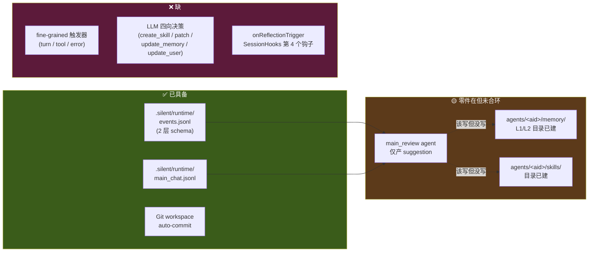
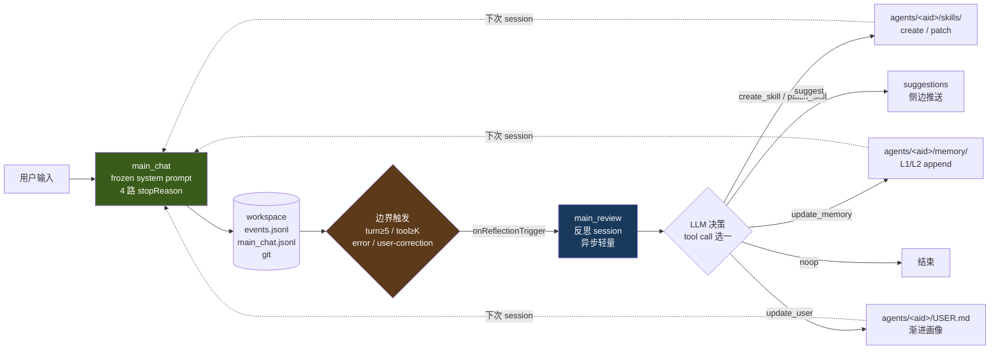

# 学习闭环:在 Silent Agent 上吸收 Hermes 的自进化范式(v0.1)

> 本文沉淀自 2026-04-29 关于 Hermes Agent(NousResearch 开源)的对照分析。回答:Silent Agent 的"学习进化"具体怎么做、跟现有 4 层架构怎么不冲突、改动落到哪些章节。
>
> Hermes 调研笔记:`/Users/bytedance/Documents/ObsidianPKM/Notes/调研/Hermes-Agent/`(本仓未引)

## TL;DR

- Hermes 学习闭环 = **trajectory 持久化 + Nudge 触发反思 + LLM 决策沉淀**三件套
- Silent Agent 已有前者(events.jsonl 二层 schema 比 SQLite+FTS 更结构化)和半个后者(main_review 是带工作区的 reflection),**只缺"in-session 触发 + 四向沉淀决策"**
- 落地方式:**扩展 main_review 的输出从 `suggest` 单向到四向(`create_skill / patch_skill / update_memory / update_user / suggest / noop`)**,触发器加一层 fine-grained(turn 数 / tool burst / error / 用户纠正),不新增组件
- 关键工程约束:**反思写盘不破坏当前 session 的 frozen system prompt 与 prefix cache**——新知识下次 session 才生效

## 1. 为什么借 Hermes(不是 OpenClaw / 其他)

| 维度 | Silent Agent | Hermes | 共同点 |
|---|---|---|---|
| 核心范式 | observe-learn-act,AI-push | self-evolution,Nudge-driven | 都是 push 范式,不是 pull chat |
| 数据观 | everything is file | file-first(SOUL.md / MEMORY.md / SKILL.md) | 都用 markdown 沉淀,可 git/diff |
| Memory 分层 | L1 preferences / L2 profile,推外 | SOUL/MEMORY/USER 三层 + Skill 索引 + Session FTS | 哲学同构 |
| Skill 系统 | builtin / custom 二分 | agentskills.io 标准 + 索引常驻 + 按需加载 | Silent Agent 缺装载机制,Hermes 已工程化 |
| 学习触发 | onSessionEnd 一个时刻 | 周期 Nudge(in-session) | Silent Agent 反馈链长,Hermes 短 |

→ Hermes 已经把 Silent Agent 设计文档**只提了原则、没落地机制**的几个点做出了具体范式。

## 2. 三件套现状盘点



> 图:学习闭环现状。绿色已具备(trajectory 持久化、workspace、双 agent 角色);橙色零件在但闭环没合上(main_review 只产 suggestion、memory/skills 目录建好但没写入路径);红色完全缺(细粒度触发、四向决策、SessionHooks 钩子)。

## 3. 闭环全图(改造后)



> 图:学习闭环全图。main_chat 跑常规会话写 events,边界条件触发 main_review 异步轻量反思,反思决策四选一(skill / memory / user / suggest / noop),写入只影响下一 session 不破坏当前 frozen prompt。

## 4. 关键约定:反思不破坏 prefix cache

跟 [03-agent-core.md §9 Prefix Cache 策略](03-agent-core.md) 强配合:

- **system prompt 在 `SessionManager.create` 时冻结**,会话期任何重入都不重拼
- **`onReflectionTrigger` 写盘只影响下一 session 的 system prompt 装载**
- 当前 session 仍命中 ephemeral cache,token 成本恒定

这是从 Hermes "Cache-Aware 设计"学到的最重要工程约束。否则学习越多 cache 命中率越低,跟系统价值方向相反。

## 5. 改动清单(按文档章节)

| 文档章节 | 现状 | 改动 |
|---|---|---|
| **[03 §4 SessionHooks](03-agent-core.md)** | 3 个 hook(start/end/toolUse) | 加 `onReflectionTrigger?(session, transcript, trigger)` |
| **[03 §5 runSession](03-agent-core.md)** | 单 while + 4 路 stopReason | 主循环末尾加 `shouldReflect` 检查 + hook 触发 |
| **[03 §9 Prefix Cache](03-agent-core.md)** | 提了 ephemeral 但未强约束 | 加「system prompt 在 create 时冻结,反思写入只影响下一 session」强约定 |
| **[03 §11 Phase 6 路线](03-agent-core.md)** | 6a-6h 八个子任务 | 加 6i:reflection trigger + 四向 action(~0.5d) |
| **[02 §存储约定](02-architecture.md)** | `agents/<aid>/USER.md` 未提 | memory 分层加 USER.md(渐进画像,onReflectionTrigger 写) |
| **本文** | — | 作为 09 收口 |

## 6. SessionHooks 第 4 个钩子(接口预览)

```typescript
// packages/agent-core/src/session/interface.ts
export interface SessionHooks {
  onSessionStart(session, agent): Promise<MemoryPayload>
  onSessionEnd(session, transcript, files): Promise<void>
  onToolUse?(session, toolName, input): Promise<{...}>

  /**
   * In-session 反思触发。runSession 在边界条件命中时调,上层应用决定:
   *  - 立刻同步反思(阻塞 main_chat) — 不推荐,影响交互
   *  - 排队后台异步反思 — 推荐:启 main_review session,跑完写盘
   *  - 不反思 — 比如用户正在快速对话,推到下一个边界
   * 钩子本身不阻塞 runSession;返回后 main_chat 立刻继续下一轮。
   */
  onReflectionTrigger?(
    session: Session,
    transcript: ChatMessage[],
    trigger: ReflectionTrigger,
  ): Promise<void>
}

export type ReflectionTrigger =
  | { kind: 'turn-count';     value: number }       // 累计 N 轮
  | { kind: 'tool-burst';     value: number }       // 单 turn ≥ K 个 tool
  | { kind: 'error';          messageId: string }   // tool / LLM 出错
  | { kind: 'user-correction'; messageId: string }  // 用户说"那不对"模式匹配
```

## 7. main_review 输出从单向扩四向

当前 main_review 的产出固定为 suggestion(`.silent/runtime/main_review.jsonl` 末轮 assistant message)。改造为 LLM 必须通过 tool call 选一:

```typescript
type ReflectAction =
  | { type: 'create_skill';  slug: string; frontmatter: SkillMeta; body: string }
  | { type: 'patch_skill';   slug: string; old: string; new: string }
  | { type: 'update_memory'; level: 'L1' | 'L2'; append: string }
  | { type: 'update_user';   field: keyof UserProfile; value: string }
  | { type: 'suggest';       body: string }
  | { type: 'noop' }
```

review agent 的 system prompt 末尾加结构化决策指令:

```
After reviewing the workspace events, decide ONE of:
  • Reusable workflow → create_skill / patch_skill
  • Durable user preference → update_user
  • Workspace context worth keeping → update_memory
  • Just nudge user → suggest
  • Nothing actionable → noop
Return EXACTLY ONE action via tool call.
```

`patch_skill` 是 token-efficient 改进路径(LLM 返回 old/new 片段,不重写全文),对应 [Hermes minimal 实现 §扩展成真版要做什么 第 2 条](https://github.com/nousresearch/hermes-agent)。

## 8. 触发器双层

| 层 | 触发 | 实现位置 | 同/异步 |
|---|---|---|---|
| **Coarse**(已有) | 用户手动 / idle 30s / 凌晨定时 | `app/src/main/review/runner.ts` 现有流程 | 异步 |
| **Fine**(新加,对标 Hermes Nudge) | turn ≥ 5 / 单 turn tool ≥ K / 出错 / 用户纠正 | `runSession` 主循环末尾边界检查 → 调 `onReflectionTrigger` | 异步(后台跑 main_review) |

Fine 触发的核心代码骨架(伪):

```typescript
// packages/agent-core/src/session/run-session.ts
while (true) {
  // ... LLM call + tool dispatch(原有逻辑)

  // 主循环末尾,在 idle 判断之前
  const trigger = detectReflectionTrigger(session, turnsSinceLastReflect, toolCallsThisTurn, hadError)
  if (trigger) {
    void hooks.onReflectionTrigger?.(session, session.messages, trigger)
    turnsSinceLastReflect = 0
  }

  // ... idle / terminate 检查
}
```

`void` 故意不 await:**反思永远不阻塞 main_chat**。app 层 hook 实现负责排队与去重。

## 9. 不借鉴的部分

| 不借的 | 原因 |
|---|---|
| Hermes 多平台 Gateway(Telegram / Discord / iMessage) | Silent Agent 是桌面 app,连接边界不同 |
| Honcho dialectic 12 维用户建模 | MVP 用 onReflectionTrigger 写 USER.md 简版即可 |
| DSPy + GEPA 进化优化 skill | 学术倾向,先把基础闭环跑通 |
| Modal / Daytona 远端执行后端 | 跟"全本地"原则冲突,Sandbox 接口已留扩展位 |
| ACP adapter(IDE 集成) | Silent Agent 自身就是 IDE-like 壳,不被嵌入 |
| 批量 RL 轨迹生成 | 模型微调不在产品路线 |

## 10. Phase 6i 实施(~0.5d)

| 子项 | 估时 | 产出 | 验收 |
|---|---|---|---|
| 6i.1 SessionHooks 加 `onReflectionTrigger` | 0.1d | core 接口扩展 | 类型编译过 |
| 6i.2 runSession 加 `detectReflectionTrigger` + hook 调用 | 0.1d | 边界检查逻辑 | unit 测试覆盖 4 种 trigger |
| 6i.3 main_review 改 4 向输出(builtin tool) | 0.2d | review prompt + tool dispatch | mock LLM 跑通四种 action 落盘 |
| 6i.4 system prompt 冻结约定写进 SessionManager | 0.1d | create 时拼一次,重入不重拼 | 检查 cache hit rate ≥ 80% |

## 11. 风险与权衡

| 风险 | 缓解 |
|---|---|
| reflection 频率过高,token 成本爆 | trigger 阈值保守(turn ≥ 5、tool ≥ K=8);main_review max_tokens 限 1024 |
| LLM 自创 skill 质量低 | 用户 review 通道 — skill 写入后侧栏推送让用户确认/拒绝(L0-L4 信任分层,新 skill 默认 L0 教学) |
| 反思中途主对话有新输入,状态错乱 | hook 异步执行,反思 session 跟 main_chat 用不同 sandbox 实例(只读),互不干扰 |
| USER.md 渐进画像写偏 | MVP 只 append 不重写;v0.2 加用户编辑面板 |
| skill 库膨胀,system prompt 爆 | progressive disclosure(索引常驻,全文按需 load) — 详见 [03 §8](03-agent-core.md) |

## 12. Open Questions

1. **Coarse / Fine 两层触发的去重策略**:同时命中怎么办?短间隔多次命中要 throttle 吗?——MVP 简单 throttle(30s 内只跑一次),v0.2 加更智能的合并
2. **反思 session 是否复用 main_chat 的 frozen system prompt cache**:理论上可,但 review agent 跟 chat agent 的 SOUL 不同(review 是只读评估者),需要分开 prompt cache key
3. **USER.md schema 简版**:用 free-form markdown 还是简单 YAML?MVP 走 free-form,onReflectionTrigger append 行级条目即可
4. **Cross-workspace skill 提升路径**:某个 workspace 内沉淀的 skill 何时升到 agent 级?暂手动,v0.2 看用户反馈

## 关联文档

- [03-agent-core.md](03-agent-core.md) — 4 层架构 / SessionHooks / runSession / Prefix Cache(本文改动主目标)
- [02-architecture.md](02-architecture.md) — 存储约定 / main_chat & main_review 角色 / .silent/runtime/ 二分
- [05-observation-channels.md](05-observation-channels.md) — workspace 内观察通道(events 来源)
- [08-vcs.md](08-vcs.md) — events.jsonl 2 层 schema(trajectory 真相源)

## 参考资料

- 内部 Hermes 调研:`Notes/调研/Hermes-Agent/`(_Index / architecture / learning-loop / memory-system / minimal-impl / vs-openclaw)
- [NousResearch/hermes-agent(GitHub)](https://github.com/nousresearch/hermes-agent) — 真版 Python 源码
- [Hermes Agent 官方文档](https://hermes-agent.nousresearch.com/docs/)
- [DeepWiki — Hermes 架构分析](https://deepwiki.com/NousResearch/hermes-agent)
- [Inside Hermes Agent: How a Self-Improving AI Agent Actually Works](https://mranand.substack.com/p/inside-hermes-agent-how-a-self-improving)
- [agentskills.io 标准](https://agentskills.io/) — skill markdown frontmatter
- [Anthropic Prompt Caching](https://docs.claude.com/en/docs/build-with-claude/prompt-caching) — frozen system prompt 工程基础
