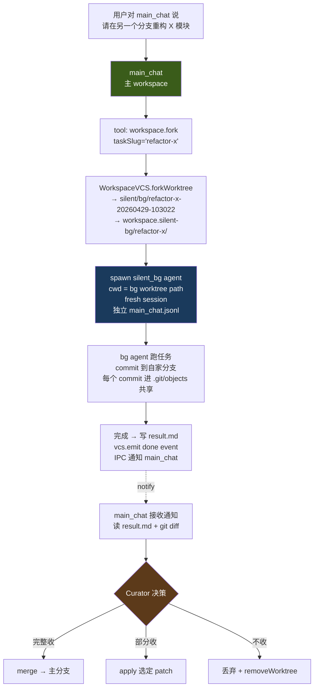

# Multi-agent 工作区隔离(v0.1)

> 本文沉淀自 2026-04-29 调研。回答:并行多 agent / background agent / subagent fork 时,工作目录怎么隔离。
>
> 调研笔记:`/Users/bytedance/Documents/ObsidianPKM/Notes/调研/silent-agent-多agent隔离与opencode/01-worktree-isolation.md`

## TL;DR

- **代码层隔离用 git worktree,边界 = workspace 整目录**(含 `.silent/`,各 worktree 各保留各的 `runtime/main_chat.jsonl` / `events.jsonl`)
- **分支命名约定**:`silent/<agent-id>/<task-slug>-<timestamp>`,例如 `silent/bg/refactor-auth-20260429-103022`
- **worktree 落盘**:兄弟目录 `<workspace>.silent-bg/<task-slug>/`(不嵌套到 main worktree,避免污染 git status)
- **能力扩展**:[`WorkspaceVCS`](08-vcs.md) 加 4 个方法(`forkWorktree / listWorktrees / removeWorktree / mergeWorktree`)
- **main_chat / main_review MVP 不分 worktree**(已串行 + review 只读 + fresh session,分了徒增复杂)
- **main_chat 是 curator**:background agent 跑完 commit 自家分支,通知 main_chat → main_chat 决定 merge / apply / 丢弃
- **运行时隔离**(端口、`node_modules`、LSP)推 v0.2,组合 macOS sandbox-exec + pnpm global virtual store
- **Cursor 双层模式适配**:本地交互 = sandbox-exec(可选),后台并行 = worktree(本期主目标)

## 1. 设计目标与约束

| 目标 | 约束 |
|---|---|
| **G1 代码冲突隔离** | 多 agent 并行写不串台,各自有独立 working tree |
| **G2 跟 `.silent/` 数据模型一致** | runtime/jsonl 跟随 worktree,events / chat 各自一份,不撕裂 append-only 流 |
| **G3 跟 [08-vcs.md](08-vcs.md) 既有契约一致** | 每个 worktree 内仍是一个完整 workspace(有自己的 WorkspaceVCS 实例) |
| **G4 启动延迟 < 1s** | 用 git worktree 不是 clone,共享 `.git/objects` |
| **G5 magic 最小** | 不引内核态 CoW、不引 Docker;用 `simple-git` 一行 worktree add |
| **G6 用户可读** | `git worktree list` / `git branch -a` 用户能直接看明白哪个分支是哪个 agent |
| **G7 合并主权清楚** | main_chat 是 curator,只有它能 merge 进 main 分支 |

**非目标**(留给 v0.2+):
- 端口自动分配 / 偏移
- pnpm global store 联动
- macOS sandbox-exec 集成
- 远端 worktree(E2B / Modal / Daytona)
- 跨 workspace fork

## 2. 触发场景

什么时候**会**起 worktree:

| 场景 | 谁触发 | 例子 |
|---|---|---|
| **Background agent**(长任务) | main_chat 通过 `workspace.fork` tool | "在另一个分支重构 auth 模块,跑完通知我" |
| **Subagent fork**(分叉探索) | main_chat 通过 `workspace.fork` tool | "你尝试方案 A,我同时让另一个 agent 跑方案 B" |
| **用户显式 "新分支跑"** | UI(v0.2 加"新建后台任务"按钮) | 用户主动开后台任务 |
| **长程 review**(v0.3+) | main_review 升级成 watcher 模式后 | 长期运行的代码审计 |

什么时候**不**起 worktree:

| 场景 | 原因 |
|---|---|
| 用户跟 main_chat 实时对话 | main_chat 在主 workspace 直接干活,跟用户交互 |
| 当前 main_review (only suggest) | 只读 + 一次性 + fresh session,跟 main_chat 顺序跑,没有冲突 |
| 单 turn LLM 调用 | LLM 推理是串行的,只有"整段任务"才有隔离价值 |

## 3. 核心决策

### 3.1 worktree 边界 = workspace 整目录

```
<workspace>/                         ← main worktree
├── .git/                            (objects 共享)
├── .silent/
│   ├── meta.yaml                    ✅ git
│   └── runtime/                     ❌ gitignore
│       ├── main_chat.jsonl          ← main_chat 自己的对话流
│       └── events.jsonl             ← main_chat 视角的 timeline
└── (用户文件)

<workspace>.silent-bg/refactor-auth-20260429-103022/   ← bg agent worktree
├── .git                             (link file → 主 .git/worktrees/...)
├── .silent/
│   └── runtime/
│       ├── main_chat.jsonl          ← bg agent 自己的对话流(独立)
│       └── events.jsonl             ← bg agent 视角的 timeline(独立)
└── (用户文件,checkout 到这个分支的版本)
```

**为什么是「workspace 整目录」而不是「只 fork 用户产物」**:

| 方案 | 评价 |
|---|---|
| ❌ 整 workspace 一个 worktree(共享) | 现状,无隔离 |
| ✅ **每 agent 一个 worktree(整目录,含 `.silent/`)** | 干净:events / chat 各自一份,产物在各自分支演化,可合 |
| ❌ 只 fork 用户产物,`.silent/runtime/` 共享 | events.jsonl 是 append-only,多写者撕裂 |
| ❌ `.silent/runtime/` 放 worktree 外(共享) | 跨 worktree 同步噪音 + chat 历史串台 |

`.silent/runtime/` 已经在 `.gitignore` 里(见 [08-vcs.md §1](08-vcs.md))→ 合并 worktree 时 runtime 自然不参与 merge,各 agent 的对话流互不干扰。

### 3.2 分支命名约定

```
silent/<agent-id>/<task-slug>-<timestamp>
```

例:
- `silent/bg/refactor-auth-20260429-103022`
- `silent/bg/explore-zustand-20260429-141500`
- `silent/main_review-watcher/audit-20260430-090000` (v0.3+)

**为什么 `silent/` 前缀**:对标业内事实标准——opencode 用 `opencode/<slug>`、Yume 用 `yume-async-{type}-{id}`、Claude Code 用 `worktree-agent-{hash}`、container-use 用 `cu-<adverb-animal>`。统一前缀让用户 `git branch -a` 一眼分清人类分支 vs agent 分支,清理时 `git branch -d silent/*` 一刀。

**为什么带 timestamp**:同一 agent 同一任务可能多次跑(失败重试 / 用户改主意 / 探索多方案),timestamp 让分支天然唯一。

### 3.3 worktree 落盘位置

**兄弟目录,不嵌套**:

```
~/.silent-agent/agents/<aid>/workspaces/<wid>/                          ← main worktree
~/.silent-agent/agents/<aid>/workspaces/<wid>.silent-bg/<task-slug>/    ← bg worktree
```

**为什么是兄弟而非嵌套**:嵌套放在 `<workspace>/.silent/worktrees/` 也行,但会污染 main worktree 的 `git status`(嵌套 worktree 是新文件,要在 `.gitignore` 加一行)。兄弟目录干净,且对应 git 自身推荐的 worktree 布局(`git worktree add ../sibling-dir`)。

**外挂工作区** (`addWorkspace(absPath)`) 同理:
```
/path/to/user-project/                       ← 用户原工作区(已有 .silent/)
/path/to/user-project.silent-bg/<task>/      ← bg worktree(在用户路径旁)
```

## 4. WorkspaceVCS 接口扩展

在 [08-vcs.md §2 WorkspaceVCS 接口](08-vcs.md) 基础上加 4 个方法:

```typescript
// app/src/main/vcs/interface.ts(扩展)
export interface WorkspaceVCS {
  // ... 原有方法(emit / commit / log / diff / show / status / branch / checkout / dispose)

  // ============ Worktree(multi-agent 隔离)============

  /**
   * 起一个新 worktree,checkout 到新分支。
   * 分支名按约定 `silent/<agentId>/<taskSlug>-<ts>` 自动生成。
   * worktree 路径:`<workspacePath>.silent-bg/<taskSlug>/`
   */
  forkWorktree(args: {
    agentId: string                         // 'bg' | 'main_review-watcher' | ...
    taskSlug: string                        // kebab-case 'refactor-auth'
    baseRef?: string                        // 默认 HEAD
  }): Promise<WorktreeInfo>

  /** 列出当前 workspace 的所有 worktree(含 main + 派生) */
  listWorktrees(): Promise<WorktreeInfo[]>

  /**
   * 移除一个 worktree。
   * - opts.force: worktree 内有 uncommitted 改动也强删(默认 false → 抛错保护)
   * - 同时尝试删对应分支(如 --delete branch);分支已合到 main 则 -d 安全删
   */
  removeWorktree(branch: string, opts?: { force?: boolean }): Promise<void>

  /**
   * Curator 操作:把指定 worktree 的分支 merge 进当前 worktree(主分支)。
   * 默认走 `--no-ff` 保留 agent 工作的 commit 历史。
   * 冲突时不自动消解,返回 mergeConflict: true 由上层 UI 处理。
   */
  mergeWorktree(branch: string, opts?: {
    message?: string
    strategy?: 'merge' | 'squash' | 'rebase'
  }): Promise<{ sha?: string; mergeConflict: boolean; conflictedFiles?: string[] }>
}

export interface WorktreeInfo {
  path: string                              // 绝对路径
  branch: string                            // 'silent/bg/refactor-auth-...'
  head: string                              // commit sha
  agentId?: string                          // 解析自分支前缀
  taskSlug?: string
  createdAt: string
  isMain: boolean                           // 是否主 worktree
}
```

**实现要点**:
- 用 `simple-git` 的 `raw(['worktree', 'add', ...])`(simple-git 当前没专属 worktree API,raw 即可)
- forkWorktree 创建后**立刻在新目录写入 `.silent/runtime/` 骨架**(空 main_chat.jsonl / events.jsonl + `state/` 目录),让 bg agent 一启动就能 emit
- listWorktrees 用 `git worktree list --porcelain` 解析,叠加上分支命名解析出 agentId / taskSlug
- removeWorktree 串行 `git worktree remove` + `git branch -d/-D`

## 5. Background agent 流程



> 图:Background agent 完整流程。main_chat 通过 `workspace.fork` tool 起 bg worktree,bg agent 在隔离环境跑、commit 自家分支,跑完通知 main_chat 做 curator,main_chat 决定 merge / apply / 丢弃。

**main_chat 暴露的 tool**(扩展 [02-architecture.md §main_chat 主权 agent](02-architecture.md) 的 tool 集):

| Tool | 行为 |
|---|---|
| `workspace.fork(taskSlug, prompt)` | 起 bg worktree + spawn silent_bg agent(异步) |
| `workspace.listForks()` | 列当前所有 bg worktree + 状态 |
| `workspace.peekFork(branch)` | 看某个 bg 的 result.md / events 摘要 |
| `workspace.mergeFork(branch)` | merge bg 分支进主分支 |
| `workspace.discardFork(branch, force?)` | 丢弃 bg 分支 + worktree |

silent_bg agent 是一个**新的 agent role**(跟 main_chat / main_review 并列),配置可以最小:复用 main_chat 的 system prompt + 限定 tool 集(去掉 `workspace.fork` 防递归)。

## 6. main_chat 与 main_review 不分 worktree

**MVP 决策:不分**。

理由:

| 维度 | main_chat | main_review |
|---|---|---|
| 时机 | 用户主动 | 系统调起 / idle |
| 持续性 | 长会话 | 一次性 |
| 写盘 | 有(用户产物 + .silent/runtime/) | **只读 + 写 .silent/main_review.jsonl + 可能写 skill/memory(09 机制)** |
| 串/并发 | — | 跟 main_chat 串行调度(`runner.ts`) |

main_review 不写用户产物,不会跟 main_chat 物理冲突。强行分 worktree 引入:
- 多一个 worktree 实例的开销
- main_review 看不到 main_chat 在主分支的实时改动(要先 commit 才能看到)
- 09-learning-loop.md 的反思机制需要看到当下事件流,跨 worktree 不直接

**未来例外**(v0.3+):main_review 升级成 long-running watcher / 自主探索模式时,再分 worktree。彼时 main_review 是真正的"另一个 agent",跑在自己分支上做大范围 audit。

## 7. Curator 模式

**只有 main_chat 能 merge 进主分支**。这是数据安全的边界:

- bg agent 跑完 commit **自己的分支**(`silent/bg/...`)
- bg agent **不能**直接动主分支(`workspace.fork` tool 不暴露 merge 能力给 silent_bg)
- 用户只跟 main_chat 对话决定收哪个 patch
- `mergeWorktree` 默认 `--no-ff` 保留 agent 工作的完整 commit 历史(便于 `git log --graph` 回看)

四种决策动作:

| 动作 | 行为 |
|---|---|
| **完整收** | `mergeWorktree(branch)` → fast-forward / no-ff merge |
| **部分收** | main_chat 用 `git diff <branch> -- <selected paths>` 然后 `git apply` |
| **squash 收** | `mergeWorktree(branch, { strategy: 'squash' })` 把 agent 多个细 commit 压成一个 |
| **不收** | `removeWorktree(branch)` 丢弃 |

**冲突处理**:`mergeWorktree` 返回 `mergeConflict: true` + 冲突文件列表;UI 弹冲突 view,用户手解或让 main_chat 帮忙解(main_chat 拿到冲突 patch 跟 LLM 协商一个 resolution)。

## 8. 不做的(v0.2+ 推后)

| 推后项 | 触发引入信号 |
|---|---|
| **端口自动分配** | dogfood 出现并行 dev server 冲突 |
| **pnpm global virtual store 集成** | 用户反馈"每个 worktree `pnpm install` 太慢" |
| **macOS sandbox-exec 集成**(对标 Cursor) | 跑不可信代码 / 用户敏感目录的 agent 任务 |
| **Docker / container-use 风格深隔离** | 跑明显不可信 / 重 deps 的任务(npm test 跑社区 PR) |
| **远端 worktree**(E2B / Modal / Daytona) | 用户机器跑不动 / 长任务要持续运行 |
| **跨 workspace fork** | 多 workspace 共享公共代码 |
| **自动 cleanup stale worktree** | 用户磁盘开始累积 dead worktree |
| **worktree UI 侧栏 + diff view** | 单个用户同时跑 ≥ 3 个 bg agent |

## 9. 实施路线(Phase 6+ 子任务,~1.5d)

| 子任务 | 估时 | 产出 | 验收 |
|---|---|---|---|
| **6j.1 WorkspaceVCS 加 4 个 worktree 方法** | 0.3d | `forkWorktree / listWorktrees / removeWorktree / mergeWorktree` | unit test:fork 后 listWorktrees 见到、merge 后 main 分支有 commit |
| **6j.2 分支命名 + worktree 路径约定落代码** | 0.1d | 工具函数 `workspaceVcs/naming.ts`(slug 校验、timestamp 生成、path 解析) | grep 不出散落的 'silent/' 字符串 |
| **6j.3 silent_bg agent role + spawn 流程** | 0.3d | `app/src/main/agent/silent-bg-runner.ts`(复用现有 review runner cwd 参数) | mock 任务跑通:fork → spawn → commit → notify |
| **6j.4 main_chat 暴露 5 个 workspace.* tool** | 0.3d | builtin tool registry 扩展 + permission policy | LLM 调 `workspace.fork` 真起 worktree;`workspace.discardFork` 真删 |
| **6j.5 IPC + UI 通知**(`bg-task-done` event) | 0.2d | 主进程 emit IPC 事件,React 接收后弹 toast / 侧栏 badge | 跑完一个 bg 任务,UI 上有提示 |
| **6j.6 mergeWorktree 冲突处理 UI**(最简) | 0.3d | 冲突列表 + "用 main_chat 协商" / "手动解决" 入口 | 制造一个冲突,UI 能展示并让用户选路径 |

总 ~1.5d。**优先级**:6j.1 / 6j.2 / 6j.3 是 P0(没它们 fork 跑不起来);6j.4 是 P1(让 LLM 能调度);6j.5 / 6j.6 是 P2(用户体验,可推 v0.2)。

## 10. 风险与权衡

| 风险 | 缓解 |
|---|---|
| bg agent 失控写大量文件 | sandbox 是 worktree-scoped(只能写自家 worktree 内),物理上隔离 main worktree |
| 多 worktree 累积撑爆磁盘 | `.git/objects` 共享(几 MB 量级);worktree working tree 是用户文件本身大小,不重复 |
| pnpm install / venv 在每个 worktree 都来一遍 | MVP 不解决(用户自感知),v0.2 接 pnpm global virtual store |
| LSP 多份资源膨胀 | MVP agent 不依赖 LSP(只读文件),用户的 IDE 自管 |
| 用户用 GitHub Desktop 看到 `silent/*` 分支困惑 | README 说明命名约定;UI 也有"清理 dead worktree"按钮 |
| 多 agent commit message 混杂 | mergeWorktree 默认 `--no-ff`,main 分支看到的 merge commit 携带"merged silent/bg/refactor-auth-..." 可读 |
| recursive fork(bg agent 又 fork) | silent_bg 默认不暴露 `workspace.fork` tool;v0.3 真要嵌套时再加深度限制 |
| `.silent/runtime/` 在 fork 时重复初始化丢历史 | 这是设计上要的:bg 是 fresh session,需要干净 events / chat;merge 时 runtime/ 不参与 merge,各保留各的 |

## 11. Open Questions

1. **bg agent 的 workspace identity**:bg worktree 里面那份 `.silent/meta.yaml` 是新生成还是复制 main 的?当前倾向**复制 main + 加 `parent: <main-wid>`字段**,让 bg worktree 也能被 `addWorkspace` 识别(用户能切过去看)
2. **Cleanup 策略阈值**:N 天没活动自动 prompt 用户清?还是等磁盘满才管?MVP 不自动清,加 UI"清理"按钮即可
3. **bg agent 是否可读 main_chat 的当前 transcript**:借给 LLM 做 context?可,但只读快照(fork 时刻的 transcript),避免运行中实时改动
4. **mergeWorktree 是否要加 pre-merge LLM review**:让 main_chat 拿 diff 自动 summarize 给用户看?可放 v0.2,MVP 先纯 git
5. **跟 [09-learning-loop.md](09-learning-loop.md) 反思机制的耦合**:bg agent 跑完触不触发 reflection?当前倾向**触发**,reflection action 也可以选 `update_user`(从 bg 任务里抽到的用户偏好)

## 关联文档

- [02-architecture.md](02-architecture.md) — workspace 模型 / main_chat 主权 agent / .silent/ 二分
- [03-agent-core.md](03-agent-core.md) — Sandbox 接口 / SessionManager(每个 worktree 是一个独立 Session+Sandbox)
- [08-vcs.md](08-vcs.md) — WorkspaceVCS 接口基础(本文扩展 4 个 worktree 方法)
- [09-learning-loop.md](09-learning-loop.md) — 反思机制(bg agent 跑完可触发)
- 调研笔记:`Notes/调研/silent-agent-多agent隔离与opencode/01-worktree-isolation.md`(8 路径权衡 + 12 个产品实测做法)

## 参考资料

### git worktree 基础

- [git-worktree(1) man page](https://git-scm.com/docs/git-worktree)
- [pnpm + Git Worktrees for Multi-Agent Development](https://pnpm.io/11.x/git-worktrees)

### 业内做法

- [sst/opencode — Project and Worktree Management(DeepWiki)](https://deepwiki.com/sst/opencode/2.7-project-and-worktree-management) — `opencode/<slug>` 命名 + WorktreeAdaptor
- [Claude Code Subagents 文档 — `isolation: worktree`](https://code.claude.com/docs/en/sub-agents)
- [Cursor 2.0 — parallel agents per worktree](https://cursor.com/changelog/2-0)
- [Cursor blog — Implementing a secure sandbox for local agents](https://cursor.com/blog/agent-sandboxing) — sandbox-exec 实现细节
- [container-use(dagger)](https://github.com/dagger/container-use) — worktree + Docker 两层叠加最完整开源参考
- [Conductor.build](https://www.conductor.build/) — macOS 多 agent worktree 编排
- [Yume(aofp)](https://github.com/aofp/yume) — `yume-async-{type}-{id}` 命名 + guardian curator 角色

### 工程问题

- [Git Worktrees Need Runtime Isolation(penligent.ai)](https://www.penligent.ai/hackinglabs/git-worktrees-need-runtime-isolation-for-parallel-ai-agent-development/)
- [Worktree CLI: Parallel Feature Shipping(AirOps)](https://www.airops.com/blog/worktree-cli-running-parallel-ai-agents-across-isolated-dev-environments)
