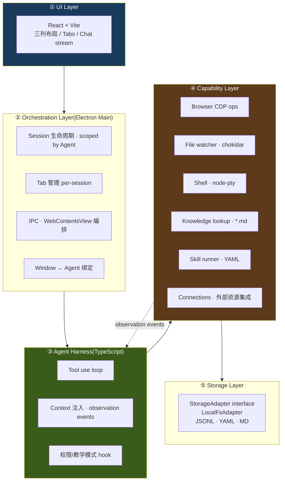

# 架构与技术选型(v0.1)

> 本篇沉淀自 2026-04-23 架构讨论。回答:分层怎么切、harness 什么路线、壳选谁、数据模型怎么组织。MVP 全本地(不依赖云端服务,仅调用 Claude API 做推理),数据模型按多 agent 设计、UI 先单 window 单 agent。

## TL;DR

- **壳**:Electron(Node.js + Chromium + TypeScript)
- **后端**:Electron 主进程即后端,Node.js / TypeScript
- **前端**:React + Vite(electron-vite 模板,HMR)
- **Agent harness**:接口形式抽象;Phase 6 起手 `ClaudeAgentSdkHarness`(走 Claude 订阅);后续可平替 Anthropic API / OpenAI / Ollama
- **运行时三件套**:Harness(LLM loop)/ Session(身份+历史)/ Sandbox(执行边界),正交可换
- **存储**:本地 JSONL + YAML + Markdown,`~/.silent-agent/` 为默认根;**任意文件夹 + `.silent/` 即工作区**(类比 `.git/`)
- **顶级公民**:Agent(非 singleton),**session 归属 agent**;默认 session 落在 `agents/<id>/sessions/<sid>/`,外挂 session 落在用户指定路径
- **外部资源**:Connection 全局唯一,按 `exclusive | shared` 分 mode;agent 通过 Attachment 关系挂载
- **观察通道**:MVP P0 = 内嵌浏览器 CDP(Electron 原生)
- **不上云**:本地自洽;未来可替换 harness 为 Claude Managed Agent,storage 加 sync adapter

## 选型理由

- **Electron over Tauri/Wails**:observe-learn-act 的**观察质量**靠 Chromium CDP,WKWebView 走 JS 注入丢 50%+ 信号;MCP 生态 Node 原生,上云时顺;代价是包大(放弃 "< 100 MB" 硬指标,改为 "打开 < 1.5 s、运行内存 < 250 MB")
- **TypeScript over Go**:选了 Electron 后 Node.js 就是主进程,Go 做子进程成本 > 收益
- **自研 harness over 复用 Claude Code**:事件驱动(observer push)与 CLI 交互驱动不兼容;GUI 权限/教学 UI 要深集成;不引第三进程

## 分层架构



| 层 | 职责 | 实现 | 未来上云替换点 |
|---|---|---|---|
| ① UI | 前端渲染、交互 | React + Vite(renderer) | 不变 |
| ② Orchestration | Session/Tab/Window 生命周期、IPC | Electron main (TS) | 不变 |
| ③ Agent Harness | tool use loop、context、permission | 自研 minimal loop (TS) | **替换为 Managed Agent runtime** |
| ④ Capability | tools、skill runner、connections | Node 包 | web tools 可路由到云端执行 |
| ⑤ Storage | 事件/skill/memory 落盘 | LocalFsAdapter(JSONL+YAML+MD) | **加 sync adapter**,L1/L2 先同步 |

## 核心模型

### 五个核心对象

```mermaid
classDiagram
    class App {
      singleton · 一台设备一份
    }
    class Agent {
      + id : slug
      + name / avatar / model
      + system_prompt
    }
    class Session {
      + id
      + name / createdAt
      + linkedFolder? (可选外部挂载)
      (本质是一个 git repo 目录)
    }
    class Connection {
      app-level · 全局唯一
      + id : feishu | gmail | notion | ...
      + auth (OAuth/token)
    }
    class Capability {
      + kind : im | calendar | doc | kb | ...
      + mode : exclusive | shared
    }
    class Attachment {
      关系对象
      + connectionId
      + capabilityKind
      + agentId
      + role : owner | consumer
    }
    class Window {
      runtime only
      + agentId (绑定)
      + activeSessionId
    }
    class Message
    class SessionEvent {
      session-level timeline
      events.jsonl append-only
    }
    class Tab {
      + id
      + type : browser | terminal | file | silent-chat
      + path (产物路径, session 内或外部绝对路径)
      + state (type-specific runtime)
    }
    class Skill
    class KnowledgeFile

    App "1" *-- "1..*" Agent
    App "1" *-- "0..*" Connection
    App "1" *-- "1..*" Window
    Connection "1" *-- "1..*" Capability
    Capability "1" -- "0..*" Attachment : 按 mode 限数
    Attachment "*" -- "1" Agent
    Agent "1" *-- "0..*" Session
    Agent "1" *-- "0..*" Skill
    Agent "1" *-- "0..*" KnowledgeFile
    Agent "1" -- "1" Memory
    Session "1" *-- "0..*" Message
    Session "1" *-- "0..*" SessionEvent
    Session "1" *-- "0..*" Tab
    Window ..> Agent : 绑定
    Window ..> Session : 当前活跃
```

### 关系规则

- **Agent 是顶级公民**:删 agent = 它的 sessions / skills / knowledge / memory 全走
- **Session = 一个工作区目录(任意路径 + `.silent/` 标记)**:不再区分 chat / workspace,所有 session 都是工作区。默认建在 `agents/<aid>/sessions/<sid>/`,也可由用户指定挂载任意外部文件夹(`addWorkspace`)。`.silent/` 类比 `.git/`,是工作区身份的唯一标识。
- **Tab = `{type, path, state}` 指针**:只告诉 UI "用什么视图打开哪个路径";产物快照 / 版本链在 path 所指的位置自管
- **Events 是 session 级**:单一 `events.jsonl`,跨 tab 动作(focus/open/close)本身就是 event
- **Connection 是 app-level 资源**:一个飞书登录就一份 auth,共享给多个 agent
- **Capability 按 mode 决定 Attachment 的数量上限**:
  - `exclusive`(如飞书 IM):整个 App 只能有 1 个 `Attachment`,那个 agent 独占
  - `shared`(如日历/文档/KB):可多个 agent 并联
- **Window 绑定 Agent**:MVP 单 window,未来切 agent 可能走"新开 window"
- **linkedFolder(可选)**:session 可挂一个外部文件夹作 cwd / 观察锚;**不**纳入 session repo,events.jsonl 记其 HEAD SHA

### 统一模型:Session 就是一个 Git Repo,Tab 是文件指针

**Session = 一个 git 仓库(目录)**。目录里所有产物(chat、browser 快照、terminal buffer、用户放的文件)都是这个仓库的内容。

**Tab = 一个 `{type, path, state}` 指针**。`tabs.json` 是索引,告诉 UI "用哪种 pane 打开哪个路径"。

关键约定:
- **不再区分 `type: 'chat' | 'workspace'`** — 所有 session 都是工作区,区别只是"下面有哪些文件"
- **Tab 自己管产物快照 / 版本**,落在 `tabs/<tid>/` 子目录里
- **Events 是 session 级**,单一 `events.jsonl` 记所有跨 tab 动作(tab focus/open/close 本身就是事件)
- **Git 提供版本管理** —— 每 session 一个 repo,auto-commit + agent-curator 两层策略
- **`linkedFolder` 是 session 可选的外部挂载** —— 不纳入 session repo,只在 events 里记其 HEAD SHA

```
事件(events.jsonl)          ← "发生了什么"
  ↕ 按 ts + tabId 引用
产物(tabs/<tid>/…)          ← "长什么样"
  ↕ 在自然边界触发
git commit                   ← "这个时刻的 snapshot"
  → git log / git diff       ← "用户 & agent 都能回放的时间线"
```

### Tab 的 `{type, path}` 映射

| type | `path` | 产物内部 | 谁产生 |
|---|---|---|---|
| `silent-chat` | `messages.jsonl` | 一个文件(append-only) | harness 对话 |
| `browser` | `tabs/<tid>/` | `snapshots/NNN.md` + `latest` symlink | `did-finish-load` 后抽 readability |
| `terminal` | `tabs/<tid>/` | `buffer.log`(append) + `snapshots/NNN.log`(命令边界) | `pty.onData` + preexec/exit |
| `file` (内部) | `sessions/<sid>/<path>` | 文件本身 | 用户 save |
| `file` (外部) | 绝对路径 | 文件本身(session 外) | 用户 save(外部 git 管) |

### 分栏(Split Layout)演进路线

MVP 主区有两种显示模式:
- **A 模式**:silent-chat tab 活跃 → Silent Chat 全宽
- **B 模式**:browser/terminal/file tab 活跃 → 左工作 tab 1.3 / 右 Silent Chat 1 自动分栏

当前 v0.1 是**纯 UI 派生规则**(Level 0),无模型、无存储。后续按需升级:

| Level | 内容 | 新增存储 | 触发升级的信号 |
|---|---|---|---|
| **0(现在)** | hardcoded:activeTab.type 决定 A/B,比例写死 CSS 1.3:1 | 无 | — |
| **1** | 持久化 divider ratio 到 `sessions/<sid>/state/layout.json`,divider 可拖动 | `layout.json: { splitRatio: number }` | dogfood 时反复调比例 |
| **2** | 完整 layout 树(类似 VSCode editor groups):任意 tab 可拖入 split,横纵皆可,可嵌套 | `layout.json: { tree: LayoutNode }` | 出现 "两个 browser / terminal 并排" 等真实多-pane 需求 |

**设计原则**:tab 是一等公民,layout 是 tab 的排列派生物。Level 1+ 引入后仍不能动摇"每个 tab 独立有 id / 独立 content"的单元性,layout 只管"放在哪"。

### 工作区文件树 — Pinned-left,Tab Bar 上 toggle

**心智区分**(影响 UI 决策):
- **LeftNav = 脑子切换**:消息渠道、工作流、知识库、会话列表 —— **决定要做哪件事**
- **工作区文件树 = 工作心流**:文件浏览、定位、跳转 —— **进入并完成这件事**

文件树**不**长在 LeftNav 里(那会污染脑子切换的语义),而是作为**第二列固定区**,通过 TabBar 最左的 📁 按钮 toggle 出现/消失。

```
[LeftNav | (📁 file tree?) | TabBar + center pane ]
   180px      190px              flex-1
```

**Toggle 入口**(两处冗余,体感一致):
1. TabBar 最左的 `📁` 按钮(active 态 magic-color glow)—— 工作流主入口
2. LeftNav 里 session 项的 `ws` tag 点击 —— 脑子切换里的"快捷暗门"

**Narrow LeftNav**(打开文件树时):
- LeftNav 从 180px → **100px**(只**横向**压缩,**不动**纵向高度;高度变了会让滚动位置跳)
- Session 卡片从单行变 **2 行**:line1 = 名字 + ws tag + live dot;line2 = 路径(若 linkedFolder)或相对时间("3 分钟前")
- 这条规则的 **why**:用户讲过"leftNav 是脑子切换 / 文件夹和文件操作是要专注和心流的地方";窄到 100px 仍能看清 session 名,但视觉重量收缩,把焦点推给文件树

**File Tree Panel 自身**:
- 190px 宽,**舒适行高**(不靠竖向压紧塞内容)
- **不要 chevron 列**,只用 emoji icon(📁/📄)区分文件夹和文件;减小视觉噪音
- 隐藏:`.silent/`、`.git/`、`node_modules/`、`.DS_Store`、`.next/`、`.venv`
- 懒加载:展开时再读子目录;不预扫描全树
- 没有 `×` 关闭按钮 —— 它是 **pinned tab**,只通过 toggle 收起;离 📁 按钮很近,不需要冗余

### 版本管理(Git per session)

每个 session 目录自动 `git init`,作为一个独立 repo。两层 commit 策略:

**Layer 1 — 基础规则(auto-commit)**:保证最低版本链,不依赖 agent。触发点:
- Chat turn 完成
- 浏览器 `did-finish-load` 且有 snapshot 新增
- 终端命令 `exit`
- 文件 save(file tab / session 内文件)
- Tab close
- Session idle 30s 且 dirty(兜底 flush)

**Layer 2 — Agent Curator(Phase 6+,当 agent 能用 git tool)**:
- agent 拿 `git.status / git.diff / git.log` 看变化
- agent 决定合理边界 commit,写语义化 message
- agent 跑 skill 前 `git branch` 实验,失败 `checkout` 回滚
- 用户说"commit 一下,message 写 X" agent 直接调

**Commit message 规范**(两层都用):
```
[source] action: short summary

---
event-id: evt_abc123
ts: 2026-04-24T11:40:30.123Z
tab-id: browser-abc
```

**linkedFolder(嵌套 repo)处理** — **D 方案:只记 ref,不复制内容**:
- session `.gitignore` 包含 linkedFolder 路径
- events.jsonl 记 `{source: 'linked', action: 'probe', meta: {head: <sha>, dirty: bool}}`
- linkedFolder 内容演进 agent 用 linkedFolder 自己的 git 看
- 如果 linkedFolder 不是 git repo,退化为"每文件 sha256 的 pointer snapshot"

**实现栈**:
- `simple-git` npm 包(薄 wrapper over git CLI),macOS 系统自带 git binary
- `src/main/storage/git.ts` — `SessionGit` 类封装 init/commit/status/diff
- Phase "Session 化" 先做 Layer 1,Phase 6(Chat)开放给 agent 用

### Events 设计:Session 级单一时间线

所有事件汇入 `sessions/<sid>/events.jsonl`,按 ts 时序追加。跨 tab 动作(tab focus / open / close)天然归属 session,不塞进某个 tab。

**Event schema**:
```typescript
interface SessionEvent {
  ts: string              // ISO
  source: 'tab' | 'browser' | 'shell' | 'file' | 'chat' | 'agent' | 'session' | 'linked'
  action: string          // 按 source 定义: focus/open/close/navigate/request/exec/edit/turn/...
  tabId?: string          // 可选,meta 事件(session / linked)可无
  target?: string         // URL / command / path
  meta?: Record<string, unknown>
}
```

典型片段(一次 "查 logid" 流):
```jsonl
{"ts":"..01","source":"chat","action":"user-turn","tabId":"silent-chat","meta":{"preview":"帮我查 logid xxx"}}
{"ts":"..10","source":"tab","action":"open","tabId":"browser-abc","meta":{"type":"browser","url":"..."}}
{"ts":"..10","source":"tab","action":"focus","tabId":"browser-abc"}
{"ts":"..15","source":"browser","action":"navigate","tabId":"browser-abc","target":"https://logservice..."}
{"ts":"..30","source":"tab","action":"focus","tabId":"silent-chat"}
{"ts":"..32","source":"agent","action":"turn","tabId":"silent-chat","meta":{"preview":"..."}}
{"ts":"..50","source":"tab","action":"open","tabId":"term-xyz","meta":{"type":"terminal"}}
{"ts":"..52","source":"shell","action":"exec","tabId":"term-xyz","target":"git status"}
```

**Chat 消息双写**:
- `messages.jsonl` 存全文(含 tool_use / tool_result block),harness / 回放用
- `events.jsonl` 存预览(`meta.preview` 截断 120 字符),用于跨 tab 时序 + pattern mining

### AgentRuntime 三件套 — Harness / Session / Sandbox 解耦

借鉴 Managed Agents 的设计思想:**对话运行时由三件套组成,彼此正交、可独立替换**。

| 对象 | 职责 | 换的时机 | 持久度 |
|---|---|---|---|
| **Session** | 身份 / 历史 / workspace 路径 | 切会话 | 永久(磁盘) |
| **Sandbox** | Tool 执行边界:cwd / 可读写路径 / env / 网络 / 超时 | 切"执行模式"(真执行 / dry-run / 容器 / 远程 VM) | 绑 session 但可换 impl |
| **Harness** | LLM loop 运行时:哪家模型 / streaming / compaction / 权限 gate | 切 provider 或 loop 策略 | 每次 start 一次,可 recreate |

#### Harness 在 LLM Chat 之上做的 8 件事

LLM Chat 是无状态函数(`messages → stream`),Harness 是长期活着的 agent 进程,多了:

1. **对话状态** — 内部维护 messages 历史
2. **工具循环** — 识别 tool_use 块 → 执行 → 回灌 tool_result → 再 call,直到 end_turn
3. **Compaction** — 对话过长时自动总结
4. **权限门(教学模式核心)** — 每次 tool call 前通过 Sandbox + permission gate
5. **取消** — 中断 stream + 清理 pending tool call
6. **事件广播** — emit user-turn / tool-call / agent-turn / 错误 到 events.jsonl
7. **Context 注入** — 动态拼 system(+ 观察事件 + memory + tab 状态)
8. **Session 绑定** — tool 执行绑定到对应 session 的 Sandbox

#### 接口形态

```typescript
// ===== Sandbox =====
interface Sandbox {
  readonly sessionId: string
  readonly workspacePath: string     // 关联的 workspace 根(引用,不拥有)
  readonly cwd: string
  readonly env: Record<string, string>

  canRead(absPath: string): boolean
  canWrite(absPath: string): boolean
  canExec(cmd: string): boolean

  readFile(pathRelOrAbs: string): Promise<string>
  writeFile(pathRelOrAbs: string, content: string): Promise<void>
  exec(cmd: string, opts?: ExecOpts): Promise<ExecResult>
}

// 实现:
class LocalFsSandbox implements Sandbox { /* MVP 默认 */ }
class ReadOnlySandbox implements Sandbox { /* dry-run */ }
class DockerSandbox implements Sandbox { /* 容器,v1+ */ }

// ===== Harness =====
interface AgentHarness {
  readonly providerName: string      // 'claude-agent-sdk' / 'anthropic-api' / 'openai' / ...
  readonly modelName: string
  sendMessage(text: string): HarnessStream
  cancel(): void
  listMessages(): ChatMessage[]
}

class ClaudeAgentSdkHarness implements AgentHarness { /* 走 Claude 订阅 */ }
class AnthropicApiHarness implements AgentHarness { /* 走 API key pay-per-token */ }
class OpenAiHarness implements AgentHarness { /* OpenAI */ }

// ===== Factory(粘合三件套) =====
function createAgentRuntime(deps: {
  session: SessionMeta
  sandbox: Sandbox
  harnessConfig: { provider: string; model: string; systemPrompt: string; tools: ToolDefinition[] }
  onEvent?: (e: HarnessEvent) => void
}): AgentHarness
```

#### 为什么 Workspace ≠ Sandbox

`Workspace = 数据(目录 + .silent/)`,`Sandbox = 策略(在该目录上允许做什么)`。MVP 是 1:1 映射,但概念区分后可以:

- 同一 workspace 多个 sandbox:默认(全读写)/ dry-run(只读)/ audit(log 所有写)
- 不同 workspace 共享一套 sandbox 策略(如"禁读 `~/.ssh`"全局)

Tool 执行**只通过 sandbox**,不直接 `node:fs`/子进程:

```typescript
export const shellExecTool: ToolDefinition = {
  name: 'shell.exec',
  inputSchema: { type: 'object', properties: { cmd: { type: 'string' } } },
  execute: async (input, { sandbox }) => {
    if (!sandbox.canExec(input.cmd)) throw new Error('denied by sandbox')
    return sandbox.exec(input.cmd)
  },
}
```

换 DockerSandbox 时 tool 代码零改动。

#### Prefix Cache 策略 — Harness 内部自管 cache_control

LLM 本身是无状态函数(`messages → stream`),"session" 是客户端便利 —— Anthropic prompt cache 是**内容寻址**的(prefix hash),**不绑 session_id**。所以我们自己管 messages.jsonl,通过手动打 `cache_control` 一样能拿到 cache hit。

**MVP 决策(Option A)**:
- **不**用 SDK 的 `resume`/`session_id` 续会话
- `messages.jsonl` 是**真相源**,每次 `sendMessage` 自己 load 历史 + 在合适位置打 `cache_control`
- SDK session_id 的角色被显式拆给 messages.jsonl(历史)+ Harness(cache 断点决策)+ Layer 1 git(版本)

**断点放法**(Anthropic 限制每请求最多 4 个 `cache_control`):
1. `system` prompt 末尾 — 几乎不变,长 TTL 收益最大
2. `tools` 数组末尾 — agent 工具定义稳定
3. **倒数第二条** assistant message 末尾 — 让"上一轮的 prefix"成为下一轮的 cache key
4. (留 1 个余量给 dynamic 注入,如长 observation 摘要)

```typescript
// ClaudeAgentSdkHarness.sendMessage 伪代码
async sendMessage(text: string) {
  const history = await this.loadHistoryWithCacheControl()  // 读 messages.jsonl + 打 cache_control
  return query({
    messages: [...history, { role: 'user', content: text }],
    system: [{ text: this.systemPrompt, cache_control: { type: 'ephemeral' } }],
    tools: this.tools,           // 工具数组结尾打一个 cache_control
    cwd: this.sandbox.cwd,
    canUseTool: ...,
    // 不传 resume —— session 由 messages.jsonl 自管
  })
}
```

**TTL 选择**:默认 `ephemeral`(5min);若已 dogfood 验证某 prefix 跨小时复用频繁,再升级到 `extended`(1h)。

**为什么不直接用 SDK resume** — SDK resume 帮你管的本质就是"哪几个位置贴 cache_control",但隐藏了控制点;Option A 暴露断点位置后,可控、可解释、可跨 provider(Anthropic API / OpenAI prompt cache 同样思路)。

#### 目录组织

```
src/main/agent/
├── runtime/                    三件套 façade
│   ├── session.ts              已有
│   ├── sandbox.ts              Sandbox 接口 + LocalFsSandbox
│   ├── harness.ts              AgentHarness 接口 + 事件
│   └── factory.ts              createAgentRuntime
├── harness/                    各 provider 实现
│   ├── claude-agent-sdk.ts     Phase 6 起手
│   ├── anthropic-api.ts        v0.2
│   └── openai.ts               v0.2+
├── sandbox/                    各 sandbox 实现
│   ├── local-fs.ts             MVP
│   ├── read-only.ts            v1
│   └── docker.ts               v1+
└── tools/                      ToolDefinition + builtin tools(通过 sandbox)
    ├── registry.ts
    └── builtin/ (shell/file/knowledge)
```

### Tool 契约

Tool 接收 sandbox 注入的 ctx,**不直接碰 fs / child_process**,通过 sandbox 执行:

```typescript
interface Tool {
  name: string
  description: string
  input_schema: JSONSchema
  runMode: 'local' | 'web'   // local=必须本地;web=未来可云端执行
  execute(input: any, ctx: ExecContext): Promise<ToolResult>
}

interface ExecContext {
  agentId: string
  sessionId: string
  sandbox: Sandbox       // tool 通过它读写文件 / exec,sandbox 决定允不允许
  windowId?: number
}
```

## 存储约定(everything is file)

> **核心约定**:工作区身份由 **`.silent/`** 目录决定(类比 `.git/`)。任何文件夹 `<X>` 加上 `<X>/.silent/` 就是一个 Silent Agent 工作区。Agent 默认在 `~/.silent-agent/agents/<aid>/sessions/<sid>/` 下建,也可通过 `addWorkspace(absPath)` 把任意已有目录注册为 session,只要在该目录写 `.silent/` 并把绝对路径登记进 agent 的 `_index.json`。

**身份目录命名集中在 `app/src/shared/consts.ts`**(`SILENT_DIR / FILES.* / SUBDIRS.* / SILENT_CHAT_TAB_PATH / tabRelPath()`),不要把 `'.silent'` / `'messages.jsonl'` 这类字符串散落到各处。

```
~/.silent-agent/
├── app-state.json                      # 窗口位置、上次活跃 agent+session
├── app-config.yaml                     # API key、主题、全局偏好
│
├── connections/                        # app-level 外部资源
│   ├── _index.json                     # [{id, kind, status}]
│   └── feishu/
│       ├── auth.yaml
│       └── capabilities.yaml
│
├── agents/                             # 顶级公民容器
│   ├── _index.json                     # [{id, name, lastActiveAt}]
│   └── <agent-id>/                     # id 为 slug(如 silent-default)
│       ├── meta.yaml
│       ├── memory/
│       │   ├── L1-preferences.md
│       │   └── L2-profile.md
│       ├── skills/<skill-name>.yaml
│       ├── knowledge/<topic>.md
│       └── sessions/
│           ├── _index.json             # [{id, path?}] —— path 在场表示外挂工作区
│           └── <session-id>/           # ★ 一个工作区目录(同时也是 git repo)
│               ├── .git/               # auto-init(Phase 5f)
│               ├── .gitignore
│               ├── .silent/            # ★ 工作区标识 + 内部产物全在这下面
│               │   ├── meta.yaml       # name / linkedFolder?
│               │   ├── messages.jsonl  # silent-chat tab 的产物
│               │   ├── events.jsonl    # session 级单一时间线
│               │   ├── tabs.json       # tab index: [{id, type, path, state}]
│               │   ├── tabs/<tid>/     # 每个 tab 的产物
│               │   │   ├── snapshots/NNN-<ts>.{md|log}
│               │   │   └── buffer.log  # terminal append-only
│               │   └── state/          # 其他运行时状态
│               └── (用户放的任何文件)  # 如 notes.md / data.csv
│
└── logs/app.log
```

**外挂工作区(addWorkspace)**:
```
<任意路径>/<my-existing-project>/
├── .git/                               # 用户原有
├── src/, package.json, ...             # 用户原有
└── .silent/                            # ★ Silent Agent 写入的标识 + 产物
    ├── meta.yaml
    ├── messages.jsonl
    └── ...                             # 同上
```
- `addWorkspace(agentId, absPath, name?)` 在 `absPath/.silent/` 下创建标识 + 初始化产物
- 在 agent 的 `sessions/_index.json` 追加 `{id, path: absPath}` 记录
- 之后 Storage 层用 `resolveSessionPath(agentId, sessionId)` 把 sessionId → 绝对路径(默认位置或外挂位置)
- **不复制用户文件,不接管用户的 `.git/`**;用户的代码仓库还是用户自己的

**linkedFolder(D 方案,只记 ref)**:
- 与 addWorkspace 不同 —— `linkedFolder` 是 session 内部 meta 字段,标记一个**观察锚**(只读引用),不在那里写 `.silent/`
- `.gitignore` 不复制其内容,events.jsonl 定期 probe 记 HEAD SHA + dirty 状态

- **JSONL 是真相源**,SQLite/index 只做缓存,删了能从 JSONL 重建
- **一 session 一 git repo**:删 = `rm -rf`,分享 = `git bundle` 或 tar 整目录
- **原子写**:yaml/json 整文件写 `.tmp` + rename(POSIX 原子);jsonl 追加 + fsync
- **List 优化**:`_index.json` 作为目录扫描 cache,启动时读,不命中再重建
- **events.jsonl 高频 append**,git 不 commit 每一次;commit 在逻辑边界(Layer 1 规则 / Layer 2 agent 决策)

### StorageAdapter 接口(一等抽象)

```typescript
interface StorageAdapter {
  // agents
  listAgents(): Promise<AgentMeta[]>
  getAgent(id: string): Promise<Agent>

  // sessions (scoped by agent) —— sessionId → 绝对路径解析
  listSessions(agentId: string): Promise<SessionMeta[]>
  createSession(agentId: string, args: CreateSessionArgs): Promise<SessionMeta>
  /** ★ 把任意已有目录注册为 session,在该目录写 .silent/ */
  addWorkspace(agentId: string, absPath: string, name?: string): Promise<SessionMeta>
  /** ★ sessionId → 绝对路径(默认位置 or 外挂),内部带 cache */
  resolveSessionPath(agentId: string, sessionId: string): Promise<string>

  appendMessage(agentId: string, sessionId: string, msg: ChatMessage): Promise<void>
  appendEvent(agentId: string, sessionId: string, evt: SessionEvent): Promise<void>

  // tabs
  getTabs(agentId: string, sessionId: string): Promise<Tab[]>
  setTabs(agentId: string, sessionId: string, tabs: Tab[]): Promise<void>

  // skills / memory / knowledge
  listSkills(agentId: string): Promise<Skill[]>
  saveSkill(agentId: string, s: Skill): Promise<void>
  getMemory(agentId: string, level: 'L1' | 'L2'): Promise<string>
  setMemory(agentId: string, level: 'L1' | 'L2', content: string): Promise<void>
  listKnowledge(agentId: string): Promise<KnowledgeFile[]>

  // connections
  listConnections(): Promise<ConnectionStatus[]>
  getAttachments(connectionId: string, capability: string): Promise<Attachment[]>
}

// 实现
class LocalFsAdapter implements StorageAdapter { ... }
// 未来 CloudSyncAdapter wraps LocalFsAdapter,双写+本地优先
```

**`_index.json` 的演化**:从早期的 `{ids: [...]}` 升级为 `{entries: [{id, path?}]}`,其中 `path` 在场表示外挂工作区的绝对路径,缺省表示用 `agents/<aid>/sessions/<id>/` 默认位置。

## 项目目录(代码组织)

```
silent-agent/
├── design/                             # 设计文档
├── app/                                # Electron 应用
│   ├── src/
│   │   ├── main/
│   │   │   ├── index.ts                # 窗口 + 启动
│   │   │   ├── ipc/                    # 唯一 import 'electron' 的业务入口
│   │   │   │   ├── agent.ts
│   │   │   │   ├── session.ts
│   │   │   │   ├── tab.ts
│   │   │   │   └── ...
│   │   │   ├── storage/                # 纯 TS,不 import electron
│   │   │   │   ├── adapter.ts          # StorageAdapter 接口
│   │   │   │   ├── local-fs.ts         # LocalFsAdapter 实现
│   │   │   │   ├── paths.ts            # ~/.silent-agent/ 路径工具
│   │   │   │   ├── jsonl.ts            # append / read 工具
│   │   │   │   └── yaml.ts             # 原子写
│   │   │   ├── agent/                  # 纯 TS
│   │   │   │   ├── registry.ts         # agent list/get
│   │   │   │   ├── session.ts          # session CRUD
│   │   │   │   ├── harness.ts          # tool use loop(Phase 2+)
│   │   │   │   └── llm.ts              # Anthropic SDK 封装
│   │   │   ├── tabs/                   # 桥接层,import electron
│   │   │   │   ├── manager.ts          # Tab 生命周期
│   │   │   │   ├── browser.ts          # WebContentsView
│   │   │   │   ├── terminal.ts         # node-pty
│   │   │   │   └── file.ts             # fs 操作
│   │   │   ├── observers/              # 桥接层
│   │   │   │   ├── browser.ts          # CDP 事件 hook
│   │   │   │   ├── files.ts            # chokidar
│   │   │   │   └── shell.ts
│   │   │   ├── connections/            # 外部资源集成(v0.2+ 实装)
│   │   │   │   └── feishu/
│   │   │   └── tools/                  # 纯 TS
│   │   │       ├── registry.ts
│   │   │       ├── browser.ts
│   │   │       ├── knowledge.ts
│   │   │       └── skill-runner.ts
│   │   ├── preload/
│   │   │   └── index.ts                # contextBridge
│   │   ├── renderer/
│   │   │   ├── index.html
│   │   │   └── src/
│   │   │       ├── App.tsx
│   │   │       ├── main.tsx
│   │   │       ├── components/
│   │   │       ├── hooks/
│   │   │       ├── lib/ipc.ts
│   │   │       └── styles/
│   │   └── shared/                     # 两端共用 types(runtime-free)
│   │       └── types.ts
│   ├── package.json
│   ├── electron.vite.config.ts
│   └── tsconfig{.json,.node.json,.web.json}
├── README.md
├── CLAUDE.md
└── task.md
```

**分层原则**(未来上云抽 Node 服务用):
- `storage/ + agent/ + tools/`:**纯业务,不 import 'electron'**
- `ipc/ + tabs/ + observers/ + main/index.ts`:桥接层,可以 import electron
- `connections/`:分情况——底层 SDK 本身不依赖 electron(如 lark-cli 封装),但接入时的 window/通知会用到

## IPC 白名单(v0.1)

```typescript
window.api = {
  agent: {
    current: () => AgentMeta            // 当前 window 绑定的 agent
    list: () => AgentMeta[]
    // create/rename/delete: MVP 不开放 UI,手改 yaml
  }

  // 所有 session 调用隐含"当前 window 的 agentId"
  session: {
    list: () => SessionMeta[]
    create: (args: { name?: string }) => SessionMeta            // 默认位置
    addWorkspace: (absPath: string, name?: string) => SessionMeta  // 外挂任意已有目录
    rename: (id: string, name: string) => void
    delete: (id: string) => void
    loadMessages: (id: string) => ChatMessage[]
  }

  tab: {
    list: (sessionId: string) => TabMeta[]
    open: (sessionId: string, args: TabOpenArgs) => TabMeta
    close: (tabId: string) => void
    focus: (tabId: string) => void
    popupTypeMenu: () => 'browser'|'terminal'|'file'|'file-new'|null  // 原生 OS 菜单
  }

  file: {
    read: (absPath: string) => string
    write: (absPath: string, content: string) => void
    pickOpen: () => string | null
    createInSession: (sessionId: string, filename: string) => string  // 安全检查 .silent / .git / 越界
    listDir: (absPath: string) => DirEntry[]                          // 文件树用
  }

  connection: {
    list: () => ConnectionStatus[]
    // v0.1 只读状态,路由规则改 yaml
  }

  ping: () => { pong: true, at: string }
}
```

**IPC 内部用 `BrowserWindow.fromWebContents(event.sender)` 取 `agentId`**,业务层拿到的永远是 `(agentId, sessionId, ...)`,不关心 window 怎么绑。

## MVP v0.1 范围对齐

**核心原则**:**Tab 基础设施先做,AI 后置**。先把"轻 IDE 壳"的 3 种 tab(浏览器/终端/文件)跑通,dogfood 工作区形态 → 再加 agent harness + observation + skill。

**做**(Phase 1-8,详见 `task.md`):
- Phase 1 ✅ 存储层 + Agent/Session CRUD + 左栏对接
- Phase 2 ✅ Tab 管理框架 + 浏览器 tab(WebContentsView)
- Phase 3 ✅ 终端 tab(xterm + node-pty)
- Phase 4 ✅ 文件 tab(Monaco editor)
- Phase 5 🔄 Session 化 · 工作区化(`.silent/`)+ events.jsonl + Layer 1 git auto-commit
- Phase 6 — Chat:Sandbox + Harness 接口 + `ClaudeAgentSdkHarness`(走 Claude 订阅,自管 messages.jsonl + cache_control)+ 知识库 tool
- Phase 7 — 教教我仪式 + skill v1 教学执行
- Phase 8 — Dogfood(1 周)

**不做(推 v0.2)**:
- 飞书 IM 真接入(MVP 只做 connection 数据结构占位)
- Skill 信任等级升级(v1 教学 → v2 auto)
- 技能商店、多 agent UI 切换器、多 window
- 日程/TODO/邮箱 实体内容(UI 占位)
- Pattern 检测算法(MVP 用 LLM 摘要)

## 风险与对策

| 风险 | 对策 |
|---|---|
| Electron 包大违反"轻"原则 | 只打 macOS dmg;砍 locale;v0.2 再考虑 Tauri partial port |
| 多 agent 数据模型变复杂了 | MVP 只展示 default agent,代码按多 agent 写;UI 不做 |
| Connection mode 冲突(飞书换 owner) | MVP 手改 yaml;v0.2 做设置面板 |
| Observation events 累积,session 变慢 | 按 session 按通道分 jsonl;V2 加 SQLite index |
| Node 主进程单线程卡 LLM 流 | harness async + renderer 直接渲染流 |
| 教学模式 UI 节奏烦 | 第一版每 tool call 一次;dogfood 再调 |

## 关联笔记

- [positioning-strategy-v3-workspace.md](positioning-strategy-v3-workspace.md) — 产品定位
- [mvp-plan.md](mvp-plan.md) — 实施路径(原以 Tauri 写,本篇替换为 Electron + 多 agent 数据模型)
- [cloud-vs-local-agent.md](cloud-vs-local-agent.md) — 本地/云端分工
- [observation-channels.md](observation-channels.md) — 观察通道

## 参考资料

- [Electron docs](https://www.electronjs.org/docs/latest)
- [electron-vite](https://electron-vite.org/)
- [Anthropic TypeScript SDK](https://github.com/anthropics/anthropic-sdk-typescript)
- [xterm.js](https://xtermjs.org) / [node-pty](https://github.com/microsoft/node-pty)
- [chokidar](https://github.com/paulmillr/chokidar)
- [@modelcontextprotocol/sdk](https://github.com/modelcontextprotocol/typescript-sdk)
