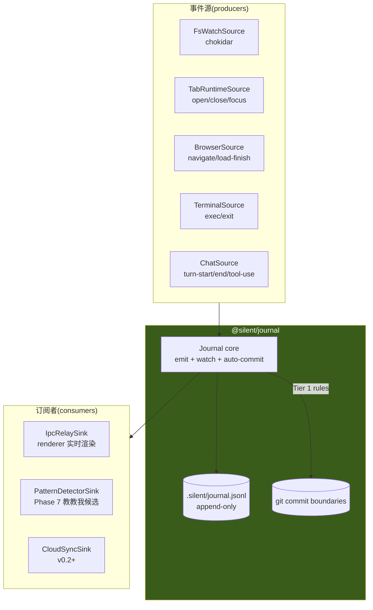

# [已废弃] Journal:工作区编年史(独立包 `@silent/journal`)

> ⚠️ **本文档已废弃**(2026-04-28),被 [`design/08-vcs.md`](../08-vcs.md) `WorkspaceVCS` 取代。
>
> **废弃原因**:本文档原本计划把"file watcher + 事件流 + 自动 commit"打成独立 npm package(`@silent/journal`)。后续讨论意识到几个简化点:
>
> 1. **workspace = git repo,git diff 已经是统一的"发生了什么"接口** —— 不需要单独 cursor / anchor 机制
> 2. **不需要 chokidar 监听用户文件** —— 用户的 fs 编辑由下一次 trigger 时 `git status` 懒发现,自然进 commit;agent 想看变化调 `git diff` 即可
> 3. **不需要独立 npm package** —— MVP 在 app 内做模块即可,以后真要拆包(MCP server / CLI)再拆,1 小时能完成
> 4. **abstraction 收敛到 `WorkspaceVCS`** —— workspace 暴露 commit / branch / log / diff 等 git 能力作为 meta-skill,任何 agent 都能用
>
> 保留本文档作为决策轨迹。本文档的多数设计仍然有效(Defuddle browser snapshot / NNN-cmd.log terminal snapshot / latest.md copy / Tier 1 4 条规则 / .gitignore 默认 / OpenChronicle 5 条启示),已迁到 `08-vcs.md` 中重新组织。
>
> ---
>
> 以下为原文档保留(用于追溯设计演化)。

> Journal 是挂在一个目录上的"工作区编年史"——通用能力,**不知道业务语义**(不知 skill / agent / chat 是啥)。任何 agent 都能 attach source(写)+ subscribe(读)+ 触发 commit。
>
> 起源:在 02-architecture / 03-agent-core 设计完之后,意识到"file/event watcher + 时间线 + git 触发"这套机制跟 LLM 运行时无关,应该独立成包,让任何工具都能消费。

## TL;DR

- **Workspace = 一个 git 仓库**,所有变化自然由 git 管版本。`.silent/` 内除少量 cache 外,**全部进 git**(包含 journal.jsonl / messages.jsonl)
- **Workspace 版本 = git commit SHA**。不需要 anchor / cursor / 别的 manifest
- **Journal 三件事**:
  1. **Event 收集** —— `emit()` 主动 push + `watchFs()` 被动监听 → append 到 `.silent/journal.jsonl`
  2. **Auto-commit** —— 在逻辑边界(turn-end / load-finish / shell.exit / fs.save)按规则触发 git commit,每条 commit message 反向链回事件 ID
  3. **Diff / Replay** —— 薄 git wrapper:`workspace.diff(sha1, sha2)` / `journal.replay(sha1, sha2)`
- **快照子系统**:browser 用 Defuddle 抽干净 .md;terminal 在命令边界切 .log;每 tab 都有 `latest.md` / `latest.log` **(copy,非 symlink)**作为时间线 anchor 文件,`git log -p latest.md` 一条命令看页面演化
- **唯一例外**:`buffer.log` 高频 pty 数据流不进 git(信息冗余,已在 `NNN-cmd.log` 切片里)
- **写入归引擎,agent 只读**(OpenChronicle 启示)——agent 没有 `write_journal` 工具,只能 emit 事件 / 读历史

## 目标与约束

| 目标 | 约束 |
|---|---|
| **G1 通用挂载** | journal 不知道 workspace / agent / skill 概念,只挂在一个目录上 |
| **G2 git 是真相源** | workspace 版本 = git sha,不另立 anchor;empty commit 不可能(journal 永远有增量) |
| **G3 边界自动 commit** | Tier 1 规则在 journal 内置,默认 5 条覆盖 80% 场景 |
| **G4 Replay 任意区间** | `replay(sha1, sha2)` 解析 journal.jsonl 增量返回事件流 |
| **G5 多消费者** | pub/sub + bookmark 模式,任意 sink 订阅,crash 重启幂等 |
| **G6 隐私 / 安全** | 高频 pty 流不入 git;敏感字段(token / cookie)永不写 journal |
| **G7 跟 git 工具兼容** | 用户用 GitHub Desktop / GitButler / `git log` 都能正确看到 workspace 历史 |

**非目标**:多级摘要 pipeline / 跨 workspace 同步 / 实时 stream 给 LLM(都推 v0.2+)

## 总体形态



## 1. Git 资源清单(全在 git working tree)

按"进 git / 不进 git"清晰切分,**所有需要"回得到那一刻"的内容都进 git**:

### 进 git(workspace 真相源)

```
<workspace>/
├── .git/                                    # repo 元数据
├── .gitignore                               # 默认配置见下
├── .silent/
│   ├── meta.yaml                            # 工作区配置(name / linkedFolder),瘦身后
│   ├── tabs.json                            # tab 索引(open/close/state-change 时重写)
│   ├── messages.jsonl                       # ★ silent-chat tab 对话全文(append)
│   ├── journal.jsonl                        # ★ workspace 单一事件时间线(append)
│   └── tabs/
│       └── <tid>/
│           ├── snapshots/
│           │   ├── 001-<ts>.md              # immutable
│           │   ├── 002-<ts>.md
│           │   └── 003-<ts>.md
│           └── latest.md                    # ★ copy of newest snapshot,git log -p 看演化
└── 用户的任何文件                              # notes.md / src/ / data.csv / ...
```

### 不进 git(运行时 / 隐私 / 高频冗余)

```
.silent/state/                               # 全部 .gitignore
├── last-active.json                         # touchWorkspace 高频更新,污染版本
├── active.json                              # 当前 active tab(纯 UI)
├── processors.jsonl                         # consumer bookmark(crash 可从 journal 重建)
├── cookies/                                 # 内嵌浏览器 storage(隐私)
└── cache/                                   # 任何重建型缓存(SQLite index 等)

.silent/tabs/<tid>/
└── buffer.log                               # ★ 高频 pty 数据流(信息已在 snapshots/NNN-cmd.log)
```

### 默认 `.gitignore`

```gitignore
# 系统
.DS_Store
Thumbs.db

# 编辑器临时
*.swp
*.swo
*~

# 项目通用 cache
node_modules/
.next/
.venv/
__pycache__/
target/

# Silent Agent 运行时
.silent/state/
.silent/tabs/*/buffer.log

# linkedFolder(动态写入,如有)
# <linkedFolder relative path>/
```

**没有**默认 ignore 大二进制扩展(.mov / .psd 等)—— 改用 pre-commit hook 拦 > 10MB 文件,提示用户是否真要提交。

## 2. Auto-commit 策略(Tier 0/1/2/3)

### Tier 0 — 只 emit,不触发 commit(高频信号)

| 事件 | 频率 | 落地 |
|---|---|---|
| `shell.output` chunk | pty 每行 | append `buffer.log`(不进 git)+ append `journal.jsonl` |
| `browser.request` | SPA 每页几十个 | append `journal.jsonl`(URL/method/status,token 永远剥) |
| `tab.focus` | 用户切 tab 几十次/天 | append `journal.jsonl`(focus 不重写 `tabs.json`) |
| `fs.modify` 在 `.silent/tabs/*/buffer.log` | append 流 | journal.jsonl 一行 |

→ append 进 jsonl 即可,**不**调 commit。

### Tier 1 — 规则自动 commit(逻辑边界)

journal 内置 5 条默认规则:

```typescript
const DEFAULT_RULES: AutoCommitRule[] = [
  { on: { source: 'chat', action: 'turn-end' }, debounceMs: 0,
    message: e => `[chat] turn: ${truncate(e.meta.preview, 60)}` },

  { on: { source: 'browser', action: 'load-finish' }, debounceMs: 1000,
    message: e => `[browser] load: ${new URL(e.target).host}` },

  { on: { source: 'shell', action: 'exit' }, debounceMs: 0,
    message: e => `[shell] exec: ${truncate(e.meta.cmd, 60)}` },

  { on: { source: 'fs', action: 'save', pathFilter: '!.silent/**' }, debounceMs: 1000,
    message: e => `[fs] save: ${e.target}` },

  { on: { source: 'workspace', action: 'idle', meta: { dirty: true } }, debounceMs: 0,
    message: '[workspace] idle flush' },
]
```

Footer 统一格式,反向链回事件:

```
[browser] load: logservice.bytedance.net

---
trigger: browser.load-finish
ts: 2026-04-27T10:32:42.123Z
event-id: evt_abc123
```

### Tier 2 — agent 显式 commit(Phase 6+)

agent 跑完 task / skill 时主动调:

```typescript
journal.commit('查清 logid X 的根因')          // 语义化 message
journal.branch('try-skill-foo')                 // 试 skill 前开分支
journal.checkout('main')                        // 失败回滚
```

agent 拿 git tool 才会用到。MVP 不暴露给 LLM。

### Tier 3 — 用户手动

用户说"commit 一下,message 写 X" → agent 直接调 Tier 2 API。MVP 不做 UI。

### 关于多 commit 在同一 user-perceived 动作

用户问"帮我把 logid 的解释存到 notes.md":

```
T1   chat.user-turn                                         (journal +1 行)
T2   agent tool-use: write_file('notes.md', '...')          (journal +1 行)
T3   fs.save event 触发 → 1s debounce timer                 (journal +1 行)
T3+1s commit "[fs] save: notes.md"                          ← 包含 notes.md + journal.jsonl
T4   agent assistant-turn                                    (journal +1 行)
T5   chat.turn-end → 立即 commit (debounce 0)
     commit "[chat] turn: ..."                              ← 只含 journal.jsonl 增量
```

→ **2 个 commit**,git log 看到:

```
[chat] turn: 帮我把 logid 解释存到 notes.md
[fs] save: notes.md
```

读起来粒度细但不冗余;接受。

### Pre-commit hook(防呆)

`.git/hooks/pre-commit` 默认校验:

- 任何 staged 文件 > 10MB → 拒绝,提示"考虑 LFS 或 .gitignore"
- 出现 `**/*.{token,secret,key}` 风格文件名 → 警告
- linkedFolder 路径下文件 → 拒绝(应该被 .gitignore)

## 3. Browser Snapshot 子系统

每次 `did-finish-load` 触发,**BrowserTabRuntime**(在 app 层 `src/main/tabs/browser-tab.ts`)做 4 件事:

```
1. 抓 outerHTML (executeJavaScript)
2. Defuddle 抽干净 .md  (npm 包,不 spawn)
3. 写 snapshots/NNN-<ts>.md  (immutable)
4. cp 到 latest.md  (供 git log -p 看时间线)
```

```typescript
// [main · BrowserTabRuntime] 已有的 did-finish-load handler 中
async snapshotPage() {
  const html = await this.webContents.executeJavaScript(
    `document.documentElement.outerHTML`
  )
  if (!html || html.length < 200) return                  // loading 骨架,跳过

  const md = await Promise.race([
    this.runDefuddle(html),
    timeout(800).then(() => this.runInnerTextFallback()), // 800ms 超时回退
  ])

  const N = String(await this.nextSnapshotIndex()).padStart(3, '0')
  const ts = new Date().toISOString().replace(/[:.]/g, '-')
  const filename = `${N}-${ts}.md`
  const filepath = path.join(this.snapshotDir, filename)

  await fs.writeFile(filepath, this.composeMd(md))        // 头部加 URL/title meta
  await fs.copyFile(filepath, path.join(this.snapshotDir, '../latest.md'))

  this.journal.emit({
    source: 'browser', action: 'snapshot',
    tabId: this.tabId, target: filename,
  })
}

private async runDefuddle(html: string) {
  const Defuddle = (await import('defuddle')).default
  const parsed = new Defuddle(html, this.url, { markdown: true }).parse()
  return parsed?.content ?? null
}
```

### 性能预算与降级

| 页面 | total | 在 1s commit debounce 内? |
|---|---|---|
| 小(GitHub README ~50KB) | 30-100ms | ✅ |
| 中(Notion / 飞书 doc ~500KB) | 150-400ms | ✅ |
| 重(SPA 5MB+) | 500-1000ms | ⚠️ 800ms 超时回退 innerText |

### `latest.md` 用 copy 而非 symlink

| 形态 | git log -p 体验 | 磁盘 |
|---|---|---|
| symlink | 看到 target 字符串变化(`002→003`),内容不可见 | 几字节 |
| **copy(选)** | **完整页面内容演进时间线**,一行命令看 | git pack delta dedupe 后实际 +5% |

→ 选 copy。`latest.md` 在 git 里跟 NNN-*.md 是不同 blob,但 pack 后大部分 delta 共享。

## 4. Terminal Snapshot 子系统

终端比浏览器多一个 `buffer.log`(高频 pty 流)。处理上不进 git。

```
.silent/tabs/<tid>/
├── buffer.log                          ❌ .gitignore (高频 pty 流,信息冗余)
├── snapshots/
│   ├── 001-<ts>-ls.log                 ✅ git (per-cmd 切片,immutable)
│   ├── 002-<ts>-pwd.log
│   └── 003-<ts>-git-status.log
└── latest.log                          ✅ git (最新 cmd 切片 copy,git log -p 看)
```

### 切片时机

**TerminalTabRuntime**(`src/main/tabs/terminal-tab.ts`)在 zsh `preexec` / `exit` hook:

```typescript
// preexec: 命令开始
this.currentCmd = { cmd, ts: nowIso(), bufferStartOffset: this.buffer.size }
this.journal.emit({ source: 'shell', action: 'exec', tabId: this.tabId, target: cmd })

// exit: 命令结束
const slice = this.buffer.readFrom(this.currentCmd.bufferStartOffset)
const N = String(...).padStart(3, '0')
const filename = `${N}-${this.currentCmd.ts}-${slug(cmd)}.log`
await fs.writeFile(path.join(this.snapshotDir, filename), slice)
await fs.copyFile(filepath, path.join(this.snapshotDir, '../latest.log'))
this.journal.emit({ source: 'shell', action: 'exit', tabId: this.tabId,
                   target: cmd, meta: { exitCode, durMs } })
```

→ 每个命令一个 snapshot 文件 + latest.log copy + 1 条 journal 事件。

### `&&` / `;` 链式命令

`ls && pwd && git status` 触发 3 次 preexec / exit → 3 个 snapshot + 3 个 commit,`git log --oneline` 看到:

```
[shell] exec: git status
[shell] exec: pwd
[shell] exec: ls
```

粒度细,后续 pattern mining / replay 都受益。

### 长时运行命令(`tail -f` / REPL)

无 exit 触发 → buffer.log 一直涨但不 snapshot/commit。
兜底:`workspace.idle 30s` 触发 commit 时,journal 检测到 active 命令,可选 snapshot 当前 buffer 后缀(留接口,MVP 不做)。

## 5. Journal API

### 接口

```typescript
// packages/journal/src/index.ts

export interface JournalEvent {
  ts: string                                    // ISO
  source: 'workspace' | 'tab' | 'browser' | 'shell' | 'fs' | 'chat' | 'agent' | 'linked' | string
  action: string
  tabId?: string
  target?: string                               // URL / cmd / path
  meta?: Record<string, unknown>
}

export interface AutoCommitRule {
  on: { source?: string; action?: string; pathFilter?: string }
  debounceMs?: number                           // 默认 1000
  message: string | ((e: JournalEvent) => string)
}

export interface JournalSink {
  name: string
  push(e: JournalEvent): Promise<void>
}

export class Journal {
  constructor(rootPath: string, opts?: {
    rules?: AutoCommitRule[]                    // 默认 DEFAULT_RULES
    autoCommit?: boolean                        // 默认 true
  })

  // ============ Event 收集 ============
  emit(e: Omit<JournalEvent, 'ts'>): Promise<void>
  watchFs(globs: string[], opts?: { ignored?: string[] }): void
  unwatchFs(globs: string[]): void

  // ============ Sink ============
  addSink(sink: JournalSink): void
  removeSink(name: string): void

  // ============ Pub/Sub ============
  subscribe(filter: EventFilter, handler: (e: JournalEvent) => void): Unsubscribe
  stream(filter: EventFilter): AsyncIterable<JournalEvent>

  // ============ Replay(读历史) ============
  replay(opts?: { since?: string; until?: string; sinceSha?: string; untilSha?: string }):
    AsyncIterable<JournalEvent>

  // ============ Git 集成(薄 wrapper) ============
  commit(message: string, options?: { allowEmpty?: boolean }): Promise<string>      // 返回 sha
  log(opts?: { limit?: number; since?: string; path?: string }): Promise<CommitInfo[]>
  diff(refA?: string, refB?: string, path?: string): Promise<string>                // patch text
  show(sha: string): Promise<{ message: string; files: string[]; patch: string }>

  // ============ 生命周期 ============
  dispose(): Promise<void>
}
```

### 内置 Sink

- **`JsonlSink`**(默认开启)— append `.silent/journal.jsonl`
- **`IpcRelaySink`**(app 注册)— 转发给 renderer 渲染时间线
- **`PatternDetectorSink`**(Phase 7)— 教教我候选检测
- **`CloudSyncSink`**(v0.2+)— 同步到云端 Sidecar

### 不做(纯化)

- ❌ 不解释事件意义(skill 文件变化 = 啥?journal 不知道,sink 自己处理)
- ❌ 不持有产物(snapshot / buffer.log 由 BrowserTabRuntime / TerminalTabRuntime 落 fs,journal 只接事件 + 触发 commit)
- ❌ 不知 LLM / agent / workspace 业务概念(workspace 这个词在 journal 包里都不出现,只叫 `rootPath`)
- ❌ 不暴露 write tool 给 agent(写入归引擎,agent 只读)

## 6. 完整链路示例:查 logid

复用 `01-product-vision.md` 里的场景,展示 git + journal 协作。

### 时间轴

```
T1   用户在地址栏输 https://logservice.bytedance.net
T4   did-finish-load(登录页)         → snapshot 001 + latest.md copy
T6   did-finish-load(主页)            → snapshot 002 + latest.md copy
T8   用户点击"搜索"按钮
T9   fetch /api/search?logid=abc123
T12  did-finish-load(结果页)          → snapshot 003 + latest.md copy
T13  debounce 倒数完(T12+1s)         → COMMIT a1b2c3
T14  用户切到 silent-chat,问 agent
T15-T18  agent 跑 tool, 解读
T19  turn-end                          → COMMIT d4e5f6
```

### Journal 事件(`.silent/journal.jsonl` 全程 append)

```jsonl
{"ts":"T1","source":"browser","action":"navigate","target":"https://logservice...","tabId":"br-1"}
{"ts":"T4","source":"browser","action":"load-finish","target":"https://logservice...","tabId":"br-1"}
{"ts":"T4","source":"browser","action":"snapshot","tabId":"br-1","target":"001-...md"}
{"ts":"T6","source":"browser","action":"load-finish",...}
{"ts":"T6","source":"browser","action":"snapshot","target":"002-...md"}
{"ts":"T8","source":"browser","action":"click","tabId":"br-1","meta":{"role":"button","text":"搜索"}}
{"ts":"T9","source":"browser","action":"request","target":".../api/search?logid=abc123",...}
{"ts":"T12","source":"browser","action":"load-finish",...}
{"ts":"T12","source":"browser","action":"snapshot","target":"003-...md"}
{"ts":"T14","source":"tab","action":"focus","tabId":"silent-chat"}
{"ts":"T15","source":"chat","action":"user-turn","meta":{"preview":"帮我分析这条 logid 的报错"}}
{"ts":"T16","source":"agent","action":"tool-use","meta":{"tool":"browser.extractText"}}
{"ts":"T18","source":"chat","action":"assistant-turn","meta":{"preview":"看起来是 ctx timeout..."}}
{"ts":"T19","source":"chat","action":"turn-end"}
```

### Git commits

**T13 commit a1b2c3**(`browser.load-finish` debounce 后,trigger T12):
```
files:
  + .silent/tabs/br-1/snapshots/001-<ts>.md
  + .silent/tabs/br-1/snapshots/002-<ts>.md
  + .silent/tabs/br-1/snapshots/003-<ts>.md
  + .silent/tabs/br-1/latest.md             # copy of 003
  M .silent/tabs.json                        # state.url 更新
  M .silent/journal.jsonl                    # +9 行(T1..T12)

[browser] load: logservice.bytedance.net

---
trigger: browser.load-finish
ts: 2026-04-27T10:32:42Z
```

**T19 commit d4e5f6**(`chat.turn-end`,debounce 0):
```
files:
  M .silent/messages.jsonl                   # +2 行(user + assistant)
  M .silent/journal.jsonl                    # +5 行(T14..T19)

[chat] turn: 分析 logid abc123 报错
```

### 用户视角的查询

```bash
# 看时间线
$ git log --oneline
d4e5f6 [chat] turn: 分析 logid abc123 报错
a1b2c3 [browser] load: logservice.bytedance.net

# 看页面内容怎么变
$ git log -p .silent/tabs/br-1/latest.md
# → 完整 logservice 页面演化历史(空 / 主页 / 结果页)

# 看 T1-T12 之间的事件
$ git diff a1b2c3^ a1b2c3 -- .silent/journal.jsonl
# → 9 行 jsonl 增量

# 看完整工作区某一刻状态
$ git checkout a1b2c3
# → 一切自然回到 T13
```

### Journal API 视角

```typescript
const events = await journal.replay({ sinceSha: 'a1b2c3', untilSha: 'd4e5f6' })
// → 5 条 chat / agent / tab 事件,顺序

const patch = await journal.diff('a1b2c3^', 'a1b2c3')
// → git patch text,包含所有文件变化

const commits = await journal.log({ path: '.silent/tabs/br-1/latest.md', limit: 10 })
// → 最近 10 次该 tab 的页面变化 commit
```

## 7. OpenChronicle 5 条启示(已沉淀,实施时遵循)

详细调研:`/Users/bytedance/Documents/ObsidianPKM/Notes/调研/OpenChronicle/`。5 条直接抄进 journal 的实现纪律:

### 1. 多级压缩 pipeline(留接口,v0.2+)

```
原始事件流(高频)
   ↓ 1-min wall-clock window LLM normalize  → 1 分钟级摘要
   ↓ 5-min flush                            → 工作 session 摘要
   ↓ 30-min classifier                      → durable workspace memory
```

**每一级 prompt 只看上一级输出,token 不爆**。MVP 不做,journal 接口预留:

```typescript
journal.subscribe({ source: '*' }, async (events) => {
  // sink 自己实现压缩
})
```

### 2. Bookmark 字段而非消息队列

每个 consumer 在 `.silent/state/processors.jsonl` 持久化水位:

```jsonl
{"name":"pattern-detector","cursor":"evt_abc123","ts":"..."}
{"name":"summarizer","cursor":"evt_def456","ts":"..."}
```

任何 listener crash 重启 → 从 bookmark 重新读 journal.jsonl,**幂等**。

`processors.jsonl` 不进 git(crash 重建可从 journal head 推)。

### 3. Wall-clock window 而非滚动窗口

```
✅ wall-clock:[10:00, 10:01) 整 60s 对齐    → 重跑不重复
❌ 滚动:events[-60s:]                       → 无法去重
```

存表用 `UNIQUE(start, end)` 主键。Phase 7 做 5 分钟摘要时必抄。

### 4. 永不静默丢数据

```typescript
async function llmNormalize(events: JournalEvent[]) {
  try {
    return await llm.call(prompt, events)
  } catch (e) {
    // heuristic fallback,绝不抛
    return { kind: 'heuristic', text: `${events.length} events in window`, error: String(e) }
  }
}
```

任何 batch task 都按这个写。Phase 7 / Phase 8 dogfood 严格遵循。

### 5. 写入归引擎,agent 只读

journal 暴露给 LLM 的是 **只读 tools**:

```typescript
// MCP / tool 定义
journal.replay({ since })             // ✅ 暴露
journal.log({ path })                 // ✅ 暴露
journal.diff(sha1, sha2)              // ✅ 暴露

journal.emit(...)                     // ❌ 不暴露,只 internal source 用
journal.commit(msg)                   // ❌ Tier 2 是显式 agent tool,Phase 6+ 评估
```

**减少 prompt injection 污染 journal 的攻击面**。要让 agent "记住"什么,agent 输出到 transcript / 文件,journal 自己捕获 fs.save 事件。

## 8. 包结构(monorepo)

```
silent-agent/
├── packages/
│   ├── agent-core/                  # 03-agent-core.md 定义
│   ├── journal/                     # ★ 本篇定义
│   │   ├── package.json             # name: "@silent/journal"
│   │   └── src/
│   │       ├── index.ts             # public exports
│   │       ├── types.ts             # JournalEvent / AutoCommitRule / Sink
│   │       ├── journal.ts           # Journal class
│   │       ├── sources/
│   │       │   ├── fs-watch.ts      # chokidar 包装
│   │       │   └── interface.ts     # EventSource 接口
│   │       ├── sinks/
│   │       │   ├── jsonl-sink.ts
│   │       │   └── interface.ts
│   │       ├── git/
│   │       │   ├── wrapper.ts       # simple-git 薄封装
│   │       │   └── auto-commit.ts   # rule engine
│   │       └── filter.ts            # subscribe 用 EventFilter 实现
│   └── app/
│       └── src/main/journal/        # journal 跟具体 source 的胶水
│           ├── tab-source.ts        # TabManager 推 tab.* 事件
│           ├── browser-source.ts    # BrowserTabRuntime 推 browser.* 事件
│           ├── terminal-source.ts   # TerminalTabRuntime 推 shell.* 事件
│           └── chat-source.ts       # SessionManager onEvent → journal
```

**关键约束**:

- `packages/journal/` **不 import 'electron'**(只用 `node:fs` / chokidar / simple-git)
- 所有具体的 webContents / pty / SessionManager 接入,通过 app 层薄 source 适配
- `Journal` 不知道 workspace 这个词,只接受 `rootPath`

## 9. 实施路线(对应 task.md Phase 5)

| 子任务 | 估时 | 产出 | 验收 |
|---|---|---|---|
| **5a · journal 包骨架** | 0.5d | `@silent/journal` workspace package,接口编译过 | `npm run build` 两包都过 |
| **5b · 默认 JsonlSink + emit** | 0.5d | append `.silent/journal.jsonl` | unit test:并发 emit 不丢失 |
| **5c · FsWatchSource** | 0.5d | chokidar 包装,gitignore 过滤 | 大目录 watch 不卡 |
| **5d · git wrapper + Tier 1 rules** | 1d | simple-git + 5 条默认规则 + footer | 5 类边界事件都触发 commit;footer 正确 |
| **5e · BrowserTabRuntime snapshot(Defuddle)** | 1d | did-finish-load → snapshots/NNN.md + latest.md | 中页 < 400ms,fallback OK |
| **5f · TerminalTabRuntime snapshot(zsh hook)** | 1d | preexec/exit → NNN-cmd.log + latest.log | 链式命令分别切片 |
| **5g · 跟 IPC / app 接入** | 0.5d | renderer 收到 journal 事件 stream(IpcRelaySink) | 时间线 UI 可看实时事件 |

总 ~5 天。完成后 task.md Phase 5 关闭。

## 10. 风险与权衡

| 风险 | 缓解 |
|---|---|
| **journal.jsonl 长期增长** | 30 天 archive(v0.2+);MVP 不限,实测后看 |
| **GitHub / GitLab 视角看到 chat 内容(messages.jsonl 在 git)** | `workspace.config.streamInGit: false` opt-out(v0.2 加) |
| **大文件偶尔进 commit** | pre-commit hook 拦 > 10MB |
| **Defuddle 在某些页失败** | 800ms timeout fallback 到 innerText |
| **buffer.log 不进 git 导致 fast-resume 跨设备丢** | tar 整目录同步带上(buffer.log 在 fs 里只是 .gitignore,share 时 rsync 会带) |
| **CDP / Playwright 接入冲突 DevTools** | MVP 不做 Playwright;v0.2 spike `--remote-debugging-port` 路径 |

## 11. Open Questions

1. **MCP server 暴露 journal?** OpenChronicle 启示 5 — 让其他 agent 通过 MCP 读 journal。预留 `journal.mcpServer()` 接口,实装推 v0.2+
2. **journal.jsonl 跨设备同步策略?** v0.2 决定:rsync 整目录 / git push 推所有(包括 jsonl)/ 专用 sync 协议
3. **Multi-workspace 全局 journal?** 一个 agent 多个 workspace 时,有没有"agent 级 journal" 把所有工作区聚合? 推 v0.3
4. **Pattern detector 用 wall-clock 还是事件计数窗口?** Phase 7 实测决定

## 关联文档

- [01-product-vision.md](01-product-vision.md) — Everything is file 哲学的具体实现
- [02-architecture.md](02-architecture.md) — workspace = git repo 的整体上下文
- [03-agent-core.md](03-agent-core.md) — agent-core 通过 onEvent hook 推事件给 journal
- [05-observation-channels.md](05-observation-channels.md) — P0 三通道 emit 进 journal
- `Notes/调研/OpenChronicle/` — 5 条启示的原始调研

## 参考资料

- [simple-git](https://github.com/steveukx/git-js) — git wrapper(MVP 实现选)
- [chokidar](https://github.com/paulmillr/chokidar) — 跨平台 fs watcher
- [Defuddle](https://github.com/kepano/defuddle) — HTML → clean markdown
- [Anthropic prompt caching](https://docs.claude.com/en/docs/build-with-claude/prompt-caching) — journal replay 给 LLM 时如何打 cache
- [OpenChronicle](https://github.com/openchronicle/openchronicle) — 多级压缩 + bookmark + AX tree 参考实现
