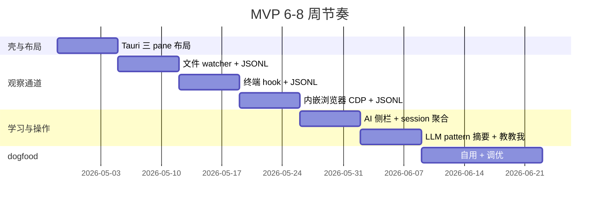
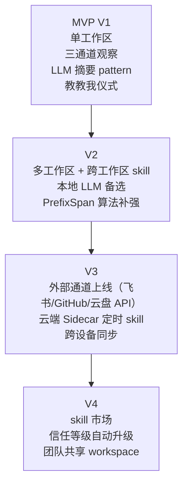

# MVP 方案（v3）

> 基于 [positioning-strategy-v3-workspace.md](positioning-strategy-v3-workspace.md) 的轻工作区形态，6-8 周做出一个可自 dogfood 的 MVP。验证三件事：(1) 用户愿意把当期任务搬进轻工作区；(2) 工作区内 file + browser + shell 三通道观察能产出足够信号；(3) AI-push 能从产物流发现真实 pattern 让用户说"啊对哦"。

## TL;DR

- **技术栈**：Tauri 最小壳 + xterm.js + Tauri WebView（<100MB、冷启动<1s，不内嵌编辑器）
- **平台范围**：**MVP = macOS only**（Tauri WebView 在 macOS 下是 WKWebView，走 JS 注入实现 observe + act；Windows/Linux 推 V3）
- **形态参考**：cmux（原生 macOS 终端 + 内嵌浏览器 + 标签页分屏）——我们做 agent-ready 终端的 Tauri 轻量版 + observe-learn-act 魂；Yume（Claude Code 桌面 GUI）是**产品设计参考**（闭源专有许可，不可抄代码），其 **background agent + git worktree 隔离** 最值得借鉴
- **核心循环**：单工作区 → 三通道事件落 JSONL → LLM 摘要出 pattern → "教教我"仪式生成 skill
- **只做一个真实任务**：围绕一个我自己每天做的任务（例如每日调研笔记整理）跑通 observe-learn-act

## 要验证的核心假设

1. **用户愿意搬入** — 轻工作区（< 100 MB、打开 < 1 s、内嵌够用）能让用户把当期任务的一部分从 IDE / 飞书里迁进来
2. **观察质量** — 工作区内 file + browser + shell 三通道的事件流，比外部 API 更容易发现重复 pattern（因为粒度更细、上下文天然关联）
3. **AI-push 有效** — "教教我"仪式能让用户从"没意识到自己重复"过渡到"确认要自动化"

## MVP 范围

### 技术栈硬性约束：轻量

| 组件 | 选型 | 为什么 |
|---|---|---|
| 壳 | **Tauri**（Rust 后端 + TS 前端） | Electron 250 MB 起步输光，Tauri 20 MB 可达；cmux 原生 Swift 是参考上限 |
| 编辑器 | **不内嵌**——用户自带 micro / VSCode / vim | 研发肌肉记忆在 vim/VSCode，硬塞 Monaco 一定输；file watcher 统一抓保存事件 |
| 终端 | **xterm.js + portable-pty** | 够跑 script，不跟 iTerm 比 |
| 浏览器 | **Tauri WebView（macOS = WKWebView）+ JS 注入** | 借鉴 cmux agent-browser 移植模式——不走 CDP，用 `WKNavigationDelegate` + 注入 `__silent_browser__` 全局 JS 对象 patching fetch/XHR；observe 和 act 同时具备；跨平台推 V3 |
| 存储 | **JSONL 落盘 + SQLite 缓存** | 真相源是文件，SQLite 只做性能索引 |
| LLM | **Claude API**（MVP 期） | 本地推理推到 V2 |

### 只做一个工作区形态

- 用户在 App 里 `New Workspace` = 新建 `~/Workspaces/<name>/` 目录
- 工作区打开后的布局：左侧文件树 + 中央上下分屏（终端 + 浏览器）+ 右侧 AI 侧栏
- **不做内嵌编辑器**——终端里直接 `micro notes.md` / `vim` / `code` 打开文件
- 右侧 AI 侧栏：显示 "正在观察到什么" 实时摘要 + "教教我?" 卡片

### 工作区目录 schema（everything is file）

```
~/Workspaces/<name>/
├── .workspace.yaml         # 工作区配置
├── context/                # 观察空间产出
│   ├── files.jsonl
│   ├── browser.jsonl
│   ├── shell.jsonl
│   └── session-{id}.jsonl
├── skills/                 # 学习空间产出
│   └── *.yaml
├── state/                  # Agent 运行态
│   └── pending-suggestions.jsonl
├── output/                 # 交付产出（最终推外部系统）
│   └── *.md
└── <用户自己放的文件>
```

### 只做一种 pattern 检测

- **MVP 期**：直接用 Claude 做 LLM-based pattern 摘要（mechanical + semantic 合并）
- **不做**：PrefixSpan / HDBSCAN 等算法（V2 再补）
- **做法**：每次关闭工作区或每日 18:00，把当天 `context/*.jsonl` 喂给 Claude，产出 "你可能在重复做 X" 摘要

### 编辑器策略：不内嵌，推荐 micro

- **Silent Agent 不做编辑器**——省 Monaco 集成成本，也避免跟用户的 vim/VSCode 肌肉记忆竞争
- 首次启动检测 `$EDITOR`，未设置则提示一句 "推荐 `brew install micro`（类 VSCode 快捷键，10 分钟上手）"
- 文件树右键支持 "Open in external editor"，调用 `$EDITOR` 或用户配置的编辑器
- 无论用户用 micro / vim / VSCode，file watcher 都统一抓保存事件，observe 不受影响

### 只做一个 dogfood 任务

选一个我自己每天都做的真实任务——例如**每日调研笔记整理**或**竞品监控**。所有迭代围绕这一个任务跑通闭环，不追求多任务覆盖。

## 开发计划（6-8 周）



| 周 | 做什么 | 交付 | 验证 |
|---|---|---|---|
| W1 | Tauri 壳 + 三 pane 布局（文件树 / 终端+浏览器 / AI 侧栏）+ 工作区目录新建 | 能打开一个文件夹，三 pane 正常显示 | 轻量指标：< 100 MB、< 1 s 冷启动 |
| W2 | 文件 watcher（Rust `notify`） + 事件落 `context/files.jsonl` | 编辑保存 / 多文件并发 / 大目录性能 | debounce 正确、不丢事件 |
| W3 | xterm + zsh preexec hook + 事件落 `context/shell.jsonl` | cwd / exit code / 敏感参数脱敏 | 命令级记录完整 |
| W4 | 内嵌浏览器 CDP + Network/Page 订阅 + 事件落 `context/browser.jsonl` | URL / 请求脱敏记录 | SPA / HTTPS 无异常 |
| W5 | AI 侧栏 + "正在观察到什么" 实时聚合视图 | 侧栏显示当前 session 事件摘要 | 用户能看到 AI "看到了什么" |
| W6 | LLM 摘要 + 首个"教教我"仪式 + skill 落盘 | 关闭工作区时生成 summary，发现重复问"教教我?" | 结构化 3 问 + skill 生成 `skills/*.yaml` |
| W7-8 | 自用 dogfood + 调 noise threshold + bug 修 | 连续 5 天用得下去 | 至少 1 次 "啊对哦" 体验 |

## 成功标准

- [ ] 技术：Tauri 壳 < 100 MB，冷启动 < 1 s
- [ ] 观察:三通道事件流无丢失，一周 JSONL 可 `grep` 可 `jq` 分析
- [ ] 学习：至少发现 1 个我自己都没意识到的重复 pattern
- [ ] 操作：第一个 skill 能从"教教我"仪式里 0→1 生成并被复用
- [ ] 产物：工作区可 `git init && git log context/` 看到事件演化

## AI-push 的 4 个代价（MVP 也要守住）

对应 [core-insight-ai-push.md](core-insight-ai-push.md) 的 4 条：

1. **推的质量 >> 数量** — MVP 期每天最多 1 次"教教我"，宁可漏不乱推
2. **每条 push 带"为什么"** — 卡片必须展示 "因为你这周做过 3 次 X，每次都……"
3. **结构化 3 问而非开放式"教"** — 背景 / 关键步骤 / 成功标准
4. **置信度宁高勿低** — MVP 阈值设高，dogfood 中逐步调

## 从 MVP 到完整产品



## 与历史 MVP 方案的差异

| 版本 | 方案 | 为什么被废弃 |
|---|---|---|
| **v1**（原 `mvp-plan.md`） | 浏览器扩展 + PrefixSpan + 推荐卡片 | 无工作区壳，观察精度受限于浏览器 |
| **v2**（`observation-channels.md` 原 P0 6 周版） | 飞书 API + 代码仓 API + 文件 watcher + 云盘 | 无工作区壳，外部通道只能提供元数据级观察 |
| **v3（本篇）** | 工作区壳 + 三通道 + LLM pattern + 教教我（砍 Monaco 进一步减重） | 产物观察和 AI-push 有物理位置落地 |

外部 API 通道（飞书 / 代码仓 / 云盘）推到 V3，作为工作区之外的辅助信号，不作为 MVP 主源。

## 关联笔记

- [positioning-strategy-v3-workspace.md](positioning-strategy-v3-workspace.md) — 上层定位锚
- [workspace-interaction.md](workspace-interaction.md) — 工作区交互设计
- [observation-channels.md](observation-channels.md) — 通道分层技术细节
- [core-insight-ai-push.md](core-insight-ai-push.md) — "教教我"仪式来源
- [artifact-first-architecture.md](artifact-first-architecture.md) — 产物视角哲学
- [cloud-vs-local-agent.md](cloud-vs-local-agent.md) — 本地 Agent 为主，云端 Sidecar 辅助

## 参考资料

- [Tauri 官方文档](https://tauri.app) — 2.x 已稳定
- [awesome-tauri](https://github.com/tauri-apps/awesome-tauri) — Tauri 生态官方清单
- [xterm.js](https://xtermjs.org)
- [micro editor](https://micro-editor.github.io) — 推荐给不想用 vim 的用户，类 VSCode 快捷键，10 分钟上手
- [cmux](https://cmux.com) — 原生 macOS agent-ready 终端 App 形态参考（GPL-3.0，不 fork）
- [agent-browser](https://github.com/vercel-labs/agent-browser) — Playwright 风格 49 verb API 规范（cmux 移植它到 WKWebView）
- [WKWebView 官方文档](https://developer.apple.com/documentation/webkit/wkwebview)
- [Screenpipe](https://github.com/mediar-ai/screenpipe) — Tauri + Rust 做 24/7 本地观察的已验证案例
- [Yume](https://github.com/aofp/yume) — Claude Code 桌面 GUI（**闭源专有许可，不可借鉴代码**；仅产品设计参考，尤其 background agent + git worktree 隔离）
- [GitButler](https://github.com/gitbutlerapp/gitbutler) — Tauri 复杂桌面应用的参考
- [Rust notify crate](https://docs.rs/notify/)
- [Claude Code harness 调研](../../Notes/调研/claude-code-harness/)
- [Cloud Agent Workspace 调研](../../Notes/调研/cloud-agent-workspace/)
- [cmux 调研笔记](../../Notes/调研/cmux-terminal-browser/) — cmux 源码解析
- [yume 调研笔记](../../Notes/调研/yume-claude-code-gui/) — Yume 调研（已完成：闭源不可深调，仅产品设计要点）
- [Tauri 生态竞品对标](competitors-tauri-ecosystem.md) — 本目录下的详细对标
