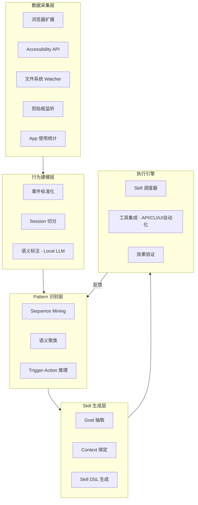

# 技术架构

> 全本地架构，数据采集 → 行为建模 → Pattern 识别 → Skill 生成 → 执行引擎，五层管线。

## 整体架构



## 数据采集层

### 信号源选型

优先级排序（信息价值 / 实现成本 / 隐私风险 综合考虑）：

| 优先级 | 信号源 | 采集内容 | 实现方式 | 备注 |
|--------|--------|---------|---------|------|
| P0 | 浏览器扩展 | URL、页面标题、表单操作、点击序列 | Chrome/Arc Extension API | 信息最结构化，用户接受度高 |
| P0 | 文件系统 Watcher | 文件创建/修改/删除、路径、类型 | macOS FSEvents / Linux inotify | 低噪声，精确 |
| P1 | App 使用统计 | 前台 app、窗口标题、使用时长 | macOS Accessibility API | 粗粒度 context |
| P1 | 剪贴板监听 | 复制粘贴内容、来源 app | NSPasteboard observer | 跨 app 数据流的关键线索 |
| P2 | 屏幕截图 + OCR | 视觉内容 | CGWindowListCreateImage + Vision | 兜底方案，计算贵 |
| P3 | 网络抓包 | API 调用、请求响应 | mitmproxy / Network Extension | 实现复杂，HTTPS 需证书 |

### 事件格式

所有信号源统一为标准事件格式：

```json
{
  "timestamp": "2026-04-16T14:32:05Z",
  "source": "browser_extension",
  "app": "Arc",
  "action": "navigate",
  "target": "https://figma.com/file/xxx",
  "metadata": {
    "page_title": "设计稿 v2",
    "tab_id": "tab_42"
  },
  "session_id": "sess_abc123"
}
```

## 行为建模层

### Session 切分

将连续事件流切分为有意义的"任务 session"：
- 时间间隔 > 5 分钟 → 新 session
- 切换到无关 app → 新 session
- 同一 app 内主题变化（LLM 判断）→ 新 session

### 语义标注

用 Local LLM（如 Llama 3 8B 量化版）对每个 session 生成语义摘要：

```
Session: [打开 Figma → 导出 PNG → 打开飞书文档 → 上传图片]
语义标注: "从 Figma 导出设计稿并上传到飞书文档"
```

## Pattern 识别层

### Mechanical Repeat 检测

算法：基于事件序列的频繁子序列挖掘（PrefixSpan / GSP）

```
输入: 最近 N 天的 session 序列
参数: min_support = 3 (至少出现 3 次), min_length = 2 (至少 2 步)
输出: 频繁操作序列 + 出现频次 + 时间分布
```

### Semantic Repeat 检测

算法：对 session 语义摘要做 embedding 聚类

```
1. 每个 session 的语义摘要 → embedding (local embedding model)
2. HDBSCAN 聚类，发现语义相似的 session 簇
3. 对每个簇，用 LLM 归纳共同 goal
```

### Confidence 评分

每个 pattern 有 confidence score，决定是否推荐：

```
confidence = f(出现频次, 时间规律性, 操作一致性, 用户确认历史)
```

只有 confidence > threshold 才触发推荐，避免骚扰。

## Skill 生成层

Pattern → Skill 的转换由 LLM 完成：

```
输入:
  - pattern 描述 (语义摘要 + 操作序列)
  - 相关 context (涉及的 app、文件、URL)
  - 可用工具列表 (API、CLI、UI 自动化能力)

输出:
  - skill 定义 (goal + trigger + context + output)
  - 执行计划 (用哪些工具、什么顺序)
  - 预期效果描述 (用于向用户展示)
```

## 执行引擎

### 工具集成

skill 的实际执行依赖工具集成层：

| 工具类型 | 覆盖场景 | 实现 |
|---------|---------|------|
| Native API | 日历、提醒、文件操作 | macOS EventKit / FileManager |
| Web API | 飞书、Notion、GitHub 等 SaaS | OAuth + REST API |
| CLI | 开发工具链 | 子进程调用 |
| UI 自动化 | 无 API 的 app | AppleScript / Accessibility API |
| 浏览器自动化 | Web 操作 | Playwright / 扩展 inject |

### 效果验证

执行后自动验证是否达到预期：
- 文件是否创建成功
- API 返回是否正常
- 目标状态是否变更

验证失败 → 降级该 skill 的信任等级，通知用户。

## 本地推理方案

隐私要求全本地处理，模型选型：

| 用途 | 模型 | 规模 | 备注 |
|------|------|------|------|
| 语义标注 | Llama 3.1 8B Q4 | ~4GB | 对 session 生成摘要 |
| Embedding | nomic-embed-text | ~270MB | session 向量化用于聚类 |
| Skill 生成 | Llama 3.1 70B Q4 / Claude API | ~40GB 或云端 | 复杂推理，可选混合模式 |
| OCR | Apple Vision framework | 系统内置 | 截图文字提取 |

对于 Skill 生成这种需要强推理的环节，可以提供混合模式：
- 默认本地（隐私优先）
- 用户可选开启云端 LLM（质量优先），数据脱敏后上传
