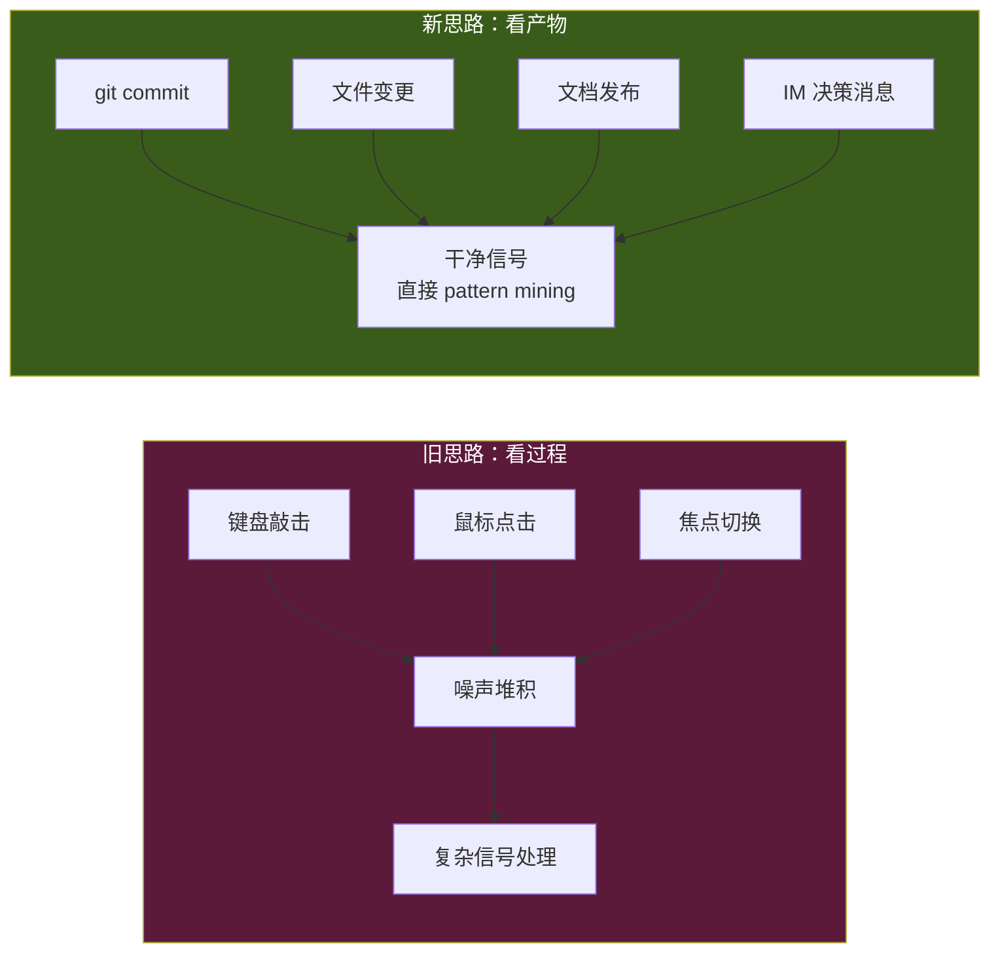
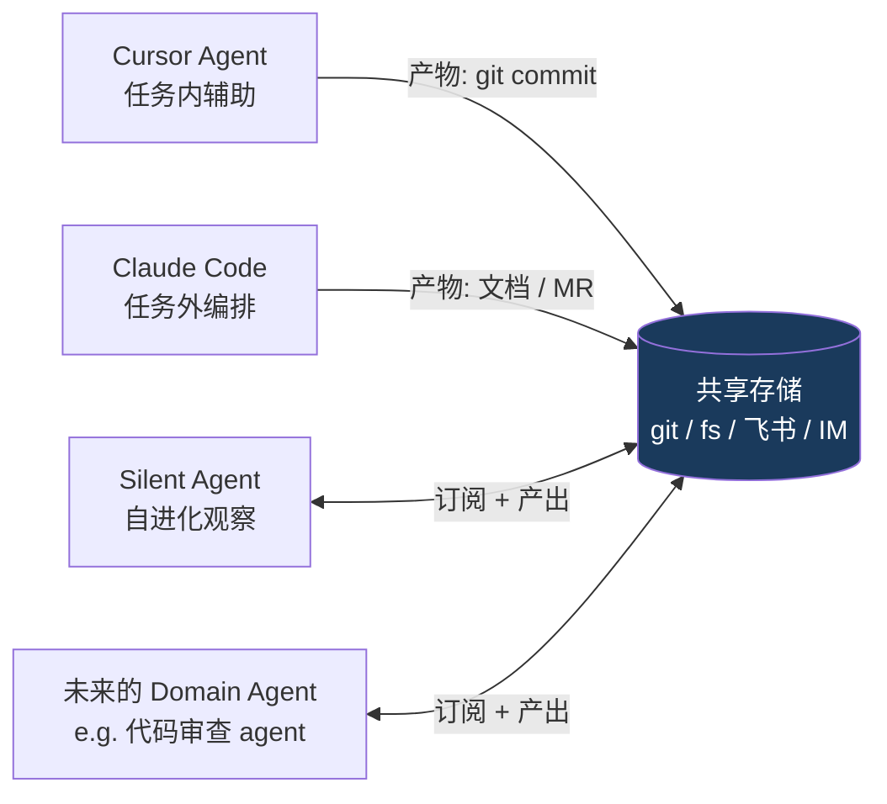

# Artifact-First Architecture：只看产物，不看过程

> 本篇沉淀自 2026-04-22 产品讨论的核心架构洞察：claw 不需要进入 IDE/Figma 等任务工具内部看用户的每一次敲击，只要观察这些工具沉淀到共享存储里的**产物**（commit、文件、文档、设计稿、消息），自进化闭环就能闭合，而且信号质量更高、架构更简单、skill 更鲁棒。**"产物"是这个产品的第一公民概念。**

## TL;DR

- **任务过程是黑盒**：IDE 里 30 次试错、Figma 里 20 次改稿、文档里 50 次撤销，claw 看不到也不该看
- **产物是白盒**：最终留在 git / 文件系统 / 飞书云盘 / 妙记 / 内部系统的结果，claw 一定能观察
- **产物足以支撑自进化**：过程是熵，产物是信号；commit 级事件做 pattern mining，信噪比比键鼠事件高一个数量级
- **skill 用产物表达**：skill 不是"步骤回放"，是"产物映射"——看到 X 产物 → 产出 Y 产物，这让 skill 对 UI 改版天然鲁棒
- **架构简化**：观察通道从"全平台 hook"收敛到"产物存储订阅"，MVP 4 条通道起步

## 核心转换



## 为什么产物级观察足够

### 1. 产物是"去噪后的决策"

开发者在 IDE 里试 10 次最后留下 1 个 commit——那个 commit 就是**去噪后的真实决策**。过程里的探索、试错、撤销都已经被用户的编辑过程过滤掉了。

agent 学产物，等于**让用户的大脑先帮我做了一遍 PCA**。

### 2. 任务工具的盲区不在产物侧

用户质疑"图层派串不起多场景"是对的。但产物视角绕过了这个问题：

| 任务工具 | 过程是否可观察 | 产物是否可观察 |
|---|---|---|
| IDE (VSCode/JetBrains) | 需装扩展，碎片化 | **git commit / 文件变更，统一** |
| Figma | 需装插件 | **export → 文件系统 / 飞书云盘** |
| 飞书文档编辑器 | API 不完整 | **飞书 OpenAPI 有 doc.content.updated 事件** |
| 终端 | 需 shell hook | **结果 = 文件/进程/CI 产物** |
| 浏览器 | 需扩展 | **大部分会落到 IM 决策或文档里** |

**所有主流任务工具的产物，都会沉到几个有限的共享存储里**——git、文件系统、云文档系统、IM 系统。订阅这几个存储的事件，比进入每个任务工具都装一个 hook 简单一个数量级。

### 3. 产物事件的信噪比

| 粒度 | 日均事件量 | 信号密度 |
|---|---|---|
| 键盘敲击 | ~30000 | 极低 |
| 鼠标点击 | ~3000 | 低 |
| 文件保存 | ~300 | 中 |
| **git commit / 文档发布** | ~10–20 | **高** |
| **MR / 文档 review 完成** | ~3–5 | **极高** |

PrefixSpan / 序列挖掘算法在噪声大的输入上几乎不 work，在 commit 序列上能跑出漂亮的 pattern。**观察粒度越粗，自进化越准**——这和"数据越多越好"的直觉相反。

## Skill 的新定义：产物映射

skill 的统一 schema：

```yaml
skill:
  name: "MR 发起后的跨系统通知"

  # 看到什么产物触发
  trigger_artifacts:
    - type: git.mr.created
      conditions:
        repo_pattern: "life.marketing.*"
        author: me

  # 相关的上下文产物（用于模板变量）
  context_artifacts:
    - type: jira.issue
      link_from: mr.description.issue_ref
    - type: feishu.group
      link_from: repo.config.notify_group

  # 应该产出什么产物
  output_artifacts:
    - type: feishu.message
      target: "{context.group.id}"
      template: "MR {trigger.title} 已发起 - 关联 {context.issue.id} - {trigger.url}"
    - type: jira.issue.comment
      target: "{context.issue.id}"
      content: "MR: {trigger.url}"

  # 验证产出成功
  verification:
    - output.feishu.message.id != null
    - output.jira.comment.id != null

  # 信任等级（对应信任梯度 L1-L4）
  trust_level: 2  # 执行前需确认
```

这个定义有三个关键特征：

1. **没有"点哪个按钮、打开哪个 tab"**——只有"看到什么、产出什么"
2. **产物类型是受控词表**——git.mr.created / feishu.message / jira.issue.comment 等，形成产物 taxonomy
3. **verification 基于产物存在性**——执行成功 = 预期产物真的出现在存储里

## 产出 contract：agent 之间的协作协议

如果整个系统都以产物为一等公民，它天然成为**多 agent 协作的协议**：



这和 UNIX 哲学（文件/管道/小工具）一致。UNIX 的产物是文本流，agent 世界的产物是结构化事件 + 文件。**MCP resources 的设计其实已经在往这个方向走**——MCP 的 resource 就是产物；MCP 的 tool 调用产出新产物。

这个判断如果成立：你的 claw 现在做的产物观察架构，就是**未来 agent 协作网络里的一个节点**。Cursor 越强，产物越规整，你的 claw 能学到的 pattern 越准——**共生关系，不是零和**。

## 观察盲区：只看产物覆盖不到的三类工作

诚实说，有三类工作没留产物：

| 类型 | 例子 | 补救 |
|---|---|---|
| **探索性调研** | 读 5 篇文档决定方向 | 浏览器扩展只记录 domain metadata；或 IM 里的决策复述 |
| **验证/测试** | 本地跑 20 次测试确认能 work | CI log / test artifact |
| **决策对话** | 聊 10 分钟决定不做 A 做 B | 妙记 action / IM 关键消息 |

解法：**看"决策的痕迹"，不看决策本身**——飞书 IM 里的"好就这么定了"、会议妙记 action、commit message 里的 "revert to approach B"，这些都是**产物级的文本决策**，不需要打破"只看产物"原则。

## 对已有笔记的修订清单

| 原笔记 | 需要改什么 |
|---|---|
| [tech-architecture.md](tech-architecture.md) | 数据采集层要从"全量事件流"改成"产物订阅"，Pattern 识别层输入改为产物序列 |
| [product-design.md](product-design.md) | skill DSL 示例要改成 artifact-map 形态 |
| [workspace-interaction.md](workspace-interaction.md) | "工作区 = 文件夹 + 内嵌浏览器"改成"工作区 = 产物存储的逻辑 scope" |
| [cloud-vs-local-agent.md](cloud-vs-local-agent.md) | MCP 能力层部分要强调 **resource = 产物**；本地/云端划分基本不变，但产物视角让云端 Act 更容易路由 |
| [mvp-plan.md](mvp-plan.md) | MVP 范围缩小：只做 P0 四条产物通道 |

## 对观察通道优先级的影响

原先 5 条观察通道，按产物优先级重排（详见 [observation-channels.md](observation-channels.md)）：

```
P0 — 产物通道（必做，MVP 直接闭环）
  1. 飞书 OpenAPI（消息 / 日历 / 文档变更 / 妙记）
  2. 代码仓 API（code.byted.org / GitHub / GitLab）
  3. 本地文件系统 watcher（工作目录）
  4. 飞书云盘 / 云文档事件

P1 — 补盲通道（看场景决定是否装）
  5. 浏览器扩展（补没 API 的内部系统）
  6. Shell / bytedcli wrapper（补命令级决策痕迹）

P2 — 过程通道（除非做实时辅助，否则不做）
  7. IDE 扩展（Copilot 模式专用）
  8. 屏幕录制 / OCR（兜底方案）
```

**MVP 阶段只上 P0 四条，一周可落地骨架。**

## 关键判断

- 过程级观察是红海（Cursor/Claude Code 在深耕），产物级观察是蓝海（没人系统做）
- 产物级 skill 对 UI 改版、工具换代、平台升级**天然鲁棒**，这是 skill 库能长期积累的前提
- 产物 contract 是未来 agent 生态的协作基础，早做早占位

## 一句话总结

> **Claw 的第一性不是"执行"，是"产物映射"——看产物、理产物、造产物。**
