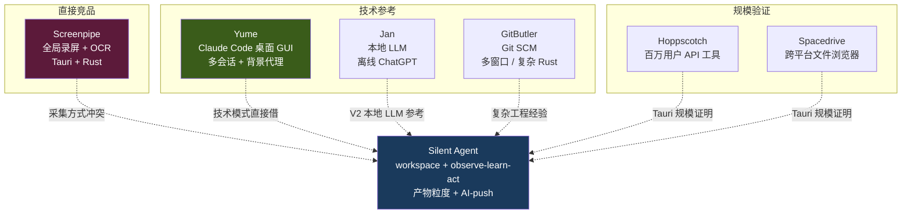

# 竞品：Tauri 生态里的相关产品深度对标

> Silent Agent 选型 Tauri 做壳后，生态里已有几个产品路径高度重叠——本篇梳理最值得深度对标的 5 个产品（Screenpipe / Yume / Jan / GitButler / Hoppscotch），以及其他值得一读的 Tauri 产品。目标是**回答三个问题：能借鉴什么、差异点在哪、是否会正面竞争**。

## TL;DR

- **Screenpipe**：最像的**竞品**——全本地观察 + AI 上下文 + Tauri；但采集走 **OCR 屏幕录制**（我们明确反对的方案）。差异在**工作区边界 + 产物粒度三通道**
- **Yume**：最直接的**技术参考**——Claude Code 桌面 GUI + 多标签会话 + 背景代理；workspace 形态和 agent 生命周期几乎是 Silent Agent 的已验证子集（深度调研见 [../../Notes/调研/yume-claude-code-gui/](../../Notes/调研/yume-claude-code-gui/)）
- **Jan**：本地 LLM 桌面 App，V2 本地模型时对标
- **GitButler**：复杂 Tauri 工程参考——多窗口 / 原生交互 / Rust 后端复杂度
- **Hoppscotch**：百万用户规模验证，证明 Tauri 能撑商业级产品
- **结论**：Tauri 不是探索性技术栈，**是成熟选择**。MVP 技术风险基本消除

## 核心对标矩阵



## Screenpipe 深度对比

### 产品形态
- 24/7 本地屏幕录制 + OCR + Accessibility API 提取文字
- 全本地存储，不上传原始数据
- 可接入 Claude / GPT 做智能分析
- 提供 REST API，可接入 Obsidian / 自定义 agent
- 开源，Tauri + Rust 实现

### 与 Silent Agent 的共同点
- 本地优先、隐私红线一致（`cloud-vs-local-agent.md` 已引用为参考）
- Tauri 技术栈
- 目标用户都是 "希望 AI 理解工作上下文" 的知识工作者

### 关键差异：采集方式

| 维度 | Screenpipe | Silent Agent |
|---|---|---|
| 采集边界 | **整台电脑全局** | **工作区边界内** |
| 采集方式 | 屏幕录制 + OCR + Accessibility | 文件 watcher + 内嵌浏览器 CDP + 终端 hook |
| 信噪比 | 低（刷抖音、看微信都录） | 高（工作区内天然相关） |
| 权限 | 屏幕录制 + 辅助功能（重） | 单个文件夹（轻） |
| 用户心理 | "它在监视我" | "我主动把东西放这里" |
| 观察粒度 | 像素 / 文本块 | 产物 / 结构化事件 |

### 我们相对 Screenpipe 的优势
- **隐私感知低**：工作区边界 = 授权边界，不像全局录屏那样"吓人"
- **信噪比高**：工作区内 100% 相关，不用做噪声过滤
- **产物粒度更利于 AI-push**：屏幕 OCR 出的是散乱文本块，工作区事件流天然结构化

### 我们可能的劣势
- **覆盖面窄**：Screenpipe 能抓到 Silent Agent 工作区外的事（用户回飞书的消息、Figma 的操作）
- **用户需要"搬入"**：Screenpipe 零配置开机就录，Silent Agent 需要用户主动 `New Workspace`

### 行动：深度对标 Tauri 工程组织
Screenpipe 是 Tauri + Rust 做 24/7 后台长跑应用的**已验证案例**。我们要看：
- Rust 侧 daemon 如何常驻（Tauri 2.x autostart plugin？）
- 事件写入性能（每秒多少事件不卡）
- 内存占用长时间不增长的经验
- macOS 系统权限申请流程（哪些弹窗，怎么降低用户恐惧）

## Yume 深度对比

> 详细调研见 [../../Notes/调研/yume-claude-code-gui/](../../Notes/调研/yume-claude-code-gui/)
>
> **调研结论颠覆预期**：Yume 是**闭源商业产品**（$29 一次性买断 99 tabs），自定义专有许可证，明确禁止 "reverse engineer / derivative works"；GitHub repo `aofp/yume` 只放 GitHub Pages 和 binary，**无任何源码**。**不能借鉴代码**，仅产品设计可参考。

### 产品形态

- Claude Code 原生桌面 GUI——把 Claude Code CLI 作为 subprocess spawn
- 多标签会话（`⌘T` / `⌘W` / `⌘D` / `⌘⇧D` fork session）
- 4 个并发 background agents，git worktree 隔离（`yume-async-{type}-{id}`）
- 3 进程架构：Tauri 2.9（Rust）+ React 19（virtualized rendering）+ Node.js server（socket.io stream）
- SQLite + WAL 做 sessions / messages / analytics 持久化

### License 限制

```
禁止：Modify / reverse engineer / decompile / disassemble
禁止：Create derivative works based on the software
源码：proprietary and confidential（不公开）
```

**对 Silent Agent 的影响**：之前设想的"MVP W1-W6 照抄 Yume pattern"**不可行**。改为"只借鉴产品设计，不碰代码实现"。

### 可借鉴的产品设计（不是代码）

| 设计点 | 借鉴度 | 备注 |
|---|---|---|
| **Background agent + git worktree 隔离** | ⭐⭐⭐⭐⭐ | 最有价值——每个 agent 任务独立 worktree + 分支，合并前冲突检测；与 Silent Agent "everything is file" 哲学完美契合 |
| **Fork session** 快捷键 | ⭐⭐⭐ | 从某点复制会话继续探索不同方向——Silent Agent workspace 可以借鉴（workspace 目录 + git branch） |
| **Virtualized rendering** | ⭐⭐⭐⭐ | 大会话历史性能必需，React 生态直接用 `react-window` |
| **SQLite WAL 持久化** | ⭐⭐⭐ | 业界标配；但 Silent Agent 的 SQLite 只做缓存（everything-is-file 要求 JSONL 为真相源） |
| **3 进程架构**（Tauri + React + Node server） | ⭐⭐ | 引入 Node.js 是为了 socket.io 的 stream 生态；Silent Agent 用 Rust reqwest + Tauri event 即可，**不需要第三进程** |

### 行动：找开源替代品做 MVP 技术参考

Yume 的技术实现不可见不可学，**MVP 照抄对象要找真正开源的 Claude Code GUI**。建议下一轮调研：

- **Claudia** (`getAsterisk/claudia`) — 传闻 MIT + Tauri + Claude Code GUI，需确认
- **Screenpipe** — 已确认开源，Tauri + Rust 做本地观察
- **GitButler** — 开源（需确认 license），Tauri 复杂工程典范

**Yume 的价值降级为"产品灵感库"——background agent + git worktree 的设计我们自己重写一份放进 V2。**

## Jan 深度对比（V2 再关注）

- **定位**：离线 ChatGPT 替代品，100% 本地运行
- **价值**：证明 Tauri 能做**本地 LLM 集成 + 重 Rust 后端**
- **当前不紧迫**：MVP 期 LLM 走 Claude API，不需要本地模型
- **V2 相关**：当 Silent Agent 考虑本地推理（隐私场景、离线场景）时，Jan 是最直接的技术参考

## GitButler 深度对比

- **定位**：新一代 Git SCM（SvelteKit + Tauri）
- **价值**：Tauri + 复杂桌面交互的标杆——证明可以做出**不像 Electron App 的原生手感**
- **学习点**：
  - SvelteKit 在 Tauri 里的集成（如果前端考虑 Svelte）
  - 多窗口管理
  - 复杂 Rust 后端组织（他们的 `gitbutler-core` 是大型 crate）
  - 键盘快捷键 / 拖放 / 原生菜单

## Hoppscotch / Spacedrive（规模验证）

### Hoppscotch
- API 测试工具，"被百万开发者信任"
- **意义**：证明 Tauri 能撑**商业级规模**
- 不需要深度对标——只需要知道 "Tauri 在大产品上可行" 这个事实

### Spacedrive
- 跨平台文件浏览器，大型融资项目（~$2M 早期轮）
- **意义**：证明 Tauri 能做**跨平台 + 复杂 UI**
- 学习点：文件索引 + 虚拟列表 + 多窗格布局（都和 Silent Agent 相关）

## 其他值得一读的 Tauri 产品（简表）

| 产品 | 类别 | 对 Silent Agent 的关联点 |
|---|---|---|
| **Cap** | 屏幕录制（Loom 替代） | Tauri 做原生媒体的参考 |
| **Shell360** | SSH/SFTP 客户端 | Tauri 做终端类应用的参考 |
| **Kunkun** | Alfred/Raycast 替代（跨平台 launcher） | V3 如果回到 launcher 形态时对标 |
| **Clash Verge Rev** | 代理工具 | Rust 重网络栈 + Tauri UI |
| **Yaak** | REST/GraphQL/gRPC 请求管理 | Tauri 2.x 标杆，多协议支持 |
| **CrabNebula DevTools** | Tauri 应用调试 | 官方出品，学习 Tauri best practices |
| **Blinko** | 自托管 AI 笔记 | AI + 笔记场景的 Tauri 实现 |
| **Oxide-Lab** | 本地 LLM 聊天 | Candle + Rust 后端 |
| **Kanri** | 离线 Kanban | 轻量 Tauri App 的简洁实现 |

## 对 Silent Agent 决策的启示

### 1. Tauri 技术风险基本消除
Screenpipe（24/7 后台）、Yume（多会话 agent）、Jan（本地 LLM）、GitButler（复杂交互）、Hoppscotch（规模）——**Silent Agent 需要的每个能力都有已验证的 Tauri 产品**。我们不是"探路者"，是"站在巨人肩膀"。

### 2. Screenpipe 是要认真对待的竞品
它在做"本地观察 + AI 上下文"的大方向，只是方法（OCR 屏幕录制）和我们（工作区内三通道）不同。**差异化叙事必须说清楚**：
- "Screenpipe 采集全局，我们采集工作区"
- "Screenpipe 靠 OCR 降噪靠算法，我们靠边界天然降噪"
- "Screenpipe 观察像素 / 文本，我们观察结构化产物"

这三句话要能站住——否则用户会问"为什么我不用 Screenpipe？"

### 3. Yume 是 MVP 的直接技术抄作业对象
等 `Notes/调研/yume-claude-code-gui/` 调研完成，MVP W1-W6 开发直接对照 Yume 源码写。尤其是：
- 多会话状态管理
- Tauri command 组织
- Claude API stream 流式渲染
- Window / 持久化模式

### 4. Tauri 2.x 是稳的
Yaak、Jan、GitButler 都用 Tauri 2.x。不用再纠结 1.x / 2.x——**直接上 2.x**。

### 5. 关键差异化仍然是"魂"
以上所有 Tauri 产品**都没有 observe-learn-act 闭环 × AI-push × skill 沉淀**。Screenpipe 有观察无 push，Yume 有 agent 无 observe，Jan 有 LLM 无 context，GitButler 只管 Git。Silent Agent 的位置仍然独特。

## 关联笔记

- [positioning-strategy-v3-workspace.md](positioning-strategy-v3-workspace.md) — v3 定位锚，本篇呼应"壳类竞品 + Tauri 生态"段
- [mvp-plan.md](mvp-plan.md) — MVP 实施路径（Tauri + xterm + WKWebView）
- [cloud-vs-local-agent.md](cloud-vs-local-agent.md) — 本地 Agent 架构（Screenpipe 已被引用）
- [competitors.md](competitors.md) — v2 时代竞品分析（待按 v3 重写）
- [../../Notes/调研/yume-claude-code-gui/](../../Notes/调研/yume-claude-code-gui/) — Yume 源码深度调研（进行中）
- [../../Notes/调研/cmux-terminal-browser/](../../Notes/调研/cmux-terminal-browser/) — cmux 调研（壳类竞品，Swift 栈）

## 参考资料

- [awesome-tauri](https://github.com/tauri-apps/awesome-tauri) — Tauri 生态官方清单
- [Screenpipe](https://github.com/mediar-ai/screenpipe) — 24/7 本地录屏 + AI
- [Yume](https://github.com/) — Claude Code 桌面 GUI（具体 repo 路径待调研 agent 确认）
- [Jan](https://github.com/janhq/jan) — 离线 ChatGPT
- [GitButler](https://github.com/gitbutlerapp/gitbutler) — Git SCM
- [Hoppscotch](https://github.com/hoppscotch/hoppscotch) — API 工具
- [Spacedrive](https://github.com/spacedriveapp/spacedrive) — 跨平台文件浏览器
- [Tauri 2.x 官方文档](https://tauri.app/) — 框架文档
