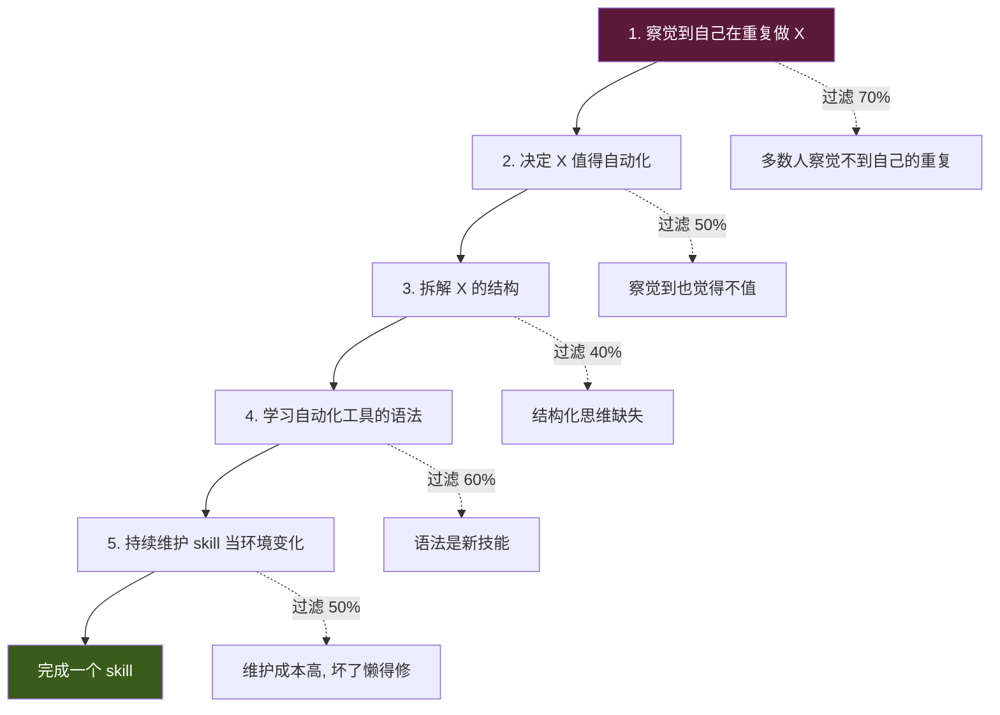
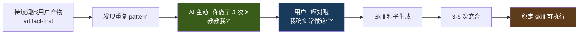
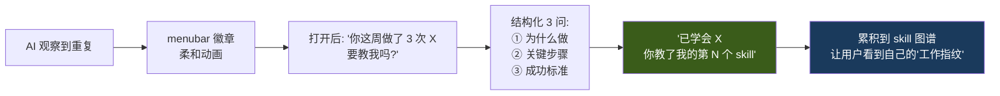

# 为什么必须是 AI-Push：用户的元认知盲区

> 本篇是 Silent Agent 最根本的洞察。[artifact-first-architecture.md](artifact-first-architecture.md) 回答 "AI 看什么"、[positioning-strategy.md](positioning-strategy.md) 回答 "AI 在哪里"，本篇回答 **"AI 和用户的根本关系"**——为什么所有"让用户主动沉淀 skill / workflow"的产品最终都死在 5% 活跃用户上，而 AI-push 是唯一的结构性突破口。

## TL;DR

- **核心洞察**：用户不知道自己在重复做什么。让用户主动沉淀 skill 的产品，最终只有 < 5% 的用户真的写过 1 个。
- **障碍本质不是"门槛高"，是"元认知盲区"**——大多数人没有观察自己行为的能力。
- **pull 范式（对话式 AI）的结构性上限 = 用户的元认知上限**，用户只能问他知道要问的事。
- **AI-push 外置了元认知**：AI 替用户看自己、发现 pattern、主动说"教教我"。
- **Silent Agent 的魂**：你不用学 AI，AI 学你。

## 核心数据：95% 用户从未写过 1 个 workflow

Alfred、Raycast、macOS Shortcuts、Zapier、IFTTT——所有"用户主动沉淀自动化"的产品都有同一组数据：

| 产品 | 真正写过 1 个 workflow 的用户比例 |
|---|---|
| Alfred workflows | ~3–5% |
| Raycast script commands | ~5–8% |
| macOS Shortcuts | ~5% |
| Zapier | ~10%（付费用户） |

即使是最优秀的工具，**95% 的用户把它当启动器用，从未进入自动化层**。

工具本身的体验不是问题——瓶颈在用户侧。

## 真正的障碍：元认知盲区

"用户主动沉淀 skill" 要求用户具备 5 个能力，每一步都过滤掉大量用户：



**第 1 步就过滤掉 70%**——这就是元认知盲区。

元认知（Metacognition）= 对自己认知和行为的察觉。它是**少数人才有**的能力，大多数人的行为是"条件反射"式的：

- 每周四下午 2 点都做某件事 → 自己察觉不到
- 收到 logid 就查 → 感觉是"随手"
- 改完代码发消息通知 → 已成肌肉记忆

**你不能期待 95% 的用户先修炼元认知再来用你的产品。**

## Pull 范式的结构性上限

所有 chatbot（ChatGPT、Claude、Cursor、Raycast AI、飞书智能助手）的交互范式是 pull：**用户发起、AI 响应**。

```
用户: "帮我查 logid X 的日志"
AI:   <查询并返回>
```

这个范式的上限是：**用户只能问他知道要问的事**。

- 不知道代码里有 bug → 不会问 "这段有 bug 吗"
- 不知道流程可以自动化 → 不会问 "这能不能自动"
- 不知道有更好做法 → 不会问 "还有啥办法"
- 不知道被重复打断多少次 → 不会问 "怎么减少打断"

**Pull 的天花板 = 用户的元认知上限。** 这是结构性的，不能靠 AI 更聪明来突破。模型再强，问不到就等于没有。

## AI-Push 的本质：外置元认知

AI-push 的核心不是"主动发消息给用户"，是**代替用户做元认知观察**：



用户不需要：

- ❌ 察觉自己在重复
- ❌ 判断是否值得自动化
- ❌ 学习自动化语法
- ❌ 主动维护 skill

用户只需要：

- ✅ 响应 AI 的提问
- ✅ 确认 / 否定 / 微调

**从"主动发起 + 学习 + 维护"5 步缩成"确认 + 反馈"2 步**。进入自动化层的用户比例有机会从 5% 提升到 30–50%。

## Skill 生命周期全部 Push 化

不只是"发现"要 push，整个 skill 生命周期每一步都应由 AI 发起：

| 环节 | 传统 pull | AI-push |
|---|---|---|
| **发现** | 用户说"存为 skill" | AI："你这周做了 3 次 X，教教我?" |
| **起草** | 用户写脚本 / 配参数 | AI 根据轨迹生成 v0.1，用户只看 |
| **调参** | 用户打开编辑器改 | AI 执行出错后问"刚才哪里不对?" |
| **触发** | 用户记得召唤 | AI 识别场景主动提议 |
| **升级** | 用户回顾重写 | AI 发现新分支问"这情况怎么处理?" |
| **废弃** | 用户想起来删 | AI 观察到 2 个月未触发，问"还留吗?" |

**用户从不需要"去做 skill 的工作"，只需要响应 AI 的提问。**

## "教我"的仪式化设计

"教" 是 Silent Agent 最重要的动作，应该有**标志性的情感事件**，不是"又一个设置项"。



设计借鉴：

- **Duolingo 连续学习 X 天** → "我从你这学了 X 个 skill"
- **宝可梦"学会新招式"** 的仪式感
- **Apple Watch 圆环合拢** 的正向强化
- **GitHub 贡献热力图** → 用户的"教学热力图"

**每次"教会一个 skill" = 一次正向情感事件**。这是产品叙事的灵魂时刻——用户感受到"它真的在学"，而不是"又一个 AI 工具"。

## 一句话定位 v3

市面所有 AI 产品和 Silent Agent 的根本差异：

| 产品 | 用户 - AI 的关系 |
|---|---|
| ChatGPT / Claude | 你教 AI 一个 prompt |
| Cursor / Copilot | 你和 AI 结对编程 |
| Raycast AI | 你召唤 AI 做事 |
| **Silent Agent** | **AI 学你，然后替你做** |

**一句话定位**：

> **你不用学 AI，AI 学你。**

## 这个洞察对其他设计决策的辐射

这一条轴解释了产品几乎所有的设计选择：

| 设计决策 | 为什么 |
|---|---|
| artifact-first 观察 | 只有看产物，AI 才能外置元认知（不打扰用户） |
| observe-suggest-act loop | 观察 = 代替元认知；suggest = AI-push；act = 确认执行 |
| menubar + ambient | 长期观察的物理前提，不能是 App |
| 不做 chatbot | chatbot 结构性是 pull，突破不了元认知上限 |
| 分层信任 + L3 强确认 | AI 学得不准的兜底，信任维护 |
| 研发垂类 | 研发的重复 pattern 最多最清晰，AI-push 最易见效 |
| "教教我" 仪式 | 把 skill 积累变成情感事件，不是负担 |
| 外部任务代办（查 logid 等）做第一批 skill | 这类最易被 AI 识别重复，见效最快 |

## AI-Push 不是白嫖的：4 个代价

AI-push 是对的方向，但换来了新的挑战：

### 1. 打断成本更高

Push 本身是打断。如果推得不准，伤害 > pull：

- pull 错了：用户自发的，容易纠正
- push 错了：用户质疑"为什么推给我这个"、"不准就别推"

**对策**：推的质量 >> 推的数量；默认安静，**确信才推**；不确信的先积累在 inbox 里。

### 2. 信任建立更慢

用户点 yes 不代表理解 AI 为什么推这个。不理解原因，同类错误会反复。

**对策**：每次 push **附带"为什么"**（"因为你这周做过 3 次 X，每次都……"）——让用户理解 AI 的推理，而不是只看结论。

### 3. "教"的 UX 比想象难

AI 说"教教我吧"——**教什么？教多少？怎么教？**用户可能不知道怎么回答。

**对策**：不是开放式"教"，是 **结构化 3 问**（背景 / 步骤 / 成功标准）。把"教"降维成"回答 3 个问题"。

### 4. 观察精度决定一切

如果 AI 识别不出真的重复 pattern，或把巧合当 pattern，整个范式崩溃。

**对策**：

- 观察粒度越粗越准（artifact-first：产物级 >> 键鼠级）
- 置信度阈值**宁高勿低**（宁可漏，不要错）
- 让用户 feedback 迭代（"这不是 pattern"一键标记）

## 反例：AI-Push 不适合什么

为了边界清晰，也要讲清不适合的场景：

| 场景 | 为什么不适合 |
|---|---|
| 创造性探索（写作、设计）| 探索无重复，push 无从起 |
| 一次性任务 | 没有"第 3 次"可推 |
| 高度变化的工作 | pattern 不稳定，skill 寿命短 |
| 社交/情感场景 | AI 学不会人际分寸 |

**Silent Agent 守住"重复性高的结构化工作"**——研发日常、文档流程、跨系统编排，这是 push 范式的甜点区。

## 关键判断

- 元认知盲区是 95% 用户不用自动化工具的**根因**，不是工具问题
- 所有 pull 范式产品的天花板都被用户元认知封死
- AI-push 是**唯一系统性突破这个天花板**的范式
- Silent Agent 的核心不是"功能"，是"关系"——AI 和用户的关系从 "用户 teach AI" 反转为 **"AI teach user about themselves"**

## 一句话总结

> **Silent Agent 不是更聪明的 AI，是会观察你的 AI。市面所有 AI 都在让你学它，只有这个在学你。**

## 关联笔记

- [artifact-first-architecture.md](artifact-first-architecture.md) — AI 看什么（学习原料）
- [positioning-strategy.md](positioning-strategy.md) — AI 在哪里（形态与入口）
- [observation-channels.md](observation-channels.md) — AI 怎么看（通道实现）
- [product-design.md](product-design.md) — 原 observe-suggest-act 设计（由本篇提供底层解释）

## 参考资料

- [2026-04-22 多轮产品讨论](../../Notes/调研/claude-code-harness/) — 本篇沉淀的来源
- 元认知理论：J.H. Flavell (1979) "Metacognition and cognitive monitoring: A new area of cognitive-developmental inquiry"
- Alfred / Raycast / Shortcuts / Zapier 用户数据：来自各自社区公开讨论
