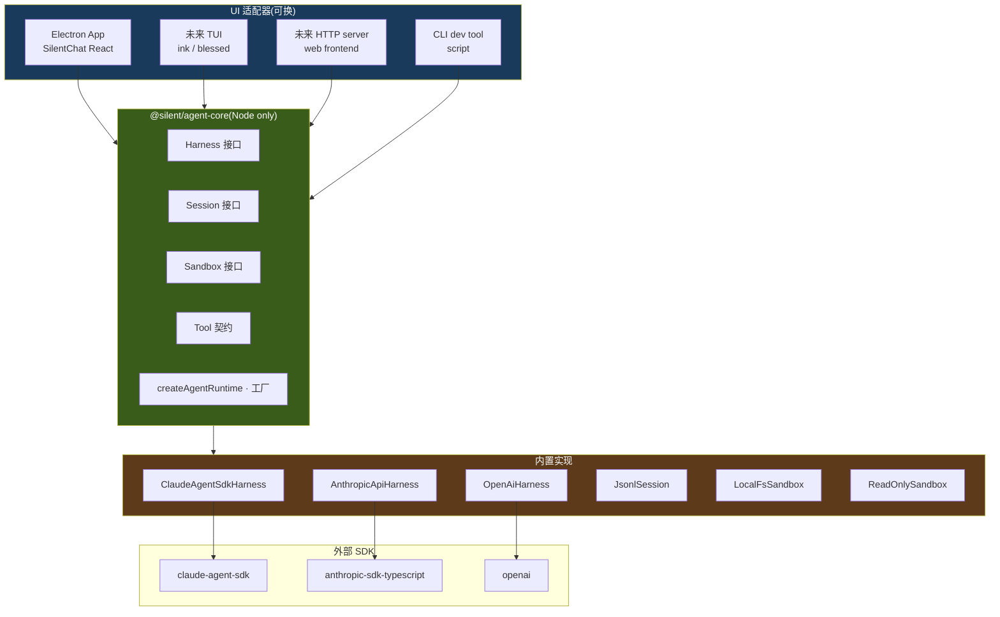

# Agent Harness 技术方案(v0.1)

> **TL;DR** — 抽出独立包 `@silent/agent-core`,Node-only / 零 Electron 依赖。三件套接口 `Harness / Session / Sandbox` 正交可换;Provider 矩阵首发 `ClaudeAgentSdkHarness`(走 Claude Code 订阅),`AnthropicApiHarness` / `OpenAiHarness` 平替。Tool 通过 Sandbox 执行,Prefix Cache 与 Compaction 由 Harness 内部封装。app(Electron)/ 未来 TUI 都只是 agent-core 的"UI 适配器"。

## 目标与约束

| 目标 | 约束 |
|---|---|
| **G1 分层**:agent-core 不依赖 Electron,只依赖 Node 标准库 + LLM SDK | 所有 `electron` / `BrowserWindow` / IPC 字符串只能出现在 app/ 下;agent-core 的 import 列表 grep 不出 `electron` |
| **G2 LLM 可插拔**:换 provider 不改业务代码 | 接口稳定 ≥ 6 个月;tool / sandbox 不感知 provider |
| **G3 Agent 可插拔**:不止换 LLM,可整体换 agent loop(eg. 复用 SDK 自带 loop · 自研 loop · 远程 managed agent) | `Harness` 抽象到 "loop 单位",而非 "single chat call" |
| **G4 H/S/S 解耦**:Harness / Session / Sandbox 三件套正交 | 三接口互不引用对方实现细节,只通过参数传入 |
| **G5 TUI ready**:未来开个 ink/blessed TUI 直接复用 agent-core | agent-core 输出**事件流**(`AsyncIterable<HarnessEvent>`),不直接渲染 |
| **G6 可观察**:harness 把 turn / tool-call / 错误 emit 到 events.jsonl | 复用现有 `appendEvent(SessionEvent)` 通道 |

**非目标**(留给 v0.2+):
- ❌ 多 agent 并行 / agent 之间 message passing
- ❌ Distributed harness(跨进程 / 跨机器)
- ❌ Streaming tool-call 取消粒度细到 token 级

## 总体分层



**关键边界**:
- `agent-core/package.json` 的 `dependencies` 里**没有** `electron` / `@electron/*`
- Electron 主进程 import agent-core 后,把它"包"成 IPC handler
- TUI 主进程 import agent-core,把它"包"成 ink 组件
- agent-core 自己**不知道**自己在哪运行

## 包结构(monorepo)

采用 **npm workspaces**,不引 lerna / turbo(单人 MVP 不需要)。

```
silent-agent/
├── package.json                # 根:{ workspaces: ["packages/*"] }
├── packages/
│   ├── agent-core/             # ★ 新增
│   │   ├── package.json        # name: "@silent/agent-core", deps: 仅 Node + 各 LLM SDK
│   │   ├── tsconfig.json       # 输出 ESM,target: node18+
│   │   └── src/
│   │       ├── index.ts        # public exports
│   │       ├── types.ts        # ChatMessage / HarnessEvent / Tool / SessionEvent
│   │       ├── harness/
│   │       │   ├── interface.ts            # Harness 接口
│   │       │   ├── claude-agent-sdk.ts     # ClaudeAgentSdkHarness
│   │       │   ├── anthropic-api.ts        # AnthropicApiHarness
│   │       │   ├── base-loop.ts            # 共享给 anthropic-api / openai 的手撸 loop
│   │       │   └── openai.ts
│   │       ├── session/
│   │       │   ├── interface.ts            # Session 接口
│   │       │   └── jsonl-session.ts        # JsonlSession(读写 messages.jsonl + events.jsonl)
│   │       ├── sandbox/
│   │       │   ├── interface.ts            # Sandbox 接口
│   │       │   ├── local-fs.ts             # LocalFsSandbox
│   │       │   └── read-only.ts            # ReadOnlySandbox(dry-run)
│   │       ├── tools/
│   │       │   ├── registry.ts
│   │       │   └── builtin/
│   │       │       ├── shell.ts            # shell.exec → sandbox.exec
│   │       │       ├── file.ts             # file.read/write → sandbox.read/write
│   │       │       └── knowledge.ts        # knowledge.lookup → 读 agent knowledge md
│   │       ├── cache/
│   │       │   └── prompt-cache.ts         # cache_control 打点策略
│   │       ├── compaction/
│   │       │   └── summarizer.ts           # 上下文压缩
│   │       └── factory.ts                  # createAgentRuntime
│   └── app/                    # 原 app/ 移过来
│       └── ...
```

**migration 成本评估**:`app/` 目录整体移动一次,根 `package.json` 加 workspace 字段,renderer/main 的 tsconfig path 调一下。约 1 小时,趁 codebase 还小做掉。

## 三大接口

### Sandbox — 执行边界

```typescript
// packages/agent-core/src/sandbox/interface.ts
export interface Sandbox {
  readonly sessionId: string
  readonly cwd: string                                  // 工作区根
  readonly env: Record<string, string>

  /** 静态权限判定,在 tool execute 前调 */
  canRead(absPath: string): boolean
  canWrite(absPath: string): boolean
  canExec(cmd: string): boolean

  /** 实际操作,内部 enforce 权限 */
  readFile(p: string): Promise<string>
  writeFile(p: string, content: string): Promise<void>
  exec(cmd: string, opts?: ExecOpts): Promise<ExecResult>
}

export interface ExecOpts {
  timeoutMs?: number        // 默认 30s
  env?: Record<string, string>
  signal?: AbortSignal
}

export interface ExecResult {
  stdout: string
  stderr: string
  exitCode: number
  durationMs: number
}
```

**默认实现 `LocalFsSandbox`**:
- `canRead/canWrite`:绝对路径必须在 `cwd` 下(防越界);可加黑名单(`.ssh`、`.aws`)
- `canExec`:MVP 全允许;v0.2 加命令黑名单
- 通过 `node:fs/promises` + `node:child_process.exec` 实现
- **不 import electron**

### Session — 身份 + 历史

```typescript
// packages/agent-core/src/session/interface.ts
export interface Session {
  readonly sessionId: string
  readonly agentId: string
  readonly workspacePath: string         // 工作区绝对路径(同 Sandbox.cwd)

  /** 读 messages.jsonl 全文(按需也可加分页) */
  loadHistory(): Promise<ChatMessage[]>
  appendMessage(msg: ChatMessage): Promise<void>

  /** session 级 events.jsonl */
  appendEvent(evt: SessionEvent): Promise<void>

  /** agent 静态资源,Phase 6 用作 system prompt + knowledge tool */
  getSystemPrompt(): Promise<string>
  listKnowledge(): Promise<KnowledgeFile[]>
}
```

**默认实现 `JsonlSession`**:
- 持有 `workspacePath`,所有路径基于 `<workspacePath>/.silent/` 派生
- 用现有 `app/src/main/storage/jsonl.ts` 的 append 工具(可移到 agent-core 共享)
- **不 import electron**

### Harness — LLM Loop 运行时

```typescript
// packages/agent-core/src/harness/interface.ts
export interface Harness {
  readonly providerName: string
  readonly modelName: string

  /** 发一条用户消息,返回事件流。生命周期:user-turn → ...tool calls... → agent-turn end */
  sendMessage(text: string): AsyncIterable<HarnessEvent>

  /** 中断当前 stream + 清理 pending tool calls */
  cancel(): void

  /** 当前 in-memory 历史(可能比 messages.jsonl 滞后,后者是真相源) */
  listMessages(): ReadonlyArray<ChatMessage>

  /** 资源释放(用于切 session) */
  dispose(): Promise<void>
}

export type HarnessEvent =
  | { type: 'turn-start';        role: 'user' | 'assistant'; ts: string }
  | { type: 'text-delta';        delta: string }
  | { type: 'tool-use-start';    callId: string; name: string; input: unknown }
  | { type: 'tool-use-result';   callId: string; result: ToolResult }
  | { type: 'turn-end';          role: 'user' | 'assistant'; stopReason: string; ts: string }
  | { type: 'error';             error: { message: string; recoverable: boolean } }
  | { type: 'cache-hit';         tokens: number; ttl: 'ephemeral' | 'extended' }   // 可观测
  | { type: 'compaction';        beforeTokens: number; afterTokens: number }
```

**为什么 `AsyncIterable` 而非 EventEmitter** —— iter 用 `for await` 消费天然支持 cancel(`break` 即停);跨进程序列化更直接(逐个 push 到 IPC channel);TUI / Web frontend 都好接。

### Tool 契约

```typescript
// packages/agent-core/src/types.ts
export interface Tool {
  name: string
  description: string
  inputSchema: JSONSchema
  runMode: 'local' | 'web'                              // web 留给 v0.2 路由到云
  execute(input: unknown, ctx: ExecContext): Promise<ToolResult>
}

export interface ExecContext {
  agentId: string
  sessionId: string
  sandbox: Sandbox
  session: Session
  signal: AbortSignal
}

export interface ToolResult {
  ok: boolean
  content: string                                       // tool_result 的文本
  meta?: Record<string, unknown>                        // 不进 LLM,进 events.jsonl
}
```

**关键约定** — Tool 内部 **不**直接 `import 'node:fs'` / `child_process`,统一走 `ctx.sandbox`。换 sandbox 时(read-only / docker / 远程 VM)tool 代码零改动。

## Provider 实现矩阵

### `ClaudeAgentSdkHarness` — Phase 6 起手

走 `@anthropic-ai/claude-agent-sdk`(`query()` 函数自带 tool loop / compaction / cache_control 管理)。

**优点**:复用 SDK loop;开箱即用 Claude Code 订阅;最少代码量。
**缺点**:loop 内部黑盒,只能通过 `canUseTool` hook 介入;若 SDK 不支持某个细粒度 cache_control 控制需要自己再绕。

```typescript
// 伪代码
class ClaudeAgentSdkHarness implements Harness {
  async *sendMessage(text: string): AsyncIterable<HarnessEvent> {
    const history = await this.session.loadHistory()
    const cachedHistory = applyCacheControl(history)             // ← cache/prompt-cache.ts

    // SDK 的 query() 内部跑 tool loop
    const stream = query({
      messages: [...cachedHistory, { role: 'user', content: text }],
      system: [{ text: this.systemPrompt, cache_control: { type: 'ephemeral' } }],
      tools: this.tools.map(toSdkToolDef),
      cwd: this.sandbox.cwd,
      canUseTool: async (toolName, input) => {
        // 我们的权限 gate
        if (!this.sandbox.canExec(...)) return { behavior: 'deny', message: '...' }
        return { behavior: 'allow', updatedInput: input }
      },
    })

    for await (const ev of stream) {
      // SDK 事件 → HarnessEvent 翻译
      const harnessEv = translateSdkEvent(ev)
      if (harnessEv.type === 'turn-end') {
        await this.session.appendMessage(buildAssistantMessage(...))
      }
      yield harnessEv
    }
  }
}
```

### `AnthropicApiHarness` — v0.2

走 `@anthropic-ai/sdk` 直 API(pay-per-token)。**自己**实现 tool loop。

```typescript
class AnthropicApiHarness extends BaseLoopHarness {
  async *runLoop(messages): AsyncIterable<HarnessEvent> {
    while (true) {
      const stream = anthropic.messages.stream({
        model: this.modelName,
        messages, system, tools: this.tools.map(toAnthropicSchema),
        // 手动打 cache_control
      })
      const { content, stopReason } = await this.consumeStream(stream)
      if (stopReason === 'end_turn') return
      // tool_use → execute via sandbox → push tool_result → 再 call
      const toolResults = await this.runToolUses(content)
      messages.push({ role: 'user', content: toolResults })
    }
  }
}
```

`base-loop.ts` 抽出 `runToolUses` / `consumeStream` 给 OpenAi / 任何 ChatCompletions 风格 provider 复用。

### `OpenAiHarness` — v0.2+

OpenAI Responses API(2025+)tool loop 与 Anthropic 风格类似,只是 `function_call` 命名不同。继承 `BaseLoopHarness`。

### Provider 矩阵

| Provider | LLM Loop | Cache 管理 | 适用 |
|---|---|---|---|
| `claude-agent-sdk` | SDK 自管 | SDK 内置(可干预) | 起手 / 走订阅 |
| `anthropic-api` | 自研 | 自管 cache_control | API key / 跨 IDE 用同一 prefix cache |
| `openai` | 自研 | OpenAI prompt cache(自动,不可干预) | 备选 / 多模型对比 |
| `ollama` | 自研 | 无 cache | 离线 / 隐私场景 |
| `managed-agent`(v0.2+) | 远程 | 远程 | 上云 |

## Prefix Cache 策略

详见 `architecture.md` 的 "Prefix Cache 策略" 节。落到 agent-core 的形态:

```typescript
// packages/agent-core/src/cache/prompt-cache.ts
/**
 * 给 messages 数组打 cache_control 标记。
 * 策略:倒数第二条 assistant 消息末尾打一个 ephemeral,作为下一轮 prefix。
 * tools / system 由调 query() 处单独打。
 */
export function applyCacheControl(messages: ChatMessage[]): ChatMessage[] {
  if (messages.length < 2) return messages
  const result = messages.map((m) => ({ ...m }))
  // 找倒数第二条 assistant
  for (let i = result.length - 2; i >= 0; i--) {
    if (result[i].role === 'assistant') {
      attachCacheControl(result[i], 'ephemeral')
      break
    }
  }
  return result
}
```

**4 个 cache_control 槽分配**:
1. `system` 末尾(constructor 时打)
2. `tools` 末尾(constructor 时打)
3. 倒数第二条 assistant(每次 sendMessage 打)
4. 留空,给 dynamic context(observation summary)

## Compaction 策略

```typescript
// packages/agent-core/src/compaction/summarizer.ts
export interface CompactionPolicy {
  threshold: number                  // 触发阈值,如 0.8(占 model context 80%)
  keepRecent: number                 // 保留最近 N 条原文
  summarize(old: ChatMessage[]): Promise<ChatMessage>  // 老的合成一条 [summary]
}
```

Harness 在 `sendMessage` 前 check token 数;触发即调用 `summarize`(可以让同 LLM 帮忙总结)。新消息序列 = `[summary, ...recentN, userTurn]`。

**不在 v0.1 实装,但接口先留** —— Phase 6 短对话不需要,Phase 7+ skill 长执行才用得到。

## Factory + 装配

```typescript
// packages/agent-core/src/factory.ts
export interface CreateAgentRuntimeOpts {
  session: Session
  sandbox: Sandbox
  harness: HarnessConfig
  tools: Tool[]
  onEvent?: (evt: HarnessEvent) => void   // 旁路监听(非消费)
  compaction?: CompactionPolicy
}

export interface HarnessConfig {
  provider: 'claude-agent-sdk' | 'anthropic-api' | 'openai' | 'ollama'
  model: string
  systemPrompt: string
  apiKey?: string                          // claude-agent-sdk 不需要(走 OAuth)
}

export function createAgentRuntime(opts: CreateAgentRuntimeOpts): Harness {
  switch (opts.harness.provider) {
    case 'claude-agent-sdk': return new ClaudeAgentSdkHarness(opts)
    case 'anthropic-api':    return new AnthropicApiHarness(opts)
    // ...
  }
}
```

## App 适配层 — Workspace 是 Session + Sandbox 的双面体

**关键认知**:agent-core 只定义 `Session` / `Sandbox` 两个接口,**不知道** "workspace" 这个词。app 的 `Workspace`(一个工作区目录)同时**充当**两者的实现方:`.silent/messages.jsonl` 兑现 Session 接口,workspace 根目录作 cwd 兑现 Sandbox 接口。

MVP 走 adapter 模式,两个 adapter 包同一个 Workspace 实例:

```typescript
// app/src/main/agent/workspace-adapter.ts
import type { Session, Sandbox, ChatMessage, WorkspaceEvent } from '@silent/agent-core'

export class WorkspaceSessionAdapter implements Session {
  constructor(private ws: Workspace) {}
  get workspacePath() { return this.ws.absPath }
  loadHistory()       { return readJsonl(this.ws.messagesPath) }
  appendMessage(m)    { return appendJsonl(this.ws.messagesPath, m) }
  appendEvent(e)      { return appendJsonl(this.ws.eventsPath, e) }
  // ...
}

export class WorkspaceSandboxAdapter implements Sandbox {
  constructor(private ws: Workspace) {}
  get cwd() { return this.ws.absPath }
  canRead(p)  { return isInside(p, this.ws.absPath) && !inBlocklist(p) }
  canWrite(p) { return isInside(p, this.ws.absPath) }
  exec(cmd, opts) { /* child_process,enforce timeout */ }
  // ...
}

// app/src/main/agent/electron-bridge.ts
import { createAgentRuntime } from '@silent/agent-core'

export class ElectronChatBridge {
  async start(agentId: string, workspaceId: string, userText: string, webContents: WebContents) {
    const ws       = await loadWorkspace(agentId, workspaceId)
    const session  = new WorkspaceSessionAdapter(ws)
    const sandbox  = new WorkspaceSandboxAdapter(ws)
    const harness  = createAgentRuntime({ session, sandbox, harness: {...}, tools: [...] })

    for await (const ev of harness.sendMessage(userText)) {
      webContents.send('chat.event', ev)              // ← 唯一的 Electron 接触点
    }
  }
}
```

**为什么用 adapter 而不是 `class Workspace implements Session, Sandbox`** —— Workspace 是 app 的核心数据模型,不应被 agent-core 接口反向耦合;接口签名变了只改 adapter。

### 现在融合 / 未来分离 —— 三件套的回报

MVP 1 个 Workspace = 1 个 Session + 1 个 Sandbox(融合)。**未来上云,这两者天然分离**:

| 维度 | MVP 本地 | 云端 v1+ |
|---|---|---|
| **Session 来源** | `WorkspaceSessionAdapter`(读本地 messages.jsonl) | `CloudSessionAdapter`(读云端 DB,跨设备同步) |
| **Sandbox 来源** | `WorkspaceSandboxAdapter`(本机 fs / child_process) | `RemoteSandbox`(Docker / Firecracker / 远程 VM,多租户隔离) |
| **装配关系** | 1 Workspace → 1 Session + 1 Sandbox(强绑定) | N:M —— 同一 Session 可换不同 Sandbox(本地 dry-run → 云端真执行);同一 Sandbox 可服务不同 Session(共享开发环境) |
| **agent-core 接口** | 不变 | 不变 ✅ |

这就是三件套从 day 1 就拆开抽象的**回报** —— 上云时 agent-core 一行代码不改,只新增两个 adapter 实现。

```
本地 MVP                            云端 v1+
┌───────────────────┐              ┌──────────────────┐
│   Workspace 实体   │              │  CloudSession    │ (DB-backed)
│  ┌───────────────┐│              │  + cache_control │
│  │WorkspaceSession││              └────────┬─────────┘
│  │  Adapter      ││                       │
│  ├───────────────┤│              ┌────────▼─────────┐
│  │WorkspaceSandbox││              │  RemoteSandbox   │ (Docker / VM)
│  │  Adapter      ││              │  + audit log     │
│  └───────────────┘│              └──────────────────┘
└───────────────────┘                  N:M 任意装配
   1 实体两面
```

### TUI 适配层未来类似

```typescript
// future: packages/tui/src/chat-screen.tsx
const ws       = await loadWorkspaceFromCwd(process.cwd())  // 找最近的 .silent/
const session  = new WorkspaceSessionAdapter(ws)
const sandbox  = new WorkspaceSandboxAdapter(ws)
const harness  = createAgentRuntime({ session, sandbox, ... })

for await (const ev of harness.sendMessage(text)) {
  render(ev)                                                // ← 渲染到 ink 组件
}
```

TUI 复用同一对 adapter(`@silent/agent-core` + `@silent/workspace-adapter`),只是 UI 层从 React 换成 ink。

## 实施路线(Phase 6 子任务)

| 子任务 | 估时 | 产出 | 验收 |
|---|---|---|---|
| **6a · monorepo 化 + agent-core 骨架** | 0.5d | npm workspace + `packages/agent-core/`,空接口 | `npm run build` 两包都过;app 能 import `@silent/agent-core` |
| **6b · Sandbox / Session 实现 + 移植 storage** | 0.5d | `LocalFsSandbox` / `JsonlSession`;现 `app/src/main/storage/jsonl.ts` 等抽到 agent-core | 单元测试:sandbox.exec 能跑命令;session 能读写 messages.jsonl |
| **6c · ClaudeAgentSdkHarness MVP** | 1d | 接 `claude-agent-sdk`,翻译 SDK event → HarnessEvent;cache_control 集成 | demo 脚本 `node packages/agent-core/scripts/chat.mjs` 能跟 Claude 聊一来一回 |
| **6d · Tool 框架 + 内置 3 件套** | 0.5d | `Tool` 注册表;`shell.exec / file.read|write / knowledge.lookup` | demo 脚本能让 agent 跑 `ls` 并返回结果 |
| **6e · Electron 接入** | 0.5d | `ElectronChatBridge` + IPC `chat.send/cancel/event`;SilentChat 流式渲染 | UI 上发"hi"能流式收到 Claude 回复;tool_use 能渲染 |
| **6f · 错误 / 取消 / 异常恢复** | 0.5d | sendMessage 异常 fallback;cancel 中断 stream | 关 session 或点 cancel,LLM stream 立即停,无 dangling tool call |

总估时 **3.5 天**(原 task.md 是 3-4 天,符合)。

## 风险与权衡

| 风险 | 缓解 |
|---|---|
| `claude-agent-sdk` API 变更打断 ClaudeAgentSdkHarness | 接口在 agent-core 稳定,impl 内部适配;有 AnthropicApiHarness 兜底 |
| 自研 base-loop 重复造轮子(对比 SDK) | base-loop 只在 anthropic-api / openai 用,SDK Harness 不走它,影响有限 |
| Sandbox 权限模型过强 / 过弱 | MVP 黑名单(`.ssh`/`.aws`)+ cwd 越界检查,够用;v0.2 再做白名单细粒度 |
| Cache_control 打错位置反而失效 | 加 `cache-hit` 事件可观测;dogfood 时看 hit rate |
| monorepo 切换的 tooling 摩擦 | 用 npm workspaces(原生),不引 turbo / lerna;tsconfig references 跑通就停 |
| TUI 真做时发现 agent-core 不够中立 | 留 open question,先按"我自己将来要写一个 ink TUI"心智写代码,不替假想用户决策 |

## Open Questions

1. **Tool 路由给 SDK 还是自己 execute?** — `claude-agent-sdk` 接受外部 tool,SDK 看到 tool_use 时会调 `canUseTool` 然后让你 execute。这个约定现在是 SDK 文档里的还是要二次确认?(Phase 6c 实做时跑通)
2. **MCP 是否在 v0.1 暴露?** — Claude Agent SDK 支持 MCP server config;暂不暴露,但接口预留 `mcpServers?: McpConfig[]` 字段
3. **多 turn 内 tool 输出超长怎么办?** — 先粗暴截断 + meta 里记原长度,Phase 7 再设计 "tool result 摘要"
4. **SystemPrompt 注入观察事件** — Phase 6 先静态;Phase 7 接入"动态 context 注入"(把最近 events.jsonl 摘要塞进 system)

## 关联文档

- [architecture.md](architecture.md) — 整体架构,本方案是其 Harness/Sandbox 节的展开
- [task.md](../task.md) — Phase 6 任务清单(本方案落 6a-6f)
- [Anthropic prompt caching](https://docs.claude.com/en/docs/build-with-claude/prompt-caching) — cache_control 官方文档
- [@anthropic-ai/claude-agent-sdk](https://github.com/anthropics/claude-agent-sdk-typescript) — Phase 6 起手 SDK
