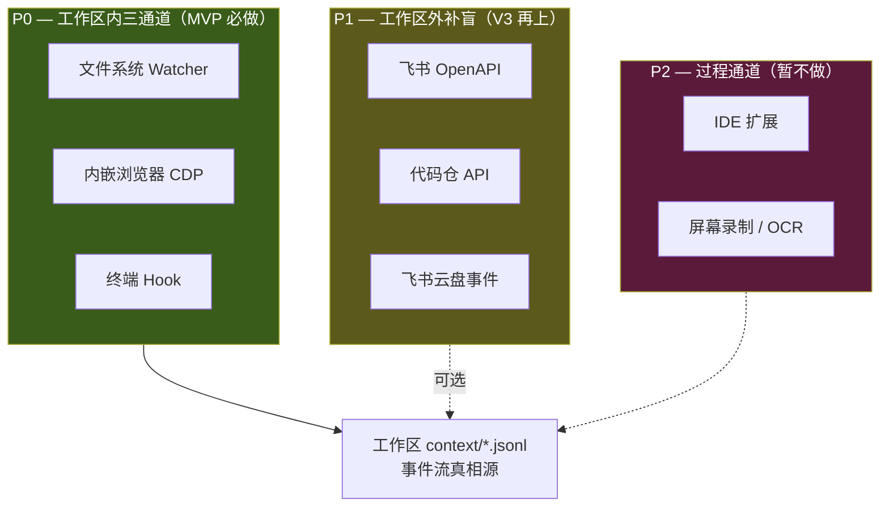

# 观察通道设计（v3）：工作区内三通道为 P0，外部 API 辅助

> **v3 调整说明**（2026-04-23）：上一版对应 v2 定位（menubar claw），把观察通道设计为"寄生在外部 surface"——飞书 API + 代码仓 API + 文件 watcher + 浏览器扩展。v3 回归工作区形态后，**观察主战场从"寄生用户各处"转为"工作区内一等公民"**：文件 watcher / 内嵌浏览器 CDP / 终端 hook 升为 P0；外部 API 通道降为 P1 作为工作区之外的辅助信号。

## TL;DR

- **三条红线不变**：不建用户要切去的目的地；元数据 > 内容；本地合并再上云
- **P0 = 工作区内三通道**：文件 watcher + 内嵌浏览器 CDP + 终端 hook
- **P1 = 工作区外补盲**：飞书 / 代码仓 / 云盘——当用户搬不进工作区的那部分数据
- **P2 = 过程通道**：IDE 扩展 / 屏幕录制，暂不做
- **MVP = P0 三通道**，6 周内在工作区内跑通 observe-learn-act 闭环

## 三条红线

1. **工作区边界 = 观察边界 = 授权边界** — 工作区目录之外不观察，内嵌浏览器以外的 Chrome 不观察，其他终端进程不观察
2. **元数据 > 内容** — 默认只抓 URL / 时间 / 动作类型 / 命令名，不抓消息 body / 文档正文 / 代码内容 / 命令参数里的敏感字符串
3. **本地合并** — 各通道事件统一落盘到 `context/*.jsonl`，只送**脱敏摘要**给云端 LLM（对应 [cloud-vs-local-agent.md](cloud-vs-local-agent.md) 的守门人原则）

## 通道分层



## P0 — 工作区内三通道（MVP 必做）

### 1. 文件系统 Watcher

**抓什么**：
- 工作区目录下所有 `create / modify / delete / move` 事件
- 只抓 `{path, size, mtime, extension}` — **不抓文件内容**
- 产出落盘 `context/files.jsonl`

**不抓什么**：
- 工作区目录之外任何路径
- 文件内容（除非用户主动查询"这个文件是啥"，临时读取且不入库）

**技术实现**：Rust 的 `notify` 库（跨 macOS/Linux/Windows），底层是 FSEvents / inotify / ReadDirectoryChangesW。

**编辑器无关**：抓文件保存事件，不关心用户用哪个编辑器——vim / micro / nano / VSCode / Cursor / JetBrains 一视同仁。Silent Agent 本身不内嵌编辑器，用户终端里 `$EDITOR` 是什么就用什么。

**陷阱**（MVP 期需 spike 验证）：
- FSEvents 合并窗口——快速多次写只收到 1 个事件，需要 debounce + mtime 比对
- 编辑器保存行为差异：vim 写 tmp 再 rename / VSCode 直接写——会收到 create+delete+rename 多个事件，需要归一化
- 大目录 recursive watch 性能——10 万文件的 repo 扫描慢，需要忽略 `.git` / `node_modules` / `target` 等

#### 子模块：二进制产物的影子文本（Office / PDF 等）

工作区里 `.docx / .pptx / .xlsx / .pdf` 等**二进制产物**会破坏 everything-is-file 哲学——能 commit 不能 diff、LLM 也读不了。解法：watcher 检测到这类文件变更时，**自动产出影子文本副本**，原文件留给用户用 Office/Acrobat 编辑：

```
研究报告.docx        ← 用户原文件（Office 编辑）
研究报告.shadow.md   ← watcher 自动生成（git diff + LLM 学习用）
```

```yaml
office_to_shadow:
  enabled: true
  rules:
    - patterns: ["*.docx", "*.odt"]
      converter: pandoc
      shadow_ext: ".shadow.md"
    - patterns: ["*.xlsx", "*.ods"]
      converter: xlsx2csv
      shadow_ext: ".shadow.csv"
    - patterns: ["*.pptx"]
      converter: pandoc
      shadow_ext: ".shadow.md"
    - patterns: ["*.pdf"]
      converter: pdftotext
      shadow_ext: ".shadow.txt"
  shadow_in_git: true     # 影子文本进 git，原文件可选择走 LFS
  shadow_in_jsonl: true   # 文件变更事件里带上 shadow_path
```

工作区初始化时同步写入 `.gitattributes`：

```
*.docx diff=pandoc
*.xlsx diff=xlsx
*.pptx diff=pandoc
*.pdf  diff=pdf
```

这样**所有产物（纯文本 + 二进制）都能进入 observe-learn-act 闭环**，不破坏 everything-is-file。

老 Office 格式（`.doc / .ppt / .xls` 二进制 CFBF）pandoc 处理不了，建议在工作区入口拒收或自动转新格式。

### 2. 内嵌浏览器（WKWebView + JS 注入）

> **MVP = macOS only**：Tauri WebView 在 macOS 下是 WKWebView，**不走 CDP**，改走"WKNavigationDelegate + JS 注入"路径——cmux 已验证这条路径够用。跨平台（Windows WebView2 可选 CDP / Linux WebKitGTK 需单独适配）推 V3。

**抓什么**（observe）：
- **导航事件**（`WKNavigationDelegate.didFinishNavigation`）→ URL / title / domain
- **Network 请求**（JS 注入 patching `window.fetch` / `XMLHttpRequest`）→ `{method, url, status, domain}`（脱敏后）
- **用户交互**（注入 `addEventListener('click'/'input'/'submit')`）→ 元素 role / selector / 位置（不抓输入内容）
- **标签 / 停留**（`visibilitychange` event）→ active 时长、滚动深度
- 产出落盘 `context/browser.jsonl`

**同时具备 act 能力**（V2 agent 自动化浏览器时直接用）：
- 导航：`WKWebView.load(URLRequest)`
- 点击 / 填表 / 选择：`evaluateJavaScript()` + Playwright 风格定位器（借鉴 cmux agent-browser 移植模式的 49 个 verb spec）
- 截图 / PDF：`takeSnapshot(with:)` / `createPDF(...)`
- DOM snapshot：`evaluateJavaScript` 抽 role/name/value/position
- Cookie / localStorage：`WKHTTPCookieStore` + `evaluateJavaScript`

**不抓什么**：
- 页面正文、表单输入内容
- API 的 request body / response body
- 用户的外部 Chrome（只管内嵌的）
- Cookie / Token / Authorization header（必须脱敏）

**技术实现**：
- Tauri 2.x 注册 `WKNavigationDelegate`（macOS 下通过 Tauri plugin 访问原生 WebView）
- 启动时注入全局 JS 对象 `__silent_browser__`，包含 fetch/XHR patcher 和 event listener
- 事件通过 Tauri `emit` 推到 Rust 侧 → 写入 `context/browser.jsonl`
- **不支持的能力**（WKWebView 限制）：request interception / route mocking / video record / trace——MVP 不需要

**Context 隔离**：每个 workspace 独立 `WKWebsiteDataStore(forIdentifier:)`（macOS 14+）——cookie / localStorage 互不串扰，对应 Playwright 的 `browserContext` 概念

### 3. 终端 Hook

**抓什么**：
- zsh preexec hook → `{命令名, cwd, 时间}`
- 命令退出 → `{exit_code, 耗时}`
- 产出落盘 `context/shell.jsonl`

**不抓什么**：
- 命令参数里的敏感字符串（token、密码、私有 URL）——用 glob pattern 白名单匹配后过滤
- 命令的 stdout/stderr 内容（默认不抓；用户可选开启"抓某条命令的输出"作为 skill 一部分）

**技术实现**：内嵌 xterm + portable-pty，包装的 shell（zsh/bash）注入 preexec hook，或在 pty 层解析 prompt 分隔标记来切分命令。

## P1 — 工作区外补盲（V3 再上）

当用户的任务部分数据搬不进工作区（会议在日历、别人的 PR 在 GitHub、文档正在飞书多人协作），这些外部通道作为补盲：

### 4. 飞书 OpenAPI

**抓什么**：
- 消息：`{time, chat_id, sender, 是否@我, 是否未读}` — 不抓正文
- 日程：`{time, title, 参会人, 确认状态}`
- 文档变更：`{doc_id, title, 修改时间, 我是否参与}`
- 任务：`{state, assignee, due}`

**技术复用**：已有 lark-cli / lark-im / lark-doc / lark-calendar skill，直接封装。

### 5. 代码仓 API（code.byted.org / GitHub / GitLab）

**抓什么**：
- commit / MR / PR 元数据（不抓 diff）
- review verdict（不抓 comment 正文）
- CI 状态

**技术实现**：code.byted.org 走 OpenAPI（bytedcli 已封装）；GitHub 走 REST + webhook。

### 6. 飞书云盘事件

**抓什么**：
- 文件创建 / 修改 / 删除事件
- 文档评论 / @ 提及
- 文档 permission 变更

**技术实现**：飞书 OpenAPI drive webhook + event subscription。

## P2 — 过程通道（暂不做）

### 7. IDE 扩展

**什么时候做**：需要"实时辅助"场景时（类似 Copilot）。但这块已被 Cursor / Claude Code 占据，**除非自己做 IDE AI，否则别碰**。

### 8. 屏幕录制 / OCR

**为什么不做**：
- 权限重（用户心理负担）
- 噪声极大（信噪比极低）
- 工作区内三通道已覆盖 80% 研发工作
- **Rewind / Limitless 的教训**：全屏采集引来的隐私争议不值得

## 事件统一 schema（everything is file）

各通道事件写入 JSONL，字段统一：

```json
{"ts":"2026-04-23T10:32:05Z","source":"file","action":"modify","target":"./notes.md","meta":{"size":4321,"ext":"md"},"session_id":"sess_abc"}
{"ts":"2026-04-23T10:32:10Z","source":"browser","action":"navigate","target":"https://screenpipe.com/pricing","meta":{"domain":"screenpipe.com"},"session_id":"sess_abc"}
{"ts":"2026-04-23T10:32:30Z","source":"shell","action":"exec","target":"git commit","meta":{"cwd":"~/Workspaces/research","exit":0},"session_id":"sess_abc"}
```

**session_id 切分**：由工作区管理器统一分配——时间间隔 > 5 min、切换工作区、或用户显式声明新任务都开新 session。

## 隐私架构

```
🔴 原始内容（消息 body / 文档正文 / 代码 diff / 命令输出）  → 永远不离开设备
🟡 脱敏摘要（"用户在工作区里整理了竞品笔记"）              → 可送云端 LLM 做推理
🟢 产物元数据（文件路径 / URL 域名 / 命令名）              → 可存工作区 context/，可 git 追踪
🔵 Skill 定义（observe-learn-act schema）                  → 跨设备同步（云端 Sidecar）
```

与 [cloud-vs-local-agent.md](cloud-vs-local-agent.md#memory-分层同步策略) 的 L1–L4 Memory 分层一致。

## MVP 实施顺序（6 周）

| 周 | 做什么 | 产出验证 |
|---|---|---|
| W1 | Tauri 壳 + 工作区目录 + 文件 watcher 通道 | `context/files.jsonl` 实时更新 |
| W2 | xterm 终端 + preexec hook + `context/shell.jsonl` | 命令级记录完整且敏感参数脱敏 |
| W3 | 内嵌浏览器 + CDP Network/Page + `context/browser.jsonl` | URL 和请求脱敏记录 |
| W4 | Session 切分 + 事件聚合视图 | 侧栏显示当前 session "看到了什么" |
| W5 | LLM 摘要 + 基础 pattern 检测 | 每日关闭工作区时生成 summary |
| W6 | dogfood + 调 noise + 首次 "教教我" 仪式 | 自用一周，1 次真实 "啊对哦" |

P1 外部 API 通道推到 V3，MVP 不做。

## 与已有笔记的关系

- 本篇替代 v2 的通道分层——P0 从外部 API 改为工作区内三通道
- 本篇细化 [workspace-interaction.md](workspace-interaction.md) 的"文件层 / 浏览器层 / API 抓包层"为通道技术规格
- 本篇呼应 [positioning-strategy-v3-workspace.md](positioning-strategy-v3-workspace.md) 的"观察空间"定义

## 关联笔记

- [positioning-strategy-v3-workspace.md](positioning-strategy-v3-workspace.md) — v3 定位锚
- [workspace-interaction.md](workspace-interaction.md) — 工作区交互设计
- [artifact-first-architecture.md](artifact-first-architecture.md) — 为什么用产物视角
- [cloud-vs-local-agent.md](cloud-vs-local-agent.md) — 本地 vs 云端架构
- [mvp-plan.md](mvp-plan.md) — 基于本篇 P0 的 6 周实施路径

## 参考资料

- [Chrome DevTools Protocol](https://chromedevtools.github.io/devtools-protocol/) — CDP 官方文档
- [Rust notify crate](https://docs.rs/notify/) — 跨平台文件监听
- [zsh preexec hook](https://zsh.sourceforge.io/Doc/Release/Functions.html) — shell 命令捕获
- [Cloud Agent Workspace 调研](../../Notes/调研/cloud-agent-workspace/) — sandbox / workspace 技术栈参考
