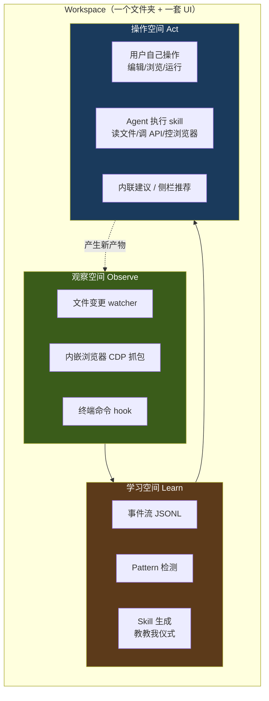
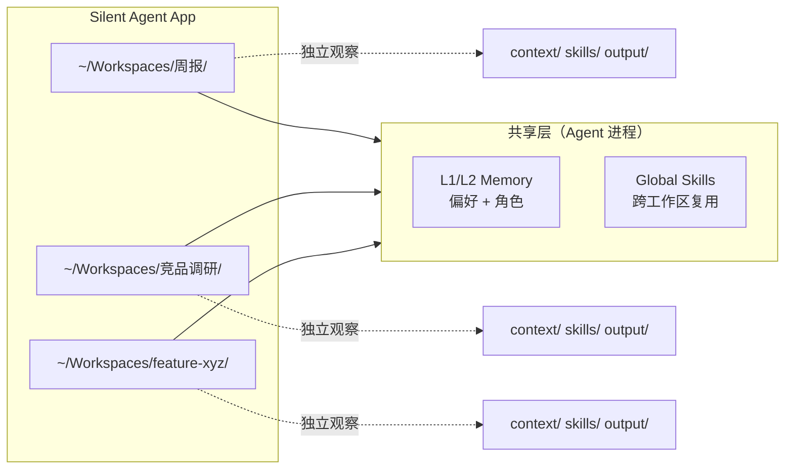
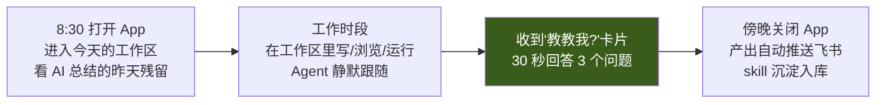

# 产品定位 v3：轻工作区，产物为核心

> 本篇是 Silent Agent 的第三版定位，沉淀自 2026-04-23 讨论。从 v2（menubar claw + 首尾编排）回归到 v0 的工作区方向，但选择**中接管**形态——轻量工作区不替代专业工具，只提供 **observe / learn / act** 三种空间。哲学是 **"everything is file"**——所有事件、状态、产物、skill 都落盘为文件。

## TL;DR

- **形态选择**：轻工作区（不是 menubar，不是目的地，介于两者之间）
- **接管程度**：中接管——用户当期任务搬进来做，专业工作仍回 IDE/Figma
- **核心哲学**：产物为核心 + everything is file
- **三大空间**：观察（observe）、学习（learn）、操作（act）
- **与专业工具的关系**：吸收**过程和产物**，不替代**最终交付**
- **相比 v2 的变化**：重新承认"工作区才是 AI-push 的最佳观察窗口"，menubar 覆盖不了产物粒度

## 定位声明（v3）

> Silent Agent 是一个**轻量级任务工作区**——
> 为 Agent 提供**观察**你的产物、**学习**你的 pattern、**操作**你的文件/网页/命令三种空间。
> 当期任务搬进来，Agent 静默跟随；
> 产出推回飞书 / GitHub / Figma，skill 留下来继续成长。
> Everything is file——所有状态、事件、产物都可 diff、可 rewind、可 git。

## 为什么翻回工作区派（相比 v2 的反思）

v2 把工作区路线判死刑，理由是 Coze 目的地派的三重失败（数据重力 / 产出归属 / 工具重力）。**中接管 + 轻工作区**对这三个问题有新答案：

| v2 的否定理由 | v3 的新答案 |
|---|---|
| **数据重力** — 数据都在 Figma/飞书/GitLab | 工作区不强求迁入全量，**只拉当期任务需要的那一小部分**（某个 repo、某份文档、某个 Figma 文件）——寄生式取数 |
| **产出归属** — 交付物必须回到飞书/GitHub | 工作区**只接管过程**，终态产出推回外部系统。工作区保留过程事件和 skill 沉淀 |
| **工具重力** — 专业工具 10 年 UX 赢不了 | 内嵌工具定位是**"够用，不专业"**——Monaco 够写 Markdown/YAML，不跟 IDE 比；内嵌浏览器够调研，不跟 Chrome 比；xterm 够跑 script，不跟 iTerm 比 |

同时 v2 的两个最大问题在 v3 里被解决：

| v2 的短板 | v3 的解法 |
|---|---|
| **Menubar 观察不到产物** — 只能观察外部通道的元数据（commit 时间、文档 ID） | 工作区内直接看到文件变更、浏览器 URL、终端命令，**产物粒度的第一手观察** |
| **⌘-Panel 召唤编排对 AI-push 不利** — 用户必须主动召唤，push 路径弱 | 工作区打开 = 隐式授权观察，AI-push 有物理位置落地（内联建议 / 侧栏 / 通知） |

## 三大空间：observe / learn / act

工作区不是"功能集合"，而是**为 AI-push 闭环服务的三类空间**：



### 观察空间（Observe）

- **文件 watcher**：工作区目录下所有 `create/modify/delete` 事件
- **内嵌浏览器 CDP**：URL 导航、Network 请求、页面 DOM 事件
- **终端 hook**：命令、cwd、exit code（不抓参数内敏感内容）
- 所有事件统一 schema → 落盘为 `context/*.jsonl`

核心边界：**不观察工作区之外**。用户的私人 Chrome、其他文件夹、系统剪贴板一概不碰。工作区边界 = 观察边界 = 授权边界。

### 学习空间（Learn）

- 事件流 → Pattern 检测（MVP 期直接 LLM 摘要，后期补 sequence mining）
- 发现重复 → **"教教我"仪式**（`core-insight-ai-push.md` 的结构化 3 问）
- 生成 skill → 落盘为 `skills/*.yaml`，用户可看可改可删
- 跨工作区的 skill 同步到云端 Sidecar（`cloud-vs-local-agent.md` L1/L2 memory）

### 操作空间（Act）

- **用户自己操作**：Monaco 编辑 / WebView 浏览 / xterm 运行
- **Agent 执行**：按 `cloud-vs-local-agent.md` 的 Act 路由，能走 Web API 就走云端，必须本地才本地
- **内联建议**：Agent 不抢窗口，在用户正在看的 pane 里浮卡片

## Everything is File

工作区的每一个东西都是文件。不是"为了展示"是文件，是**真的只存文件**：

```
~/Workspaces/竞品调研/
├── .workspace.yaml              # 工作区配置
├── context/                     # 观察空间产出
│   ├── files.jsonl              # 文件事件
│   ├── browser.jsonl            # CDP 事件
│   ├── shell.jsonl              # 终端事件
│   └── session-{id}.jsonl       # 按 session 切分
├── skills/                      # 学习空间产出
│   ├── weekly-report.yaml
│   └── figma-to-feishu.yaml
├── state/                       # Agent 运行态
│   ├── memory.jsonl             # L3/L4 本地 memory
│   └── pending-suggestions.jsonl
├── output/                      # 交付产出（最终推回外部）
│   └── 2026-W17-report.md
└── <用户自己放的任何文件>
    ├── notes.md
    ├── data.csv
    └── screenshots/
```

这带来的性质：

| 性质 | 说明 |
|---|---|
| **Git-friendly** | 工作区可以直接 `git init`，事件历史和 skill 全进版本控制 |
| **Rewindable** | 想看三天前 agent 在学什么？ `git log context/` |
| **Debuggable** | Agent 行为异常？直接读 JSONL，不用进数据库 |
| **Portable** | 换电脑、备份、给同事看，都是拷贝文件夹 |
| **Scriptable** | 用 grep/jq/sed 就能分析事件流，不用自己写 SDK |
| **AI-readable** | 下一个版本的 Agent 读同样的文件就能接手 |

这个哲学和 Claude Code 的 `~/.claude/projects/` 一致，和 Unix 工具链一致，和 `artifact-first-architecture.md` 的产物视角一致。

**约束**：性能敏感的索引（pattern 检测的倒排、embedding）可以用 SQLite/DuckDB 作为**缓存**，但**源数据永远是文件**——缓存删了能从文件重建。

## 工作区的边界与多工作区

用户同时会有多个任务，每个任务一个工作区：



- **每个工作区独立隔离**：观察 / skill / memory 默认不跨工作区串
- **共享层**：L1/L2 Memory（用户偏好、角色）和通用 skill（如"搜索飞书文档"）跨工作区复用
- **默认行为**：新任务 = 新工作区；Agent 在切换工作区时切换上下文

## 竞品对标（v3 新版）

v2 时对标 Raycast/OpenClaw，v3 对标换成：

| 产品 | 形态 | Silent Agent 差异 |
|---|---|---|
| **Cursor** | IDE + AI | Cursor 只管代码；我们管任务级的跨 surface 工作（代码/文档/调研） |
| **Obsidian** | 文件夹 + 插件 | Obsidian 只管 Markdown 笔记；我们有内嵌浏览器/终端 + AI-push |
| **Notion AI** | 云端文档 + AI | Notion 数据上云；我们本地优先 + 产物 git-friendly |
| **Claude Code** | CLI + project dir | Claude Code 是命令行；我们是图形化工作区 + 内嵌三件套 |
| **Replit Agent** | 云端 IDE + Agent | Replit 只管代码 sandbox；我们管真实工作产物 |
| **Coze Studio** | 云端 agent 构建 | Coze 用户要迁入；我们寄生用户当期任务 |
| **Rewind / Screenpipe** | 全局录屏 | 它们无边界，噪声大；我们工作区边界 = 观察边界 |

### 壳类竞品（不是直接对手，但形态参考价值极高）

| 产品 | 形态 | 与 Silent Agent 的关系 |
|---|---|---|
| **cmux** | macOS 原生终端 App（Swift + AppKit + libghostty + 内嵌浏览器 + 垂直标签页 + 分屏 + 可编程 API，GPL-3.0-or-later） | **壳做得比我们好**；但只做壳，不做 observe-learn-act——我们正好接管它不做的"魂"。其 **agent-browser 49 verb API + Playwright 风格 locator + `WKWebsiteDataStore` 级 context 隔离 + 浏览器导入 + v1/v2 协议双轨** 是可借鉴的 spec（**不 fork 代码，GPL 传染**） |
| **Warp** | AI-native 终端 | 命令级 AI 建议，但没有跨命令的 pattern 沉淀和 skill 生成 |
| **Wave Terminal** | 开源 AI 终端 + 多 pane | 偏基础设施，无产品观点 |
| **Ghostty** | 原生 GPU 终端 | 纯终端体验标杆，不带 AI |

这些是"agent-ready 终端"类目，**壳的体验它们做得比我们好（尤其 cmux 的原生 Swift）**。Silent Agent 的差异在**魂**——observe-learn-act 层 × AI-push × skill 沉淀。**不要陷入"做更好的终端"的竞争**，壳做到"够用"即可，精力全在魂。

### Tauri 生态里的参考对标（详见 [competitors-tauri-ecosystem.md](competitors-tauri-ecosystem.md)）

Tauri 2.x 已投产的桌面 App 生态里，和 Silent Agent 路径高度重叠的参考：

| 产品 | 定位 | 对 Silent Agent 的价值 |
|---|---|---|
| **Screenpipe** | 24/7 本地屏幕录制 + AI 上下文 | **最像的竞品**——全本地观察 + Tauri；但采集走 OCR（我们明确反对），差异在工作区边界 + 产物粒度三通道 |
| **Yume** | Claude Code 原生桌面 GUI + 多标签会话 + 背景代理 | **最直接的技术参考**——workspace 形态和 agent 生命周期几乎是我们的已验证子集 |
| **Jan** | 离线本地 ChatGPT 替代 | V2 本地 LLM 时对标 |
| **GitButler** | 新一代 Git SCM（SvelteKit） | 复杂 Tauri 工程参考（多窗口 + 原生交互） |
| **Hoppscotch** | API 测试工具，百万用户 | 规模验证，证明 Tauri 能撑大产品 |

结论：Tauri 不是探索性技术栈，**是成熟选择**。Silent Agent 的 MVP 技术风险基本消除，剩下的是 observe-learn-act 的魂的设计挑战。

护城河：**工作区内的 full-artifact 观察 × AI-push × skill 沉淀**——这三件事没有任何一家同时做。cmux 等壳类产品有壳无魂，Screenpipe 有观察无边界，是最明显的空白。

## 一天的产品接触点（v3）



与 v2 的不同：
- v2 期望用户**全天召唤**（menubar ⌘-Panel），对肌肉记忆要求高
- v3 期望用户**进入工作区后就待在里面一段时间**（30 min – 2 h），类似进入"专注模式"——对标 Cursor / Notion 的使用模式，不是 Raycast

## 成功的 4 个必须条件（v3）

### 1. 轻——打开 < 1 秒，内存 < 100 MB

对手是用户的"嫌麻烦"。Electron 250 MB 起步会输，cmux 这类原生 Swift 壳能压到 50 MB 以下。**Tauri 最小壳**（砍编辑器，只保留终端 + 浏览器 + AI 侧栏）是硬指标。

### 2. 内嵌工具"够用"即可，不追求专业

- **不内嵌编辑器**——用户在终端里 `micro notes.md` / `code notes.md` / `vim` 自便，file watcher 统一抓保存事件
- 内嵌浏览器够调研、看文档、填表单，**不替代 Chrome 日常使用**
- xterm 终端够跑 script、看日志，**不替代 iTerm**

编辑器不做是关键决定——研发用户肌肉记忆就是 vim/VSCode，硬塞一个 Monaco 体验一定输。cmux / Warp / Wave 都验证了这个共识：agent 时代的终端 App 不需要内嵌编辑器。

### 3. 观察-学习-操作闭环要跑完

只做观察没有 push = 变成 Screenpipe（噪声仓库）
只做学习没有操作 = skill 躺在文件里不执行
只做操作没有观察 = 变成 Cursor（没有 AI-push）

**三者缺一个，这个产品就没意义**。

### 4. Everything is file 不能食言

一旦用私有数据库存事件或 skill，用户失去可审计性和可搬运性，信任崩。SQLite 只能做**缓存**，不能做**真相源**。

## 风险与校准

### 风险 A：内嵌三件套工程量爆炸

Tauri + Monaco + xterm.js + WebView 的集成和维护成本不低，尤其跨平台。

**应对**：
- MVP 只做 macOS，Linux/Windows 推到 V2
- 内嵌浏览器只支持基本 CDP 事件，不做高级 devtools
- Monaco 只配最小 language server，不做智能补全（那是 IDE 的事）

### 风险 B：用户不愿把工作"搬进来"

v2 抛弃工作区的核心理由。即使是轻接管，用户可能还是"懒得切"。

**应对**：
- **降低搬入成本**：工作区本质是文件夹，拖入 = 授权
- **提供第一周的 quick win**：内嵌浏览器的"所有标签页一键存为笔记"、文件变更的自动时间线——让用户看到 AI-push 能做的事，再谈搬入其他任务
- **可逆**：从工作区搬出去还是普通文件夹，没有 lock-in

### 风险 C：AI-push 精度不够导致用户关闭

工作区打开 = 观察开始，如果 push 不准用户会直接关 App。

**应对**（同 `core-insight-ai-push.md` 的 4 个代价）：
- 推的质量 >> 数量
- 每条 push 带"为什么"
- 结构化 3 问而非开放式"教"
- 置信度宁高勿低

### 风险 D：与 Claude Code / Cursor 边界模糊

Claude Code 也是"文件夹+agent+CLI"，Cursor 是"IDE+agent"。都可以扩展出类似工作区形态。

**应对**：
- **差异化在 observe**——Claude Code / Cursor 都是 pull 范式（用户发指令），Silent Agent 是 push（从产物主动学）
- **差异化在非代码场景**——Cursor 锁死 IDE，Silent Agent 覆盖调研、文档、数据分析、跨系统任务
- 但要认：如果 Anthropic / Cursor 明天加了 push 和浏览器，**差异化会消失**——所以 skill 积累的护城河要尽快建起来

## 与已有笔记的关系

v3 对现有笔记的影响矩阵：

| 笔记 | v3 对它的影响 |
|---|---|
| `_Index.md` | **重写** — 核心原则和文档顺序按 v3 调整 |
| `positioning-strategy.md`（v2） | **保留作为历史** — 不删，加标注"已被 v3 取代，保留决策轨迹" |
| `workspace-interaction.md`（v0） | **翻回主方案** — 头部加 TL;DR 说明从 v2 回归 + 按 v3 对齐 |
| `mvp-plan.md` | **重写** — 基于工作区形态的 MVP，不再是浏览器扩展 |
| `observation-channels.md` | **局部调整** — P0 改为"工作区内三通道"，外部 API 通道降为 P1 |
| `tech-architecture.md` | **局部调整** — 采集层和执行层按 v3 重画 |
| `core-insight-ai-push.md` | **不动** — AI-push 魂在工作区形态下更易实现 |
| `artifact-first-architecture.md` | **不动** — 产物视角是 v3 的底层哲学 |
| `cloud-vs-local-agent.md` | **不动** — 本地 Agent + 云端 Sidecar 架构仍成立 |
| `competitors.md` | **重写** — 对标对象换为 Cursor/Obsidian/Notion/Claude Code/Replit |

## 定位演化轨迹

| 版本 | 定位 | 被否定的原因 |
|---|---|---|
| v0 | 工作区（目的地派，重接管） | Coze 三重失败 |
| v1 | 不抢时间的图层 | 太保守，放弃观察产物的护城河 |
| v2 | menubar claw + 首尾 + 编排 | 观察不到产物粒度，AI-push 没有落地位置 |
| **v3（本篇）** | **轻工作区 + 产物为核心 + observe/learn/act** | **当前最优** |

## 关联笔记

- [core-insight-ai-push.md](core-insight-ai-push.md) — 为什么必须 AI-push（产品之魂）
- [artifact-first-architecture.md](artifact-first-architecture.md) — 产物视角（底层哲学）
- [workspace-interaction.md](workspace-interaction.md) — 工作区的具体交互设计（v3 翻回主方案）
- [observation-channels.md](observation-channels.md) — 观察通道分层（v3 调整 P0/P1）
- [mvp-plan.md](mvp-plan.md) — MVP 实施路径（按 v3 重写）
- [cloud-vs-local-agent.md](cloud-vs-local-agent.md) — 本地 / 云端职责划分
- [positioning-strategy.md](positioning-strategy.md) — v2 定位（历史决策，已被本篇取代）

## 参考资料

- [2026-04-22 v2 定位讨论](../../Notes/调研/claude-code-harness/) — v2 的沉淀来源
- [2026-04-23 v3 回归讨论] — 本篇沉淀来源（本次对话）
- [Claude Code harness 解剖](../../Notes/调研/claude-code-harness/) — "everything is file" 哲学的参考
- [Cloud Agent Workspace 调研](../../Notes/调研/cloud-agent-workspace/) — sandbox / workspace 技术栈
