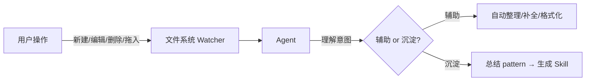
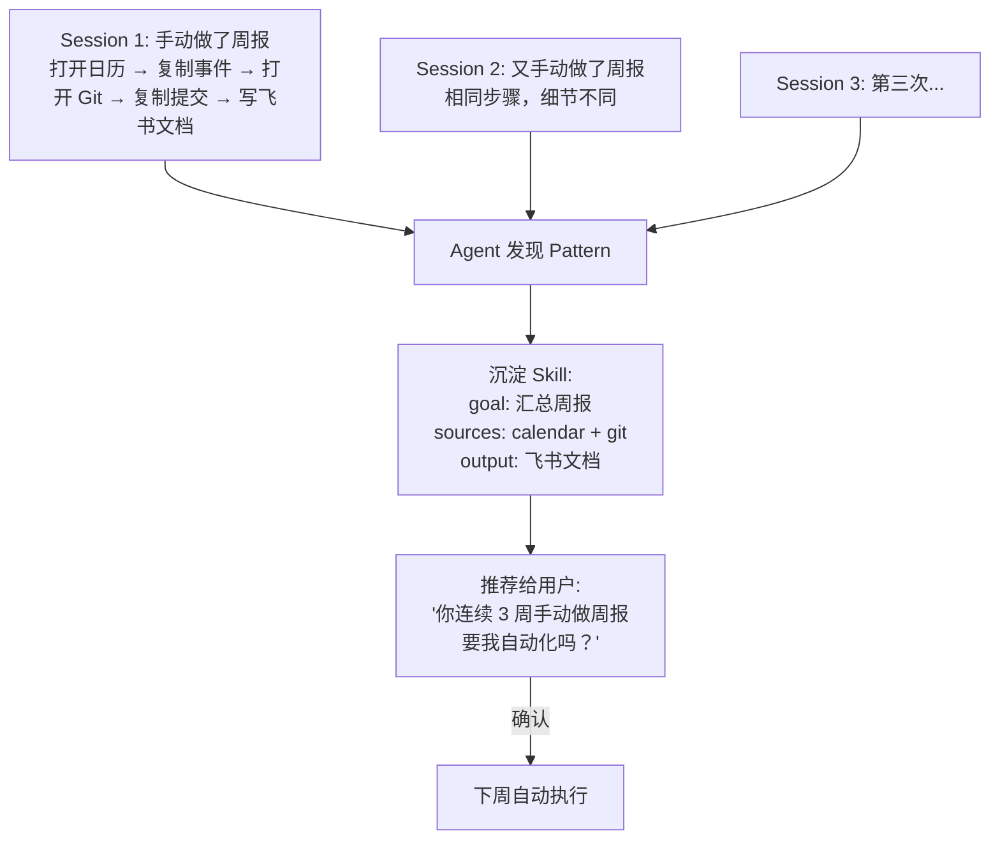
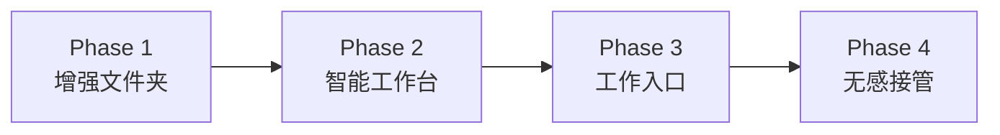
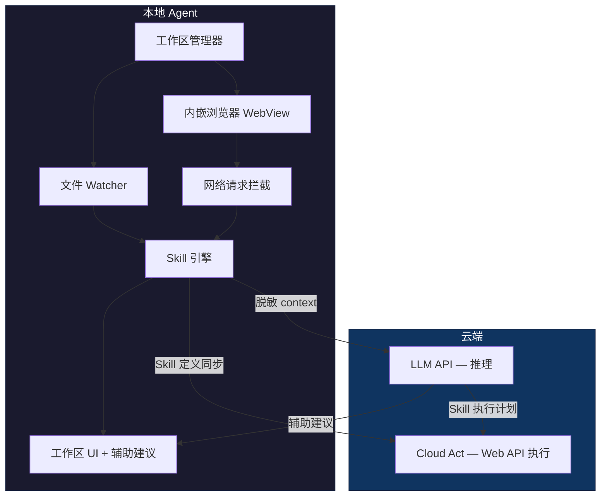

# 工作区交互设计：observe / learn / act 三大空间

> **v0 → v2 → v3 回归说明**（2026-04-23）：本篇最早是 v0 的工作区目的地方案，v2 一度因 Coze 三重失败否定（见历史篇 [positioning-strategy.md](positioning-strategy.md)）。v3 重新承认"工作区才是 AI-push 的最佳观察窗口"——但采用**中接管 + 轻工作区**形态：只接管过程，不抢最终交付；内嵌工具"够用不专业"；everything is file。上层锚定见 [positioning-strategy-v3-workspace.md](positioning-strategy-v3-workspace.md)。

## TL;DR

- 工作区 = **一个文件夹 + 一套轻量 UI**（Tauri 最小壳 + xterm + WebView + AI 侧栏，**不内嵌编辑器**，< 100 MB，< 1 s 冷启动；形态参考 cmux）
- 三大空间：**观察**（file / browser / shell watcher）、**学习**（pattern → skill）、**操作**（用户自做 + Agent 自动执行）
- 哲学：**everything is file**，事件 / skill / 状态 / 产出全落盘到 `~/Workspaces/<name>/`，可 git、可 diff、可 rewind
- 用户心智：**增强版任务文件夹**，打开 = 隐式授权观察，关闭 = 不再观察

## 核心 idea

本地 App 提供"工作区"（本质是文件夹），用户在工作区内新建文件、浏览网页、调用接口。Agent 持续监控工作区内一切变化，学习后提供辅助和沉淀。目标是**过程接管 + 产物回流**——接管用户当期任务的过程，产出推回飞书 / GitHub / Figma 等外部系统。

## 为什么工作区是对的

之前的方案是"监控整台电脑"（截屏、全局文件系统、所有浏览器活动），这带来三个问题：

| 问题 | 全局监控 | 工作区 |
|------|---------|--------|
| 隐私感知 | "它在监视我" | "我主动把东西放这里" |
| 数据噪声 | 90% 无关活动（刷抖音、看微信） | 工作区内全是相关上下文 |
| 权限门槛 | 需要屏幕录制+辅助功能+完整磁盘访问 | 只需要一个文件夹的权限 |

**工作区把"被动监控"变成了"主动使用"。** 用户不是被观察的对象，而是在用一个工具工作，观察是工具的副产品。

类比：
- 全局监控 = 在用户家里装摄像头
- 工作区 = 用户走进一间智能办公室，里面的设备自然地辅助他

## 工作区是什么

```
~/Workspaces/
├── 周报/
│   ├── .workspace.yaml          # 工作区配置
│   ├── context/                 # Agent 采集到的上下文
│   │   ├── browsing.jsonl       # 工作区内打开过的 URL
│   │   ├── api-calls.jsonl      # 浏览中产生的 API 请求
│   │   └── file-changes.jsonl   # 文件变更日志
│   ├── skills/                  # 从这个工作区沉淀的 skill
│   │   └── weekly-report.yaml
│   ├── notes.md                 # 用户的笔记
│   ├── data.csv                 # 用户拖进来的数据
│   └── output/                  # Agent 生成的产出
│       └── 2026-W16-report.md
│
├── 竞品调研/
│   ├── .workspace.yaml
│   ├── context/
│   ├── skills/
│   ├── screenpipe-notes.md
│   ├── limitless-notes.md
│   └── _summary.md              # Agent 自动汇总
│
└── Figma-飞书同步/
    ├── .workspace.yaml
    ├── context/
    ├── skills/
    │   └── figma-to-feishu.yaml  # 沉淀的自动化 skill
    └── exports/                   # 监听的导出目录
```

工作区对用户来说就是一个**增强版文件夹**：可以放文件、做笔记、打开网页、看数据。但对 Agent 来说，工作区是一个**完整的观察窗口和执行沙箱**。

## 工作区内的能力

### 1. 文件层 — 监控一切变化



用户在工作区里的每个文件操作 Agent 都看得到：
- 新建了 `competitor-a.md` → Agent 知道在做竞品调研
- 拖入了一个 CSV → Agent 分析结构，建议可视化
- 反复编辑同一段落 → Agent 建议更好的表述

### 2. 浏览器层 — 内嵌浏览器，不是监控外部浏览器

这是关键设计决策：**工作区自带浏览器**，而不是监控用户的 Chrome。

```
┌─────────────────────────────────────────────┐
│  Workspace: 竞品调研                         │
├────────────┬────────────────────────────────┤
│            │  [内嵌浏览器]                   │
│  文件列表   │  ┌──────────────────────────┐  │
│            │  │ https://screenpipe.com   │  │
│  📄 notes  │  │                          │  │
│  📄 summary│  │  (正常浏览网页)           │  │
│  📁 exports│  │                          │  │
│            │  └──────────────────────────┘  │
│            │                                │
│  ─────────  │  Agent 观察到:                │
│  💡 建议    │  • 访问了 screenpipe.com      │
│  "要把这个  │  • 停留了 5 分钟              │
│   页面内容  │  • 复制了定价信息              │
│   存到笔记  │  • 之前也访问过 limitless.ai  │
│   里吗？"  │  → 建议：整理竞品对比表        │
└────────────┴────────────────────────────────┘
```

内嵌浏览器的优势：
- **天然获得全部浏览数据** — URL、页面内容、停留时间、滚动位置、复制的文字、Ajax 请求
- **不需要装浏览器扩展** — 降低用户门槛
- **抓包零成本** — 内嵌浏览器的网络层完全可控，能看到所有 API 请求响应
- **不侵入用户的日常浏览器** — 工作用工作区浏览器，私人用 Chrome，边界清晰

技术实现：Electron/Tauri 内嵌 WebView，底层是 Chromium，支持 DevTools Protocol 拿所有网络请求。

### 3. API 抓包层 — 理解用户在用什么服务

内嵌浏览器天然能看到所有网络请求：

```json
// context/api-calls.jsonl
{"ts":"2026-04-16T10:32:00Z","method":"GET","url":"https://api.figma.com/v1/files/xxx","status":200,"domain":"figma.com"}
{"ts":"2026-04-16T10:32:05Z","method":"POST","url":"https://open.feishu.cn/open-apis/drive/v1/files/upload","status":200,"domain":"feishu.cn"}
```

Agent 从 API 调用中学到的比从页面内容学到的更精确：
- 看到 `figma.com/v1/files` → 用户在用 Figma
- 看到 `feishu.cn/drive/upload` → 用户在上传文件到飞书
- 两个请求时间相近 → 用户在做 Figma → 飞书 的搬运工作
- 这个模式出现 3 次 → **沉淀成 Skill**

### 4. 辅助模式 — 实时介入

Agent 观察到上下文后，可以实时辅助：

| 观察到 | 辅助动作 |
|--------|---------|
| 用户在写 Markdown 笔记 | 自动补全、建议格式、插入相关链接 |
| 用户浏览了 5 个竞品网站 | 自动生成对比表格草稿 |
| 用户反复在两个文档间复制粘贴 | 建议合并或自动同步 |
| 用户打开了上周同类工作区的文件 | 预加载相关上下文 |
| 用户拖入了一张截图 | OCR 提取文字，建议存入笔记 |

辅助的交互不是对话框，是**内联建议**：

```
┌───────────────────────────────┐
│  # 竞品调研笔记               │
│                               │
│  ## Screenpipe               │
│  - 开源，MIT 协议             │
│  - 本地优先架构               │
│  - █                          │
│                               │
│  ┌─ 💡 Agent ──────────────┐ │
│  │ 你刚才在浏览器里看到：   │ │
│  │ 定价 $20/月，支持 Mac   │ │
│  │ [插入到笔记] [忽略]      │ │
│  └──────────────────────────┘ │
└───────────────────────────────┘
```

### 5. 沉淀模式 — 从 repeat 到 Skill

当 Agent 在多个 session 中发现 repeat pattern：



沉淀物存在工作区的 `skills/` 目录，用户可以看到、编辑、删除：

```yaml
# skills/weekly-report.yaml
name: 周报自动生成
learned_from:
  sessions: [sess_001, sess_002, sess_003]  # 从哪几次观察中学到的
  confidence: 0.85
goal: 汇总本周工作生成飞书文档
trigger:
  type: cron
  expr: "0 17 * * 5"
sources:
  - type: calendar
    range: this_week
  - type: github
    filter: my_commits
output:
  type: feishu_doc
  template: weekly-report
status: active
trust_level: 2  # 执行前需确认
```

## 无感接管的路径

"无感接管"不是第一天就做到，而是渐进发生的：



**Phase 1: 增强文件夹** — 用户把工作区当普通文件夹用，Agent 静默观察，偶尔给建议
- 价值感：文件自动整理、智能搜索、浏览历史记录
- 用户心智：这是个好用的工作文件夹

**Phase 2: 智能工作台** — 用户开始习惯在工作区里完成工作（写笔记、浏览网页、整理资料）
- 价值感：实时辅助、上下文感知的建议、自动生成摘要
- 用户心智：在这里工作比在外面效率高

**Phase 3: 工作入口** — 用户的大部分工作都从工作区开始
- 价值感：沉淀的 Skill 开始自动执行重复任务
- 用户心智：工作从这里开始最自然

**Phase 4: 无感接管** — 用户不再区分"自己做"和"Agent 做"
- 价值感：Agent 预测到用户要做什么，提前准备好
- 用户心智：它就是我的工作方式的一部分

## 与之前架构的关系

工作区改变了之前的 Observe 策略：

| | 之前（全局监控） | 现在（工作区） |
|---|---|---|
| 观察范围 | 整台电脑 | 工作区内 |
| 观察方式 | 截屏 + Accessibility + 全局文件监听 | 文件 Watcher + 内嵌浏览器 + 抓包 |
| 权限需求 | 屏幕录制 + 辅助功能 + 完整磁盘访问 | 单个文件夹读写 |
| 数据质量 | 高噪声，需要复杂过滤 | 高信噪比，上下文天然关联 |
| 用户授权 | 显式弹窗授权（吓人） | 把文件放进工作区 = 隐式授权 |

本地 Agent 的架构也更聚焦：



## 工作区 vs 其他产品的交互对比

| 产品 | 交互模式 | 学习方式 | 问题 |
|------|---------|---------|------|
| ChatGPT / Claude | 对话框 | 用户主动描述 | 太重，用户得知道怎么问 |
| Copilot | 代码内联补全 | 从代码上下文 | 只限代码场景 |
| Notion AI | 文档内辅助 | 从当前文档 | 不跨应用，不跨 session |
| Rewind / Screenpipe | 全局录屏 | 被动全量采集 | 噪声大，隐私压力大 |
| **Silent Agent 工作区** | 工作空间 | 从工作区内一切活动 | 覆盖文件+浏览器+API，隐式授权 |

工作区的独特性：**它既是用户的工具，又是 Agent 的观察窗口，两者是同一个东西。**

## 与 v3 其他文档的映射

| 本篇章节 | 对应 v3 文档 |
|---|---|
| 文件层 / 浏览器层 / API 抓包层 | [observation-channels.md](observation-channels.md) — P0 工作区内三通道的技术规格 |
| 辅助模式 / 沉淀模式 | [core-insight-ai-push.md](core-insight-ai-push.md) — "教教我"仪式的设计 |
| 本地 Agent 架构图 | [cloud-vs-local-agent.md](cloud-vs-local-agent.md) — 云 / 本地职责划分 |
| Phase 1–4 无感接管 | [mvp-plan.md](mvp-plan.md) — MVP 对应 Phase 1–2；v3 终态停在 **Phase 3（工作区内无感）**，不扩展到用户整台电脑（避免 Rewind / Limitless 的隐私陷阱） |

## 关联笔记

- [positioning-strategy-v3-workspace.md](positioning-strategy-v3-workspace.md) — v3 上层定位锚
- [core-insight-ai-push.md](core-insight-ai-push.md) — AI-push 是底层驱动
- [artifact-first-architecture.md](artifact-first-architecture.md) — 产物视角的哲学基础
- [observation-channels.md](observation-channels.md) — 通道技术规格
- [mvp-plan.md](mvp-plan.md) — 6 周实施路径
- [cloud-vs-local-agent.md](cloud-vs-local-agent.md) — 架构分层
